# Technical Specification

# 1. Introduction

## 1.1 Executive Summary

### 1.1.1 Project Overview

Ephemeral Chat — publicly branded as **Ephchat** — is a cross-platform, privacy-first messaging application that enables ephemeral chat, encrypted voice calls, and secure file sharing with a zero-knowledge architecture. Developed and maintained by Caleb Kyere-Boateng, the platform operates under an Apache 2.0 license (with the E2ECP subproject licensed under MIT) and is currently at version 1.0.0, with the companion Electron desktop application at version 1.1.3.

The system is deployed and accessible at [https://chat.kyere.me](https://chat.kyere.me) as its primary hosted instance, with a dedicated marketing landing page at [https://ephchat.kyere.me](https://ephchat.kyere.me). The project repository is hosted at [https://github.com/cLLeB/ephemeral-chat](https://github.com/cLLeB/ephemeral-chat).

Ephchat delivers on the promise of private digital communication by enforcing a strict **RAM-only, Zero-Persistence** data model. No message history, no server-side storage, and no user accounts exist within the system — messages live exclusively in volatile memory and vanish the moment a chat session ends or the room expires. The platform spans Web (including PWA), Android, Windows, macOS, Linux, and Chrome browser extension, all served from a unified monorepo architecture.

### 1.1.2 Core Problem Statement

Modern digital communication platforms routinely compromise user privacy through persistent message storage, metadata collection, behavioral analytics, and account-based identity linking. Even platforms marketed as "private" often retain server-side records, require personally identifiable information for registration, and expose metadata to operators and potential adversaries.

Ephemeral Chat addresses this fundamental gap by implementing a communication system in which:

- **No data persists on servers** — all messages, call data, and file metadata exist only in volatile RAM and are purged upon room expiry or user departure.
- **No identity is required** — users join with only a self-chosen nickname; no registration, email address, or phone number is collected (as defined in `PRIVACY_POLICY.md`).
- **No metadata is linkable** — through Oblivious HTTP (RFC 9458) and Privacy Pass (RFC 9578), the server cannot correlate IP addresses to rooms or link multiple sessions to the same user.
- **No future decryption is possible** — hybrid post-quantum key exchange (PQXDH with X25519 + ML-KEM-768) protects against "harvest now, decrypt later" attacks by quantum adversaries.

### 1.1.3 Key Stakeholders and Users

| Stakeholder Group | Role | Relationship to System |
|---|---|---|
| **Privacy-Conscious Individuals** | Primary end users | Create/join rooms, exchange messages, make calls, share files anonymously |
| **Platform Administrator** | System operator | Deploys and maintains server infrastructure; by design, has zero access to message content or user identities |
| **Application Developers** | Contributors / maintainers | Extend and maintain the multi-platform codebase across React, Node.js, Go, Rust, and Electron |
| **Security Auditors** | Reviewers | Evaluate cryptographic implementations, threat model coverage, and protocol compliance |

All primary users access the platform **anonymously** — the only user-provided datum is a freely chosen nickname at the time of room entry. This positions the system for adoption by any individual or group that treats private communication as a fundamental right.

### 1.1.4 Business Impact and Value Proposition

Ephemeral Chat delivers a distinct value proposition across several dimensions:

- **Zero-Knowledge Privacy Architecture**: Encryption keys are derived client-side and stored exclusively in URL fragments (`#`), which by specification are never transmitted to the server. This design, implemented across modules in `client/src/crypto/`, ensures that even a compromised server operator cannot access message content.
- **Post-Quantum Readiness**: The PQXDH hybrid key exchange (`client/src/crypto/pqxdh.js`, `client/src/crypto/ml-kem.js`) combines classical X25519 with the lattice-based ML-KEM-768 (Kyber) algorithm, safeguarding communications against future quantum computing threats.
- **Anti-Surveillance Suite**: Platform-level screenshot blocking (Android `FLAG_SECURE`, Electron `setContentProtection(true)`), ghost watermarking (`client/src/components/GhostWatermark.jsx`), clipboard clearing on PrintScreen, and privacy blur on focus loss collectively form a comprehensive anti-exfiltration layer.
- **Ephemeral Data Lifecycle**: Messages auto-delete per room-configured intervals (30 seconds to 1 hour), rooms expire after a maximum of 24 hours of inactivity, and files are never stored on servers — as codified in the data retention parameters within `PRIVACY_POLICY.md`.
- **Multi-Platform Reach from Single Codebase**: A single monorepo delivers Web/PWA, Android (Capacitor), Desktop (Electron for Windows/macOS/Linux), and Chrome Extension experiences, maximizing user reach without fragmenting development effort.

---

## 1.2 System Overview

### 1.2.1 Project Context

#### Business Context and Market Positioning

Ephchat positions itself as a zero-trace communication standard — the landing page (`landing-page/index.html`) carries the hero title "Chat Without a Trace" and the subtitle "Ephemeral messaging with privacy. No history." The platform's README establishes its market identity with the tagline describing it as a standard for private, zero-knowledge communication, emphasizing military-grade security without compromising on modern features.

The system's security architecture is governed by an internal hardening roadmap codenamed **"Project Ghost"** (`docs/SECURITY_UPGRADE_PLAN.md`), which defines a seven-phase implementation plan aligned with IETF standards including RFC 9458 (Oblivious HTTP), RFC 9578 (Privacy Pass), MASQUE (CONNECT-UDP proxying), and Signal's PQXDH specification. Phases 1 through 7 are documented as implemented, with post-audit hardening items identified for future iteration.

#### Integration with Enterprise Landscape

Ephemeral Chat integrates with the following external services and infrastructure:

| Integration Point | Purpose | Configuration Source |
|---|---|---|
| **Redis** (optional) | Horizontal scaling for room state and caching | `server/rooms.js`, `.env` |
| **Agora RTC SDK** | Voice call failover when direct WebRTC P2P fails | `agora-token ^2.0.5`, `.env` credentials |
| **GitHub Actions** | CI/CD for CodeQL security scanning and Electron cross-platform builds | `.github/workflows/` |
| **Render** | Primary application hosting platform | Referenced in `README.md` |
| **Vercel** | Landing page hosting | `landing-page/vercel.json` |
| **Docker** | Containerized deployment for the E2ECP Go service | `e2ecp/Dockerfile` |

The server operates without mandatory external database dependencies — all room and message state resides in volatile RAM by default, with Redis available as an optional scaling layer. This architectural decision reinforces the zero-persistence guarantee.

### 1.2.2 High-Level System Description

#### Primary System Capabilities

The system provides the following core capabilities, each grounded in specific implementation modules:

| Capability | Description | Key Modules |
|---|---|---|
| Ephemeral Messaging | RAM-only rooms with configurable TTL and auto-destruction | `server/rooms.js`, `CreateRoomModal.jsx` |
| End-to-End Encryption | AES-256-GCM with per-message Double Ratchet key derivation | `client/src/crypto/double-ratchet.js` |
| Post-Quantum Key Exchange | Hybrid PQXDH combining X25519 and ML-KEM-768 | `client/src/crypto/pqxdh.js`, `ml-kem.js` |
| Voice Calls | WebRTC P2P with Agora RTC failover | `client/src/webrtc.js`, `AudioCallModal.jsx` |
| Encrypted File Drops | Ephemeral drops with TTL, view-once, and verbal codes | `server/drops.js`, `server/drops-routes.js` |
| Proximity Transfer | Rust/QUIC-based LAN peer-to-peer file transfer | `proximity-core/` workspace |
| Watch Party | Synchronized media viewing (YouTube, Twitch, Figma, Google Drive) | `SharedMediaPlayer.jsx` |
| Screenshot Protection | Platform-level screenshot and screen recording blocking | `electron-app/main.js`, Android `FLAG_SECURE` |
| Oblivious HTTP | RFC 9458 metadata-blind relay for request privacy | `server/ohttp-gateway.js`, `client/src/crypto/ohttp.js` |
| Privacy Pass | RFC 9578 anonymous authentication tokens via Ristretto255 VOPRF | `server/privacy-pass-issuer.js` |
| Traffic Padding | Anti-traffic-analysis chaff and cover traffic generation | `server/traffic-padding.js` |

#### Major System Components

The system is organized as a **polyglot monorepo** spanning four language ecosystems — JavaScript/TypeScript (Node.js, React), Go, Rust, and Java/Kotlin (Android) — each serving a distinct architectural role:

| Component | Path | Technology | Purpose |
|---|---|---|---|
| Frontend Client | `client/` | React, Vite, Tailwind CSS | Web, PWA, and mobile app UI |
| Backend Server | `server/` | Node.js, Express, Socket.IO | Signaling, room/drop management, privacy APIs |
| E2ECP Service | `e2ecp/` | Go (Cobra, Gorilla WebSocket) | File transfer relay and CLI tool |
| Proximity Core | `proximity-core/` | Rust (Quinn/QUIC, Tokio, mDNS) | LAN peer-to-peer transfers |
| Electron App | `electron-app/` | Electron 28.x | Desktop shell for Windows, macOS, Linux |
| Chrome Extension | `chrome-extension/` | Manifest V3 | Browser quick-access widget |
| Landing Page | `landing-page/` | HTML/CSS/JS | Marketing portal and download hub |
| Android Build | `client/android/` | Capacitor, Gradle | Native Android packaging |

The following diagram illustrates the high-level component topology and inter-service communication paths:

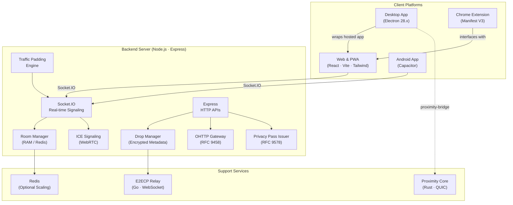
```mermaid
flowchart TB
    subgraph Clients["Client Platforms"]
        WebPWA["Web & PWA<br/>(React · Vite · Tailwind)"]
        AndroidApp["Android App<br/>(Capacitor)"]
        DesktopApp["Desktop App<br/>(Electron 28.x)"]
        ChromeExt["Chrome Extension<br/>(Manifest V3)"]
    end

    subgraph Backend["Backend Server (Node.js · Express)"]
        SIO["Socket.IO<br/>Real-time Signaling"]
        HTTPAPI["Express<br/>HTTP APIs"]
        RoomMgr["Room Manager<br/>(RAM / Redis)"]
        DropMgr["Drop Manager<br/>(Encrypted Metadata)"]
        OHTTPGw["OHTTP Gateway<br/>(RFC 9458)"]
        PPIssuer["Privacy Pass Issuer<br/>(RFC 9578)"]
        ICESig["ICE Signaling<br/>(WebRTC)"]
        TPEngine["Traffic Padding<br/>Engine"]
    end

    subgraph SupportSvc["Support Services"]
        E2ECPRelay["E2ECP Relay<br/>(Go · WebSocket)"]
        ProxCore["Proximity Core<br/>(Rust · QUIC)"]
        RedisOpt["Redis<br/>(Optional Scaling)"]
    end

    WebPWA -->|Socket.IO| SIO
    AndroidApp -->|Socket.IO| SIO
    DesktopApp -->|wraps hosted app| WebPWA
    ChromeExt -->|interfaces with| WebPWA
    SIO --> RoomMgr
    SIO --> ICESig
    HTTPAPI --> DropMgr
    HTTPAPI --> OHTTPGw
    HTTPAPI --> PPIssuer
    RoomMgr --> RedisOpt
    DropMgr --> E2ECPRelay
    TPEngine --> SIO
    DesktopApp -.->|proximity-bridge| ProxCore
```

#### Core Technical Approach

The system's architecture is governed by several foundational design principles:

- **RAM-Only Persistence**: All server state — room metadata, participant lists, and transient message buffers — resides exclusively in volatile memory. The `server/rooms.js` module manages room lifecycle entirely in-process, with optional Redis (`redis ^4.6.8`) available for horizontal scaling without introducing persistent storage.
- **Client-Side Encryption**: Cryptographic key derivation, encryption, and decryption occur entirely within the browser or native client. Keys are exchanged via PQXDH and stored in URL fragment identifiers (`#`), which by HTTP specification are never transmitted to the server. The complete cryptographic stack resides in `client/src/crypto/` across eight specialized modules: HKDF, X25519, ML-KEM, PQXDH, Double Ratchet, OHTTP, Privacy Pass, and Traffic Padding.
- **Real-Time Communication**: Socket.IO provides the primary signaling channel between clients and server, handling room events, message relay, and presence updates. WebRTC enables direct peer-to-peer media and data streams for voice calls and file transfer.
- **Multi-Transport Strategy**: The transport layer (`client/src/transport/transport-manager.js`) implements a cascading fallback: ICE/STUN hole punching → TURN relay → Socket.IO relay, ensuring connectivity across diverse network topologies. The ICE transport (`client/src/transport/ice-transport.js`) and MASQUE client (`client/src/transport/masque-client.js`) provide additional privacy-preserving transport options.
- **Defense-in-Depth Privacy**: Multiple independent privacy layers operate in concert, as illustrated below:

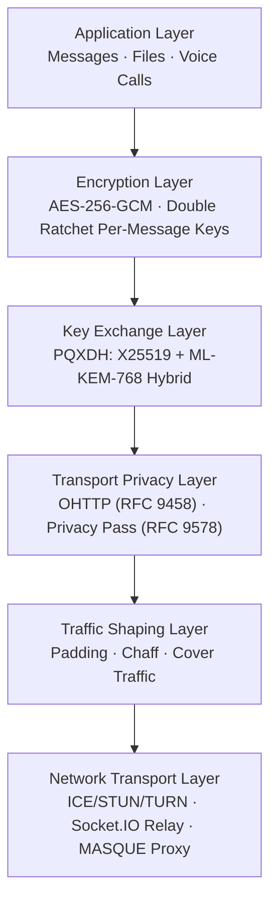
```mermaid
flowchart TB
    AppLayer["Application Layer<br/>Messages · Files · Voice Calls"]
    EncLayer["Encryption Layer<br/>AES-256-GCM · Double Ratchet Per-Message Keys"]
    KeyLayer["Key Exchange Layer<br/>PQXDH: X25519 + ML-KEM-768 Hybrid"]
    TransPriv["Transport Privacy Layer<br/>OHTTP (RFC 9458) · Privacy Pass (RFC 9578)"]
    TrafficShape["Traffic Shaping Layer<br/>Padding · Chaff · Cover Traffic"]
    NetLayer["Network Transport Layer<br/>ICE/STUN/TURN · Socket.IO Relay · MASQUE Proxy"]

    AppLayer --> EncLayer
    EncLayer --> KeyLayer
    KeyLayer --> TransPriv
    TransPriv --> TrafficShape
    TrafficShape --> NetLayer
```

### 1.2.3 Technology Stack

The following table summarizes the technology choices across each system layer, with specific dependency versions drawn from the project's `package.json` and workspace configuration files:

| Layer | Technologies | Key Dependencies |
|---|---|---|
| **Frontend** | React, Vite, Tailwind CSS, Lucide Icons, Workbox (PWA) | `@vitejs/plugin-react ^4.7.0`, `tailwindcss ^4.1.18` |
| **Backend** | Node.js (≥16), Express, Socket.IO, Redis | `express ^4.21.2`, `socket.io ^4.7.2`, `redis ^4.6.8` |
| **Security Core** | Web Crypto API, OHTTP, Privacy Pass, ML-KEM | `mlkem ^2.5.0`, `hpke ^1.0.4`, `@noble/curves ^1.8.1` |
| **Proximity** | Rust, QUIC (Quinn), mDNS-SD, Tokio | Cargo workspace, resolver 2 |
| **Desktop** | Electron 28.x, Electron-Store, Electron-Builder 24.x | `electron-updater`, `electron-store` |
| **Mobile** | Capacitor (Core, CLI, Android, iOS) | App ID: `me.kyere.chat` |
| **E2ECP** | Go 1.25, Cobra CLI, Gorilla WebSocket, PostgreSQL, SQLC | `spf13/cobra`, `gorilla/websocket`, `golang-jwt/jwt/v5` |
| **CI/CD** | GitHub Actions, Docker, CodeQL | Node 20, Go 1.25, `golang-migrate` |

### 1.2.4 Success Criteria

#### Security Objectives

The system's security posture is defined by seven measurable objectives, as articulated in the security upgrade plan (`docs/SECURITY_UPGRADE_PLAN.md`):

| Objective | Definition | Implementation Evidence |
|---|---|---|
| **Confidentiality** | Only room participants can read messages | AES-256-GCM encryption in `double-ratchet.js` |
| **Forward Secrecy** | Past messages remain safe if future keys are compromised | Per-message key ratcheting via Double Ratchet |
| **Post-Compromise Security** | Sessions self-heal after key compromise | Ratchet advancement on each message exchange |
| **Metadata Privacy** | Server cannot link IP → room → messages | OHTTP gateway in `server/ohttp-gateway.js` |
| **Unlinkability** | Server cannot correlate two sessions to the same user | Privacy Pass tokens in `server/privacy-pass-issuer.js` |
| **Traffic Analysis Resistance** | Observers cannot determine communication patterns | Traffic padding in `server/traffic-padding.js` |
| **Quantum Resistance** | Communications safe against harvest-now-decrypt-later | ML-KEM-768 in `client/src/crypto/ml-kem.js` |

#### Operational Parameters

The system enforces the following operational thresholds, as configured in the production environment (`.env`):

| Parameter | Value | Purpose |
|---|---|---|
| Room Expiry | 60 minutes | Maximum room lifetime |
| Inactivity Timeout | 10 minutes | Auto-disconnect for idle users |
| Invite Token Expiry | 5 minutes | Time-limited room invitations |
| Rate Limit | 30 messages/minute | Abuse prevention throttle |
| Failed Auth Lockout | 5 attempts / 10 minutes | Brute-force protection |
| Server Port | 3001 | Backend service endpoint |

#### Key Performance Indicators

The system's effectiveness is measured against the following critical success factors:

- **Zero Server-Side Data Retention**: Verified by the absence of any persistent database for message content; all state resides in `server/rooms.js` in-memory structures.
- **End-to-End Encryption Coverage**: All communication channels — messages, voice calls, and file transfers — are encrypted client-side before transmission.
- **Cross-Platform Availability**: Simultaneous deployment across Web/PWA, Android, Windows, macOS, Linux, and Chrome Extension from a single release cycle.
- **Privacy Standard Compliance**: Implementation fidelity to RFC 9458 (OHTTP), RFC 9578 (Privacy Pass), and Signal PQXDH specification.
- **Room Lifecycle Enforcement**: Deterministic room destruction upon expiry or last-participant departure, with no residual data artifacts.

---

## 1.3 Scope

### 1.3.1 In-Scope: Core Features and Functionalities

#### Must-Have Capabilities

The following capabilities constitute the core feature set of Ephemeral Chat, all of which are implemented and operational in the current version:

**1. Ephemeral Room Management** (`server/rooms.js`, `client/src/components/Home.jsx`, `CreateRoomModal.jsx`)
- Room creation with auto-generated or custom room codes
- Password-protected rooms with stealth entry (no visual feedback on password input)
- Configurable room TTL and automatic expiry enforcement
- Invite-only and verbal-code join modes
- Join locking controlled by the room creator

**2. Encrypted Real-Time Messaging** (`client/src/crypto/`, `server/index.js`)
- AES-256-GCM encryption with Double Ratchet per-message key derivation
- PQXDH hybrid key exchange (X25519 + ML-KEM-768)
- Message reactions, inline edits, replies, and threading
- Polls and sub-polls with real-time voting
- Message TTL enforcement and view-once semantics

**3. Voice Communication** (`client/src/webrtc.js`, `client/src/components/AudioCallModal.jsx`)
- WebRTC peer-to-peer voice calls with ICE/STUN/TURN negotiation
- Agora RTC engine failover when direct P2P connectivity is unavailable
- Audio Drops (encrypted voice notes for asynchronous listening)

**4. Encrypted File Drops** (`server/drops.js`, `server/drops-routes.js`, `CreateDropModal.jsx`, `DropViewer.jsx`)
- Encrypted payload delivery with metadata-only server-side storage
- Verbal codes (four-word codes drawn from a 256-word wordlist) for human-friendly sharing
- Configurable TTL, view-count, size, and recipient limits
- `.eph` file format for authentication packets and QR code sharing

**5. Proximity Transfer** (`proximity-core/`, `electron-app/proximity-bridge.js`, `NearbyTransfer.jsx`)
- QUIC-based peer-to-peer LAN file transfers using the Quinn library
- mDNS service discovery for automatic local peer detection
- Hotspot and offline mode for field deployment without internet connectivity
- Android native plugin via JNI and Node.js addon via napi-rs for Electron integration

**6. Privacy and Anti-Surveillance Suite**
- Privacy blur overlay on application focus loss (`client/src/components/PrivacyOverlay.jsx`)
- Ghost watermarking with tamper detection (`client/src/components/GhostWatermark.jsx`)
- Platform-level screenshot and screen recording blocking (`electron-app/main.js` for desktop, Android `FLAG_SECURE` for mobile)
- Clipboard clearing on PrintScreen key press (`electron-app/preload.js`)
- DevTools, view-source, and print shortcut blocking across all platforms

**7. Watch Party** (`client/src/components/WatchPartyModal.jsx`, `SharedMediaPlayer.jsx`)
- Synchronized media viewing for YouTube, Twitch, SoundCloud, Figma, and Google Drive/Docs content
- Automatic provider detection with oEmbed and OpenGraph metadata fetching

**8. Metadata Privacy Protocols**
- Oblivious HTTP gateway (`server/ohttp-gateway.js`) implementing RFC 9458 with HPKE for metadata-blind request relay
- Privacy Pass issuer (`server/privacy-pass-issuer.js`) implementing RFC 9578 with Ristretto255 VOPRF and DLEQ proofs for anonymous rate limiting
- Traffic padding engine (`server/traffic-padding.js`) with low, medium, and high privacy presets generating cover traffic and chaff

#### Primary User Workflows

The system supports the following primary interaction patterns:

1. **Ephemeral Chat**: Create a room → share room code or link → participants join with nicknames → exchange encrypted messages → messages vanish upon room exit or expiry.
2. **Voice Communication**: Initiate a WebRTC call within a room → establish P2P connection (or failover to Agora) → conduct encrypted voice conversation.
3. **File Drop**: Create an encrypted Drop → configure TTL and access limits → share verbal code or QR code → recipient claims and views the Drop.
4. **Proximity Transfer**: Discover nearby peers via mDNS → pair using a shared code → transfer files directly over LAN via QUIC.
5. **Watch Party**: Initiate a Watch Party session → paste a media URL (YouTube, Twitch, Figma, etc.) → all room participants view synchronized content.
6. **Voice Notes**: Record an Audio Drop → encrypt and send to room → recipients play back asynchronously.

### 1.3.2 In-Scope: Implementation Boundaries

#### Platform Coverage

| Platform | Technology | Distribution Channel | Status |
|---|---|---|---|
| Web & PWA | React/Vite, Workbox, Service Worker | [chat.kyere.me](https://chat.kyere.me) | Active |
| Android | Capacitor (Java/Kotlin plugins) | APK via GitHub Releases | Active |
| Windows | Electron + NSIS/Portable/AppX | EXE, MSIX via GitHub Releases | Active |
| macOS | Electron + DMG/ZIP (hardened runtime) | DMG via GitHub Releases | Active |
| Linux | Electron + AppImage/DEB | AppImage, DEB via GitHub Releases | Active |
| Chrome | Manifest V3 Extension | Chrome Web Store | Active |

#### Essential Integrations

| Integration | Purpose | Evidence |
|---|---|---|
| Redis | Optional horizontal scaling for room state | `server/rooms.js`, `.env` |
| Agora RTC SDK | Voice call failover engine | `agora-token ^2.0.5` in `package.json` |
| GitHub Actions | CI/CD for CodeQL scanning and Electron builds | `.github/workflows/codeql.yml`, `electron-build.yml` |
| Vercel | Landing page hosting | `landing-page/vercel.json` |
| Render | Primary application hosting | Referenced in `README.md` |
| Docker | E2ECP service containerized deployment | `e2ecp/Dockerfile` |

#### Data Domains

All data within Ephemeral Chat falls into the following domains, none of which involve persistent server-side storage:

- **Transient Message Data**: Encrypted message payloads relayed through Socket.IO, existing only in server RAM during active room sessions.
- **Ephemeral Room State**: Room metadata (codes, participant counts, TTL timers) held in volatile memory within `server/rooms.js`.
- **Encrypted Drop Metadata**: Minimal metadata for file drops stored in-memory with enforced TTL and access limits via `server/drops.js`.
- **Client-Side Cryptographic Material**: Key pairs, ratchet states, and session data derived and stored exclusively on the client device.
- **Local Device Storage**: Optional local-only message retention on user devices, configurable and clearable by the user, never backed up to servers.

### 1.3.3 Out-of-Scope

#### Excluded by Design

The following items are **intentionally excluded** as core architectural decisions reflecting the platform's privacy-first philosophy:

| Exclusion | Rationale |
|---|---|
| **User Accounts and Registration** | No accounts exist by design; users are anonymous with only a self-chosen nickname. The E2ECP subproject optionally supports server-side profiles via PostgreSQL, but the main Ephemeral Chat platform has zero user management. |
| **Persistent Message History** | No server-side message storage exists. Messages are ephemeral by definition, auto-deleted per room settings (30 seconds to 1 hour as configured in `.env` and `PRIVACY_POLICY.md`). |
| **Third-Party Analytics or Advertising** | Explicitly prohibited — the privacy policy (`PRIVACY_POLICY.md`) states that no third-party analytics or advertising trackers are used. |
| **Server-Side File Storage** | Files are never stored on servers; all file data transits encrypted through relay services or direct P2P channels and exists only on sender and recipient devices. |

#### Future Phase Considerations

The following items are referenced in the codebase or documentation but are not fully operational in the current release:

| Item | Current Status | Evidence |
|---|---|---|
| **iOS Distribution** | Capacitor configuration references iOS (`capacitor.config.ts`), but no active iOS build workflows or download links exist. | `capacitor.config.ts`, absence in `.github/workflows/` |
| **Full MASQUE Dual-Proxy** | Described in `docs/SECURITY_UPGRADE_PLAN.md` as a post-audit hardening item. The current `masque-client.js` provides fallback behavior but does not implement a complete CONNECT-UDP MASQUE proxy. | `docs/SECURITY_UPGRADE_PLAN.md`, `masque-client.js` |
| **Comprehensive Automated Test Suite** | The root `package.json` contains a placeholder test script (`"echo \"No tests specified\""`). The E2ECP subproject includes Go integration tests and Playwright E2E tests, but the main application lacks formal test infrastructure. | Root `package.json`, `e2ecp/` |
| **Package Manager Distribution** | E2ECP is available via Homebrew and Arch Linux package managers, but the main Ephemeral Chat application is distributed only through GitHub Releases and direct web access. | `e2ecp/README.md` |

#### Unsupported Use Cases

- **Long-Term Message Archival**: The system is designed for ephemeral communication; users requiring permanent records should use alternative platforms.
- **Enterprise Directory Integration**: No LDAP, SSO, or corporate identity provider integration is provided, consistent with the anonymous-access model.
- **Chess and Game Features**: The `client/src/components/games/` subfolder contains chess game implementations; these are classified as demo and testing artifacts, not production communication features.
- **Federated or Decentralized Operation**: The system operates as a centralized service with a single server deployment; multi-server federation is not supported.

---

## 1.4 Document Conventions

Throughout this Technical Specification, the following conventions apply:

- **File paths** are referenced relative to the repository root (e.g., `client/src/crypto/pqxdh.js`).
- **RFC references** cite the specific IETF standard number (e.g., RFC 9458 for Oblivious HTTP).
- **Version numbers** refer to dependency versions as declared in `package.json`, `Cargo.toml`, or `go.mod` at the time of documentation.
- **"Server" and "Client"** refer to the backend (`server/`) and frontend (`client/`) components respectively, unless otherwise qualified.

---

## 1.5 References

#### Files Examined

- `README.md` — Project identity, feature overview, technology stack, quick start guide, and repository structure
- `package.json` — Package metadata (v1.0.0), Node.js/npm engine requirements, all dependencies with versions, and npm scripts
- `PRIVACY_POLICY.md` — Privacy policy (updated February 5, 2026), data handling practices, permissions model, and retention parameters
- `.env` — Production environment configuration including ports, timeouts, rate limits, Agora credentials, and Redis settings
- `LICENSE` — Apache 2.0 license for the main repository
- `e2ecp/LICENSE` — MIT license for the E2ECP subproject
- `docs/SECURITY_UPGRADE_PLAN.md` — Security hardening master plan (Project Ghost): threat model, seven-phase implementation roadmap, and file-level architecture map
- `docs/USER_GUIDE.md` — User onboarding guide covering room creation, joining, privacy tools, and voice notes
- `e2ecp/README.md` — E2ECP project overview including CLI usage, installation methods, and self-hosted relay configuration
- `landing-page/index.html` — Landing page structure with title, meta description, hero section, and download links
- `landing-page/vercel.json` — Vercel deployment configuration for the landing page
- `electron-app/package.json` — Electron app metadata (v1.1.3) and build configuration
- `electron-app/main.js` — Electron main process: content protection, hosted app loading, and proximity bridge initialization
- `electron-app/preload.js` — Electron preload script: clipboard clearing and keyboard shortcut blocking
- `capacitor.config.ts` — Capacitor configuration referencing iOS and Android platforms

#### Folders Examined

- `client/` — Frontend workspace: React/Vite/Tailwind application with Capacitor mobile integration
- `client/src/crypto/` — Cryptographic module suite: HKDF, X25519, ML-KEM, PQXDH, Double Ratchet, OHTTP, Privacy Pass, Traffic Padding
- `client/src/transport/` — Transport layer modules: ICE transport, MASQUE client, Transport Manager
- `client/src/components/` — UI component library: 55+ React components including games subfolder
- `server/` — Backend service: 16 source files covering rooms, drops, signaling, privacy protocols, and utility modules
- `e2ecp/` — Go file transfer service: CLI tool, WebSocket relay, embedded web client, PostgreSQL migrations
- `electron-app/` — Desktop application shell: main process, preload scripts, build configuration, icon assets
- `chrome-extension/` — Browser extension: Manifest V3 popup interface and background scripts
- `proximity-core/` — Rust workspace: QUIC-based P2P transfer core with Android (JNI) and Node.js (napi-rs) bindings
- `landing-page/` — Static marketing site: HTML/CSS/JS with download links and feature showcase
- `docs/` — Documentation: security upgrade plan, privacy policy references, and user guide
- `.github/workflows/` — CI/CD automation: CodeQL analysis and Electron cross-platform build workflows

# 2. Product Requirements

This section defines the complete set of discrete, testable product requirements for Ephemeral Chat (Ephchat), cataloging every feature with its metadata, functional requirements, dependency relationships, and implementation considerations. All requirements are grounded in evidence from the repository codebase, configuration files, and existing documentation.

---

## 2.1 Feature Catalog

The following catalog enumerates all features identified in the Ephchat system, organized with unique identifiers, metadata, descriptions, and dependency chains. Feature prioritization reflects the platform's core privacy-first architectural philosophy.

### 2.1.1 F-001: Ephemeral Room Management

| Attribute | Detail |
|---|---|
| **Feature ID** | F-001 |
| **Feature Name** | Ephemeral Room Management |
| **Category** | Core Messaging |
| **Priority** | Critical |

| Attribute | Detail |
|---|---|
| **Status** | Completed |
| **Key Modules** | `server/rooms.js`, `client/src/components/Home.jsx`, `CreateRoomModal.jsx`, `JoinRoomModal.jsx`, `MyRooms.jsx` |

#### Description

**Overview**: Ephemeral Room Management is the foundational feature upon which all real-time communication in Ephchat is built. It governs the full lifecycle of chat rooms — creation, discovery, joining, configuration, and automatic destruction. Rooms exist exclusively in volatile server memory (RAM) and are deterministically destroyed upon expiry or last-participant departure, leaving zero residual data artifacts.

**Business Value**: Enforces the core zero-persistence privacy guarantee by ensuring no room or message data survives beyond the configured TTL. This is the fundamental mechanism that differentiates Ephchat from persistent messaging platforms.

**User Benefits**: Users can create and join rooms instantly with no account registration — only a self-chosen nickname is required. Room codes can be auto-generated or customized with human-readable four-word verbal codes drawn from a 256-word wordlist (`server/wordlist.js`). Password-protected rooms employ stealth entry with no visual feedback on password input, preventing shoulder-surfing attacks.

**Technical Context**: The `server/rooms.js` RoomManager module maintains all room state in-process with optional Redis (`redis ^4.6.8`) for horizontal scaling. Room expiry is enforced at 60 minutes (`ROOM_EXPIRY_MINUTES=60`), inactivity timeout at 10 minutes (`INACTIVITY_TIMEOUT_MINUTES=10`), and invite tokens expire after 5 minutes (`INVITE_TOKEN_EXPIRY_MINUTES=5`), all configured via `.env`.

#### Dependencies

| Dependency Type | Details |
|---|---|
| **Prerequisite Features** | None (foundational feature) |
| **System Dependencies** | Node.js ≥16.0.0, Express, Socket.IO |
| **External Dependencies** | Redis (optional, for horizontal scaling) |
| **Integration Requirements** | `server/auth-utils.js` (bcrypt password hashing, HMAC-signed tokens), `server/security.js` (session tracking, lockout), `server/utils.js` (sanitize-html, code generation) |

---

### 2.1.2 F-002: End-to-End Encrypted Messaging

| Attribute | Detail |
|---|---|
| **Feature ID** | F-002 |
| **Feature Name** | End-to-End Encrypted Messaging |
| **Category** | Core Messaging / Security |
| **Priority** | Critical |

| Attribute | Detail |
|---|---|
| **Status** | Completed |
| **Key Modules** | `client/src/crypto/double-ratchet.js`, `client/src/crypto/pqxdh.js`, `client/src/crypto/ml-kem.js`, `client/src/crypto/hkdf.js`, `client/src/crypto/x25519.js` |

#### Description

**Overview**: All textual communication within Ephchat rooms is protected by end-to-end encryption using AES-256-GCM with per-message key derivation via the Double Ratchet protocol. Key exchange is performed using a hybrid PQXDH scheme combining classical X25519 with post-quantum ML-KEM-768 (Kyber), providing resistance against both current and future quantum computing threats.

**Business Value**: Delivers on the "zero-knowledge architecture" promise — even a compromised server operator cannot decrypt message content. The hybrid post-quantum key exchange protects against "harvest now, decrypt later" attacks, a critical differentiator against state-level adversaries.

**User Benefits**: Users communicate with cryptographic assurances of confidentiality, forward secrecy, and post-compromise security without any manual key management. Rich messaging features — reactions, inline edits, replies, threading, polls, and view-once messages — are all encrypted transparently.

**Technical Context**: The cryptographic pipeline flows through five specialized modules: `hkdf.js` → `x25519.js` → `ml-kem.js` → `pqxdh.js` → `double-ratchet.js`. All key derivation, encryption, and decryption occur entirely client-side using the Web Crypto API. Keys are stored in URL fragment identifiers (`#`), which by HTTP specification are never transmitted to the server. ML-KEM initialization is intentionally non-fatal, enabling graceful degradation to classical-only mode on unsupported browsers. X25519 includes a P-256 ECDH fallback for browsers without native X25519 support.

#### Dependencies

| Dependency Type | Details |
|---|---|
| **Prerequisite Features** | F-001 (Ephemeral Room Management) |
| **System Dependencies** | Web Crypto API (browser) |
| **External Dependencies** | `mlkem ^2.5.0`, `hpke ^1.0.4`, `@noble/curves ^1.8.1` |
| **Integration Requirements** | Socket.IO for encrypted message relay, `server/index.js` for message routing |

---

### 2.1.3 F-003: Voice Communication

| Attribute | Detail |
|---|---|
| **Feature ID** | F-003 |
| **Feature Name** | Voice Communication |
| **Category** | Communication |
| **Priority** | High |

| Attribute | Detail |
|---|---|
| **Status** | Completed |
| **Key Modules** | `client/src/webrtc.js`, `client/src/components/AudioCallModal.jsx` |

#### Description

**Overview**: Ephchat provides encrypted peer-to-peer voice calling within rooms, powered by WebRTC with ICE/STUN/TURN negotiation for NAT traversal. When direct P2P connectivity is unavailable, the system automatically fails over to the Agora RTC engine for relayed audio.

**Business Value**: Extends the privacy-first model to voice communication, ensuring that even real-time audio data is encrypted end-to-end and never stored on servers.

**User Benefits**: Users can initiate voice calls directly within a chat room with a single action. Audio Drops (encrypted voice notes) enable asynchronous listening with a 30-second recording limit. An optional Web Audio voice-scrambler pipeline provides additional outbound audio obfuscation. Mute support and wake-lock during calls ensure a polished user experience.

**Technical Context**: The `client/src/webrtc.js` module implements a singleton WebRTC service with connection state management, ICE candidate buffering for early candidates, and subscription-based UI updates. Server-side Agora token generation uses `agora-token ^2.0.5`, with credentials configured via `.env` (`AGORA_APP_ID`, `AGORA_APP_CERTIFICATE`). ICE signaling is relayed through `server/ice-signaling.js` via Socket.IO events for offers, answers, and candidates. STUN/TURN server configuration is managed through `client/.env.production` (`VITE_ICE_SERVERS`).

#### Dependencies

| Dependency Type | Details |
|---|---|
| **Prerequisite Features** | F-001 (Room context required) |
| **System Dependencies** | WebRTC API, Web Audio API |
| **External Dependencies** | `agora-rtc-sdk-ng`, `agora-token ^2.0.5`, `@ffmpeg-installer/ffmpeg`, `fluent-ffmpeg`, `lamejs` |
| **Integration Requirements** | `server/ice-signaling.js` (Socket.IO relay), `.env` Agora credentials, STUN/TURN server configuration |

---

### 2.1.4 F-004: Encrypted File Drops (Dead Drops)

| Attribute | Detail |
|---|---|
| **Feature ID** | F-004 |
| **Feature Name** | Encrypted File Drops |
| **Category** | File Sharing |
| **Priority** | High |

| Attribute | Detail |
|---|---|
| **Status** | Completed |
| **Key Modules** | `server/drops.js`, `server/drops-routes.js`, `CreateDropModal.jsx`, `DropViewer.jsx`, `ClaimDropModal.jsx`, `DropCreatedModal.jsx`, `DropPage.jsx`, `MyDrops.jsx` |

#### Description

**Overview**: The Encrypted File Drops feature enables users to create and share encrypted payloads (files, text) through a "dead drop" mechanism. The server stores only metadata; actual content is encrypted client-side and delivered directly to recipients. Drops are identified by human-friendly four-word verbal codes generated from a 256-word wordlist, and can also be shared via QR codes.

**Business Value**: Provides a privacy-preserving file sharing mechanism that enforces the zero-persistence guarantee — files are never stored on servers, and access is controlled through time-limited, count-limited, and recipient-limited parameters.

**User Benefits**: Users can create drops with configurable TTL, maximum view count, file size limits, and specific recipient restrictions. The `.eph` file format serves as an authentication packet for secure drop access. A creator dashboard (`MyDrops.jsx`) allows listing and managing active drops.

**Technical Context**: The `server/drops.js` DropManager enforces all drop constraints (TTL, view count, size, recipient, creator, and global limits) with in-memory storage and per-IP rate limiting within `server/drops-routes.js`. The REST API surface includes endpoints for drop creation, verbal code resolution, `.eph` validation/download, claim, list, metadata retrieval, stats, and deletion. Secure drop IDs are generated server-side, and view-once semantics with expiration countdowns are enforced.

#### Dependencies

| Dependency Type | Details |
|---|---|
| **Prerequisite Features** | None (operates independently, optionally room-linked) |
| **System Dependencies** | Express HTTP API |
| **External Dependencies** | `server/wordlist.js` (verbal code generation) |
| **Integration Requirements** | `QRGenerator.jsx` (QR code sharing), client-side crypto modules for encryption/decryption |

---

### 2.1.5 F-005: Proximity Transfer

| Attribute | Detail |
|---|---|
| **Feature ID** | F-005 |
| **Feature Name** | Proximity Transfer |
| **Category** | File Transfer |
| **Priority** | High |

| Attribute | Detail |
|---|---|
| **Status** | Completed |
| **Key Modules** | `proximity-core/` (Rust workspace), `electron-app/proximity-bridge.js`, `electron-app/proximity-native.js`, `client/src/components/NearbyTransfer.jsx` |

#### Description

**Overview**: Proximity Transfer enables direct peer-to-peer file transfers over a local area network (LAN) using QUIC as the transport protocol, without requiring internet connectivity. Peers are automatically discovered via mDNS, and transfers are secured with ephemeral TLS certificates to defend against man-in-the-middle attacks.

**Business Value**: Provides an air-gapped file transfer capability for field deployment scenarios where internet connectivity is unavailable or untrusted. Eliminates any server involvement in file transit, achieving the strongest possible privacy posture for file sharing.

**User Benefits**: Users can discover nearby peers automatically, verify pairing through certificate-fingerprint-derived codes, and transfer files at LAN speeds. Hotspot mode enables direct device-to-device connection without network infrastructure. Multi-peer swarm behavior supports simultaneous transfers.

**Technical Context**: The Rust workspace (`proximity-core/`) contains three crates: `core` (QUIC logic using Quinn, Rustls, Ring, Tokio), `bindings/node` (napi-rs for Electron integration), and `bindings/android` (JNI for Android Capacitor plugin). The Electron integration uses `proximity-bridge.js` for LAN interface inspection and device naming, and `proximity-native.js` as the Rust addon adapter. Browser clients can fall back to WebRTC data channels when native QUIC is unavailable.

#### Dependencies

| Dependency Type | Details |
|---|---|
| **Prerequisite Features** | F-010 (requires Electron or Android native platform) |
| **System Dependencies** | Platform-native networking (LAN/Wi-Fi) |
| **External Dependencies** | Rust: `quinn`, `rustls`, `ring`, `tokio`, `mdns-sd`, `rcgen`, `serde`, `bincode` |
| **Integration Requirements** | `electron-app/proximity-bridge.js`, `electron-app/proximity-native.js`, `PairingCodeModal.jsx`, `HotspotSetup.jsx` |

---

### 2.1.6 F-006: Privacy and Anti-Surveillance Suite

| Attribute | Detail |
|---|---|
| **Feature ID** | F-006 |
| **Feature Name** | Privacy and Anti-Surveillance Suite |
| **Category** | Security |
| **Priority** | Critical |

| Attribute | Detail |
|---|---|
| **Status** | Completed |
| **Key Modules** | `PrivacyOverlay.jsx`, `GhostWatermark.jsx`, `DesktopSecurityGuard.jsx`, `AppRestrictionBanner.jsx`, `electron-app/main.js`, `electron-app/preload.js` |

#### Description

**Overview**: A comprehensive, cross-platform anti-exfiltration layer that prevents visual capture, forensic leakage, and unauthorized content extraction through multiple independent defense mechanisms operating in concert.

**Business Value**: Protects users against surveillance techniques that operate outside the network layer — screenshot capture, screen recording, physical observation, and developer tool exploitation — addressing threat vectors that encryption alone cannot mitigate.

**User Benefits**: Privacy protections are automatic and platform-aware, requiring no user configuration. The privacy blur overlay activates instantly on focus loss or tab switch. Ghost watermarks provide forensic traceability if content is photographed. Screenshot and screen recording are blocked at the OS level on supported platforms.

**Technical Context**: The suite comprises seven distinct defense mechanisms: (1) Privacy blur overlay on focus loss/tab hidden (`PrivacyOverlay.jsx`); (2) Ghost watermarking with MutationObserver tamper detection (`GhostWatermark.jsx`); (3) Android `FLAG_SECURE` for screenshot blocking (per `CAPACITOR_SETUP.md`); (4) Electron `setContentProtection(true)` in `electron-app/main.js`; (5) Clipboard clearing on PrintScreen key press (`electron-app/preload.js`); (6) DevTools/view-source/print shortcut blocking across all platforms (`DesktopSecurityGuard.jsx`, `preload.js`); (7) Document-wide clipboard blocking unless elements opt in with `data-allow-copy="true"` (per `App.jsx`). Additional protections include image context menu suppression and drag/drop file injection prevention in the Electron preload script.

#### Dependencies

| Dependency Type | Details |
|---|---|
| **Prerequisite Features** | F-010 (platform-specific implementations) |
| **System Dependencies** | Platform APIs (Android FLAG_SECURE, Electron BrowserWindow) |
| **External Dependencies** | None |
| **Integration Requirements** | Cross-cutting — integrates with all client-facing features |

---

### 2.1.7 F-007: Metadata Privacy Protocols

| Attribute | Detail |
|---|---|
| **Feature ID** | F-007 |
| **Feature Name** | Metadata Privacy Protocols |
| **Category** | Security / Privacy |
| **Priority** | High |

| Attribute | Detail |
|---|---|
| **Status** | Completed |
| **Key Modules** | `server/ohttp-gateway.js`, `server/privacy-pass-issuer.js`, `server/traffic-padding.js`, `client/src/crypto/ohttp.js`, `client/src/crypto/privacy-pass.js`, `client/src/crypto/traffic-padding.js` |

#### Description

**Overview**: A trio of IETF-standards-based privacy protocols that protect communication metadata — preventing the server from linking IP addresses to rooms, correlating sessions to users, or enabling traffic analysis by network observers. This feature implements Phases 3, 4, and 5 of the Project Ghost security roadmap (`docs/SECURITY_UPGRADE_PLAN.md`).

**Business Value**: Addresses the metadata privacy gap that persists even with perfect end-to-end encryption. Satisfies three of the seven security goals: Metadata Privacy, Unlinkability, and Traffic Analysis Resistance, defending against passive network observers, compromised server operators, and state-level adversaries.

**User Benefits**: All metadata protections are transparent to the user, operating automatically without configuration. Users benefit from protection against network surveillance without needing to understand the underlying protocols.

**Technical Context**: The feature consists of three sub-protocols:

- **Oblivious HTTP (RFC 9458)**: HPKE-based gateway key generation/rotation with `/ohttp/config` and `/ohttp/request` endpoints. Request decapsulation, Binary HTTP parsing, and encrypted response encapsulation on the server side (`server/ohttp-gateway.js`). Client-side lazy `hpke` import, gateway key config fetch, encapsulation, and `ohttpFetch` wrapper with fallback to ordinary `fetch` on failure (`client/src/crypto/ohttp.js`).
- **Privacy Pass (RFC 9578)**: Ristretto255/VOPRF-style issuer with `@noble/curves` (`server/privacy-pass-issuer.js`). Development fallback when crypto loading fails. In-memory spent-token and issuance-rate tracking. `/privacy-pass/config` and `/privacy-pass/issue` endpoints with optional `privacyPassAuth` middleware. Client-side blind/unblind tokens, DLEQ proof verification, bounded token cache, prefetch, and `Authorization: PrivacyPass ...` header format (`client/src/crypto/privacy-pass.js`).
- **Traffic Padding**: Low, medium, and high privacy presets with configurable padding buckets (`server/traffic-padding.js`). Chaff detection and depadding, cover traffic generation per room. Preset bucket sizing accommodates ML-KEM post-quantum handshake messages (1536-byte). Padded binary envelope protocol for Socket.IO and Express.

#### Dependencies

| Dependency Type | Details |
|---|---|
| **Prerequisite Features** | F-001 (room context for traffic padding) |
| **System Dependencies** | Express middleware, Socket.IO |
| **External Dependencies** | `hpke ^1.0.4`, `@noble/curves ^1.8.1`, `mlkem ^2.5.0` |
| **Integration Requirements** | Cross-cutting layer enhancing F-001, F-002, and F-004 |

---

### 2.1.8 F-008: Watch Party

| Attribute | Detail |
|---|---|
| **Feature ID** | F-008 |
| **Feature Name** | Watch Party |
| **Category** | Entertainment / Social |
| **Priority** | Medium |

| Attribute | Detail |
|---|---|
| **Status** | Completed |
| **Key Modules** | `client/src/components/WatchPartyModal.jsx`, `SharedMediaPlayer.jsx`, `server/link-preview.js` |

#### Description

**Overview**: Watch Party enables synchronized media viewing within chat rooms, supporting content from YouTube, Twitch, SoundCloud, Figma, and Google Drive/Docs. The system automatically detects the content provider and renders the appropriate embedded player.

**Business Value**: Enhances room engagement by enabling collaborative content consumption within the privacy-preserving room context, differentiating Ephchat from text-only ephemeral messaging alternatives.

**User Benefits**: Users paste a media URL and all room participants view synchronized content. Provider detection is automatic via oEmbed and OpenGraph metadata fetching. No additional accounts or integrations are required from participants.

**Technical Context**: `server/link-preview.js` (LinkPreviewService) handles safe URL extraction with blocked-scheme and private-host checks, provider detection, and Redis-or-memory caching of metadata. Navigation is allowlisted for YouTube and SoundCloud embeds in the Capacitor configuration to support mobile playback.

#### Dependencies

| Dependency Type | Details |
|---|---|
| **Prerequisite Features** | F-001 (room context required) |
| **System Dependencies** | Express HTTP API |
| **External Dependencies** | Third-party embed APIs (YouTube, Twitch, SoundCloud, Figma, Google Drive) |
| **Integration Requirements** | `server/link-preview.js`, Capacitor `allowNavigation` for mobile |

---

### 2.1.9 F-009: E2ECP File Transfer Service

| Attribute | Detail |
|---|---|
| **Feature ID** | F-009 |
| **Feature Name** | E2ECP File Transfer Service |
| **Category** | File Transfer |
| **Priority** | High |

| Attribute | Detail |
|---|---|
| **Status** | Completed |
| **Key Modules** | `e2ecp/` (Go project) |

#### Description

**Overview**: E2ECP (End-to-End Communication Protocol) is an independent Go-based file transfer service providing a WebSocket relay server, CLI tooling, and an embedded React/Vite web client. It serves as the backbone relay infrastructure for file transfers within the Ephchat ecosystem.

**Business Value**: Provides a dedicated, containerized file transfer relay that operates independently of the main Node.js backend, enabling specialized scaling and deployment for file-heavy workloads. Available via multiple distribution channels (Docker, Homebrew, Arch Linux, GitHub Releases).

**User Benefits**: Files (photos, videos, documents) are shared securely and never stored on servers. CLI commands (`serve`, `send`, `receive`, `auth`, `upload`) provide flexibility for power users and automated workflows.

**Technical Context**: Built with Go 1.25 using Cobra CLI, Gorilla WebSocket, and optional PostgreSQL via SQLC for storage/profile features. Containerized via a Docker 3-stage build (node:20-alpine → golang:1.25-alpine → alpine runtime). JWT authentication (`golang-jwt/jwt/v5`), protocol buffer support (`google.golang.org/protobuf`), and QR code generation (`rsc.io/qr`). The main server spawns the Go relay process via `server/relay-manager.js` using `child_process.spawn`. The default room limit is 100 rooms (`--max-rooms 100`). MIT licensed separately from the Apache 2.0 main project.

#### Dependencies

| Dependency Type | Details |
|---|---|
| **Prerequisite Features** | None (independent service) |
| **System Dependencies** | Go 1.25 runtime, Docker |
| **External Dependencies** | `spf13/cobra`, `gorilla/websocket`, `golang-jwt/jwt/v5`, `lib/pq`, `golang-migrate/migrate/v4` |
| **Integration Requirements** | `server/relay-manager.js` (process spawning), PostgreSQL (optional) |

---

### 2.1.10 F-010: Multi-Platform Distribution

| Attribute | Detail |
|---|---|
| **Feature ID** | F-010 |
| **Feature Name** | Multi-Platform Distribution |
| **Category** | Platform |
| **Priority** | Critical |

| Attribute | Detail |
|---|---|
| **Status** | Completed |
| **Key Modules** | `electron-app/`, `client/`, `chrome-extension/`, `landing-page/`, `capacitor.config.ts` |

#### Description

**Overview**: Ephchat delivers a unified user experience across six active platforms — Web/PWA, Android, Windows, macOS, Linux, and Chrome Extension — all served from a single monorepo. Each platform wraps the core React client with platform-specific native capabilities.

**Business Value**: Maximizes user reach without fragmenting development effort, ensuring that privacy features are consistently available regardless of the user's platform choice.

**User Benefits**: Users access Ephchat on their preferred platform with a consistent three-step onboarding: create room, share code, start chatting. Desktop and mobile apps provide additional native security features (screenshot blocking, content protection) unavailable in web browsers.

**Technical Context**: Platform-specific implementations include:

- **Web & PWA**: React/Vite with Workbox service worker (`client/src/registerSW.js`), update prompting, iOS standalone-specific handling, deployed at `chat.kyere.me`.
- **Android**: Capacitor with App ID `me.kyere.chat`, APK distribution via GitHub Releases.
- **Desktop (Windows/macOS/Linux)**: Electron 28.x with Electron Builder 24.x. Single-instance enforcement, tray integration, native menus, global shortcuts, startup/window-state persistence, deep-link/custom protocol handling (`ephemeral`/`ephemeral-chat`), `.eph` file association, auto-updater (`electron-updater`), code signing support (`CSC_LINK`, `CSC_KEY_PASSWORD`).
- **Chrome Extension**: Manifest V3 with `storage`, `notifications`, `alarms` permissions. Host permissions for `https://chat.kyere.me/*`. Recent rooms tracking (max 10, 7-day auto-cleanup), background notifications, SPA navigation monitoring via MutationObserver and history API wrapping.

#### Dependencies

| Dependency Type | Details |
|---|---|
| **Prerequisite Features** | None (distribution wrapper) |
| **System Dependencies** | Platform-specific runtimes (Electron, Capacitor, Chrome) |
| **External Dependencies** | `electron ^28.x`, `electron-builder ^24.x`, `electron-updater`, `electron-store` |
| **Integration Requirements** | GitHub Actions CI/CD, GitHub Releases, Chrome Web Store |

---

### 2.1.11 F-011: Ambient Player

| Attribute | Detail |
|---|---|
| **Feature ID** | F-011 |
| **Feature Name** | Ambient Player |
| **Category** | User Experience |
| **Priority** | Low |

| Attribute | Detail |
|---|---|
| **Status** | Completed |
| **Key Modules** | `client/src/components/AmbientPlayer.jsx` |

#### Description

**Overview**: Procedural Web Audio ambient sound synthesis providing mood-setting background audio within chat rooms, with selectable presets including rain, ocean, cafe, and jazz.

**Business Value**: Enhances the overall user experience and room atmosphere, contributing to user engagement and session duration.

**User Benefits**: Users can select ambient sound presets to create a comfortable communication environment without requiring external audio sources or internet streaming bandwidth.

**Technical Context**: Implemented entirely client-side using the Web Audio API with procedural synthesis — no audio files are downloaded or stored.

#### Dependencies

| Dependency Type | Details |
|---|---|
| **Prerequisite Features** | F-001 (room context) |
| **System Dependencies** | Web Audio API (browser) |
| **External Dependencies** | None |
| **Integration Requirements** | Minimal — standalone client component |

---

### 2.1.12 F-012: Authentication and Security Management

| Attribute | Detail |
|---|---|
| **Feature ID** | F-012 |
| **Feature Name** | Authentication and Security Management |
| **Category** | Security |
| **Priority** | Critical |

| Attribute | Detail |
|---|---|
| **Status** | Completed |
| **Key Modules** | `server/auth-utils.js`, `server/security.js` |

#### Description

**Overview**: A serverless authentication framework (no user accounts) providing room-level access control through password hashing, challenge-response verification, HMAC-signed tokens, and brute-force protection. This feature secures room entry, invite validation, and session continuity.

**Business Value**: Enables room-level security without compromising the anonymous, account-free model — users are authenticated to rooms rather than to identities, preserving the privacy-first architecture.

**User Benefits**: Room creators can password-protect rooms and control access through invite tokens. Failed authentication attempts trigger automatic lockout, protecting against brute-force attacks. Session tokens enable seamless reconnection within grace periods.

**Technical Context**: `server/auth-utils.js` provides password hashing/verification via `bcryptjs ^2.4.3`, client-side challenge hashing, random challenge/token generation, HMAC-signed room verification and invite tokens, credential sanitization/validation, and TOTP-style 6-digit code generation/verification. `server/security.js` (SecurityManager) manages in-memory inactivity tracking, session token creation/resumption, failed-attempt lockouts (5 attempts per 10 minutes per `.env`), reconnect grace periods, room-code checksums, and periodic cleanup routines.

#### Dependencies

| Dependency Type | Details |
|---|---|
| **Prerequisite Features** | F-001 (protects room access) |
| **System Dependencies** | Node.js crypto module |
| **External Dependencies** | `bcryptjs ^2.4.3` |
| **Integration Requirements** | `server/rooms.js` (room access control), Socket.IO (session management) |

---

### 2.1.13 F-013: Transport Layer Management

| Attribute | Detail |
|---|---|
| **Feature ID** | F-013 |
| **Feature Name** | Transport Layer Management |
| **Category** | Infrastructure |
| **Priority** | High |

| Attribute | Detail |
|---|---|
| **Status** | Completed |
| **Key Modules** | `client/src/transport/ice-transport.js`, `client/src/transport/masque-client.js`, `client/src/transport/transport-manager.js` |

#### Description

**Overview**: A multi-transport infrastructure layer implementing a cascading fallback strategy that ensures reliable connectivity across diverse network topologies — from direct LAN connections to heavily firewalled corporate networks.

**Business Value**: Ensures message and file delivery regardless of network constraints, maximizing the platform's usability across deployment environments without manual user configuration.

**User Benefits**: Connectivity is automatic and transparent. The system selects the optimal transport path without user intervention, falling back through progressively more relayed options as needed.

**Technical Context**: The transport fallback cascade operates as: ICE/STUN hole punching → TURN relay → Socket.IO relay. The ICE transport (`ice-transport.js`) manages WebRTC data channels with 64 KiB file chunking, `bufferedAmount` throttling, and connection diagnostics. Connection type classification distinguishes host (LAN), srflx (STUN), and relay (TURN) paths. The MASQUE client (`masque-client.js`) implements RFC 9297/9298 capsule protocol with WebTransport datagrams, Electron native QUIC bridge, and jittered cover traffic. The transport manager (`transport-manager.js`) handles peer transport selection and relay fallback via `secureFetch` POST to the relay URL, with socket fallback for files under 256 KiB.

#### Dependencies

| Dependency Type | Details |
|---|---|
| **Prerequisite Features** | None (infrastructure layer) |
| **System Dependencies** | WebRTC API, WebTransport API |
| **External Dependencies** | STUN/TURN servers (configured via `VITE_ICE_SERVERS`) |
| **Integration Requirements** | Used by F-002 (messaging), F-003 (voice), F-005 (proximity) |

---

## 2.2 Functional Requirements

This section defines discrete, testable functional requirements for each feature, organized by feature ID. Each requirement includes acceptance criteria, priority classification, and technical specifications.

### 2.2.1 F-001: Ephemeral Room Management Requirements

| Requirement ID | Description | Priority |
|---|---|---|
| F-001-RQ-001 | System shall create rooms with auto-generated or custom room codes | Must-Have |
| F-001-RQ-002 | System shall support password-protected rooms with stealth entry | Must-Have |
| F-001-RQ-003 | System shall enforce room TTL expiry (configurable, default 60 min) | Must-Have |
| F-001-RQ-004 | System shall generate 4-word verbal codes from 256-word wordlist | Must-Have |

| Requirement ID | Description | Priority |
|---|---|---|
| F-001-RQ-005 | System shall support invite-only mode with token-based access | Should-Have |
| F-001-RQ-006 | System shall enforce inactivity timeout (default 10 minutes) | Must-Have |
| F-001-RQ-007 | Room creator shall be able to lock/unlock room joining | Should-Have |
| F-001-RQ-008 | System shall enforce invite token expiry (default 5 min) | Must-Have |

| Requirement ID | Description | Priority |
|---|---|---|
| F-001-RQ-009 | System shall validate room codes with checksums | Should-Have |
| F-001-RQ-010 | System shall provide creator dashboard for room management | Could-Have |
| F-001-RQ-011 | System shall support optional Redis for horizontal scaling | Should-Have |

#### F-001-RQ-001: Room Creation

| Attribute | Specification |
|---|---|
| **Acceptance Criteria** | User can create a room and receive a unique room code; room appears in server memory; room is accessible via the generated code |
| **Complexity** | Medium |
| **Input Parameters** | Optional: custom room code, password, TTL settings |
| **Output/Response** | Room code, room metadata, join URL |

| Attribute | Specification |
|---|---|
| **Performance Criteria** | Room creation completes within 500ms |
| **Data Requirements** | Room state stored in volatile RAM only |
| **Business Rules** | Rooms with no participants are eligible for immediate cleanup |
| **Security Requirements** | Room codes must be unpredictable; custom codes validated via `server/utils.js` |

#### F-001-RQ-002: Password-Protected Room Entry

| Attribute | Specification |
|---|---|
| **Acceptance Criteria** | Password-protected rooms require correct password to join; no visual feedback during password input (stealth entry); incorrect passwords trigger lockout after 5 attempts |
| **Complexity** | Medium |
| **Input Parameters** | Room code, password |
| **Output/Response** | Join success/failure, session token |

| Attribute | Specification |
|---|---|
| **Performance Criteria** | bcrypt verification within 200ms |
| **Data Requirements** | Password hash stored in room metadata (RAM) |
| **Business Rules** | Lockout duration: 10 minutes after 5 failed attempts |
| **Security Requirements** | Passwords hashed with bcrypt (`server/auth-utils.js`); HMAC-signed verification tokens |

#### F-001-RQ-006: Inactivity Timeout

| Attribute | Specification |
|---|---|
| **Acceptance Criteria** | Users inactive for 10 minutes are automatically disconnected; room is destroyed when last participant times out |
| **Complexity** | Low |
| **Input Parameters** | User activity events (messages, interactions) |
| **Output/Response** | Disconnect event, room cleanup |

| Attribute | Specification |
|---|---|
| **Performance Criteria** | Cleanup routine runs periodically without blocking event loop |
| **Data Requirements** | Last-activity timestamp per user in memory |
| **Business Rules** | Configurable via `INACTIVITY_TIMEOUT_MINUTES` |
| **Security Requirements** | Prevents abandoned sessions from persisting indefinitely |

---

### 2.2.2 F-002: End-to-End Encrypted Messaging Requirements

| Requirement ID | Description | Priority |
|---|---|---|
| F-002-RQ-001 | All messages shall be encrypted with AES-256-GCM before transmission | Must-Have |
| F-002-RQ-002 | Key exchange shall use hybrid PQXDH (X25519 + ML-KEM-768) | Must-Have |
| F-002-RQ-003 | Double Ratchet shall derive unique keys per message | Must-Have |
| F-002-RQ-004 | Encryption keys shall never be transmitted to the server | Must-Have |

| Requirement ID | Description | Priority |
|---|---|---|
| F-002-RQ-005 | System shall support message reactions, edits, replies, and threading | Should-Have |
| F-002-RQ-006 | System shall enforce message TTL (30 seconds to 1 hour) | Must-Have |
| F-002-RQ-007 | System shall support view-once message semantics | Should-Have |
| F-002-RQ-008 | System shall handle out-of-order messages via skipped-message key recovery | Should-Have |

| Requirement ID | Description | Priority |
|---|---|---|
| F-002-RQ-009 | ML-KEM initialization failure shall degrade gracefully to classical-only mode | Must-Have |
| F-002-RQ-010 | System shall enforce rate limit of 30 messages/minute per user | Must-Have |
| F-002-RQ-011 | System shall support real-time polls with sub-polls and voting | Could-Have |
| F-002-RQ-012 | X25519 shall fall back to P-256 ECDH on unsupported browsers | Must-Have |

#### F-002-RQ-001: AES-256-GCM Message Encryption

| Attribute | Specification |
|---|---|
| **Acceptance Criteria** | All message payloads transmitted via Socket.IO are encrypted; server cannot read message content; decryption succeeds only for room participants with valid keys |
| **Complexity** | High |
| **Input Parameters** | Plaintext message, sender's ratchet state |
| **Output/Response** | Ciphertext, IV, authentication tag |

| Attribute | Specification |
|---|---|
| **Performance Criteria** | Encryption/decryption within 50ms per message |
| **Data Requirements** | Keys stored in browser memory and URL fragment (`#`) |
| **Business Rules** | No plaintext message data exits the client |
| **Security Requirements** | Web Crypto API for all cryptographic operations; per-message unique keys via Double Ratchet |

#### F-002-RQ-002: Hybrid PQXDH Key Exchange

| Attribute | Specification |
|---|---|
| **Acceptance Criteria** | Key exchange produces a shared secret combining X25519 and ML-KEM-768 components; key exchange completes within 2 seconds; graceful degradation to X25519-only if ML-KEM fails |
| **Complexity** | High |
| **Input Parameters** | Peer identity keys, one-time prekeys |
| **Output/Response** | Shared secret, initial ratchet state |

| Attribute | Specification |
|---|---|
| **Performance Criteria** | ML-KEM encapsulation/decapsulation within 100ms |
| **Data Requirements** | Ephemeral key pairs generated per session |
| **Business Rules** | ML-KEM initialization is intentionally non-fatal |
| **Security Requirements** | Protects against "harvest now, decrypt later" quantum attacks; forward secrecy via ephemeral keys |

---

### 2.2.3 F-003: Voice Communication Requirements

| Requirement ID | Description | Priority |
|---|---|---|
| F-003-RQ-001 | System shall establish encrypted WebRTC P2P voice calls | Must-Have |
| F-003-RQ-002 | System shall failover to Agora RTC when P2P is unavailable | Must-Have |
| F-003-RQ-003 | System shall support Audio Drops (30-second voice notes) | Should-Have |
| F-003-RQ-004 | System shall support mute toggle and wake-lock during calls | Should-Have |

| Requirement ID | Description | Priority |
|---|---|---|
| F-003-RQ-005 | System shall buffer early ICE candidates before connection establishment | Must-Have |
| F-003-RQ-006 | System shall optionally apply Web Audio voice scrambler to outbound audio | Could-Have |

#### F-003-RQ-001: WebRTC P2P Voice Calls

| Attribute | Specification |
|---|---|
| **Acceptance Criteria** | Voice call connects within 5 seconds on direct P2P; audio quality is clear and continuous; call state is reflected in UI via subscriptions |
| **Complexity** | High |
| **Input Parameters** | Room context, peer connection parameters |
| **Output/Response** | Active audio stream, connection state events |

| Attribute | Specification |
|---|---|
| **Performance Criteria** | ICE negotiation within 3 seconds; audio latency < 200ms |
| **Data Requirements** | No server-side audio storage |
| **Business Rules** | Voice data is encrypted end-to-end via DTLS-SRTP |
| **Security Requirements** | STUN/TURN configured via `VITE_ICE_SERVERS`; Agora credentials via `.env` |

---

### 2.2.4 F-004: Encrypted File Drops Requirements

| Requirement ID | Description | Priority |
|---|---|---|
| F-004-RQ-001 | System shall create encrypted drops with server-side metadata only | Must-Have |
| F-004-RQ-002 | System shall generate 4-word verbal codes for human-friendly sharing | Must-Have |
| F-004-RQ-003 | System shall enforce configurable TTL, view-count, and size limits | Must-Have |
| F-004-RQ-004 | System shall support `.eph` file format for authentication packets | Should-Have |

| Requirement ID | Description | Priority |
|---|---|---|
| F-004-RQ-005 | System shall support QR code sharing for drop access | Should-Have |
| F-004-RQ-006 | System shall enforce view-once semantics with expiration countdowns | Must-Have |
| F-004-RQ-007 | System shall provide creator dashboard for drop management | Could-Have |
| F-004-RQ-008 | System shall enforce per-IP rate limiting on drop routes | Must-Have |

---

### 2.2.5 F-005: Proximity Transfer Requirements

| Requirement ID | Description | Priority |
|---|---|---|
| F-005-RQ-001 | System shall transfer files over QUIC on LAN without internet | Must-Have |
| F-005-RQ-002 | System shall discover peers via mDNS automatically | Must-Have |
| F-005-RQ-003 | System shall verify pairing via certificate-fingerprint codes | Must-Have |
| F-005-RQ-004 | System shall support hotspot mode for field deployment | Should-Have |

| Requirement ID | Description | Priority |
|---|---|---|
| F-005-RQ-005 | System shall generate ephemeral TLS certificates for MITM defense | Must-Have |
| F-005-RQ-006 | System shall support multi-peer swarm transfers | Could-Have |
| F-005-RQ-007 | Browser clients shall fall back to WebRTC data channels | Should-Have |

---

### 2.2.6 F-006: Privacy and Anti-Surveillance Requirements

| Requirement ID | Description | Priority |
|---|---|---|
| F-006-RQ-001 | System shall overlay privacy blur on focus loss / tab hidden | Must-Have |
| F-006-RQ-002 | System shall apply ghost watermarks with tamper detection | Must-Have |
| F-006-RQ-003 | Android shall block screenshots via FLAG_SECURE | Must-Have |
| F-006-RQ-004 | Electron shall enable content protection (`setContentProtection`) | Must-Have |

| Requirement ID | Description | Priority |
|---|---|---|
| F-006-RQ-005 | Electron shall clear clipboard on PrintScreen key press | Must-Have |
| F-006-RQ-006 | System shall block DevTools, view-source, and print shortcuts | Should-Have |
| F-006-RQ-007 | System shall block document clipboard unless `data-allow-copy="true"` | Should-Have |
| F-006-RQ-008 | System shall suppress image context menus and prevent drag/drop injection | Should-Have |

---

### 2.2.7 F-007: Metadata Privacy Protocol Requirements

| Requirement ID | Description | Priority |
|---|---|---|
| F-007-RQ-001 | OHTTP gateway shall decapsulate requests per RFC 9458 | Must-Have |
| F-007-RQ-002 | Privacy Pass issuer shall generate and verify VOPRF tokens per RFC 9578 | Must-Have |
| F-007-RQ-003 | Traffic padding shall generate cover traffic and chaff per room | Must-Have |
| F-007-RQ-004 | OHTTP client shall fall back to ordinary fetch on failure | Must-Have |

| Requirement ID | Description | Priority |
|---|---|---|
| F-007-RQ-005 | Privacy Pass shall track spent tokens and enforce issuance rate limits | Must-Have |
| F-007-RQ-006 | Traffic padding buckets shall accommodate ML-KEM handshake size (1536 bytes) | Should-Have |
| F-007-RQ-007 | Privacy Pass shall support development fallback when crypto loading fails | Should-Have |

---

### 2.2.8 F-008 through F-013: Additional Feature Requirements

#### F-008: Watch Party

| Requirement ID | Description | Priority |
|---|---|---|
| F-008-RQ-001 | System shall synchronize media playback across room participants | Must-Have |
| F-008-RQ-002 | System shall auto-detect provider from URL (YouTube, Twitch, SoundCloud, Figma, Google Drive) | Must-Have |
| F-008-RQ-003 | Link preview service shall block private hosts and unsafe schemes | Must-Have |

#### F-009: E2ECP File Transfer Service

| Requirement ID | Description | Priority |
|---|---|---|
| F-009-RQ-001 | Go relay shall support WebSocket-based file transfers | Must-Have |
| F-009-RQ-002 | System shall containerize E2ECP via Docker 3-stage build | Should-Have |
| F-009-RQ-003 | Server shall spawn Go relay via `child_process.spawn` | Must-Have |
| F-009-RQ-004 | E2ECP shall support max 100 concurrent rooms (configurable) | Should-Have |

#### F-010: Multi-Platform Distribution

| Requirement ID | Description | Priority |
|---|---|---|
| F-010-RQ-001 | Web/PWA shall support service worker with update prompting | Must-Have |
| F-010-RQ-002 | Electron shall enforce single-instance mode | Must-Have |
| F-010-RQ-003 | Electron shall support auto-update via `electron-updater` | Should-Have |
| F-010-RQ-004 | Electron shall handle deep links and `.eph` file association | Should-Have |

| Requirement ID | Description | Priority |
|---|---|---|
| F-010-RQ-005 | Chrome Extension shall track recent rooms (max 10, 7-day cleanup) | Should-Have |
| F-010-RQ-006 | Chrome Extension shall provide background notifications | Should-Have |
| F-010-RQ-007 | Android APK shall be distributed via GitHub Releases | Must-Have |

#### F-012: Authentication and Security Management

| Requirement ID | Description | Priority |
|---|---|---|
| F-012-RQ-001 | System shall hash passwords with bcrypt | Must-Have |
| F-012-RQ-002 | System shall enforce 5-attempt lockout with 10-minute duration | Must-Have |
| F-012-RQ-003 | System shall generate HMAC-signed room verification tokens | Must-Have |
| F-012-RQ-004 | System shall support session token resumption within grace period | Should-Have |

| Requirement ID | Description | Priority |
|---|---|---|
| F-012-RQ-005 | System shall generate and verify TOTP-style 6-digit codes | Should-Have |
| F-012-RQ-006 | System shall run periodic cleanup for expired sessions | Must-Have |

#### F-013: Transport Layer Management

| Requirement ID | Description | Priority |
|---|---|---|
| F-013-RQ-001 | Transport shall cascade: ICE/STUN → TURN → Socket.IO relay | Must-Have |
| F-013-RQ-002 | ICE transport shall chunk files at 64 KiB with bufferedAmount throttling | Must-Have |
| F-013-RQ-003 | MASQUE client shall implement RFC 9297/9298 capsule protocol | Should-Have |
| F-013-RQ-004 | Transport manager shall fall back to socket relay for files < 256 KiB | Should-Have |

---

## 2.3 Feature Relationships

### 2.3.1 Feature Dependency Map

The following diagram illustrates the dependency relationships between all thirteen features, showing which features serve as prerequisites for others and which operate as cross-cutting concerns.

```mermaid
flowchart TB
    subgraph Foundation["Foundation Layer"]
        F001["F-001<br/>Ephemeral Room<br/>Management"]
        F012["F-012<br/>Authentication &<br/>Security Mgmt"]
        F013["F-013<br/>Transport Layer<br/>Management"]
    end

    subgraph CoreComm["Core Communication"]
        F002["F-002<br/>E2E Encrypted<br/>Messaging"]
        F003["F-003<br/>Voice<br/>Communication"]
    end

    subgraph FileTransfer["File Transfer"]
        F004["F-004<br/>Encrypted<br/>File Drops"]
        F005["F-005<br/>Proximity<br/>Transfer"]
        F009["F-009<br/>E2ECP File<br/>Transfer Service"]
    end

    subgraph Privacy["Privacy Layer (Cross-Cutting)"]
        F006["F-006<br/>Anti-Surveillance<br/>Suite"]
        F007["F-007<br/>Metadata Privacy<br/>Protocols"]
    end

    subgraph Experience["Experience Layer"]
        F008["F-008<br/>Watch Party"]
        F011["F-011<br/>Ambient Player"]
    end

    subgraph Distribution["Distribution Layer"]
        F010["F-010<br/>Multi-Platform<br/>Distribution"]
    end

    F001 --> F002
    F001 --> F003
    F001 --> F008
    F001 --> F011
    F001 --> F012
    F002 --> F003
    F013 --> F002
    F013 --> F003
    F013 --> F005
    F004 --> F009
    F010 --> F005
    F010 --> F006

    F007 -.->|enhances| F001
    F007 -.->|enhances| F002
    F007 -.->|enhances| F004
    F006 -.->|protects| F002
    F006 -.->|protects| F003
    F006 -.->|protects| F004
end
```

### 2.3.2 Integration Points

The following table documents the primary integration points between features, identifying where features exchange data, share state, or coordinate behavior.

| Integration Point | Source Feature | Target Feature |
|---|---|---|
| Socket.IO room events | F-001 (Room Mgmt) | F-002 (Messaging) |
| Socket.IO message relay | F-002 (Messaging) | F-013 (Transport) |
| ICE signaling relay | F-003 (Voice) | F-013 (Transport) |

| Integration Point | Source Feature | Target Feature |
|---|---|---|
| Relay process spawning | F-009 (E2ECP) | F-004 (File Drops) |
| Password/token verification | F-012 (Auth) | F-001 (Room Mgmt) |
| Traffic padding envelope | F-007 (Metadata) | F-002 (Messaging) |

| Integration Point | Source Feature | Target Feature |
|---|---|---|
| OHTTP request wrapping | F-007 (Metadata) | F-004 (File Drops) |
| Content protection APIs | F-006 (Anti-Surveillance) | F-010 (Platform) |
| Link preview service | F-008 (Watch Party) | F-001 (Room context) |

### 2.3.3 Shared Components

Several components are shared across multiple features, creating logical coupling points within the architecture.

| Shared Component | Path | Consuming Features |
|---|---|---|
| Socket.IO | `server/index.js` | F-001, F-002, F-003, F-007, F-013 |
| Crypto Stack | `client/src/crypto/` | F-002, F-004, F-007 |
| Wordlist | `server/wordlist.js` | F-001, F-004 |

| Shared Component | Path | Consuming Features |
|---|---|---|
| SecurityManager | `server/security.js` | F-001, F-012 |
| Web Crypto API | Browser native | F-002, F-004, F-007 |
| QR Code Generator | `QRGenerator.jsx` | F-004, F-005 |

### 2.3.4 Common Services

| Service | Description | Consuming Features |
|---|---|---|
| Express HTTP API | REST endpoints for drops, OHTTP, Privacy Pass, link previews | F-004, F-007, F-008 |
| Redis (optional) | Room state scaling and link preview caching | F-001, F-008 |
| Agora RTC | Voice call failover engine | F-003 |
| GitHub Actions CI/CD | Build and security scanning automation | F-009, F-010 |

---

## 2.4 Implementation Considerations

### 2.4.1 Technical Constraints

| Feature | Constraint |
|---|---|
| F-001 | Room state is RAM-only; server restart destroys all rooms unless Redis is enabled |
| F-002 | Web Crypto API availability required; ML-KEM degrades gracefully on unsupported browsers |
| F-003 | WebRTC requires STUN/TURN infrastructure; Agora failover requires valid API credentials |

| Feature | Constraint |
|---|---|
| F-005 | Proximity Transfer requires native platform (Electron or Android); browser clients limited to WebRTC fallback |
| F-007 | OHTTP and Privacy Pass require `hpke` and `@noble/curves` libraries; development fallback modes exist |
| F-009 | Go 1.25 runtime required; PostgreSQL optional; Docker for containerized deployment |
| F-010 | Code signing certificates required for production desktop builds; iOS not yet active |

### 2.4.2 Performance Requirements

| Feature | Performance Criteria |
|---|---|
| F-001 | Room creation < 500ms; room expiry enforcement within 1 minute of TTL |
| F-002 | Message encryption/decryption < 50ms; PQXDH key exchange < 2s |
| F-003 | ICE negotiation < 3s; audio latency < 200ms P2P |

| Feature | Performance Criteria |
|---|---|
| F-005 | LAN transfer at wire speed; mDNS discovery < 5s |
| F-007 | OHTTP gateway processing per request < 100ms; traffic padding overhead < 20% bandwidth |
| F-013 | Transport fallback detection < 5s; file chunking at 64 KiB with bufferedAmount throttling |

### 2.4.3 Scalability Considerations

| Aspect | Strategy |
|---|---|
| **Horizontal Room Scaling** | Optional Redis backend for `server/rooms.js` distributes room state across multiple server instances |
| **E2ECP Relay Scaling** | Docker containerization enables independent scaling of the Go relay (`--max-rooms 100` default) |
| **Transport Offloading** | Cascading transport fallback (F-013) offloads heavy transfers to direct P2P paths, reducing server relay load |
| **Proximity Transfer** | Completely serverless — QUIC/LAN transfers scale independently of server infrastructure |

### 2.4.4 Security Implications

The following table maps each feature to the threat model adversary classes it defends against, as defined in `docs/SECURITY_UPGRADE_PLAN.md`:

| Feature | Adversary Classes Addressed |
|---|---|
| F-002 (E2E Encryption) | Passive Network Observer, Compromised Server Operator, Future Quantum Computer |
| F-006 (Anti-Surveillance) | Active MITM Attacker (visual exfiltration), Physical Observer |
| F-007 (Metadata Privacy) | Compromised Server Operator, State-Level Adversary |

| Feature | Adversary Classes Addressed |
|---|---|
| F-012 (Auth/Security) | Active MITM Attacker (brute-force), Compromised Server Operator |
| F-013 (Transport) | Passive Network Observer, Active MITM Attacker (relay interception) |
| F-005 (Proximity) | All network-layer adversaries (air-gapped transfer) |

### 2.4.5 Maintenance Requirements

| Feature | Maintenance Concern |
|---|---|
| F-002 | Cryptographic library updates (`mlkem`, `hpke`, `@noble/curves`) must track IETF standard revisions |
| F-007 | OHTTP/Privacy Pass implementations must maintain RFC compliance as standards evolve |
| F-009 | Go module dependencies require periodic update; PostgreSQL migrations must be forward-compatible |
| F-010 | Electron, Capacitor, and Chrome Extension APIs change across platform versions; auto-updater ensures client currency |

---

## 2.5 Traceability Matrix

The following matrix maps features to security goals (from `docs/SECURITY_UPGRADE_PLAN.md`), Project Ghost phases, and primary implementation modules.

| Feature ID | Security Goal(s) | Project Ghost Phase |
|---|---|---|
| F-001 | Room lifecycle enforcement | — |
| F-002 | Confidentiality, Forward Secrecy, Post-Compromise Security, Quantum Resistance | Phase 1 (Double Ratchet), Phase 2 (PQXDH) |
| F-003 | Confidentiality (voice) | Phase 6 (P2P) |
| F-004 | Confidentiality (files) | — |

| Feature ID | Security Goal(s) | Project Ghost Phase |
|---|---|---|
| F-005 | Confidentiality (air-gapped transfer) | — |
| F-006 | Anti-exfiltration (visual/clipboard) | — |
| F-007 | Metadata Privacy, Unlinkability, Traffic Analysis Resistance | Phase 3 (OHTTP), Phase 4 (Privacy Pass), Phase 5 (Padding) |
| F-012 | Access control, brute-force protection | — |

| Feature ID | Security Goal(s) | Project Ghost Phase |
|---|---|---|
| F-013 | Transport resilience, P2P privacy | Phase 6 (ICE), Phase 7 (MASQUE) |
| F-008 | — (user experience) | — |
| F-009 | File transfer relay | — |
| F-010 | Platform-native security integration | — |
| F-011 | — (user experience) | — |

### 2.5.1 Feature-to-Module Traceability

| Feature ID | Primary Modules |
|---|---|
| F-001 | `server/rooms.js`, `CreateRoomModal.jsx`, `JoinRoomModal.jsx`, `MyRooms.jsx` |
| F-002 | `client/src/crypto/double-ratchet.js`, `pqxdh.js`, `ml-kem.js`, `hkdf.js`, `x25519.js` |
| F-003 | `client/src/webrtc.js`, `AudioCallModal.jsx`, `server/ice-signaling.js` |

| Feature ID | Primary Modules |
|---|---|
| F-004 | `server/drops.js`, `server/drops-routes.js`, `CreateDropModal.jsx`, `DropViewer.jsx`, `ClaimDropModal.jsx` |
| F-005 | `proximity-core/`, `electron-app/proximity-bridge.js`, `NearbyTransfer.jsx` |
| F-006 | `PrivacyOverlay.jsx`, `GhostWatermark.jsx`, `DesktopSecurityGuard.jsx`, `electron-app/main.js`, `preload.js` |

| Feature ID | Primary Modules |
|---|---|
| F-007 | `server/ohttp-gateway.js`, `server/privacy-pass-issuer.js`, `server/traffic-padding.js`, `client/src/crypto/ohttp.js`, `privacy-pass.js`, `traffic-padding.js` |
| F-008 | `WatchPartyModal.jsx`, `SharedMediaPlayer.jsx`, `server/link-preview.js` |
| F-009 | `e2ecp/` (Go workspace), `server/relay-manager.js` |

| Feature ID | Primary Modules |
|---|---|
| F-010 | `electron-app/`, `chrome-extension/`, `client/src/registerSW.js`, `capacitor.config.ts` |
| F-011 | `client/src/components/AmbientPlayer.jsx` |
| F-012 | `server/auth-utils.js`, `server/security.js` |
| F-013 | `client/src/transport/ice-transport.js`, `masque-client.js`, `transport-manager.js` |

---

## 2.6 Assumptions and Constraints

### 2.6.1 Assumptions

| ID | Assumption |
|---|---|
| A-001 | Users accept that all messages are ephemeral and cannot be recovered after room expiry or departure |
| A-002 | Users have access to modern browsers supporting Web Crypto API for full encryption functionality |
| A-003 | Network infrastructure provides at least one viable transport path (direct, STUN, TURN, or Socket.IO relay) |
| A-004 | Server environments meet minimum Node.js ≥16.0.0 and npm ≥8.0.0 requirements |

### 2.6.2 Constraints

| ID | Constraint |
|---|---|
| C-001 | Zero server-side data persistence — no persistent database for messages, files, or user identities |
| C-002 | No user accounts or registration — access is anonymous with nickname only |
| C-003 | No third-party analytics or advertising trackers — prohibited by privacy policy (`PRIVACY_POLICY.md`) |
| C-004 | iOS distribution is not active in the current release despite Capacitor configuration references |

---

## 2.7 References

#### Files and Modules Examined

- `server/rooms.js` — RoomManager: room lifecycle, creation, expiry enforcement, Redis scaling
- `server/drops.js` — DropManager: encrypted file drop creation, constraints, TTL enforcement
- `server/drops-routes.js` — Express REST API for drop operations and per-IP rate limiting
- `server/auth-utils.js` — Password hashing (bcrypt), HMAC tokens, challenge generation, TOTP codes
- `server/security.js` — SecurityManager: session tracking, lockout, reconnect, inactivity cleanup
- `server/ohttp-gateway.js` — OHTTP (RFC 9458) gateway: HPKE key generation, request decapsulation
- `server/privacy-pass-issuer.js` — Privacy Pass (RFC 9578) issuer: VOPRF tokens, spent-token tracking
- `server/traffic-padding.js` — Traffic padding: chaff, cover traffic, privacy presets
- `server/ice-signaling.js` — WebRTC ICE signaling relay via Socket.IO
- `server/link-preview.js` — LinkPreviewService: URL extraction, provider detection, caching
- `server/relay-manager.js` — E2ECP Go relay process spawning
- `server/wordlist.js` — 256-word vocabulary for verbal code generation
- `server/utils.js` — Sanitization, code/nickname generation, validation
- `client/src/crypto/double-ratchet.js` — Double Ratchet per-message key derivation
- `client/src/crypto/pqxdh.js` — PQXDH hybrid key exchange
- `client/src/crypto/ml-kem.js` — ML-KEM-768 post-quantum KEM
- `client/src/crypto/hkdf.js` — HKDF (RFC 5869) key derivation
- `client/src/crypto/x25519.js` — X25519 with P-256 ECDH fallback
- `client/src/crypto/ohttp.js` — OHTTP client: encapsulation, fetch wrapper
- `client/src/crypto/privacy-pass.js` — Privacy Pass client: blind/unblind tokens, DLEQ verification
- `client/src/crypto/traffic-padding.js` — Client-side traffic padding and chaff detection
- `client/src/transport/ice-transport.js` — WebRTC data channel transport with chunking
- `client/src/transport/masque-client.js` — MASQUE (RFC 9297/9298) capsule protocol client
- `client/src/transport/transport-manager.js` — Cascading transport fallback manager
- `client/src/webrtc.js` — WebRTC singleton service for voice calls
- `client/src/components/` — 55+ React components including all modal, overlay, and page components referenced
- `client/src/registerSW.js` — PWA service worker registration and update prompting
- `electron-app/main.js` — Electron main process: content protection, deep links, tray integration
- `electron-app/preload.js` — Electron preload: clipboard clearing, shortcut blocking, injection prevention
- `electron-app/proximity-bridge.js` — LAN interface inspection, QUIC bridge
- `electron-app/proximity-native.js` — Rust addon adapter for Electron
- `electron-app/package.json` — Electron app metadata (v1.1.3), build configuration
- `chrome-extension/manifest.json` — Manifest V3 permissions and host permissions
- `chrome-extension/background.js` — Background notifications and alarms
- `e2ecp/` — Go file transfer service workspace
- `proximity-core/` — Rust QUIC workspace with three crates
- `.env` — Production environment configuration (timeouts, rate limits, credentials)
- `package.json` — Root package manifest (v1.0.0, dependencies, engine requirements)
- `PRIVACY_POLICY.md` — Privacy requirements, data handling, retention policies
- `docs/SECURITY_UPGRADE_PLAN.md` — Project Ghost: threat model, 7-phase security roadmap
- `docs/USER_GUIDE.md` — User-facing feature guide and onboarding flows
- `capacitor.config.ts` — Capacitor platform configuration (Android, iOS reference)

# 3. Technology Stack

Ephchat is architected as a **polyglot monorepo** spanning four primary language ecosystems — JavaScript (Node.js, React), Go, Rust, and Java/Kotlin — each selected for a distinct architectural role within the privacy-first, zero-persistence communication platform. This section provides a comprehensive inventory of every technology, framework, library, and service used across the system, with version numbers, justification for each selection, and security implications.

> **Note on Default Stack Deviations**: The actual technology stack deviates significantly from the default template. There is no AWS, Terraform, Python/Flask, Auth0, MongoDB, or Langchain/AI. The system uses Render and Vercel for hosting, Node.js/Express and Go for backend services, RAM-only and optional Redis for storage, Capacitor (not React Native) for mobile, and anonymous authentication — all deliberate choices driven by the platform's zero-knowledge privacy architecture.

---

## 3.1 PROGRAMMING LANGUAGES

### 3.1.1 Language Overview

Ephchat employs five programming languages, each chosen for the specific strengths it brings to the targeted component of the system. The following diagram illustrates the language distribution across the monorepo:

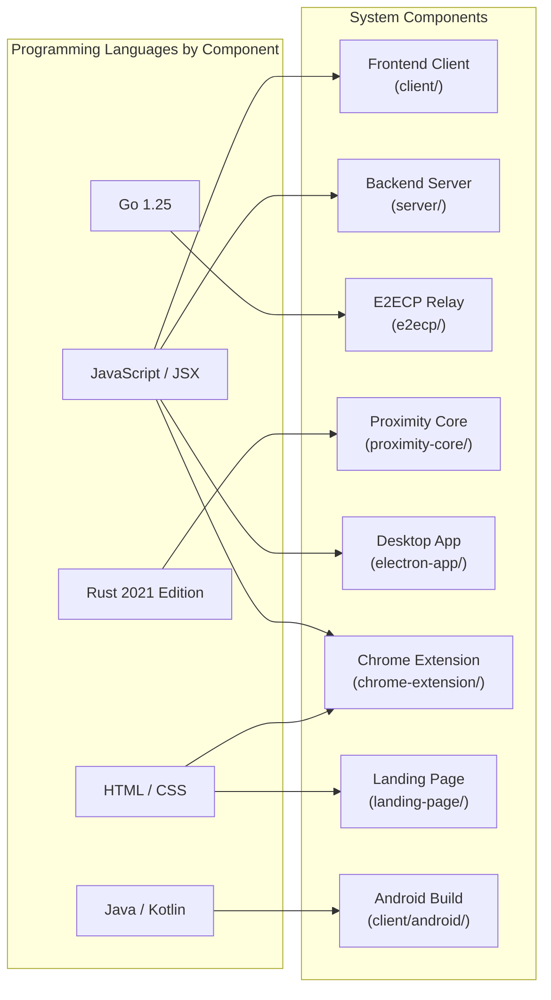
```mermaid
flowchart LR
    subgraph Languages["Programming Languages by Component"]
        JS["JavaScript / JSX"]
        Go["Go 1.25"]
        Rust["Rust 2021 Edition"]
        Java["Java / Kotlin"]
        HTML["HTML / CSS"]
    end

    subgraph Components["System Components"]
        Client["Frontend Client<br/>(client/)"]
        Server["Backend Server<br/>(server/)"]
        E2ECP["E2ECP Relay<br/>(e2ecp/)"]
        Prox["Proximity Core<br/>(proximity-core/)"]
        Electron["Desktop App<br/>(electron-app/)"]
        ChromeExt["Chrome Extension<br/>(chrome-extension/)"]
        Landing["Landing Page<br/>(landing-page/)"]
        Android["Android Build<br/>(client/android/)"]
    end

    JS --> Client
    JS --> Server
    JS --> Electron
    JS --> ChromeExt
    Go --> E2ECP
    Rust --> Prox
    Java --> Android
    HTML --> Landing
    HTML --> ChromeExt
```

### 3.1.2 JavaScript / JSX (Primary Language)

JavaScript is the dominant language across the monorepo, used for the frontend client, backend server, Electron desktop shell, and Chrome extension.

| Aspect | Detail |
|---|---|
| **Variant** | ECMAScript (ES2022+), JSX for React components |
| **Runtime** | Node.js (≥16.0.0), browser engines, Electron 28.x (Chromium 120) |
| **Module System** | CommonJS (server), ESM (client via Vite) |
| **Build Target** | `esnext` for client; no transpilation for server |
| **Engine Constraints** | `node >=16.0.0`, `npm >=8.0.0` (specified in root `package.json`, lines 6–8) |

**Justification**: JavaScript enables full-stack code sharing across client and server, maximizes developer pool access, and integrates seamlessly with the React ecosystem for cross-platform UI delivery. The JSX variant (rather than TypeScript) was selected for the client, though TypeScript type definitions are included as devDependencies (`typescript ^5.8.3`, `@types/react ^18.2.15`) for editor tooling support. The Capacitor configuration (`capacitor.config.ts`) is the sole TypeScript source file.

**Security Consideration**: The Web Crypto API, available across all targeted JavaScript runtimes, serves as the foundation for the client-side cryptographic stack in `client/src/crypto/`, avoiding reliance on user-land crypto implementations for primitive operations.

### 3.1.3 Go 1.25 (E2ECP Subsystem)

Go powers the E2ECP (End-to-End Communication Protocol) file transfer relay, CLI tooling, and WebSocket server.

| Aspect | Detail |
|---|---|
| **Version** | Go 1.25 (specified in `e2ecp/go.mod`) |
| **Module Path** | `github.com/schollz/e2ecp` |
| **Entry Point** | `e2ecp/main.go` — Cobra CLI with `serve`, `send`, `receive`, `auth`, `upload` commands |
| **Build** | Multi-stage Docker build (`golang:1.25-alpine`) |

**Justification**: Go provides an ideal combination of static binary compilation, low-latency WebSocket handling, and memory-safe concurrency for the file transfer relay workload. Single-binary distribution simplifies Docker containerization and cross-platform CLI installation (Homebrew, Arch Linux).

**Security Consideration**: The Go standard library's `crypto` packages (`golang.org/x/crypto v0.47.0`) and JWT authentication (`golang-jwt/jwt/v5 v5.3.0`) provide a hardened foundation for the relay service's security layer.

### 3.1.4 Rust 2021 Edition (Proximity Core)

Rust is used exclusively for the QUIC-based proximity/LAN peer-to-peer networking engine.

| Aspect | Detail |
|---|---|
| **Edition** | 2021 (specified in `proximity-core/Cargo.toml`) |
| **Version** | 0.1.0 |
| **Workspace Members** | `core`, `bindings/node` (napi-rs), `bindings/android` (JNI cdylib) |
| **Resolver** | Cargo resolver 2 |

**Justification**: Rust's memory safety guarantees without garbage collection, zero-cost abstractions, and first-class async/await support make it the optimal choice for a high-performance, security-critical networking engine that operates on LAN with ephemeral TLS certificates. The Rust workspace structure enables building native bindings for both Electron (Node.js via napi-rs) and Android (JNI) from a single codebase.

**Security Consideration**: Rust's ownership model eliminates buffer overflow and use-after-free vulnerabilities. The proximity core uses `ring 0.17` and `rustls 0.23` for TLS, avoiding any dependency on OpenSSL.

### 3.1.5 Java / Kotlin (Android Native Layer)

Java and Kotlin serve the native Android platform layer generated by Capacitor.

| Aspect | Detail |
|---|---|
| **Usage** | Capacitor-generated Android project; custom `MainActivity.java` with `FLAG_SECURE` |
| **Build** | Gradle (`gradlew assembleDebug`) |
| **CI/CD** | CodeQL scans `java-kotlin` language (`.github/workflows/codeql.yml`) |

**Justification**: The Android platform layer requires Java/Kotlin for native API access. Capacitor generates the majority of the Android project, with targeted modifications for security features such as `FLAG_SECURE` screenshot blocking.

### 3.1.6 HTML / CSS (Static Content)

HTML and CSS are used for the static landing page and Chrome extension popup, neither of which requires a build step.

| Component | Source |
|---|---|
| Landing Page | `landing-page/index.html`, `landing-page/styles.css` |
| Chrome Extension Popup | `chrome-extension/popup/popup.html` |

---

## 3.2 FRAMEWORKS & LIBRARIES

### 3.2.1 Frontend Core Stack

The frontend client (`client/`) is built on a modern React/Vite/Tailwind stack optimized for performance and cross-platform delivery.

#### Core UI Framework

| Library | Version | Purpose | Source |
|---|---|---|---|
| React | `^18.2.0` | Component-based UI framework | `client/package.json` |
| React DOM | `^18.2.0` | Browser DOM renderer | `client/package.json` |
| React Router DOM | `^6.15.0` | Client-side SPA routing | `client/package.json` |

**Justification**: React 18 provides concurrent rendering, automatic batching, and the robust component model needed for the 55+ UI components in `client/src/components/`. React Router DOM 6.x enables declarative, client-side navigation within the single-page application without full-page reloads, which is essential for maintaining in-memory encryption state.

#### Build Toolchain

| Library | Version | Purpose | Source |
|---|---|---|---|
| Vite | `^4.4.5` | Build tool and development server | `client/package.json` |
| @vitejs/plugin-react | `^4.7.0` | React Fast Refresh and JSX support | `client/package.json` |
| esbuild | `^0.27.2` | Fast JS bundling (Vite backend) | Root `package.json` |

**Justification**: Vite provides sub-second hot module replacement (HMR) during development and efficient Rollup-based production builds. The `esnext` build target in `client/vite.config.js` ensures modern browser features are preserved rather than transpiled. Production builds disable sourcemaps and strip `console`/`debugger` statements (lines 114, 143) as a security hardening measure.

#### Styling & UI

| Library | Version | Purpose | Source |
|---|---|---|---|
| Tailwind CSS | `^3.4.19` (client) / `^4.1.18` (root) | Utility-first CSS framework | `client/package.json`, root `package.json` |
| PostCSS | `^8.5.6` | CSS processing pipeline | `client/package.json` |
| Autoprefixer | `^10.4.23` | CSS vendor prefix automation | Root `package.json` |
| Lucide React | `^0.279.0` | SVG icon library | `client/package.json` |
| React Toastify | `^11.0.5` | Toast notification system | `client/package.json` |
| Emoji Picker React | `^4.16.1` | Emoji selection widget | `client/package.json` |

#### Communication & Utilities

| Library | Version | Purpose | Source |
|---|---|---|---|
| Axios | `^1.11.0` | HTTP client for REST API calls | `client/package.json` |
| Socket.IO Client | `^4.7.2` | Real-time bidirectional WebSocket communication | `client/package.json` |
| QRCode | `^1.5.4` | QR code generation for Drop sharing | `client/package.json` |
| React Copy to Clipboard | `^5.1.0` | Clipboard interaction utility | `client/package.json` |
| gh-pages | `^6.0.0` | GitHub Pages deployment utility | `client/package.json` |

### 3.2.2 Progressive Web App (PWA) Stack

The PWA layer enables offline-capable, installable experiences across all browser platforms.

| Library | Version | Purpose | Source |
|---|---|---|---|
| vite-plugin-pwa | `^0.17.4` | PWA manifest and service worker generation | `client/package.json` |
| workbox-core | `^7.0.0` | Service worker core runtime | `client/package.json` (devDeps) |
| workbox-expiration | `^7.0.0` | Cache expiration strategies | `client/package.json` (devDeps) |
| workbox-precaching | `^7.0.0` | Static asset precaching | `client/package.json` (devDeps) |
| workbox-routing | `^7.0.0` | Request routing for service workers | `client/package.json` (devDeps) |
| workbox-strategies | `^7.0.0` | Caching strategies (CacheFirst, NetworkFirst) | `client/package.json` (devDeps) |
| workbox-window | `^7.0.0` | Service worker registration and updates | `client/package.json` (devDeps) |

**Justification**: Workbox 7 provides production-grade service worker tooling with configurable caching strategies. The `vite-plugin-pwa` integration automates manifest generation and service worker registration (`client/src/registerSW.js`), with update prompting and iOS standalone-specific handling.

### 3.2.3 WebAssembly (WASM) Support

WebAssembly integration enables the use of compiled cryptographic protocols in the browser.

| Library | Version | Purpose | Source |
|---|---|---|---|
| vite-plugin-wasm | `^3.5.0` | WebAssembly module bundling | `client/package.json` |
| vite-plugin-top-level-await | `^1.6.0` | Top-level await for async WASM initialization | `client/package.json` |
| openmls-wasm | `^0.1.0` | OpenMLS (Messaging Layer Security) protocol | `client/package.json` |

**Justification**: The OpenMLS WASM module brings the IETF Messaging Layer Security (MLS) protocol to the browser runtime. The `vite-plugin-wasm` and `vite-plugin-top-level-await` plugins ensure correct WASM module loading and initialization within the Vite build pipeline.

### 3.2.4 Security & Cryptography Libraries

The cryptographic library selection implements a defense-in-depth encryption architecture aligned with IETF standards and NIST post-quantum recommendations.

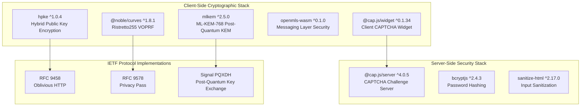
```mermaid
flowchart TB
    subgraph ClientCrypto["Client-Side Cryptographic Stack"]
        Noble["@noble/curves ^1.8.1<br/>Ristretto255 VOPRF"]
        HPKE["hpke ^1.0.4<br/>Hybrid Public Key Encryption"]
        MLKEM["mlkem ^2.5.0<br/>ML-KEM-768 Post-Quantum KEM"]
        OpenMLS["openmls-wasm ^0.1.0<br/>Messaging Layer Security"]
        CapWidget["@cap.js/widget ^0.1.34<br/>Client CAPTCHA Widget"]
    end

    subgraph ServerCrypto["Server-Side Security Stack"]
        CapServer["@cap.js/server ^4.0.5<br/>CAPTCHA Challenge Server"]
        Bcrypt["bcryptjs ^2.4.3<br/>Password Hashing"]
        Sanitize["sanitize-html ^2.17.0<br/>Input Sanitization"]
    end

    subgraph Protocols["IETF Protocol Implementations"]
        OHTTP["RFC 9458<br/>Oblivious HTTP"]
        PP["RFC 9578<br/>Privacy Pass"]
        PQXDH["Signal PQXDH<br/>Post-Quantum Key Exchange"]
    end

    Noble --> PP
    HPKE --> OHTTP
    MLKEM --> PQXDH
    CapWidget --> CapServer
```

| Library | Version | Purpose | Evidence |
|---|---|---|---|
| @noble/curves | `^1.8.1` | Elliptic curve cryptography — Ristretto255 VOPRF for Privacy Pass (RFC 9578) | `client/package.json`, root `package.json` |
| hpke | `^1.0.4` | Hybrid Public Key Encryption — OHTTP gateway encapsulation (RFC 9458) | `client/package.json`, root `package.json` |
| mlkem | `^2.5.0` | ML-KEM-768 post-quantum key encapsulation — PQXDH hybrid key exchange | `client/package.json`, root `package.json` |
| openmls-wasm | `^0.1.0` | Messaging Layer Security protocol (WASM build) | `client/package.json` |
| @cap.js/server | `^4.0.5` | Server-side CAPTCHA/proof-of-work challenge | Root `package.json` |
| @cap.js/widget | `^0.1.34` | Client-side CAPTCHA/challenge widget | `client/package.json` |
| bcryptjs | `^2.4.3` | Room password hashing and verification | Root `package.json` |
| sanitize-html | `^2.17.0` | Input sanitization to prevent XSS injection | Root `package.json` |

**Security Justification**: NIST's FIPS 203 standard specifies ML-KEM, whose security is related to the computational difficulty of the Module Learning with Errors problem, and is believed to be secure even against adversaries who possess a quantum computer. The industry has settled on ML-KEM as the underlying de facto standard, and in practice, virtually all implementations focus on X25519MLKEM768. Ephchat's hybrid PQXDH implementation (X25519 + ML-KEM-768) in `client/src/crypto/pqxdh.js` and `client/src/crypto/ml-kem.js` directly aligns with this industry direction, protecting against "harvest now, decrypt later" attacks by quantum adversaries. The `@noble/curves` library is a widely-audited, pure-JavaScript elliptic curve implementation suitable for the Ristretto255 VOPRF used in Privacy Pass token issuance.

### 3.2.5 Backend Server Stack

The Node.js backend (`server/`) uses Express as the HTTP framework and Socket.IO for real-time signaling.

| Library | Version | Purpose | Source |
|---|---|---|---|
| Express | `^4.21.2` | HTTP server framework and REST API routing | Root `package.json` |
| Socket.IO | `^4.7.2` | Real-time bidirectional signaling (rooms, messages, presence) | Root `package.json` |
| Redis | `^4.6.8` | Optional horizontal scaling and link-preview caching | Root `package.json` |
| CORS | `^2.8.5` | Cross-origin resource sharing middleware | Root `package.json` |
| dotenv | `^16.6.1` | Environment variable management | Root `package.json` |
| express-rate-limit | `^8.2.1` | Request rate limiting (30 msg/min per `.env`) | Root `package.json` |
| http-proxy-middleware | `^3.0.5` | HTTP proxy support for development and relay | Root `package.json` |
| uuid | `^13.0.0` | Cryptographically random UUID generation | Root `package.json` |

**Justification**: Express v4.21.2 remains the most widely deployed major version, with nearly 17 million weekly npm downloads. The project uses Express 4.x for its proven stability and extensive middleware ecosystem. Socket.IO 4.7 provides automatic reconnection, room-based broadcasting, and binary data support — all critical for the real-time signaling architecture described in `server/index.js`. The `express-rate-limit` middleware enforces the `MAX_MESSAGES_PER_MINUTE=30` threshold configured in `.env`.

### 3.2.6 Audio & Media Processing

| Library | Version | Purpose | Source |
|---|---|---|---|
| agora-rtc-sdk-ng | `^4.19.3` | Voice call SDK — WebRTC failover engine (client) | `client/package.json` |
| agora-token | `^2.0.5` | Agora authentication token generation (server) | Root `package.json` |
| fluent-ffmpeg | `^2.1.3` | FFmpeg wrapper for server-side audio processing | Root `package.json` |
| @ffmpeg-installer/ffmpeg | `^1.1.0` | FFmpeg binary installer | Root `package.json` |
| @ffprobe-installer/ffprobe | `^2.1.2` | FFprobe binary installer | Root `package.json` |
| lamejs | `^1.2.1` | MP3 encoding for Audio Drop voice notes | Root `package.json` |

**Justification**: The Agora RTC SDK provides a managed WebRTC infrastructure for voice call failover when direct P2P connectivity fails due to restrictive NAT configurations. FFmpeg integration supports audio processing for the Audio Drop (voice note) feature with configurable recording and playback.

### 3.2.7 Electron Desktop Stack

| Library | Version | Purpose | Source |
|---|---|---|---|
| Electron | `^28.0.0` | Desktop application shell | `electron-app/package.json` |
| Electron Builder | `^24.9.1` | Cross-platform packaging and distribution | `electron-app/package.json` |
| Electron Store | `^8.1.0` | Persistent local key-value storage | `electron-app/package.json` |
| Electron Updater | `^6.7.3` | Auto-update from GitHub Releases | `electron-app/package.json` |

**Justification**: Electron 28.0.0 ships with Chromium 120.0.6099.56, Node.js 18.18.2, and V8 12.0.267.8. Electron 28 enabled ESM support, with the UtilityProcess API now supporting ESM entrypoints. The Chromium 120 base provides access to the Web Crypto API, WebRTC, and WebTransport APIs required by the client cryptographic stack. Electron Builder 24.x enables simultaneous builds for Windows (NSIS, Portable, AppX), macOS (DMG, ZIP with hardened runtime), and Linux (AppImage, DEB).

**Security Consideration**: The Electron desktop application implements `setContentProtection(true)` in `electron-app/main.js` for screenshot blocking, clipboard clearing on PrintScreen via `electron-app/preload.js`, and code signing for distribution integrity (Windows SHA-256, macOS hardened runtime). Custom protocol handling (`ephemeral-chat://`) and `.eph` file association (`application/x-ephemeral-drop`) are registered for deep linking.

### 3.2.8 Capacitor Mobile Stack

| Library | Version | Purpose | Source |
|---|---|---|---|
| @capacitor/core | `^8.0.2` | Capacitor runtime | `client/package.json` |
| @capacitor/cli | `^8.0.2` | Capacitor CLI tooling | `client/package.json` |
| @capacitor/android | `^8.0.2` | Android platform integration | `client/package.json` |
| @capacitor/ios | `^8.0.2` | iOS platform (configured, not active — Constraint C-004) | `client/package.json` |
| @capacitor/app | `^8.0.0` | App state and lifecycle management | `client/package.json` |
| @capacitor/filesystem | `^8.1.2` | Native file system access | `client/package.json` |
| @capacitor/keyboard | `^8.0.1` | Keyboard control and management | `client/package.json` |
| @capacitor/share | `^8.0.0` | Native sharing intent integration | `client/package.json` |
| capacitor-secure-storage-plugin | `^0.13.0` | Secure on-device storage | `client/package.json` |
| @capgo/capacitor-screen-recorder | `^8.2.16` | Screen recording detection and blocking | `client/package.json` |
| @capacitor-community/file-opener | `^8.0.0` | Native file opening | `client/package.json` |

**Justification**: Capacitor 8.x enables wrapping the React/Vite web application as a native Android app with access to platform APIs (file system, secure storage, sharing), while maintaining a single codebase. The App ID is `me.kyere.chat` with the production server origin set to `chat.kyere.me` (from `capacitor.config.ts`). iOS support is technically configured but is not active in current releases per Constraint C-004.

### 3.2.9 Go Dependencies (E2ECP Subsystem)

| Library | Version | Purpose | Source |
|---|---|---|---|
| github.com/spf13/cobra | v1.10.2 | CLI framework with subcommand support | `e2ecp/go.mod` |
| github.com/gorilla/websocket | v1.5.3 | WebSocket server for file relay | `e2ecp/go.mod` |
| github.com/golang-jwt/jwt/v5 | v5.3.0 | JWT authentication for relay access | `e2ecp/go.mod` |
| github.com/golang-migrate/migrate/v4 | v4.19.1 | PostgreSQL schema migrations | `e2ecp/go.mod` |
| github.com/lib/pq | v1.10.9 | PostgreSQL driver | `e2ecp/go.mod` |
| github.com/rs/cors | v1.11.1 | CORS handling | `e2ecp/go.mod` |
| github.com/google/uuid | v1.6.0 | UUID generation | `e2ecp/go.mod` |
| github.com/joho/godotenv | v1.5.1 | Environment file loading | `e2ecp/go.mod` |
| github.com/schollz/progressbar/v3 | v3.19.0 | CLI progress bar for file transfers | `e2ecp/go.mod` |
| golang.org/x/crypto | v0.47.0 | Extended cryptographic primitives | `e2ecp/go.mod` |
| golang.org/x/term | v0.39.0 | Terminal I/O for CLI | `e2ecp/go.mod` |
| google.golang.org/protobuf | v1.36.11 | Protocol Buffers serialization | `e2ecp/go.mod` |
| rsc.io/qr | v0.2.0 | QR code generation for CLI sharing | `e2ecp/go.mod` |

### 3.2.10 Rust Dependencies (Proximity Core)

| Library | Version | Purpose | Source |
|---|---|---|---|
| quinn | 0.11 | QUIC transport implementation | `proximity-core/Cargo.toml` |
| rustls | 0.23 (with `ring` feature) | TLS implementation (no OpenSSL) | `proximity-core/Cargo.toml` |
| tokio | 1 (full features) | Async runtime | `proximity-core/Cargo.toml` |
| mdns-sd | 0.11 | mDNS-SD service discovery for LAN peers | `proximity-core/Cargo.toml` |
| rcgen | 0.13 | Ephemeral TLS certificate generation | `proximity-core/Cargo.toml` |
| ring | 0.17 | Cryptographic operations | `proximity-core/Cargo.toml` |
| serde / serde_json | 1 / 1 | Serialization framework | `proximity-core/Cargo.toml` |
| bincode | 1 | Binary serialization for wire protocol | `proximity-core/Cargo.toml` |
| tracing / tracing-subscriber | 0.1 / 0.3 | Structured logging with env-filter | `proximity-core/Cargo.toml` |
| uuid | 1 (v4) | UUID generation | `proximity-core/Cargo.toml` |
| dashmap | 6 | Concurrent hash map for peer tracking | `proximity-core/Cargo.toml` |
| thiserror | 2 | Ergonomic error handling | `proximity-core/Cargo.toml` |
| sha2 | 0.10 | SHA-2 hashing for certificate fingerprints | `proximity-core/Cargo.toml` |
| rand | 0.8 | Cryptographic random number generation | `proximity-core/Cargo.toml` |
| bytes | 1 | Zero-copy byte buffer utilities | `proximity-core/Cargo.toml` |

---

## 3.3 OPEN SOURCE DEPENDENCIES

### 3.3.1 Package Registries

The project consumes dependencies from three distinct package registries, each corresponding to a language ecosystem:

| Registry | Ecosystem | Lock File | Components |
|---|---|---|---|
| **npm** (npmjs.com) | JavaScript / Node.js | `package-lock.json` | Root, `client/`, `electron-app/`, `e2ecp/web/` |
| **Go Modules** (proxy.golang.org) | Go | `e2ecp/go.sum` | `e2ecp/` |
| **Crates.io** | Rust | `proximity-core/Cargo.lock` | `proximity-core/` |

### 3.3.2 npm Dependency Summary

The JavaScript ecosystem accounts for the largest number of direct dependencies, distributed across four `package.json` files:

| Workspace | Dependencies | Dev Dependencies | Key Packages |
|---|---|---|---|
| Root (`package.json`) | 18 | 5 | Express, Socket.IO, Redis, bcryptjs, sanitize-html |
| Client (`client/package.json`) | 28 | 13 | React, Vite, Tailwind, Capacitor, crypto libraries |
| Electron (`electron-app/package.json`) | 3 | 2 | Electron, Electron Builder, Electron Store |
| E2ECP Web (`e2ecp/web/package.json`) | ~12 | ~6 | React, Vite, Tailwind, Playwright, JSZip |

**Patch Management**: The `client/` workspace includes `patch-package ^8.0.1` as a devDependency, enabling targeted patches to npm dependencies without forking, providing a controlled mechanism for security hotfixes to third-party code.

### 3.3.3 Go Module Dependencies

The E2ECP Go module declares 13 direct dependencies in `e2ecp/go.mod`, with pinned versions following Go's module proxy system. All dependencies use semantic versioning and are resolved through `proxy.golang.org`.

### 3.3.4 Rust Crate Dependencies

The Proximity Core workspace declares 16 direct dependencies in `proximity-core/Cargo.toml`, resolved through `crates.io`. The workspace resolver 2 ensures feature unification across the three workspace members (`core`, `bindings/node`, `bindings/android`).

### 3.3.5 Licensing

| Component | License | Evidence |
|---|---|---|
| Main Repository | Apache 2.0 | `LICENSE` |
| E2ECP Subproject | MIT | `e2ecp/LICENSE` |

Both licenses are permissive open-source licenses. All direct dependencies have been selected from permissive or weakly-copyleft licensed projects compatible with the Apache 2.0 distribution model.

---

## 3.4 THIRD-PARTY SERVICES

### 3.4.1 External Service Architecture

Ephchat deliberately minimizes external service dependencies to reinforce its zero-knowledge privacy architecture. No third-party analytics, advertising, identity providers, or persistent storage services are used (Constraint C-003 from `PRIVACY_POLICY.md`).

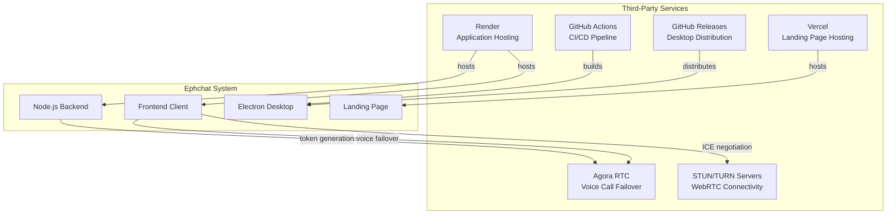
```mermaid
flowchart TB
    subgraph External["Third-Party Services"]
        Agora["Agora RTC<br/>Voice Call Failover"]
        STUN["STUN/TURN Servers<br/>WebRTC Connectivity"]
        Render["Render<br/>Application Hosting"]
        Vercel["Vercel<br/>Landing Page Hosting"]
        GHActions["GitHub Actions<br/>CI/CD Pipeline"]
        GHReleases["GitHub Releases<br/>Desktop Distribution"]
    end

    subgraph System["Ephchat System"]
        ServerNode["Node.js Backend"]
        ClientApp["Frontend Client"]
        ElectronApp["Electron Desktop"]
        LandingPg["Landing Page"]
    end

    ServerNode -->|token generation| Agora
    ClientApp -->|voice failover| Agora
    ClientApp -->|ICE negotiation| STUN
    Render -->|hosts| ServerNode
    Render -->|hosts| ClientApp
    Vercel -->|hosts| LandingPg
    GHActions -->|builds| ElectronApp
    GHReleases -->|distributes| ElectronApp
```

### 3.4.2 Agora RTC

| Aspect | Detail |
|---|---|
| **Purpose** | Voice call failover when direct WebRTC P2P connectivity fails |
| **Client Library** | `agora-rtc-sdk-ng ^4.19.3` |
| **Server Library** | `agora-token ^2.0.5` |
| **Configuration** | `AGORA_APP_ID` and `AGORA_APP_CERTIFICATE` in `.env` (lines 17–18) |
| **Integration Point** | `client/src/webrtc.js` (client), `server/index.js` (token generation) |

**Security Implication**: Agora tokens are generated server-side with time-limited validity. Voice data through Agora is still encrypted; however, Agora's relay infrastructure represents a third-party touchpoint that exists outside the zero-knowledge boundary. The system prefers direct WebRTC P2P and only falls back to Agora when ICE/STUN/TURN negotiation fails.

### 3.4.3 STUN/TURN Servers

| Aspect | Detail |
|---|---|
| **Purpose** | WebRTC NAT traversal for voice calls and peer-to-peer data channels |
| **Configuration** | `VITE_ICE_SERVERS` in `client/.env.production` (JSON array of ICE server objects) |
| **Protocol** | ICE (Interactive Connectivity Establishment) |

**Integration Requirement**: STUN servers facilitate NAT hole-punching for direct P2P connections. TURN servers provide relay fallback when direct connectivity is impossible. The ICE server configuration is environment-driven, allowing deployment-specific server selection.

### 3.4.4 Hosting Platforms

| Service | Component | Configuration | Evidence |
|---|---|---|---|
| **Render** | Primary application (server + client) | Production detection in `client/vite.config.js` (lines 16–17) | `README.md` |
| **Vercel** | Landing page | `cleanUrls: true`, `trailingSlash: false` | `landing-page/vercel.json` |
| **GitHub Releases** | Desktop app binaries (Windows, macOS, Linux) | Electron Builder publish config | `electron-app/package.json` (lines 47–51) |

### 3.4.5 Embedded Content Providers

The Watch Party feature (F-008) embeds content from third-party providers via oEmbed and OpenGraph metadata. These are user-initiated integrations, not system-level dependencies:

- YouTube (video embedding)
- Twitch (live stream embedding)
- SoundCloud (audio embedding)
- Figma (design file embedding)
- Google Drive/Docs (document embedding)

Navigation is allowlisted for YouTube and SoundCloud in the Capacitor configuration to support mobile embedded playback.

---

## 3.5 DATABASES & STORAGE

### 3.5.1 Storage Architecture Overview

Ephchat's storage architecture is uniquely defined by its **RAM-only, zero-persistence** principle. The system intentionally avoids persistent server-side databases for message content, user data, or file storage — all core data resides exclusively in volatile memory. This is the most distinctive architectural decision in the entire system.

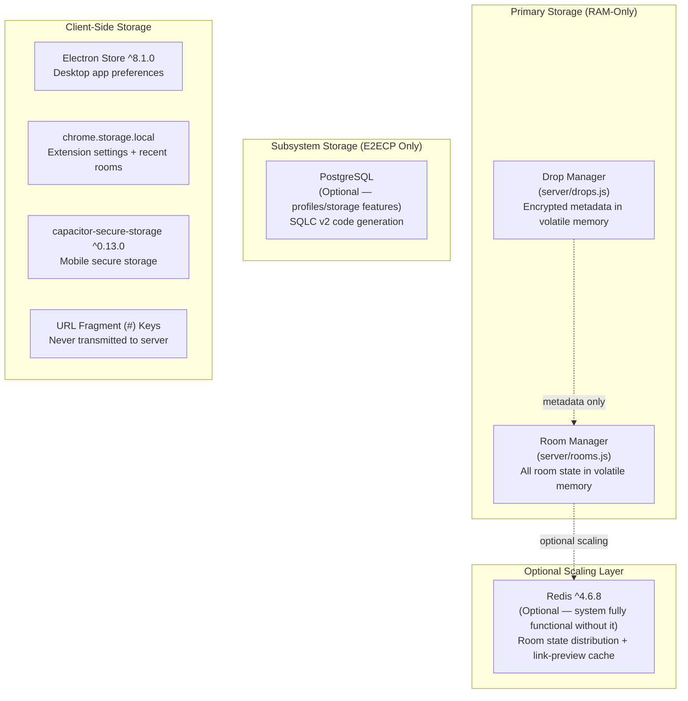
```mermaid
flowchart TB
    subgraph Primary["Primary Storage (RAM-Only)"]
        RoomMgr["Room Manager<br/>(server/rooms.js)<br/>All room state in volatile memory"]
        DropMgr["Drop Manager<br/>(server/drops.js)<br/>Encrypted metadata in volatile memory"]
    end

    subgraph Optional["Optional Scaling Layer"]
        RedisInst["Redis ^4.6.8<br/>(Optional — system fully functional without it)<br/>Room state distribution + link-preview cache"]
    end

    subgraph SubsystemDB["Subsystem Storage (E2ECP Only)"]
        PostgresDB["PostgreSQL<br/>(Optional — profiles/storage features)<br/>SQLC v2 code generation"]
    end

    subgraph ClientStorage["Client-Side Storage"]
        ElectronStore["Electron Store ^8.1.0<br/>Desktop app preferences"]
        ChromeStorage["chrome.storage.local<br/>Extension settings + recent rooms"]
        SecureStorage["capacitor-secure-storage ^0.13.0<br/>Mobile secure storage"]
        WebCrypto["URL Fragment (#) Keys<br/>Never transmitted to server"]
    end

    RoomMgr -.->|optional scaling| RedisInst
    DropMgr -.->|metadata only| RoomMgr
```

### 3.5.2 In-Memory Storage (Primary)

| Aspect | Detail |
|---|---|
| **Implementation** | `server/rooms.js` — `RoomManager` class with in-memory data structures |
| **Contents** | Room metadata, participant lists, message relay buffers, drop metadata, session tokens |
| **Persistence** | None — server restart destroys all state (Constraint C-001) |
| **Rationale** | Enforces the zero-persistence privacy guarantee; no data survives beyond the active server process |

All room state, participant data, and transient message buffers are managed as JavaScript objects in the Node.js process heap. This is an intentional architectural decision, not a limitation — it ensures that even physical access to the server infrastructure cannot reveal historical communication data.

### 3.5.3 Redis (Optional Horizontal Scaling)

| Aspect | Detail |
|---|---|
| **Version** | `redis ^4.6.8` (npm package) |
| **Default State** | Disabled (`.env` line 13: `# Redis Configuration (Optional - leave empty for in-memory storage)`) |
| **Connection** | `REDIS_URL=redis://localhost:6379` (commented out by default) |
| **Usage** | Room state distribution across multiple server instances; link-preview metadata caching |
| **Data Nature** | Volatile — mirrors in-memory state for horizontal scaling, not permanent persistence |

**Justification**: Redis serves as an optional scaling layer that distributes room state across multiple Node.js processes without introducing persistent storage. When enabled, it supports horizontal scaling for the `server/rooms.js` module and provides caching for `server/link-preview.js` metadata. The system is fully functional without Redis, operating in single-process mode.

### 3.5.4 PostgreSQL (E2ECP Subsystem Only)

| Aspect | Detail |
|---|---|
| **Driver** | `github.com/lib/pq v1.10.9` |
| **Migrations** | `golang-migrate/migrate/v4 v4.19.1`, schema in `migrations/postgres/*.up.sql` |
| **Code Generation** | SQLC v2, PostgreSQL engine, generates Go code in `src/db` package |
| **Configuration** | `e2ecp/sqlc.yaml` (lines 1–13) |
| **Purpose** | Optional persistent storage and profile features for the E2ECP file-sharing subsystem |

**Important**: PostgreSQL is the **only relational database dependency** in the entire system, and it is confined exclusively to the E2ECP subproject. The main Ephemeral Chat application has zero database dependencies. PostgreSQL is optional within E2ECP as well — the relay server operates without it when profile/storage features are not needed.

### 3.5.5 Client-Side Storage

| Storage Mechanism | Platform | Purpose | Evidence |
|---|---|---|---|
| **URL Fragment Identifiers (`#`)** | All platforms | Encryption key distribution — never transmitted to server | `client/src/crypto/` |
| **Electron Store** (`^8.1.0`) | Desktop | Persistent local settings and preferences | `electron-app/package.json` |
| **chrome.storage.local** | Chrome Extension | Recent rooms (max 10, 7-day auto-cleanup), notification/sound settings | `chrome-extension/manifest.json` permission `"storage"`, `chrome-extension/background.js` |
| **capacitor-secure-storage-plugin** (`^0.13.0`) | Android | Secure on-device storage for sensitive data | `client/package.json` |
| **Service Worker Cache** (Workbox) | Web/PWA | Static asset precaching for offline access | `client/src/registerSW.js` |

---

## 3.6 DEVELOPMENT & DEPLOYMENT

### 3.6.1 Build Systems

The monorepo employs distinct build systems per subsystem, each optimized for its target platform and language ecosystem.

#### Frontend (Vite)

| Aspect | Detail |
|---|---|
| **Bundler** | Vite `^4.4.5` with Rollup production builds |
| **Build Target** | `esnext` |
| **Output** | `client/dist/` |
| **Chunk Splitting** | Manual chunks for Agora, React, Socket.IO, and vendor code (`client/vite.config.js`, lines 121–134) |
| **CSS Pipeline** | Tailwind CSS → PostCSS → Autoprefixer |
| **WASM Integration** | `vite-plugin-wasm` + `vite-plugin-top-level-await` for OpenMLS |
| **PWA Generation** | Workbox service worker via `vite-plugin-pwa` |
| **Security Hardening** | Sourcemaps disabled, console/debugger stripped (`client/vite.config.js`, lines 114, 143) |

#### Backend (Node.js)

| Aspect | Detail |
|---|---|
| **Runtime** | Node.js (CommonJS modules) |
| **Entry Point** | `server/index.js` (`"main": "server/index.js"` in root `package.json`) |
| **Development** | `npm run dev` → `concurrently` runs server + client simultaneously |
| **Production Build** | `npm run build` → Vite production build of `client/` |
| **Auto-Restart** | `nodemon ^3.0.1` watches server files |

#### E2ECP (Go + Docker)

The E2ECP build uses a three-stage Docker multi-stage build for minimal production images:

| Stage | Base Image | Purpose |
|---|---|---|
| 1 (Frontend) | `node:20-alpine` | `npm ci` → `npm run build` of the embedded React/Vite web UI |
| 2 (Backend) | `golang:1.25-alpine` | `go mod download` → `go build -o e2ecp main.go` |
| 3 (Runtime) | `alpine:latest` | Minimal runtime with `ca-certificates`; copies compiled binary + static assets |

Additional build tooling:
- **Makefile**: Frontend, backend, test, and migration build targets
- **Air** (`.air.toml`): Live-reload Go development, watches `.go`, `.html`, `.jsx`, `.css` files
- **Default config**: `--max-rooms 100`, port `8080`

#### Proximity Core (Cargo Workspace)

| Aspect | Detail |
|---|---|
| **Build System** | Cargo (Rust), workspace resolver 2 |
| **Library Crate** | `core` — QUIC networking engine |
| **Node.js Binding** | `bindings/node` — napi-rs native addon for Electron |
| **Android Binding** | `bindings/android` — JNI cdylib for Capacitor |

#### Electron Desktop (Electron Builder)

| Aspect | Detail |
|---|---|
| **Packager** | Electron Builder `^24.9.1` |
| **Windows Targets** | NSIS (x64, arm64), Portable (x64, arm64), AppX/MSIX (x64, arm64) |
| **macOS Targets** | DMG, ZIP (hardened runtime: `hardenedRuntime: true`) |
| **Linux Targets** | AppImage, DEB |
| **Code Signing** | Windows SHA-256 (`electron-app/package.json`, lines 95–98), macOS hardened runtime |
| **Custom Protocols** | `ephemeral-chat://` URL scheme, `.eph` file association |

### 3.6.2 CI/CD Pipeline (GitHub Actions)

Two GitHub Actions workflows automate security scanning and cross-platform release builds:

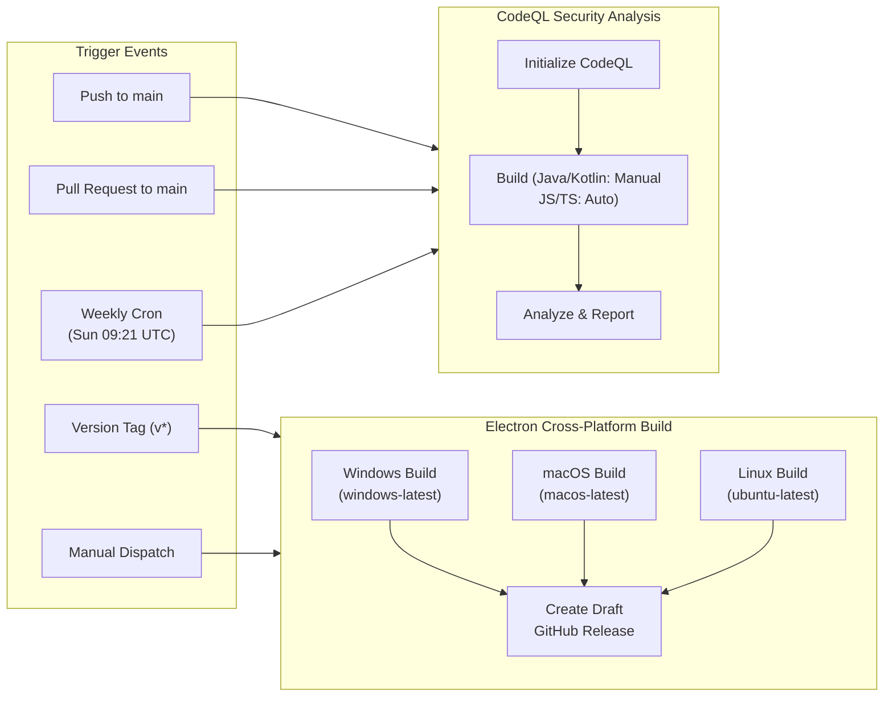
```mermaid
flowchart LR
    subgraph Triggers["Trigger Events"]
        Push["Push to main"]
        PR["Pull Request to main"]
        Tag["Version Tag (v*)"]
        Cron["Weekly Cron<br/>(Sun 09:21 UTC)"]
        Manual["Manual Dispatch"]
    end

    subgraph CodeQL["CodeQL Security Analysis"]
        CQLInit["Initialize CodeQL"]
        CQLBuild["Build (Java/Kotlin: Manual<br/>JS/TS: Auto)"]
        CQLAnalyze["Analyze & Report"]
    end

    subgraph ElectronBuild["Electron Cross-Platform Build"]
        WinBuild["Windows Build<br/>(windows-latest)"]
        MacBuild["macOS Build<br/>(macos-latest)"]
        LinBuild["Linux Build<br/>(ubuntu-latest)"]
        Release["Create Draft<br/>GitHub Release"]
    end

    Push --> CodeQL
    PR --> CodeQL
    Cron --> CodeQL
    Tag --> ElectronBuild
    Manual --> ElectronBuild

    CQLInit --> CQLBuild
    CQLBuild --> CQLAnalyze

    WinBuild --> Release
    MacBuild --> Release
    LinBuild --> Release
```

#### CodeQL Security Analysis (`.github/workflows/codeql.yml`)

| Aspect | Detail |
|---|---|
| **Triggers** | Push to `main`, PR to `main`, weekly cron (`21 9 * * 0`) |
| **Languages** | `java-kotlin` (manual build mode), `javascript-typescript` (auto mode) |
| **Tools** | `actions/checkout@v4`, `actions/setup-java@v4` (JDK 17 Temurin), `github/codeql-action/init@v4`, `github/codeql-action/analyze@v4` |
| **Permissions** | `security-events: write`, `packages: read`, `actions: read`, `contents: read` |

#### Electron Build & Release (`.github/workflows/electron-build.yml`)

| Aspect | Detail |
|---|---|
| **Triggers** | Version tags (`v*`), manual `workflow_dispatch` |
| **Jobs** | 4 parallel: `build-windows`, `build-macos`, `build-linux`, `create-release` |
| **Node Version** | 20 |
| **Release** | Draft GitHub release with auto-generated notes via `softprops/action-gh-release@v1` |
| **Artifact Retention** | 30 days |
| **Permissions** | `contents: write` |

### 3.6.3 Containerization

| Aspect | Detail |
|---|---|
| **Scope** | E2ECP subsystem only (`e2ecp/Dockerfile`) |
| **Base Images** | `node:20-alpine`, `golang:1.25-alpine`, `alpine:latest` |
| **Build Strategy** | Three-stage multi-stage build for minimal runtime image |
| **Exposed Port** | 8080 |
| **Compose** | Referenced in E2ECP documentation as a deployment option |

The main Node.js application does not currently use Docker for deployment, relying instead on direct Render platform hosting.

### 3.6.4 Testing Infrastructure

| Type | Tool | Scope | Evidence |
|---|---|---|---|
| E2E Browser Testing | Playwright | E2ECP web UI | `e2ecp/playwright.config.js`, `e2ecp/tests/` |
| Integration Testing | Go `testing` | E2ECP file/folder/text transfers | `e2ecp/integration_test.go` |
| Unit Testing | Go `testing` | URL normalization, logger utilities | `e2ecp/main_test.go` |
| Security Scanning | GitHub CodeQL | Java/Kotlin + JavaScript/TypeScript | `.github/workflows/codeql.yml` |
| Type-Safe SQL Generation | SQLC v2 | PostgreSQL query validation | `e2ecp/sqlc.yaml` |

**Note**: The main application currently has a placeholder test script (`"echo \"No tests specified\""` in root `package.json`). Formal test infrastructure for the Node.js backend and React client is identified as a future phase consideration.

### 3.6.5 Development Tools

| Tool | Version | Purpose | Source |
|---|---|---|---|
| concurrently | `^8.2.0` | Run server + client dev servers in parallel | Root `package.json` (devDeps) |
| nodemon | `^3.0.1` | Node.js auto-restart on file changes | Root `package.json` (devDeps) |
| esbuild | `^0.27.2` | Fast JavaScript/TypeScript bundling (Vite backend) | Root `package.json` (devDeps) |
| Air | — | Go live-reload development server | `e2ecp/.air.toml` |
| patch-package | `^8.0.1` | Patch npm dependencies without forking | `client/package.json` (devDeps) |

### 3.6.6 Environment Configuration

Production environment variables are managed through `.env` at the repository root:

| Variable | Value | Purpose |
|---|---|---|
| `NODE_ENV` | `production` | Environment mode |
| `PORT` | `3001` | Server listening port |
| `BASE_URL` | `https://chat.kyere.me` | Application base URL |
| `ALLOWED_ORIGINS` | `https://chat.kyere.me,https://kyere.me,http://localhost:5173` | CORS whitelist |
| `ROOM_EXPIRY_MINUTES` | `60` | Maximum room TTL |
| `INACTIVITY_TIMEOUT_MINUTES` | `10` | Idle auto-disconnect threshold |
| `INVITE_TOKEN_EXPIRY_MINUTES` | `5` | Time-limited invite validity |
| `MAX_MESSAGES_PER_MINUTE` | `30` | Rate limiting threshold |
| `MAX_FAILED_ATTEMPTS` | `5` | Authentication lockout threshold |
| `LOCKOUT_DURATION_MINUTES` | `10` | Lockout period after failed attempts |
| `REDIS_URL` | *(empty by default)* | Optional Redis connection |
| `AGORA_APP_ID` | *(credentials)* | Agora RTC application ID |
| `AGORA_APP_CERTIFICATE` | *(credentials)* | Agora RTC certificate |

### 3.6.7 Chrome Extension

| Aspect | Detail |
|---|---|
| **Manifest Version** | 3 |
| **Extension Version** | 1.0.0 |
| **Permissions** | `storage`, `notifications`, `alarms` |
| **Host Permissions** | `https://chat.kyere.me/*` |
| **Background** | Service worker (`background.js`, ES module type) |
| **Content Scripts** | `content.js` + `content.css` injected on `https://chat.kyere.me/*` |
| **Popup** | `popup/popup.html` |
| **Build** | None required — framework-free vanilla JavaScript |

---

## 3.7 TECHNOLOGY STACK SUMMARY

### 3.7.1 Cross-Component Integration Map

The following table summarizes how technologies integrate across the polyglot monorepo to deliver the platform's core capabilities:

| Capability | Frontend | Backend | Protocols | Platform |
|---|---|---|---|---|
| **Ephemeral Messaging** | React, Socket.IO Client | Express, Socket.IO Server | Double Ratchet, AES-256-GCM | All |
| **Post-Quantum Encryption** | mlkem, @noble/curves, hpke | — | PQXDH (X25519 + ML-KEM-768) | All |
| **Voice Calls** | WebRTC, Agora SDK | agora-token, ICE Signaling | DTLS-SRTP | All |
| **File Drops** | React, Axios | Express REST API, Drop Manager | Client-side encryption | All |
| **File Transfer Relay** | — | Go (Cobra, Gorilla WS) | WebSocket relay | Docker |
| **Proximity Transfer** | React (NearbyTransfer.jsx) | — | QUIC (Quinn/Rustls) | Electron, Android |
| **Metadata Privacy** | OHTTP client, Privacy Pass client | OHTTP Gateway, Privacy Pass Issuer | RFC 9458, RFC 9578 | Web |
| **Desktop Distribution** | — | — | — | Electron 28, Electron Builder |
| **Mobile Distribution** | Capacitor 8 | — | — | Android (APK) |

### 3.7.2 Version Compatibility Matrix

| Runtime | Minimum Version | Specified In |
|---|---|---|
| Node.js | ≥16.0.0 | Root `package.json` (engines) |
| npm | ≥8.0.0 | Root `package.json` (engines) |
| Go | 1.25 | `e2ecp/go.mod` |
| Rust | 2021 edition | `proximity-core/Cargo.toml` |
| JDK (CI/CD only) | 17 (Temurin) | `.github/workflows/codeql.yml` |
| Chromium (Electron) | 120.0.6099.x | Electron 28.x runtime |

---

#### References

- `package.json` — Root workspace: server dependencies, engine constraints, npm scripts
- `client/package.json` — Frontend dependencies: React, Vite, Tailwind, Capacitor, crypto libraries, PWA/WASM plugins
- `e2ecp/go.mod` — Go module dependencies and version pins for E2ECP subsystem
- `electron-app/package.json` — Electron version, builder configuration, platform targets, code signing config
- `proximity-core/Cargo.toml` — Rust workspace configuration, all Rust crate dependencies
- `e2ecp/Dockerfile` — Three-stage Docker multi-stage build definition
- `e2ecp/sqlc.yaml` — SQLC PostgreSQL code generation configuration
- `.env` — Production environment variables, service credentials, operational parameters
- `client/vite.config.js` — Build configuration, plugins, proxy setup, chunk splitting, security hardening
- `chrome-extension/manifest.json` — Extension metadata, permissions, content script injection rules
- `capacitor.config.ts` — Capacitor mobile platform configuration (App ID, server origin)
- `client/src/crypto/` — Client-side cryptographic module suite (8 modules)
- `server/` — Backend service modules (16 source files)
- `e2ecp/` — Go file transfer service workspace
- `proximity-core/` — Rust QUIC proximity engine workspace
- `electron-app/` — Desktop application shell and build scripts
- `.github/workflows/codeql.yml` — CodeQL security analysis workflow
- `.github/workflows/electron-build.yml` — Electron cross-platform build and release workflow
- `landing-page/` — Static marketing site (HTML/CSS/JS)
- `landing-page/vercel.json` — Vercel deployment configuration
- NIST FIPS 203 — ML-KEM standard referenced for post-quantum cryptography justification
- Electron v28.0.0 Release Notes — Chromium/Node.js/V8 version matrix
- Express.js npm Registry — Express 4.x version and maintenance status

# 4. Process Flowchart

This section documents the end-to-end process flows, decision logic, state transitions, and error handling pathways that govern the Ephchat platform. Every workflow is grounded in the RAM-only, zero-persistence architecture described in the system overview — all server-side state resides exclusively in volatile memory, and all encryption occurs client-side. The diagrams and descriptions below serve as the authoritative reference for how data, control, and user interactions flow through the polyglot monorepo spanning Node.js/Express (backend), React/Vite (frontend), Go (E2ECP relay), and Rust/QUIC (proximity transfers).

---

## 4.1 HIGH-LEVEL SYSTEM WORKFLOW

### 4.1.1 End-to-End User Journey

The following flowchart captures the complete user journey through the Ephchat platform — from anonymous entry, through room creation or joining, active participation with encrypted messaging, voice calls, and file sharing, to session termination. All paths enforce the zero-knowledge, account-free model: no registration, no email, no phone number — only a self-chosen nickname is required.

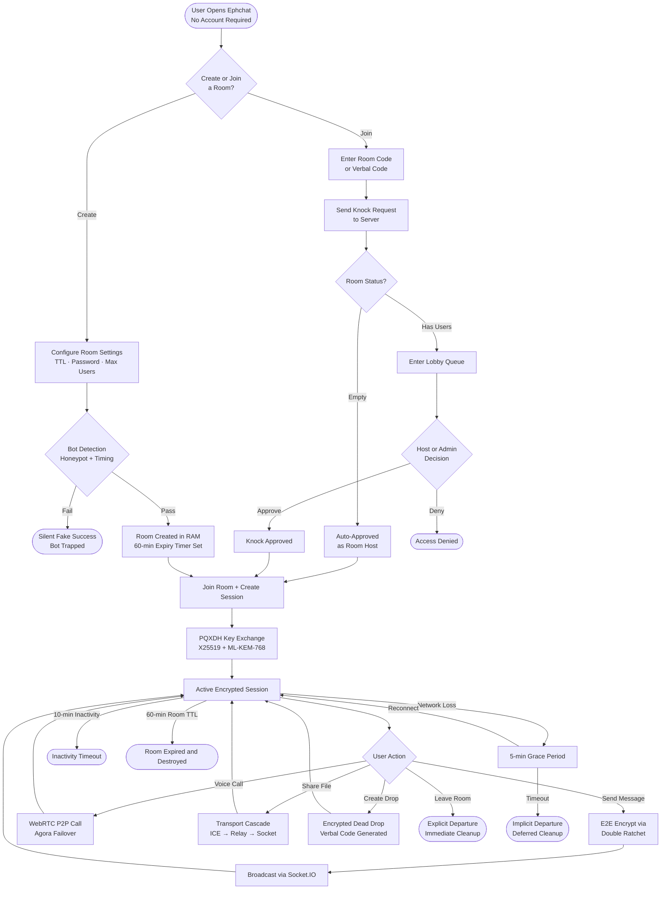
```mermaid
flowchart TD
    Enter([User Opens Ephchat<br/>No Account Required]) --> Choice{Create or Join<br/>a Room?}

    Choice -->|Create| Configure[Configure Room Settings<br/>TTL · Password · Max Users]
    Choice -->|Join| EnterCode[Enter Room Code<br/>or Verbal Code]

    Configure --> BotGate{Bot Detection<br/>Honeypot + Timing}
    BotGate -->|Fail| SilentReject([Silent Fake Success<br/>Bot Trapped])
    BotGate -->|Pass| CreateRoom[Room Created in RAM<br/>60-min Expiry Timer Set]

    EnterCode --> Knock[Send Knock Request<br/>to Server]
    Knock --> RoomStatus{Room Status?}

    RoomStatus -->|Empty| AutoHost[Auto-Approved<br/>as Room Host]
    RoomStatus -->|Has Users| Lobby[Enter Lobby Queue]

    Lobby --> HostDecision{Host or Admin<br/>Decision}
    HostDecision -->|Approve| Approved[Knock Approved]
    HostDecision -->|Deny| Denied([Access Denied])

    AutoHost --> JoinRoom[Join Room + Create Session]
    Approved --> JoinRoom
    CreateRoom --> JoinRoom

    JoinRoom --> KeyExchange[PQXDH Key Exchange<br/>X25519 + ML-KEM-768]
    KeyExchange --> Active[Active Encrypted Session]

    Active --> Actions{User Action}

    Actions -->|Send Message| Encrypt[E2E Encrypt via<br/>Double Ratchet] --> Broadcast[Broadcast via Socket.IO] --> Active
    Actions -->|Voice Call| WebRTCP2P[WebRTC P2P Call<br/>Agora Failover] --> Active
    Actions -->|Share File| Transport[Transport Cascade<br/>ICE → Relay → Socket] --> Active
    Actions -->|Create Drop| Drop[Encrypted Dead Drop<br/>Verbal Code Generated] --> Active
    Actions -->|Leave Room| ExplicitLeave([Explicit Departure<br/>Immediate Cleanup])

    Active -->|Network Loss| Grace[5-min Grace Period]
    Grace -->|Reconnect| Active
    Grace -->|Timeout| ImplicitLeave([Implicit Departure<br/>Deferred Cleanup])

    Active -->|10-min Inactivity| Timeout([Inactivity Timeout])
    Active -->|60-min Room TTL| Expired([Room Expired and Destroyed])
```

#### Key Decision Points

The user journey contains four critical decision gates that enforce Ephchat's privacy and access-control model:

1. **Bot Detection Gate** — HTTP room creation requests pass through honeypot field validation (`hp_email`, `hp_website`) and timing checks (form submission in under 1 second) in `server/index.js` (lines 594–653). Failed checks produce a fake success response with a `bot-trap-` prefixed code, silently rejecting automated requests without revealing detection.

2. **Knock-to-Join Gate** — All room entry flows through the knock protocol managed in `server/index.js` (lines 940–1089). Empty rooms auto-approve the first user as host; occupied rooms route the request to the host (or tier-1 admins) for an explicit approve/deny decision.

3. **Transport Selection Gate** — File transfers cascade through three transport tiers managed by `client/src/transport/transport-manager.js`: direct ICE/STUN, relay fallback via the Go E2ECP service, and Socket.IO relay for payloads under 256 KiB.

4. **Departure Classification Gate** — The `handleUserDeparture(isExplicit)` function in `server/index.js` (lines 3651–3862) differentiates user-initiated leaves (immediate cleanup) from network disconnects (deferred cleanup with a 5-minute grace period for reconnection).

#### Timing Constraints

| Constraint | Value | Enforcement Point |
|---|---|---|
| Room creation latency | < 500 ms | `server/rooms.js` — `createRoom()` |
| Room TTL | 60 minutes (default) | `.env` — `ROOM_EXPIRY_MINUTES` |
| Inactivity timeout | 10 minutes | `.env` — `INACTIVITY_TIMEOUT_MINUTES` |
| Reconnection grace period | 5 minutes | `server/security.js` — `trackDisconnectedSession()` |
| PQXDH key exchange | < 2 seconds | `client/src/crypto/pqxdh.js` |
| Invite token expiry | 5 minutes | `.env` — `INVITE_TOKEN_EXPIRY_MINUTES` |

### 4.1.2 System Boundary Interaction Map

The Ephchat architecture spans four distinct system boundaries — client platforms, the Node.js backend server, support services (E2ECP relay, proximity engine), and optional infrastructure (Redis). Each boundary enforces the zero-knowledge guarantee: the server relays encrypted payloads without the ability to decrypt content, and all cryptographic operations execute within client-side boundaries.

**Client Platform Boundary** — The React/Vite frontend (`client/`) hosts the complete cryptographic stack (`client/src/crypto/`), transport layer management (`client/src/transport/`), WebRTC voice services (`client/src/webrtc.js`), and anti-surveillance components (`PrivacyOverlay.jsx`, `GhostWatermark.jsx`, `DesktopSecurityGuard.jsx`). Electron (`electron-app/`) wraps the web client and adds native content protection, clipboard clearing, and proximity bridge capabilities. Android (`client/android/`) provides FLAG_SECURE screenshot blocking via Capacitor.

**Backend Server Boundary** — The Node.js/Express/Socket.IO server (`server/`) manages room state in RAM (`server/rooms.js`), handles encrypted message relay, drop management (`server/drops.js`, `server/drops-routes.js`), OHTTP gateway processing (`server/ohttp-gateway.js`), Privacy Pass token issuance (`server/privacy-pass-issuer.js`), traffic padding (`server/traffic-padding.js`), ICE signaling relay (`server/ice-signaling.js`), and E2ECP relay process management (`server/relay-manager.js`). All communication from client to server traverses Socket.IO (real-time events) or Express HTTP routes (drops, OHTTP, Privacy Pass).

**Support Service Boundary** — The Go-based E2ECP relay (`e2ecp/`) operates as a WebSocket file transfer service spawned on demand by `server/relay-manager.js`. The Rust-based proximity engine (`proximity-core/`) enables LAN peer discovery and QUIC-based direct transfers without server involvement.

**Optional Infrastructure** — Redis (`redis ^4.6.8`) serves as an optional horizontal scaling layer for room state distribution and link-preview caching. The system operates fully without Redis in single-process mode.

### 4.1.3 Core Process Catalog

The following table catalogs all major processes documented in this section, mapping each to its implementation evidence, triggering events, and the actors involved.

| Process | Trigger | Actors | Key Modules | SLA |
|---|---|---|---|---|
| Room Creation | User action (UI) | Client, Server | `server/index.js`, `server/rooms.js` | < 500 ms |
| Knock-to-Join | User enters room code | Guest, Server, Host | `server/index.js` (lines 940–1089) | Host-dependent |
| Room Entry | Knock approved or auto-approved | Client, Server | `server/index.js` (lines 1262–1830) | < 1 s |
| Message Send | User composes message | Client, Server, Recipients | `server/index.js` (lines 1837–2100) | < 50 ms encrypt |
| User Departure | Leave button or disconnect | Client, Server, Room members | `server/index.js` (lines 3651–3862) | Immediate or 5-min grace |
| PQXDH Key Exchange | Room entry | Two peers via Server relay | `client/src/crypto/pqxdh.js` | < 2 s |
| Voice Call | User initiates call | Caller, Callee, Server, Agora | `client/src/webrtc.js`, `server/ice-signaling.js` | ICE < 3 s |
| File Drop | User creates drop | Client, Server (HTTP) | `server/drops.js`, `server/drops-routes.js` | Rate-limited |
| E2ECP Relay | File transfer start | Client, Server, Go relay | `server/relay-manager.js`, `e2ecp/` | 30 s idle shutdown |
| Proximity Transfer | Nearby peer detected | Two devices (LAN) | `proximity-core/`, `proximity-bridge.js` | mDNS < 5 s |
| OHTTP Request | Client API call | Client, OHTTP Gateway | `server/ohttp-gateway.js`, `client/src/crypto/ohttp.js` | < 100 ms gateway |
| Privacy Pass | Token needed | Client, PP Issuer | `server/privacy-pass-issuer.js` | Token cached |
| Server Startup | Process launch | Operator | `server/index.js` (lines 3958–4003) | Sequential init |
| Server Shutdown | SIGTERM signal | Operator | `server/index.js` (graceful shutdown) | Ordered teardown |

---

## 4.2 ROOM LIFECYCLE WORKFLOWS

### 4.2.1 Room Creation Process

Room creation is the foundational entry point for all Ephchat interactions. The system supports two parallel creation paths — an HTTP REST API (`POST /api/rooms`) with bot detection and CAPTCHA validation, and a Socket.IO event (`create-room`) for real-time in-app creation. Both paths converge on the shared `roomManager.createRoom()` method in `server/rooms.js`, which stores all room state exclusively in volatile RAM.

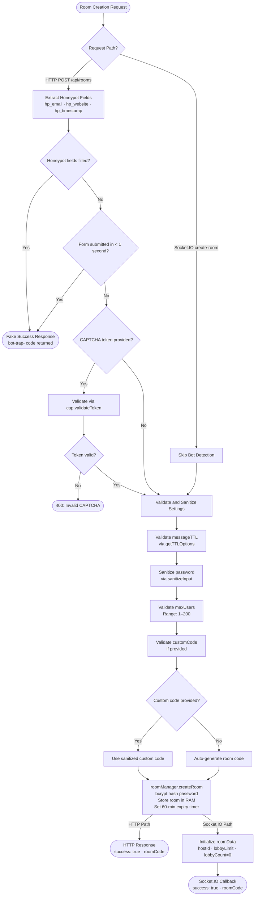
```mermaid
flowchart TD
    Start([Room Creation Request]) --> PathCheck{Request Path?}

    PathCheck -->|"HTTP POST /api/rooms"| HP1[Extract Honeypot Fields<br/>hp_email · hp_website · hp_timestamp]
    PathCheck -->|"Socket.IO create-room"| SkipBot[Skip Bot Detection]

    HP1 --> HP2{Honeypot fields filled?}
    HP2 -->|Yes| BotTrap([Fake Success Response<br/>bot-trap- code returned])
    HP2 -->|No| HP3{Form submitted in < 1 second?}
    HP3 -->|Yes| BotTrap
    HP3 -->|No| CAPCheck{CAPTCHA token provided?}

    CAPCheck -->|Yes| CAPVal[Validate via cap.validateToken]
    CAPCheck -->|No| Validate
    CAPVal --> CAPResult{Token valid?}
    CAPResult -->|No| CAPErr([400: Invalid CAPTCHA])
    CAPResult -->|Yes| Validate

    SkipBot --> Validate

    Validate[Validate and Sanitize Settings]
    Validate --> TTL[Validate messageTTL<br/>via getTTLOptions]
    TTL --> Pwd[Sanitize password<br/>via sanitizeInput]
    Pwd --> MaxU[Validate maxUsers<br/>Range: 1–200]
    MaxU --> Code[Validate customCode<br/>if provided]

    Code --> CodeChoice{Custom code provided?}
    CodeChoice -->|Yes| UseCustom[Use sanitized custom code]
    CodeChoice -->|No| AutoGen[Auto-generate room code]

    UseCustom --> Create
    AutoGen --> Create

    Create[roomManager.createRoom<br/>bcrypt hash password<br/>Store room in RAM<br/>Set 60-min expiry timer]

    Create -->|HTTP Path| HTTPResp([HTTP Response<br/>success: true · roomCode])
    Create -->|Socket.IO Path| MetaInit[Initialize roomData<br/>hostId · lobbyLimit · lobbyCount=0]
    MetaInit --> SocketResp([Socket.IO Callback<br/>success: true · roomCode])
```

#### Process Steps — HTTP Path

1. **Input Extraction** — The server extracts `messageTTL`, `password`, `maxUsers`, `capToken`, `creatorId`, `persistenceMode`, `customCode`, and honeypot fields (`hp_email`, `hp_website`, `hp_timestamp`) from the request body.
2. **Bot Detection — Honeypot** — If either `hp_email` or `hp_website` contains any value, the request is identified as bot-generated. The server returns a fake success response with a `bot-trap-` prefixed room code, preventing the bot from detecting the rejection.
3. **Bot Detection — Timing** — If the form submission timestamp (`hp_timestamp`) indicates the form was completed in under 1 second, the server applies the same silent rejection.
4. **CAPTCHA Validation** — If a `capToken` is present, it is validated via `cap.validateToken()`. Invalid tokens result in a `400` error response.
5. **Settings Validation** — `messageTTL` is validated against `getTTLOptions()`, `password` is sanitized via `sanitizeInput()` from `server/utils.js`, `maxUsers` is clamped to the range 1–200, and `customCode` undergoes format validation via `isValidRoomCode()`.
6. **Room Generation** — `roomManager.createRoom()` in `server/rooms.js` generates the room code (custom or auto-generated), hashes any provided password using bcrypt (`bcryptjs ^2.4.3`), stores the room object in memory, and starts a 60-minute expiry timer.
7. **Response** — Returns `{ success: true, roomCode }`.

#### Process Steps — Socket.IO Path

The Socket.IO path (`create-room` event, `server/index.js` lines 901–938) bypasses bot detection and CAPTCHA but follows identical settings validation and room generation. Additionally, it initializes room metadata in `roomData[roomCode]` with the creator's socket as `hostId`, sets `lobbyLimit` to `maxUsers × 2`, and initializes `lobbyCount` to zero.

#### Business Rules

| Rule | Enforcement | Module |
|---|---|---|
| Honeypot detection must be silent | Fake success response with trap code | `server/index.js` (lines 610–625) |
| Password hashing uses bcrypt | `bcryptjs ^2.4.3` | `server/auth-utils.js` |
| maxUsers range is 1–200 | Clamped at validation | `server/index.js` |
| Custom codes must pass `isValidRoomCode()` | Regex validation | `server/utils.js` |
| Room expiry default is 60 minutes | Configurable via `.env` | `server/rooms.js` |

### 4.2.2 Room Joining — Knock-to-Join Protocol

Room joining is a multi-phase protocol that ensures host-controlled access to occupied rooms while enabling auto-approval for the first entrant. The knock-to-join process spans three phases: Knock Request, Host/Admin Decision, and Room Entry. This design enforces the principle that no user enters an occupied room without explicit host authorization.

#### Phase 1 & 2: Knock Request and Host Decision

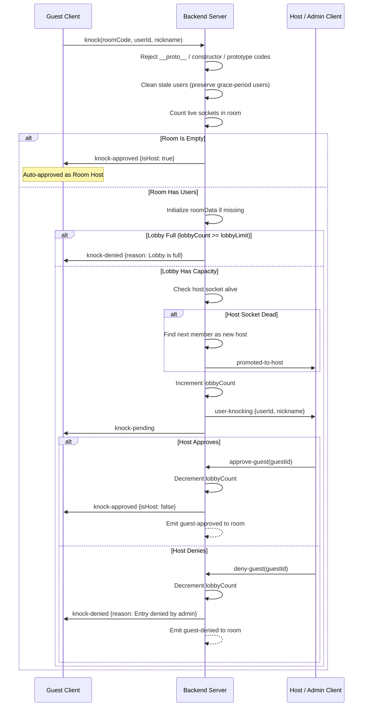
```mermaid
sequenceDiagram
    participant Guest as Guest Client
    participant Server as Backend Server
    participant Host as Host / Admin Client

    Guest->>Server: knock(roomCode, userId, nickname)
    Server->>Server: Reject __proto__ / constructor / prototype codes
    Server->>Server: Clean stale users (preserve grace-period users)
    Server->>Server: Count live sockets in room

    alt Room Is Empty
        Server->>Guest: knock-approved {isHost: true}
        Note over Guest: Auto-approved as Room Host
    else Room Has Users
        Server->>Server: Initialize roomData if missing
        alt Lobby Full (lobbyCount >= lobbyLimit)
            Server->>Guest: knock-denied {reason: Lobby is full}
        else Lobby Has Capacity
            Server->>Server: Check host socket alive
            alt Host Socket Dead
                Server->>Server: Find next member as new host
                Server->>Host: promoted-to-host
            end
            Server->>Server: Increment lobbyCount
            Server->>Host: user-knocking {userId, nickname}
            Server->>Guest: knock-pending

            alt Host Approves
                Host->>Server: approve-guest(guestId)
                Server->>Server: Decrement lobbyCount
                Server->>Guest: knock-approved {isHost: false}
                Server-->>Server: Emit guest-approved to room
            else Host Denies
                Host->>Server: deny-guest(guestId)
                Server->>Server: Decrement lobbyCount
                Server->>Guest: knock-denied {reason: Entry denied by admin}
                Server-->>Server: Emit guest-denied to room
            end
        end
    end
```

#### Phase 3: Room Entry

Upon knock approval, the client emits a `join-room` event. The server processes this through one of two paths based on whether a session token is present (session resumption) or absent (standard join).

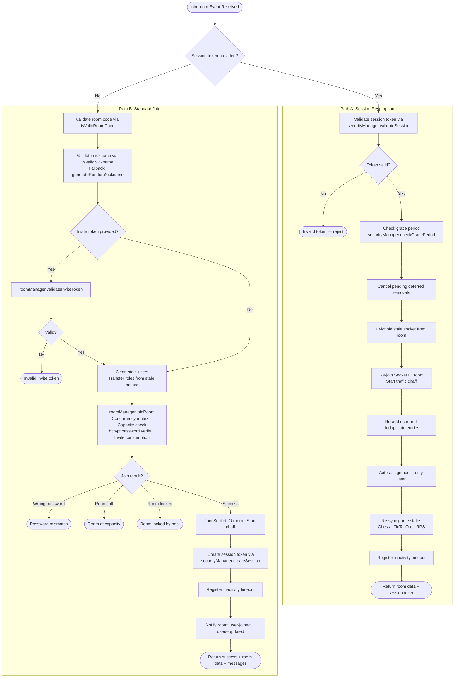
```mermaid
flowchart TD
    Start([join-room Event Received]) --> SessCheck{Session token provided?}

    SessCheck -->|Yes| R1

    subgraph ResumePath["Path A: Session Resumption"]
        R1[Validate session token via<br/>securityManager.validateSession] --> R2{Token valid?}
        R2 -->|No| R2Err([Invalid token — reject])
        R2 -->|Yes| R3[Check grace period<br/>securityManager.checkGracePeriod]
        R3 --> R4[Cancel pending deferred removals]
        R4 --> R5[Evict old stale socket from room]
        R5 --> R6[Re-join Socket.IO room<br/>Start traffic chaff]
        R6 --> R7[Re-add user and deduplicate entries]
        R7 --> R8[Auto-assign host if only user]
        R8 --> R9[Re-sync game states<br/>Chess · TicTacToe · RPS]
        R9 --> R10[Register inactivity timeout]
        R10 --> R11([Return room data + session token])
    end

    SessCheck -->|No| S1

    subgraph StandardPath["Path B: Standard Join"]
        S1[Validate room code via isValidRoomCode] --> S2[Validate nickname via isValidNickname<br/>Fallback: generateRandomNickname]
        S2 --> S3{Invite token provided?}
        S3 -->|Yes| S4[roomManager.validateInviteToken] --> S5{Valid?}
        S5 -->|No| S5Err([Invalid invite token])
        S5 -->|Yes| S6
        S3 -->|No| S6[Clean stale users<br/>Transfer roles from stale entries]
        S6 --> S7["roomManager.joinRoom<br/>Concurrency mutex · Capacity check<br/>bcrypt password verify · Invite consumption"]
        S7 --> S8{Join result?}
        S8 -->|Wrong password| PwdErr([Password mismatch])
        S8 -->|Room full| FullErr([Room at capacity])
        S8 -->|Room locked| LockErr([Room locked by host])
        S8 -->|Success| S9[Join Socket.IO room · Start chaff]
        S9 --> S10[Create session token via<br/>securityManager.createSession]
        S10 --> S11[Register inactivity timeout]
        S11 --> S12[Notify room: user-joined + users-updated]
        S12 --> S13([Return success + room data + messages])
    end
```

#### Authorization Checkpoints

| Checkpoint | Enforcement | Failure Response |
|---|---|---|
| Prototype pollution protection | Reject `__proto__`, `constructor`, `prototype` codes | Silent reject |
| Lobby capacity | `lobbyCount < lobbyLimit` | `knock-denied { reason: Lobby is full }` |
| Host/admin approval | Only host or tier-1 roles can approve/deny | Role check before processing |
| Password verification | bcrypt compare in `roomManager.joinRoom()` | Error callback with password mismatch |
| Room capacity | Live user count vs `maxUsers` | Error callback with room-full status |
| Room lock | Join lock flag check | Error callback with room-locked status |
| Invite token | HMAC validation + expiry check (5-min TTL) | Error callback with invalid token |
| Auth lockout | 5 failed attempts per 10 minutes | `securityManager` lockout tracking |

### 4.2.3 User Departure and Disconnection

User departure follows two distinct paths depending on whether the leave is intentional (user clicks "Leave") or unintentional (network loss, screen sleep, app backgrounded). Both paths converge on the same cleanup logic but differ in timing — explicit leaves execute immediately while implicit disconnects enter a 5-minute grace period allowing seamless reconnection.

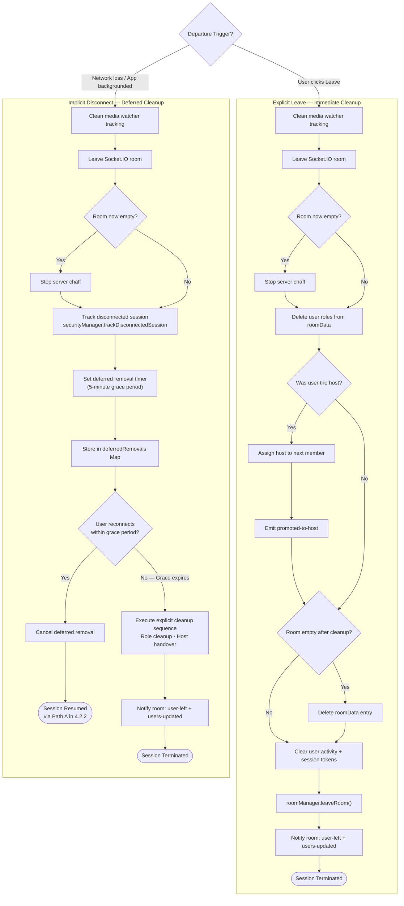
```mermaid
flowchart TD
    Trigger{Departure Trigger?}

    Trigger -->|"User clicks Leave"| E1
    Trigger -->|"Network loss / App backgrounded"| I1

    subgraph ExplicitPath["Explicit Leave — Immediate Cleanup"]
        E1[Clean media watcher tracking] --> E2[Leave Socket.IO room]
        E2 --> E3{Room now empty?}
        E3 -->|Yes| E4[Stop server chaff] --> E5
        E3 -->|No| E5[Delete user roles from roomData]
        E5 --> E6{Was user the host?}
        E6 -->|Yes| E7[Assign host to next member] --> E8[Emit promoted-to-host] --> E9
        E6 -->|No| E9{Room empty after cleanup?}
        E9 -->|Yes| E10[Delete roomData entry]
        E9 -->|No| E11
        E10 --> E11[Clear user activity + session tokens]
        E11 --> E12["roomManager.leaveRoom()"]
        E12 --> E13[Notify room: user-left + users-updated]
        E13 --> E14([Session Terminated])
    end

    subgraph ImplicitPath["Implicit Disconnect — Deferred Cleanup"]
        I1[Clean media watcher tracking] --> I2[Leave Socket.IO room]
        I2 --> I3{Room now empty?}
        I3 -->|Yes| I4[Stop server chaff] --> I5
        I3 -->|No| I5[Track disconnected session<br/>securityManager.trackDisconnectedSession]
        I5 --> I6["Set deferred removal timer<br/>(5-minute grace period)"]
        I6 --> I7[Store in deferredRemovals Map]
        I7 --> I8{User reconnects<br/>within grace period?}
        I8 -->|Yes| I9[Cancel deferred removal] --> I10([Session Resumed<br/>via Path A in 4.2.2])
        I8 -->|No — Grace expires| I11[Execute explicit cleanup sequence<br/>Role cleanup · Host handover]
        I11 --> I12[Notify room: user-left + users-updated]
        I12 --> I13([Session Terminated])
    end
```

#### Host Handover Logic

When a departing user holds the host role, the server performs automatic host reassignment in `server/index.js` (lines 3651–3862):

1. The server iterates over remaining room members to identify the next eligible host.
2. The selected member receives a `promoted-to-host` event via Socket.IO.
3. If no members remain, the `roomData` entry for the room is deleted entirely, releasing all associated metadata from RAM.

This handover is critical for maintaining room governance continuity and ensures the knock-to-join approval mechanism always has an active decision-maker.

### 4.2.4 Room and User State Machines

#### Room State Transitions

Rooms progress through a deterministic lifecycle governed by user activity and time-based expiry. All states exist exclusively in volatile RAM within `server/rooms.js`.

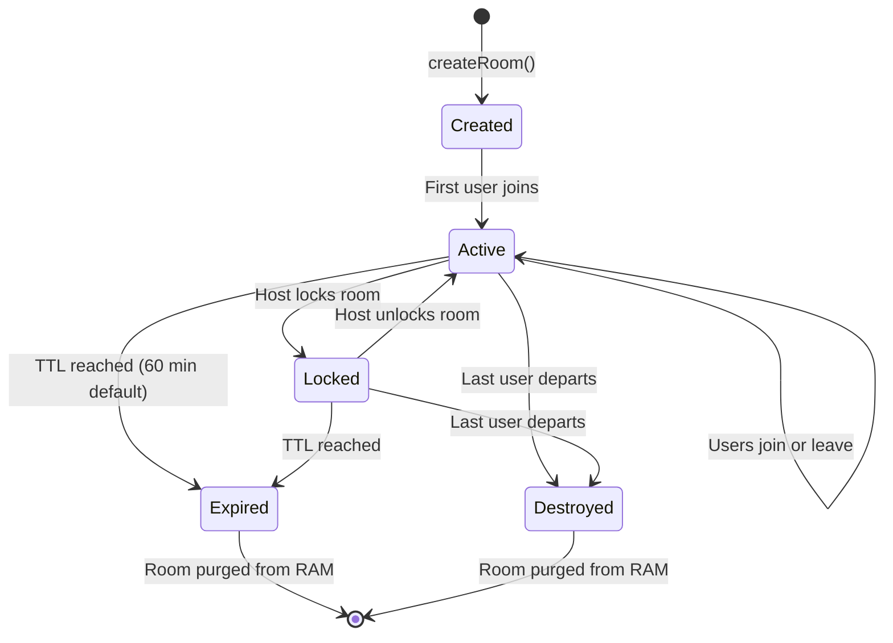
```mermaid
stateDiagram-v2
    [*] --> Created: createRoom()
    Created --> Active: First user joins
    Active --> Active: Users join or leave
    Active --> Locked: Host locks room
    Locked --> Active: Host unlocks room
    Active --> Expired: TTL reached (60 min default)
    Active --> Destroyed: Last user departs
    Locked --> Expired: TTL reached
    Locked --> Destroyed: Last user departs
    Expired --> [*]: Room purged from RAM
    Destroyed --> [*]: Room purged from RAM
```

| State | Description | Transitions Out |
|---|---|---|
| **Created** | Room exists in memory but has no participants. Eligible for immediate cleanup. | → Active (first user joins) |
| **Active** | One or more users present. Messages being exchanged. Inactivity timers running. | → Locked, Expired, Destroyed |
| **Locked** | Host has disabled new joins. Existing members remain. Knock requests are rejected. | → Active (unlock), Expired, Destroyed |
| **Expired** | TTL timer fired. Room is scheduled for destruction. | → Terminal (purged) |
| **Destroyed** | Last participant departed. Room metadata deleted from RAM and `roomData`. | → Terminal (purged) |

#### User Connection State Transitions

Individual user connections progress through states managed jointly by `server/security.js` (SecurityManager) and the Socket.IO event handlers in `server/index.js`.

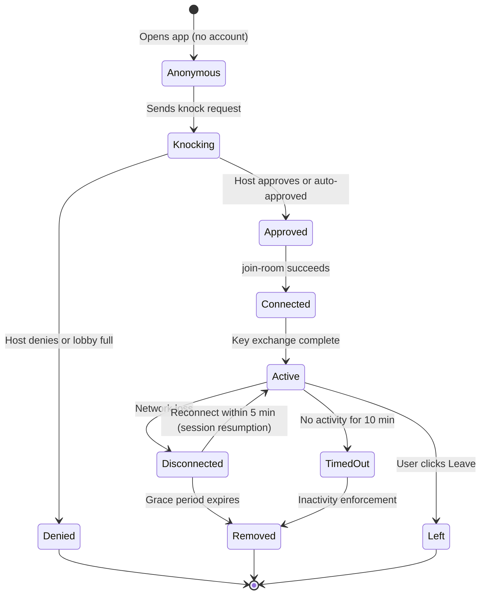
```mermaid
stateDiagram-v2
    [*] --> Anonymous: Opens app (no account)
    Anonymous --> Knocking: Sends knock request
    Knocking --> Approved: Host approves or auto-approved
    Knocking --> Denied: Host denies or lobby full
    Denied --> [*]
    Approved --> Connected: join-room succeeds
    Connected --> Active: Key exchange complete
    Active --> Disconnected: Network loss
    Disconnected --> Active: Reconnect within 5 min (session resumption)
    Disconnected --> Removed: Grace period expires
    Active --> TimedOut: No activity for 10 min
    TimedOut --> Removed: Inactivity enforcement
    Active --> Left: User clicks Leave
    Removed --> [*]
    Left --> [*]
```

---

## 4.3 MESSAGE AND COMMUNICATION WORKFLOWS

### 4.3.1 Message Processing Pipeline

The message processing pipeline in `server/index.js` (lines 1837–2100) handles all message types — text, images, audio, files, polls, and in-room games — through a unified validation, normalization, and broadcast flow. Rate limiting, encryption version normalization, and type-specific validation execute in sequence before storage and broadcast.

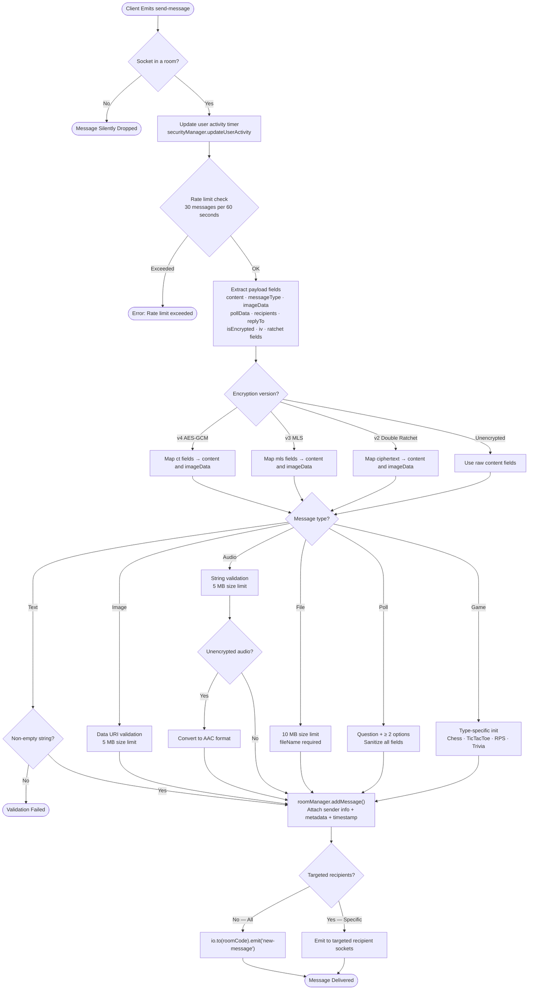
```mermaid
flowchart TD
    Start([Client Emits send-message]) --> Guard{Socket in a room?}
    Guard -->|No| Reject([Message Silently Dropped])
    Guard -->|Yes| Activity[Update user activity timer<br/>securityManager.updateUserActivity]

    Activity --> Rate{Rate limit check<br/>30 messages per 60 seconds}
    Rate -->|Exceeded| RateErr([Error: Rate limit exceeded])
    Rate -->|OK| Extract[Extract payload fields<br/>content · messageType · imageData<br/>pollData · recipients · replyTo<br/>isEncrypted · iv · ratchet fields]

    Extract --> Version{Encryption version?}
    Version -->|v4 AES-GCM| V4[Map ct fields → content and imageData]
    Version -->|v3 MLS| V3[Map mls fields → content and imageData]
    Version -->|v2 Double Ratchet| V2[Map ciphertext → content and imageData]
    Version -->|Unencrypted| Plain[Use raw content fields]

    V4 --> TypeCheck
    V3 --> TypeCheck
    V2 --> TypeCheck
    Plain --> TypeCheck

    TypeCheck{Message type?}
    TypeCheck -->|Text| ValText{Non-empty string?}
    ValText -->|No| ValErr([Validation Failed])
    ValText -->|Yes| Store

    TypeCheck -->|Image| ValImg[Data URI validation<br/>5 MB size limit]
    ValImg --> Store

    TypeCheck -->|Audio| ValAud[String validation<br/>5 MB size limit]
    ValAud --> EncCheck{Unencrypted audio?}
    EncCheck -->|Yes| Convert[Convert to AAC format] --> Store
    EncCheck -->|No| Store

    TypeCheck -->|File| ValFile[10 MB size limit<br/>fileName required]
    ValFile --> Store

    TypeCheck -->|Poll| ValPoll[Question + ≥ 2 options<br/>Sanitize all fields]
    ValPoll --> Store

    TypeCheck -->|Game| ValGame[Type-specific init<br/>Chess · TicTacToe · RPS · Trivia]
    ValGame --> Store

    Store["roomManager.addMessage()<br/>Attach sender info + metadata + timestamp"]
    Store --> Broadcast{Targeted recipients?}
    Broadcast -->|No — All| BroadcastAll["io.to(roomCode).emit('new-message')"]
    Broadcast -->|Yes — Specific| BroadcastTarget[Emit to targeted recipient sockets]

    BroadcastAll --> Done([Message Delivered])
    BroadcastTarget --> Done
```

#### Encryption Version Normalization

The server processes three concurrent encryption protocol versions to maintain backward compatibility as the cryptographic stack evolves. Importantly, the server never decrypts message content — normalization operates on the envelope structure only:

| Version | Protocol | Field Mapping | Module |
|---|---|---|---|
| v4 | AES-256-GCM (latest) | `ct` → `content` / `imageData` | Client-side AES wrapper |
| v3 | MLS Group Encryption | `mls` → `content` / `imageData` | `mls-key-package` / `mls-welcome` relay |
| v2 | Double Ratchet | `ciphertext` → `content` / `imageData` | `client/src/crypto/double-ratchet.js` |

#### Message Size Limits

| Type | Maximum Size | Validation |
|---|---|---|
| Text | Unlimited (encrypted) | Non-empty string check |
| Image | 5 MB | Data URI format validation (unencrypted) |
| Audio | 5 MB | String validation; AAC conversion if unencrypted |
| File | 10 MB | `fileName` required |
| Poll | N/A | Question string + ≥ 2 options; `sanitizeInput()` applied |

### 4.3.2 Voice Call Establishment

Voice calls in Ephchat operate through a WebRTC peer-to-peer path with automatic failover to the Agora RTC engine when direct connectivity is unavailable. The signaling flow is managed through `client/src/webrtc.js` on the client side and `server/ice-signaling.js` for server-side relay of ICE candidates, offers, and answers.

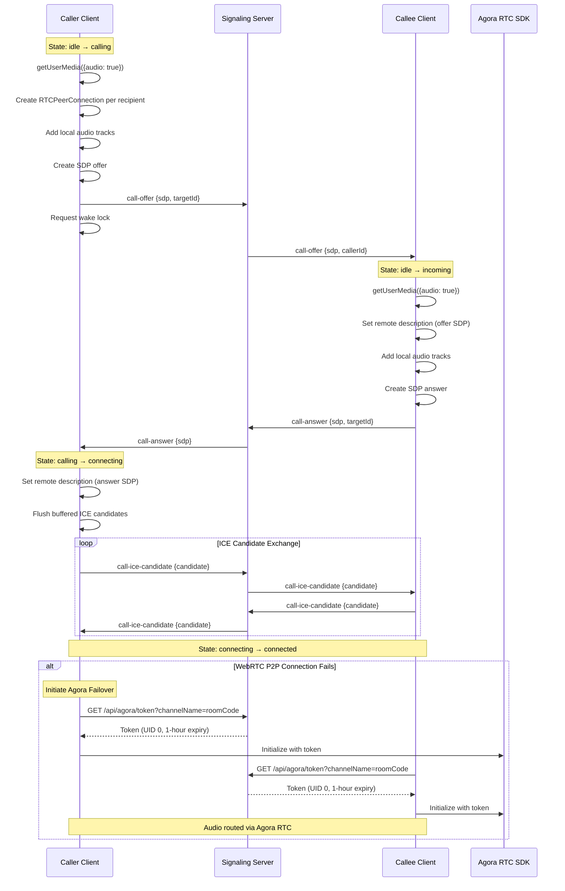
```mermaid
sequenceDiagram
    participant Caller as Caller Client
    participant Server as Signaling Server
    participant Callee as Callee Client
    participant Agora as Agora RTC SDK

    Note over Caller: State: idle → calling
    Caller->>Caller: getUserMedia({audio: true})
    Caller->>Caller: Create RTCPeerConnection per recipient
    Caller->>Caller: Add local audio tracks
    Caller->>Caller: Create SDP offer

    Caller->>Server: call-offer {sdp, targetId}
    Caller->>Caller: Request wake lock
    Server->>Callee: call-offer {sdp, callerId}

    Note over Callee: State: idle → incoming
    Callee->>Callee: getUserMedia({audio: true})
    Callee->>Callee: Set remote description (offer SDP)
    Callee->>Callee: Add local audio tracks
    Callee->>Callee: Create SDP answer

    Callee->>Server: call-answer {sdp, targetId}
    Server->>Caller: call-answer {sdp}

    Note over Caller: State: calling → connecting
    Caller->>Caller: Set remote description (answer SDP)
    Caller->>Caller: Flush buffered ICE candidates

    loop ICE Candidate Exchange
        Caller->>Server: call-ice-candidate {candidate}
        Server->>Callee: call-ice-candidate {candidate}
        Callee->>Server: call-ice-candidate {candidate}
        Server->>Caller: call-ice-candidate {candidate}
    end

    Note over Caller, Callee: State: connecting → connected

    alt WebRTC P2P Connection Fails
        Note over Caller: Initiate Agora Failover
        Caller->>Server: GET /api/agora/token?channelName=roomCode
        Server-->>Caller: Token (UID 0, 1-hour expiry)
        Caller->>Agora: Initialize with token
        Callee->>Server: GET /api/agora/token?channelName=roomCode
        Server-->>Callee: Token (UID 0, 1-hour expiry)
        Callee->>Agora: Initialize with token
        Note over Caller, Callee: Audio routed via Agora RTC
    end
```

#### Call State Machine

The call lifecycle is managed through a state machine in `client/src/webrtc.js` with the following transitions:

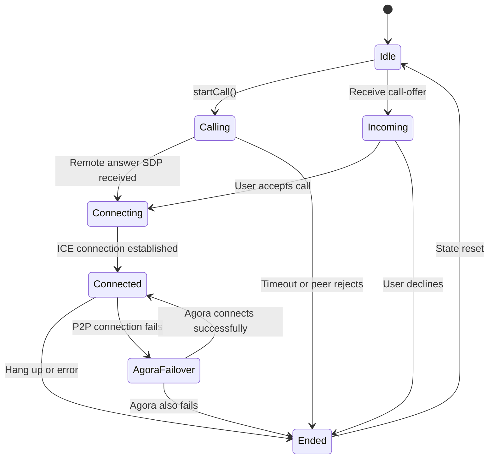
```mermaid
stateDiagram-v2
    [*] --> Idle
    Idle --> Calling: startCall()
    Idle --> Incoming: Receive call-offer
    Calling --> Connecting: Remote answer SDP received
    Incoming --> Connecting: User accepts call
    Connecting --> Connected: ICE connection established
    Connected --> Ended: Hang up or error
    Calling --> Ended: Timeout or peer rejects
    Incoming --> Ended: User declines
    Connected --> AgoraFailover: P2P connection fails
    AgoraFailover --> Connected: Agora connects successfully
    AgoraFailover --> Ended: Agora also fails
    Ended --> Idle: State reset
```

#### Performance Requirements

| Metric | Target | Evidence |
|---|---|---|
| ICE negotiation | < 3 seconds | `client/src/webrtc.js` — connection timeout |
| Audio latency | < 200 ms (P2P) | WebRTC DTLS-SRTP direct path |
| Agora token expiry | 1 hour | `RtcTokenBuilder.buildTokenWithUid()` in `server/index.js` |
| ICE candidate buffering | Pre-connection | Early candidates buffered before remote description set |

---

## 4.4 CRYPTOGRAPHIC AND PRIVACY WORKFLOWS

### 4.4.1 PQXDH Hybrid Key Exchange Protocol

The Post-Quantum Extended Diffie-Hellman (PQXDH) key exchange is the cryptographic foundation for all encrypted communication in Ephchat. It executes entirely client-side through the pipeline `hkdf.js` → `x25519.js` → `ml-kem.js` → `pqxdh.js` → `double-ratchet.js` in `client/src/crypto/`. The server acts as a blind relay, forwarding `key-bundle-offer` and `key-bundle-answer` events without inspecting payload content.

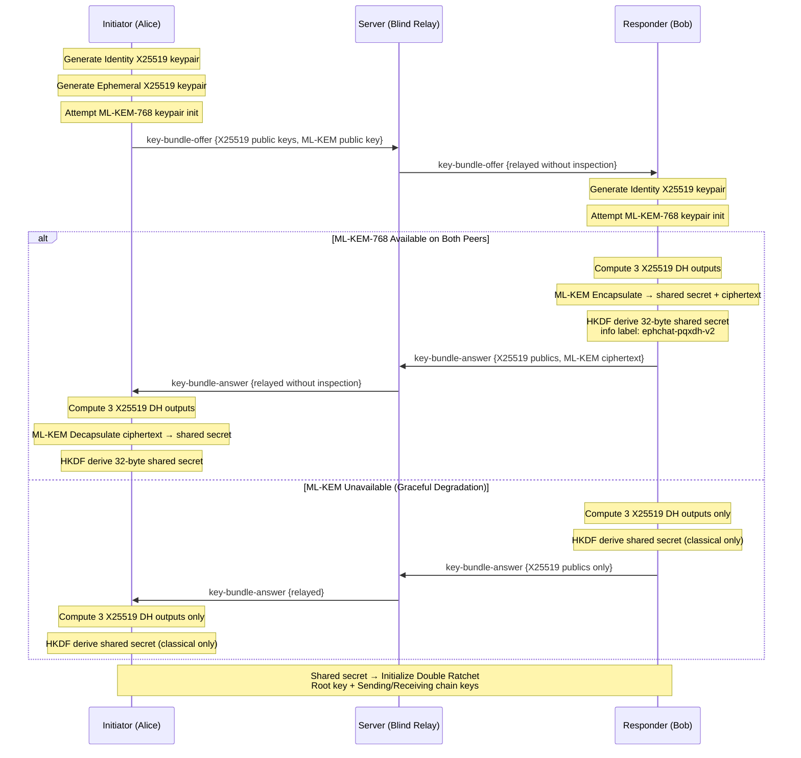
```mermaid
sequenceDiagram
    participant Alice as Initiator (Alice)
    participant Server as Server (Blind Relay)
    participant Bob as Responder (Bob)

    Note over Alice: Generate Identity X25519 keypair
    Note over Alice: Generate Ephemeral X25519 keypair
    Note over Alice: Attempt ML-KEM-768 keypair init

    Alice->>Server: key-bundle-offer {X25519 public keys, ML-KEM public key}
    Server->>Bob: key-bundle-offer {relayed without inspection}

    Note over Bob: Generate Identity X25519 keypair
    Note over Bob: Attempt ML-KEM-768 keypair init

    alt ML-KEM-768 Available on Both Peers
        Note over Bob: Compute 3 X25519 DH outputs
        Note over Bob: ML-KEM Encapsulate → shared secret + ciphertext
        Note over Bob: HKDF derive 32-byte shared secret<br/>info label: ephchat-pqxdh-v2

        Bob->>Server: key-bundle-answer {X25519 publics, ML-KEM ciphertext}
        Server->>Alice: key-bundle-answer {relayed without inspection}

        Note over Alice: Compute 3 X25519 DH outputs
        Note over Alice: ML-KEM Decapsulate ciphertext → shared secret
        Note over Alice: HKDF derive 32-byte shared secret
    else ML-KEM Unavailable (Graceful Degradation)
        Note over Bob: Compute 3 X25519 DH outputs only
        Note over Bob: HKDF derive shared secret (classical only)

        Bob->>Server: key-bundle-answer {X25519 publics only}
        Server->>Alice: key-bundle-answer {relayed}

        Note over Alice: Compute 3 X25519 DH outputs only
        Note over Alice: HKDF derive shared secret (classical only)
    end

    Note over Alice, Bob: Shared secret → Initialize Double Ratchet<br/>Root key + Sending/Receiving chain keys
```

#### Graceful Degradation Cascade

The cryptographic stack implements a two-level fallback to ensure connectivity across all browser capabilities:

| Level | Primary | Fallback | Trigger |
|---|---|---|---|
| Post-Quantum Layer | ML-KEM-768 (`mlkem ^2.5.0`) | Classical X25519 only | ML-KEM init failure (non-fatal `try/catch`) |
| Classical Layer | Native X25519 (Web Crypto API) | P-256 ECDH | Browser lacks X25519 support |

ML-KEM initialization is intentionally non-fatal, as documented in `client/src/crypto/ml-kem.js`. This ensures that users on older browsers still receive strong classical encryption rather than being blocked entirely.

### 4.4.2 Double Ratchet Encryption Cycle

Once the PQXDH shared secret is established, all subsequent messages are encrypted using the Double Ratchet protocol in `client/src/crypto/double-ratchet.js`. This provides forward secrecy and post-compromise security through per-message key derivation:

1. **Encryption (`ratchetEncrypt`)** — Derive a unique message key from the sending chain key → AES-256-GCM encrypt the plaintext → advance the sending chain → destroy the used key.
2. **Decryption (`ratchetDecrypt`)** — Check if a DH ratchet step is needed → derive the receiving chain key → AES-256-GCM decrypt → advance the chain → destroy the used key.
3. **Out-of-Order Recovery** — Skipped message keys are stored temporarily to handle messages arriving out of sequence.
4. **Forward Secrecy** — Old keys are cryptographically destroyed after use, ensuring that compromise of current keys cannot reveal past messages.

The server relays MLS group encryption events (`mls-key-package`, `mls-welcome`) in `server/index.js` (lines 3864–3908) as well as the legacy `key-bundle-offer` and `key-bundle-answer` events, never inspecting their encrypted contents.

### 4.4.3 Metadata Privacy Protocol Flows

Ephchat implements three IETF-standards-based metadata privacy protocols that operate as cross-cutting concerns across all features, preventing the server from correlating IP addresses to rooms, linking sessions to users, or enabling traffic analysis.

#### Oblivious HTTP (RFC 9458)

The OHTTP gateway in `server/ohttp-gateway.js` enables clients to make HTTP requests without revealing their identity to the application server. The client-side implementation resides in `client/src/crypto/ohttp.js`.

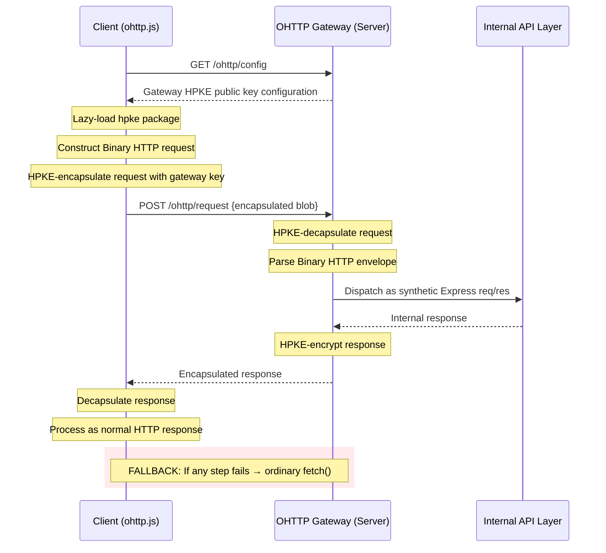
```mermaid
sequenceDiagram
    participant Client as Client (ohttp.js)
    participant Gateway as OHTTP Gateway (Server)
    participant API as Internal API Layer

    Client->>Gateway: GET /ohttp/config
    Gateway-->>Client: Gateway HPKE public key configuration

    Note over Client: Lazy-load hpke package
    Note over Client: Construct Binary HTTP request
    Note over Client: HPKE-encapsulate request with gateway key

    Client->>Gateway: POST /ohttp/request {encapsulated blob}

    Note over Gateway: HPKE-decapsulate request
    Note over Gateway: Parse Binary HTTP envelope
    Gateway->>API: Dispatch as synthetic Express req/res
    API-->>Gateway: Internal response

    Note over Gateway: HPKE-encrypt response
    Gateway-->>Client: Encapsulated response

    Note over Client: Decapsulate response
    Note over Client: Process as normal HTTP response

    rect rgb(255, 235, 235)
        Note over Client, Gateway: FALLBACK: If any step fails → ordinary fetch()
    end
```

Gateway key rotation occurs every 24 hours via `startOHTTPKeyRotation()`, initiated at server startup. OHTTP initialization is non-fatal — if the `hpke` library fails to load, the server continues operating without OHTTP support and clients transparently fall back to standard `fetch()`.

#### Privacy Pass (RFC 9578)

Privacy Pass enables anonymous authentication without identity linkage, implemented via `server/privacy-pass-issuer.js` (Ristretto255 VOPRF using `@noble/curves ^1.8.1`) and `client/src/crypto/privacy-pass.js`.

```mermaid
flowchart TD
    Need([Client Needs Auth Token]) --> Config["GET /privacy-pass/config"]
    Config --> Blind["Blind token using Ristretto255"]
    Blind --> Issue["POST /privacy-pass/issue<br/>Submit blinded element"]
    Issue --> Sign["Server signs blinded element<br/>via VOPRF"]
    Sign --> ProofReturn["Return signed element<br/>+ optional DLEQ proof"]
    ProofReturn --> Verify["Client verifies DLEQ proof"]
    Verify --> Unblind["Unblind token"]
    Unblind --> Cache["Store in bounded token cache<br/>Prefetch additional tokens"]
    Cache --> Ready([Token Ready for Use])

    Ready --> APIReq["Include in API request<br/>Authorization: PrivacyPass header"]
    APIReq --> Middleware["privacyPassAuth middleware<br/>validates token"]
    Middleware --> SpentCheck{Token already spent?}
    SpentCheck -->|Yes| SpentReject([Request Rejected:<br/>Token already used])
    SpentCheck -->|No| MarkSpent["Mark token as spent"]
    MarkSpent --> Authorize([Request Authorized])
```

Spent tokens are tracked in-memory and cleaned every 5 minutes via `startPPCleanup()`. A development fallback mode activates when the cryptographic library fails to load, allowing continued operation in testing environments.

#### Traffic Padding

The traffic padding engine (`server/traffic-padding.js`) provides anti-traffic-analysis protection through three concurrent mechanisms:

1. **Socket.IO Middleware** — The `trafficPaddingMiddleware` intercepts `padded-message` events, detects and discards chaff messages, and strips padding from legitimate messages before further processing.
2. **Server Chaff Generation** — `startServerChaff()` generates periodic dummy traffic per room, masking real communication patterns from network observers.
3. **Client Padding** — Messages are padded to fixed bucket sizes based on the selected privacy preset (low, medium, or high). Bucket sizes are designed to accommodate ML-KEM-768 post-quantum handshake messages (1536 bytes).

---

## 4.5 FILE TRANSFER WORKFLOWS

### 4.5.1 Encrypted File Drops (Dead Drops)

Encrypted File Drops provide an asynchronous, serverless file sharing mechanism through `server/drops.js` (DropManager) and `server/drops-routes.js` (REST API). The server stores only encrypted metadata — all file content is encrypted client-side before upload and decrypted client-side after claim.

```mermaid
flowchart TD
    subgraph Creation["Drop Creation Flow"]
        C1([User Creates Drop]) --> C2[Encrypt file content client-side]
        C2 --> C3[Generate recipient-specific wrapped keys]
        C3 --> C4["POST /api/drops"]
        C4 --> C5{Rate limit OK?<br/>10 per 10 min per IP}
        C5 -->|No| C5Err([429: Rate Limited])
        C5 -->|Yes| C6[Validate payload size<br/>content type · recipients · TTL]
        C6 --> C7[Generate secure drop ID]
        C7 --> C8[Generate 4-word verbal code<br/>from 256-word wordlist<br/>with collision retry]
        C8 --> C9[Set expiry timer]
        C9 --> C10([Return dropId + verbal code])
    end

    subgraph Claiming["Drop Claim Flow"]
        CL1([Recipient Has Verbal Code]) --> CL2["POST /api/drops/resolve-verbal"]
        CL2 --> CL3[Resolve verbal code to drop ID]
        CL3 --> CL4["POST /api/drops/:dropId/claim"]
        CL4 --> CL5[Submit SHA-256 username hash]
        CL5 --> CL6{Recipient hash matches?}
        CL6 -->|No| CL6Err([403: Not Authorized])
        CL6 -->|Yes| CL7{View count < max?}
        CL7 -->|No| CL7Err([410: Drop Expired])
        CL7 -->|Yes| CL8[Return encrypted payload]
        CL8 --> CL9[Client decrypts with wrapped key]
        CL9 --> CL10([Content Revealed to Recipient])
    end

    subgraph EphFile[".eph File Authentication"]
        E1([Request .eph File]) --> E2["GET /api/drops/:dropId/eph"]
        E2 --> E3[Generate HMAC-signed .eph packet]
        E3 --> E4[Return binary file<br/>no-cache headers]
        E4 --> E5["POST /api/drops/validate-eph"]
        E5 --> E6[Validate structure + HMAC]
        E6 --> E7{Valid?}
        E7 -->|Yes| E8([Proceed to claim flow])
        E7 -->|No| E9([Reject: Invalid packet])
    end
```

#### Drop Lifecycle Constraints

| Constraint | Enforcement | Module |
|---|---|---|
| Per-IP rate limiting | 10 drops per 10 minutes | `server/drops-routes.js` rate-limit Maps |
| Drop TTL | Configurable preset, enforced via timer | `server/drops.js` — `setInterval` |
| View-once semantics | View count tracked; auto-expire on max | `server/drops.js` — claim validation |
| Verbal code uniqueness | Collision retry on generation | `server/drops.js` — wordlist from `server/wordlist.js` |
| HMAC .eph integrity | Signed with server HMAC key | `server/drops.js` — `.eph` generation/validation |
| Expiry cleanup | Every 2 minutes | DropManager internal timer |

### 4.5.2 E2ECP Relay Lifecycle

The E2ECP file transfer relay is a Go-based WebSocket service (`e2ecp/`) managed by `server/relay-manager.js`. It follows an on-demand lifecycle — spawned when the first file transfer begins and terminated after a 30-second idle period.

```mermaid
flowchart TD
    Start([file-transfer-start Event]) --> Register["registerTransfer(socket.id)"]
    Register --> EnvCheck{VITE_FILE_SERVER_URL<br/>configured?}

    EnvCheck -->|"Yes — External relay"| ExtRelay[Use external relay URL]
    EnvCheck -->|"No — Spawn local"| RunCheck{Go relay already running?}

    RunCheck -->|Yes| EmitReady
    RunCheck -->|No| Spawn["child_process.spawn<br/>go run main.go serve --port 8080"]

    Spawn --> Wait["Wait for stdout:<br/>'Relay server is ready'"]
    Wait --> EmitReady

    EmitReady["Emit file-server-ready {url}<br/>to requesting client"]
    ExtRelay --> EmitReady

    EmitReady --> Transfer[Client connects directly<br/>to Go relay via WebSocket]

    Transfer --> EndEvt([file-transfer-end Event])

    EndEvt --> Unreg["unregisterTransfer(socket.id)"]
    Unreg --> ActiveCheck{Other active transfers?}

    ActiveCheck -->|Yes| WaitMore([Relay remains active])
    ActiveCheck -->|No| Schedule["Schedule 30-second<br/>idle shutdown timer"]

    Schedule --> IdleCheck{Still idle after 30s?}
    IdleCheck -->|"No — New transfer"| Cancel[Cancel shutdown timer]
    IdleCheck -->|Yes| Terminate{Platform?}

    Terminate -->|Windows| Taskkill["taskkill /pid /f /t"]
    Terminate -->|Unix/macOS| Kill["process.kill()"]

    Taskkill --> Stopped([Go Relay Terminated])
    Kill --> Stopped
```

#### Relay Error Handling

If the Go relay process fails to spawn (e.g., Go runtime not installed), the server emits a `file-server-error` event to the client. The client then falls back to the transport layer cascade (Section 4.5.3) to attempt the transfer through alternative channels.

### 4.5.3 Transport Layer Cascade

The transport manager (`client/src/transport/transport-manager.js`) implements a progressive fallback strategy ensuring file delivery across diverse network topologies. The cascade prioritizes direct peer-to-peer connections for minimal latency and maximum privacy, falling back through relayed options only as needed.

```mermaid
flowchart TD
    Start([File Transfer Request]) --> ICE["Attempt ICE Transport<br/>(ice-transport.js)"]

    ICE --> ICEResult{ICE connection<br/>established?}
    ICEResult -->|Yes| Classify{Connection type?}

    Classify -->|host| LAN[LAN Direct — Lowest latency]
    Classify -->|srflx| STUN[STUN Hole-Punched — NAT traversal]
    Classify -->|relay| TURN[TURN Relayed — Firewall bypass]

    LAN --> Chunk["64 KiB file chunking<br/>bufferedAmount throttling<br/>Progress callbacks"]
    STUN --> Chunk
    TURN --> Chunk
    Chunk --> Done([Transfer Complete])

    ICEResult -->|No — ICE fails| RelayCheck{Relay URL available?}

    RelayCheck -->|Yes| Relay["POST FormData to relay<br/>via secureFetch"]
    RelayCheck -->|No| SizeCheck{File < 256 KiB?}

    Relay --> RelayResult{Relay transfer<br/>succeeded?}
    RelayResult -->|Yes| Done
    RelayResult -->|No| SizeCheck

    SizeCheck -->|Yes| SocketIO["Socket.IO File Relay<br/>(last resort)"]
    SizeCheck -->|No| Failed([Transfer Failed:<br/>File too large for socket relay])

    SocketIO --> Done
```

Additionally, the MASQUE client (`client/src/transport/masque-client.js`) provides an RFC 9297/9298 capsule-protocol transport with three internal tiers: Electron native QUIC bridge → browser `WebTransport` with datagrams → bidirectional-stream capsule protocol. Jittered cover traffic is generated to resist traffic analysis.

#### Transport Selection Criteria

| Transport | Max File Size | Latency | Privacy Level |
|---|---|---|---|
| ICE/host (LAN) | Unlimited (chunked) | Minimal | Maximum — no server involvement |
| ICE/srflx (STUN) | Unlimited (chunked) | Low | High — STUN reveals endpoint IPs |
| ICE/relay (TURN) | Unlimited (chunked) | Medium | Medium — TURN server sees relay traffic |
| E2ECP Relay | Configurable | Medium | Medium — Go relay relays encrypted data |
| Socket.IO | 256 KiB | Varies | Standard — through main server |

### 4.5.4 Proximity Transfer Flow

Proximity Transfer enables direct LAN file transfers without any server involvement, using QUIC as the transport protocol via the Rust `proximity-core/` workspace. This flow is available on Electron desktop (via `proximity-bridge.js`/`proximity-native.js`) and Android (via JNI bindings).

```mermaid
flowchart TD
    Start([Proximity Transfer Initiated]) --> Platform{Platform?}

    Platform -->|Electron Desktop| Bridge["proximity-bridge.js<br/>LAN interface inspection + device naming"]
    Platform -->|Android| JNI["JNI → proximity-core Rust addon"]
    Platform -->|Browser| WebRTCFB["WebRTC Data Channel Fallback<br/>(native QUIC unavailable)"]

    Bridge --> Discovery["mDNS Peer Discovery<br/>(mdns-sd crate · < 5 seconds)"]
    JNI --> Discovery

    Discovery --> Found{Peers discovered?}
    Found -->|No| Hotspot{Hotspot mode<br/>available?}
    Hotspot -->|Yes| HotspotSetup["Direct device-to-device<br/>without network infrastructure"] --> Discovery
    Hotspot -->|No| NoPeers([No Peers Available])
    Found -->|Yes| Verify["Display verification code<br/>Certificate-fingerprint derived"]

    Verify --> Match{Codes match?}
    Match -->|No| Rejected([Pairing Rejected])
    Match -->|Yes| QUIC["QUIC Connection Established<br/>Ephemeral TLS certificates<br/>(Quinn · Rustls · Ring)"]

    QUIC --> Transfer["Direct LAN-Speed Transfer<br/>Zero server involvement"]
    Transfer --> Complete([Transfer Complete])

    WebRTCFB --> WRTransfer["Transfer via WebRTC<br/>Data Channel"]
    WRTransfer --> Complete
```

Proximity Transfer represents the strongest privacy posture for file sharing — no data touches any server, and the QUIC connection uses ephemeral TLS certificates generated at pairing time (via the `rcgen` and `ring` crates) to defend against man-in-the-middle attacks.

---

## 4.6 SERVER LIFECYCLE AND MAINTENANCE

### 4.6.1 Server Initialization Sequence

The server startup sequence in `server/index.js` (lines 3958–4003) follows a deterministic initialization order. Each subsystem is initialized sequentially, and non-critical components (OHTTP, Privacy Pass, ICE Signaling) are wrapped in non-fatal error handlers to ensure core functionality remains available even if privacy-enhancement modules fail to load.

```mermaid
flowchart TD
    Start(["startServer() called"]) --> Init["initializeServer()"]
    Init --> Redis["initializeRedis()"]
    Redis --> RedisCheck{REDIS_URL configured<br/>in .env?}
    RedisCheck -->|Yes| RedisConn["Connect to Redis"] --> RoomMgr
    RedisCheck -->|No| InMemory["Use in-memory storage"] --> RoomMgr

    RoomMgr["new RoomManager(redisClient)<br/>Start cleanup intervals"]
    RoomMgr --> SecMgr["new SecurityManager()"]
    SecMgr --> LinkPrev["new LinkPreviewService(redisClient)"]

    LinkPrev --> OHTTP["initGatewayKeys() +<br/>ohttpGatewayMiddleware()"]
    OHTTP --> OHTTPOk{Init success?}
    OHTTPOk -->|Yes| OHTTPRot["Start 24-hour key rotation"] --> PP
    OHTTPOk -->|No| OHTTPSkip["Skip OHTTP — non-fatal"] --> PP

    PP["initIssuer() +<br/>attachPrivacyPassRoutes()"]
    PP --> PPOk{Init success?}
    PPOk -->|Yes| PPClean["Start 5-min token cleanup"] --> ICESig
    PPOk -->|No| PPSkip["Skip Privacy Pass — non-fatal"] --> ICESig

    ICESig["attachICESignaling(io)"]
    ICESig --> ICEOk{Init success?}
    ICEOk -->|Yes| Nearby --> Listen
    ICEOk -->|No| ICESkip["Skip ICE Signaling — non-fatal"] --> Listen

    Nearby["setupNearbyNamespace(io)<br/>Proximity discovery relay"]

    Listen["server.listen(PORT 3001)"] --> Ready([Server Ready<br/>Accepting Connections])
```

#### Initialization Order Rationale

1. **Redis** initializes first because both `RoomManager` and `LinkPreviewService` depend on it as an optional scaling backend.
2. **RoomManager** starts second because all Socket.IO event handlers depend on room state management.
3. **SecurityManager** and **LinkPreviewService** are independent of each other but must be ready before request processing begins.
4. **OHTTP, Privacy Pass, and ICE Signaling** are privacy-enhancement and communication modules — their failure does not prevent core messaging functionality, hence the non-fatal wrappers.

### 4.6.2 Graceful Shutdown Process

On `SIGTERM` signal reception, the server executes an ordered shutdown sequence to cleanly release resources:

1. **Stop OHTTP key rotation** — Cancel the 24-hour `setInterval` timer.
2. **Stop Privacy Pass cleanup** — Cancel the 5-minute spent-token cleanup timer.
3. **Quit Redis client** — If connected, close the Redis connection gracefully.
4. **Close HTTP server** — Stop accepting new connections and drain existing ones.
5. **Exit process** — `process.exit(0)` for clean container termination.

All room state, messages, and session tokens are inherently destroyed when the process terminates — this is by design, reinforcing the zero-persistence guarantee.

### 4.6.3 Periodic Maintenance Cycles

The server runs multiple periodic maintenance tasks to enforce TTL constraints, clean stale resources, and rotate cryptographic keys. All intervals are managed via `setInterval` in `server/index.js` (lines 289–356).

| Task | Interval | Action | Module |
|---|---|---|---|
| Security + Link Preview Cleanup | 60 minutes | `securityManager.cleanup()`, `linkPreviewService.cleanup()` | `server/security.js`, `server/link-preview.js` |
| Expired Room Cleanup | 5 minutes | `roomManager.cleanupExpiredRooms()` | `server/rooms.js` |
| Stale User Sweep | 30 seconds | Remove disconnected sockets from all rooms; reassign host if needed | `server/index.js` |
| OHTTP Key Rotation | 24 hours | `startOHTTPKeyRotation()` — regenerate HPKE gateway keys | `server/ohttp-gateway.js` |
| Privacy Pass Token Cleanup | 5 minutes | `startPPCleanup()` — purge spent tokens from memory | `server/privacy-pass-issuer.js` |
| Drop Expiry Cleanup | 2 minutes | DropManager internal `setInterval` — destroy expired drops | `server/drops.js` |
| Drop Rate Limit Cleanup | 5 minutes | Clear per-IP rate limit tracking Maps | `server/drops-routes.js` |
| In-Memory Message Pruning | 1 minute | Enforce message TTL within rooms | `server/rooms.js` |

The 30-second stale user sweep is the most frequent maintenance operation, designed to detect and clean up sockets that disconnected without triggering the `disconnect` event (e.g., mobile app termination). It preserves users within the 5-minute grace period while removing those whose grace has expired.

---

## 4.7 ERROR HANDLING AND RECOVERY WORKFLOWS

### 4.7.1 Error Classification and Response Taxonomy

Errors in Ephchat are classified into seven categories, each with distinct detection mechanisms and recovery strategies. The system prioritizes silent degradation and fallback over hard failures, ensuring continuity of service.

```mermaid
flowchart TD
    Error([Error Detected]) --> Classify{Error Category}

    Classify -->|Bot Activity| BotResp["Silent fake success<br/>bot-trap- code returned"]
    Classify -->|Rate Limiting| RateResp["Emit error event<br/>to client socket"]
    Classify -->|Authentication| AuthCheck
    Classify -->|Cryptographic| CryptoCheck
    Classify -->|Network| NetResp
    Classify -->|Relay Process| RelayResp
    Classify -->|WebRTC| WebRTCResp

    AuthCheck{Attempt count?}
    AuthCheck -->|"< 5 attempts"| AuthRetry["Allow retry<br/>Clear on success"]
    AuthCheck -->|">= 5 attempts"| AuthLock["10-minute lockout<br/>securityManager tracking"]

    CryptoCheck{Which layer?}
    CryptoCheck -->|ML-KEM| DegradeMLKEM["Degrade to X25519 only"]
    CryptoCheck -->|X25519 Native| DegradeX25519["Fall back to P-256 ECDH"]
    CryptoCheck -->|OHTTP| DegradeOHTTP["Fall back to ordinary fetch"]
    CryptoCheck -->|Privacy Pass| DegradePP["Continue without tokens<br/>Dev fallback mode"]

    NetResp["Track disconnected session"] --> Grace["5-minute grace period"]
    Grace -->|Reconnect| Resume["Session resumption<br/>(Path A in join-room)"]
    Grace -->|Timeout| Remove["Deferred removal<br/>+ room notification"]

    RelayResp["Emit file-server-error"] --> AltTransport["Client uses<br/>transport cascade fallback"]

    WebRTCResp["Detect P2P failure"] --> AgoraFail["Request Agora token"] --> AgoraInit["Initialize Agora RTC SDK"]

    BotResp --> Silent([No error visible to bot])
    RateResp --> UserRetry([User retries after cooldown])
    AuthRetry --> UserRetry
    AuthLock --> LockWait([User waits 10 minutes])
    DegradeMLKEM --> Continue([Encryption continues at lower tier])
    DegradeX25519 --> Continue
    DegradeOHTTP --> Continue
    DegradePP --> Continue
    Resume --> Active([Session active])
    Remove --> Cleaned([User removed from room])
    AltTransport --> TransferRetry([Transfer via alternate path])
    AgoraInit --> CallActive([Call via Agora])
```

### 4.7.2 Graceful Degradation Pathways

The system implements layered fallback at every critical integration point, ensuring that failure of any single subsystem does not cascade into a total service outage. The following table summarizes all degradation pathways:

| Primary Path | Fallback Path | Trigger | Impact |
|---|---|---|---|
| ML-KEM-768 post-quantum | X25519 classical only | ML-KEM init fails | Loss of quantum resistance; classical security maintained |
| Native X25519 | P-256 ECDH | Browser lacks X25519 | Slightly weaker DH; still provides forward secrecy |
| OHTTP metadata privacy | Ordinary `fetch()` | HPKE library load fails | Server can observe request metadata |
| Privacy Pass tokens | No authentication tokens | Crypto library fails | Server can correlate sessions (dev fallback) |
| WebRTC P2P voice | Agora RTC engine | ICE connection fails | Audio routed through Agora servers; 1-hour token expiry |
| ICE file transfer | E2ECP relay | WebRTC data channel fails | Transfer via Go WebSocket relay |
| E2ECP relay | Socket.IO relay (< 256 KiB) | Go relay spawn fails | Limited to small files via main server |
| OHTTP gateway (server) | Server starts without OHTTP | Init fails at startup | Non-fatal; core messaging unaffected |
| Privacy Pass issuer | Server starts without PP | Init fails at startup | Non-fatal; core messaging unaffected |
| ICE signaling module | Server starts without ICE relay | Init fails at startup | Non-fatal; direct signaling unavailable |

### 4.7.3 Session Recovery Flow

Session recovery is the most critical error-handling pathway, enabling seamless reconnection after network interruptions — especially important for mobile users who frequently experience connectivity gaps due to screen sleep, cellular handoffs, or app backgrounding.

The recovery process operates through these coordinated mechanisms:

1. **Disconnect Detection** — The Socket.IO `disconnect` event fires, triggering `handleUserDeparture(false)` in `server/index.js` (lines 3651–3862). The `false` parameter indicates an implicit disconnect.
2. **Grace Period Activation** — `securityManager.trackDisconnectedSession()` records the session and starts a 5-minute countdown. The Socket.IO configuration uses a 300-second `pingTimeout` and 60-second `pingInterval` specifically to accommodate mobile network conditions.
3. **Deferred Removal Queuing** — A deferred removal callback is stored in the `deferredRemovals` Map, keyed by the session identifier. This callback executes the full cleanup sequence if the grace period expires.
4. **Reconnection** — When the client reconnects, the `join-room` event with a valid session token triggers Path A (Session Resumption, documented in Section 4.2.2). The server cancels the deferred removal, evicts the stale socket, and re-integrates the user into the room with all game states, roles, and presence data restored.
5. **Grace Expiry** — If the user fails to reconnect within 5 minutes, the deferred removal callback fires, executing the full explicit-leave cleanup sequence including host handover, role deletion, and room notification.

---

## 4.8 VALIDATION RULES AND AUTHORIZATION CHECKPOINTS

### 4.8.1 Business Rules by Process Step

The following table consolidates all business rules enforced at each major process step, mapping each rule to its implementation module and failure response.

| Process Step | Business Rule | Enforcement Module | Failure Response |
|---|---|---|---|
| Room Creation | Honeypot fields must be empty | `server/index.js` (lines 610–625) | Fake success with `bot-trap-` code |
| Room Creation | Form submission must take ≥ 1 second | `server/index.js` (timing check) | Fake success with `bot-trap-` code |
| Room Creation | CAPTCHA token must be valid (if present) | `cap.validateToken()` | HTTP 400 error |
| Room Creation | maxUsers in range 1–200 | `server/index.js` | Clamped to valid range |
| Room Creation | Custom codes must pass `isValidRoomCode()` | `server/utils.js` | Error callback |
| Knock Request | Room code must not be prototype-pollution string | `server/index.js` (line ~940) | Silent rejection |
| Knock Request | Lobby must have capacity | `lobbyCount < lobbyLimit` | `knock-denied` event |
| Room Entry | Password must match bcrypt hash | `server/rooms.js` — `joinRoom()` | Error: wrong password |
| Room Entry | Room must not be at capacity | Live socket count vs `maxUsers` | Error: room full |
| Room Entry | Room must not be locked | Join lock flag | Error: room locked |
| Room Entry | Invite token must be valid and unexpired | `roomManager.validateInviteToken()` | Error: invalid token |
| Messaging | User must be in a room | `socket.roomCode` check | Message silently dropped |
| Messaging | Rate limit: 30 messages per 60 seconds | `checkRateLimit(socket.id)` | Error event emitted |
| Messaging | Image payloads ≤ 5 MB | Size validation | Validation failure |
| Messaging | File payloads ≤ 10 MB with `fileName` | Size + field validation | Validation failure |
| Messaging | Poll requires question + ≥ 2 options | Structure validation | Validation failure |
| File Drops | Rate limit: 10 drops per 10 min per IP | `server/drops-routes.js` | HTTP 429 |
| File Drops | Drop verbal codes must be unique | Collision retry | Retry with new code |
| File Drops | Recipients validated via SHA-256 hash | `server/drops.js` — claim validation | HTTP 403 |
| Authentication | Max 5 failed attempts per 10 minutes | `server/security.js` — SecurityManager | Account lockout |
| Privacy Pass | Tokens must not be spent twice | In-memory spent-token tracking | Request rejected |

### 4.8.2 Authorization Checkpoints

Authorization in Ephchat is role-based at the room level rather than identity-based, consistent with the anonymous, account-free model.

| Action | Required Authorization | Verification Method |
|---|---|---|
| Approve/Deny knock | Host or Tier-1 admin | `roomData[roomCode].hostId` or tier-1 role check |
| Kick user | Host or Tier-1 admin | Role check before emission |
| Set user role | Host only | `roomData[roomCode].hostId` match |
| Lock/Unlock room | Host only | Host socket identity check |
| Update room vibe | Host or Tier-1 admin | Role-based check |
| Set room topic | Host or Tier-1 admin | Role-based check |
| Start/Stop timer | Any room member | Room membership verification |
| Send message | Any room member | `socket.roomCode` existence check |
| Create drop | Any authenticated client | Per-IP rate limiting |
| Claim drop | Designated recipient | SHA-256 username hash match |

### 4.8.3 Operational Timing Constraints

The following table consolidates all timing parameters that govern system behavior, drawn from the `.env` configuration and hardcoded values in the server modules.

| Parameter | Value | Source | Purpose |
|---|---|---|---|
| Room expiry | 60 minutes | `.env` — `ROOM_EXPIRY_MINUTES` | Maximum room lifetime |
| Inactivity timeout | 10 minutes | `.env` — `INACTIVITY_TIMEOUT_MINUTES` | Auto-disconnect idle users |
| Invite token expiry | 5 minutes | `.env` — `INVITE_TOKEN_EXPIRY_MINUTES` | Time-limited room invitations |
| Message rate limit | 30 per 60 seconds | `checkRateLimit()` in `server/index.js` | Abuse prevention |
| Auth lockout | 5 attempts per 10 min | `server/security.js` | Brute-force protection |
| Reconnect grace period | 5 minutes | `server/security.js` | Mobile reconnection window |
| Socket.IO ping timeout | 300 seconds | `server/index.js` Socket.IO config | Mobile-friendly keepalive |
| Socket.IO ping interval | 60 seconds | `server/index.js` Socket.IO config | Heartbeat frequency |
| Socket.IO max buffer | 10 MB | `server/index.js` `maxHttpBufferSize` | Large payload support |
| E2ECP relay idle shutdown | 30 seconds | `server/relay-manager.js` | Auto-stop when no active transfers |
| Agora token expiry | 1 hour | `RtcTokenBuilder` in `server/index.js` | Voice call failover auth |
| OHTTP key rotation | 24 hours | `startOHTTPKeyRotation()` | Gateway key freshness |
| Privacy Pass cleanup | 5 minutes | `startPPCleanup()` | Spent token memory reclamation |
| Stale user sweep | 30 seconds | `server/index.js` (line ~289) | Detect ghost connections |
| Room cleanup | 5 minutes | `roomManager.cleanupExpiredRooms()` | Enforce room TTL |
| Drop expiry cleanup | 2 minutes | `server/drops.js` internal timer | Destroy expired drops |
| Message TTL pruning | 1 minute | `server/rooms.js` | Enforce per-message TTL |

---

#### References

- `server/index.js` — Core server orchestration; Socket.IO event handlers (room creation lines 594–653 / 901–938, knock lines 940–1089, join lines 1262–1830, messaging lines 1837–2100, departure lines 3651–3862, MLS relay lines 3864–3908, startup lines 3958–4003, cleanup intervals lines 289–356)
- `server/rooms.js` — RoomManager class; room creation, joining, messages, invites, TTL enforcement, cleanup
- `server/drops.js` — DropManager; drop creation, claim, verbal codes, TTL, view-once, .eph packet generation
- `server/drops-routes.js` — REST API surface for drops; rate limiting, endpoint definitions
- `server/relay-manager.js` — E2ECP Go relay process lifecycle management
- `server/ohttp-gateway.js` — Oblivious HTTP gateway; HPKE key management, request decapsulation, 24-hour key rotation
- `server/privacy-pass-issuer.js` — Privacy Pass token issuer; Ristretto255 VOPRF, spent-token tracking, DLEQ proofs
- `server/traffic-padding.js` — Traffic padding engine; chaff detection, cover traffic generation, privacy presets
- `server/ice-signaling.js` — ICE signaling relay; offer/answer/candidate forwarding
- `server/security.js` — SecurityManager; session tokens, grace periods, lockout tracking, inactivity timeouts
- `server/auth-utils.js` — Authentication utilities; bcrypt hashing, HMAC tokens, challenge generation
- `server/utils.js` — Utility functions; `isValidRoomCode()`, `isValidNickname()`, `sanitizeInput()`, `generateRandomNickname()`
- `server/wordlist.js` — 256-word wordlist for verbal code generation
- `server/link-preview.js` — Link preview service; URL extraction, provider detection, caching
- `client/src/crypto/pqxdh.js` — PQXDH hybrid key exchange; X25519 + ML-KEM-768 with graceful degradation
- `client/src/crypto/double-ratchet.js` — Double Ratchet protocol; AES-256-GCM per-message encryption
- `client/src/crypto/ml-kem.js` — ML-KEM-768 wrapper; non-fatal initialization for post-quantum support
- `client/src/crypto/x25519.js` — X25519 key exchange; P-256 ECDH fallback
- `client/src/crypto/hkdf.js` — HKDF key derivation function
- `client/src/crypto/ohttp.js` — Client-side OHTTP encapsulation; `ohttpFetch` wrapper with fetch fallback
- `client/src/crypto/privacy-pass.js` — Client-side Privacy Pass; blind/unblind tokens, DLEQ verification, bounded cache
- `client/src/crypto/traffic-padding.js` — Client-side traffic padding; message padding to bucket sizes
- `client/src/transport/transport-manager.js` — Transport cascade manager; ICE → relay → Socket.IO fallback
- `client/src/transport/ice-transport.js` — ICE transport; WebRTC data channels, 64 KiB chunking, connection classification
- `client/src/transport/masque-client.js` — MASQUE capsule protocol; WebTransport, QUIC bridge, cover traffic
- `client/src/webrtc.js` — WebRTC voice call service; peer connection management, ICE buffering, Agora failover
- `e2ecp/` — Go-based E2ECP file transfer relay; Cobra CLI, Gorilla WebSocket, Docker deployment
- `proximity-core/` — Rust QUIC proximity engine; Quinn, Rustls, Ring, mDNS-SD, Tokio
- `electron-app/main.js` — Electron desktop shell; content protection, single-instance enforcement
- `electron-app/preload.js` — Electron preload; clipboard clearing, DevTools blocking
- `electron-app/proximity-bridge.js` — Electron proximity integration; LAN interface inspection
- `electron-app/proximity-native.js` — Rust addon adapter for Electron
- `.env` — Operational parameters; room expiry, inactivity timeout, rate limits, service ports
- `docs/SECURITY_UPGRADE_PLAN.md` — Project Ghost security roadmap; seven-phase implementation plan

# 5. System Architecture

This section provides the definitive architectural reference for the Ephchat platform — a cross-platform, privacy-first messaging application delivering ephemeral chat, encrypted voice calls, and secure file sharing with a zero-knowledge architecture. All architectural descriptions are grounded in the implementation evidence gathered from the polyglot monorepo spanning Node.js, React, Go, Rust, and Java/Kotlin. The system enforces a strict RAM-only, zero-persistence data model: no message history, no server-side storage, and no user accounts. Messages exist exclusively in volatile memory and vanish the moment a session ends or a room expires.

---

## 5.1 HIGH-LEVEL ARCHITECTURE

### 5.1.1 System Overview

#### Architecture Style and Rationale

Ephchat is organized as a **polyglot monorepo with an event-driven, hub-and-spoke architecture**. The monorepo root contains eleven first-order directories — `client/`, `server/`, `e2ecp/`, `proximity-core/`, `electron-app/`, `chrome-extension/`, `landing-page/`, and supporting folders — spanning four language ecosystems: JavaScript/JSX (Node.js and React), Go 1.25, Rust 2021 edition, and Java/Kotlin. The root `package.json` declares the main entry as `server/index.js` with engine constraints of Node.js ≥16 and npm ≥8.

The hub-and-spoke topology places the Node.js/Express/Socket.IO backend server at the architectural center, with all client platforms (Web/PWA, Android, Desktop, Chrome Extension) communicating through it via Socket.IO (real-time events) and Express HTTP routes (stateless operations). Two satellite services — the Go-based E2ECP file relay and the Rust-based Proximity Core engine — operate independently from the central hub, each optimized for its specific workload.

This architecture was chosen for three principal reasons:

- **Polyglot Optimization**: Each language serves its strength. Node.js excels at real-time event handling and rapid I/O. Go provides efficient, statically-compiled WebSocket relay with low memory overhead. Rust delivers memory-safe, high-performance QUIC networking for LAN transfers. Java/Kotlin is required for native Android platform access through Capacitor.
- **Privacy by Architecture**: The hub-and-spoke model enforces the zero-knowledge guarantee by design — the server acts as a blind relay for encrypted payloads, and all cryptographic operations execute exclusively within client-side boundaries in `client/src/crypto/`.
- **Monorepo Cohesion**: A single repository enables atomic versioning, shared CI/CD pipelines, and cross-component type safety, while avoiding the operational overhead of distributed microservice orchestration.

#### Key Architectural Principles

The following principles govern all architectural decisions throughout the system:

1. **RAM-Only Persistence** — All server state resides exclusively in volatile memory. `server/rooms.js` manages room lifecycle entirely in-process as JavaScript objects on the Node.js heap. No persistent database exists for messages, user data, or file content. Redis (`redis ^4.6.8`) is available as an optional horizontal scaling layer that mirrors in-memory state, not as permanent persistence.
2. **Client-Side Encryption** — Cryptographic key derivation, encryption, and decryption occur entirely within the browser or native client. Eight specialized crypto modules in `client/src/crypto/` implement the complete stack: HKDF, X25519, ML-KEM-768, PQXDH, Double Ratchet, OHTTP, Privacy Pass, and Traffic Padding. Keys are exchanged via PQXDH and stored in URL fragment identifiers (`#`), which by HTTP specification are never transmitted to the server.
3. **Zero-Knowledge Server** — The server relays encrypted payloads without the ability to decrypt content. It forwards `key-bundle-offer` and `key-bundle-answer` events blindly and processes messages through encryption version normalization on envelope structure only — never inspecting plaintext.
4. **Defense-in-Depth Privacy** — Multiple independent privacy layers operate in concert: end-to-end encryption (AES-256-GCM via Double Ratchet), metadata privacy (OHTTP per RFC 9458), session unlinkability (Privacy Pass per RFC 9578), and traffic analysis resistance (Traffic Padding with chaff, cover traffic, and bucket sizing).
5. **Graceful Degradation** — Every integration point has fallback pathways. Post-quantum ML-KEM degrades to classical X25519, which degrades to P-256 ECDH. OHTTP falls back to standard `fetch()`. WebRTC P2P falls back to Agora RTC. File transfers cascade through three transport tiers. Non-critical server modules (OHTTP, Privacy Pass, ICE Signaling) initialize non-fatally to ensure core messaging always remains available.

#### System Boundaries

The architecture enforces four distinct system boundaries, each reinforcing the zero-knowledge guarantee:

- **Client Platform Boundary** — The React/Vite frontend (`client/`) hosts the complete cryptographic stack, transport layer management (`client/src/transport/`), WebRTC voice services (`client/src/webrtc.js`), and anti-surveillance components. Electron (`electron-app/`) wraps the web client and adds native content protection and proximity capabilities. Android (`client/android/`) provides FLAG_SECURE screenshot blocking via Capacitor.
- **Backend Server Boundary** — The Node.js/Express/Socket.IO server (`server/`) manages room state in RAM, handles encrypted message relay, drop management, OHTTP gateway processing, Privacy Pass token issuance, traffic padding, ICE signaling relay, and E2ECP relay process management.
- **Support Service Boundary** — The Go-based E2ECP relay (`e2ecp/`) operates as an on-demand WebSocket file transfer service. The Rust-based proximity engine (`proximity-core/`) enables LAN peer discovery and direct QUIC transfers without server involvement.
- **Optional Infrastructure** — Redis serves as an optional horizontal scaling layer for room state distribution and link-preview caching. The system operates fully without Redis in single-process mode.

### 5.1.2 Core Components

The following table catalogs all major system components, their responsibilities, dependencies, and integration points, grounded in the monorepo directory structure and dependency manifests.

| Component | Primary Responsibility | Key Dependencies | Integration Points |
|---|---|---|---|
| **Backend Server** (`server/`) | Signaling, room management, drops, privacy APIs | Express ^4.21.2, Socket.IO ^4.7.2, Redis ^4.6.8 (optional), bcryptjs ^2.4.3 | All client platforms via HTTP/Socket.IO |
| **Frontend Client** (`client/`) | Web/PWA/mobile UI, crypto stack, transport management | React, Vite, Tailwind ^4.1.18, socket.io-client, agora-rtc-sdk-ng, hpke ^1.0.4, mlkem ^2.5.0 | Backend server via Socket.IO; WebRTC peers directly |
| **E2ECP Service** (`e2ecp/`) | File transfer relay, CLI tool | Go 1.25, Cobra, Gorilla WebSocket, PostgreSQL (optional), golang-jwt/jwt v5 | Backend via child_process spawn; clients via WebSocket |
| **Proximity Core** (`proximity-core/`) | LAN P2P transfers via QUIC | Rust (Quinn, Rustls, Tokio, mDNS-SD, rcgen, ring) | Electron via napi-rs addon; Android via JNI |
| **Electron App** (`electron-app/`) | Desktop shell (Win/Mac/Linux) | Electron 28.x, electron-store, electron-updater | Wraps hosted web app at chat.kyere.me |
| **Chrome Extension** (`chrome-extension/`) | Browser quick-access widget | Manifest V3, chrome.storage, notifications, alarms | Interfaces with chat.kyere.me web app |
| **Landing Page** (`landing-page/`) | Marketing portal, download hub | None (framework-free HTML/CSS/JS) | Links to app and GitHub releases |
| **Android Build** (`client/android/`) | Native Android packaging | Capacitor, Gradle (App ID: me.kyere.chat) | Wraps client web app |

### 5.1.3 Data Flow Description

The Ephchat architecture implements seven primary data flows, each enforcing end-to-end encryption and the zero-knowledge server model. All cryptographic operations execute client-side; the server processes only encrypted envelopes.

**Real-Time Messaging** — The client encrypts a message using AES-256-GCM with a per-message key derived from the Double Ratchet protocol (`client/src/crypto/double-ratchet.js`). The encrypted payload is emitted via Socket.IO as a `send-message` event. The server in `server/index.js` (lines 1837–2100) validates the envelope structure, applies rate limiting (30 messages per 60 seconds), normalizes encryption version fields (v4 AES-GCM, v3 MLS, v2 Double Ratchet), and broadcasts the encrypted payload to room members. Recipients decrypt using their corresponding receiving chain key. The server never inspects plaintext.

**Key Exchange** — The PQXDH hybrid key exchange (`client/src/crypto/pqxdh.js`) combines three X25519 Diffie-Hellman outputs with an ML-KEM-768 encapsulation, then derives a 32-byte shared secret via HKDF with the info label `ephchat-pqxdh-v2`. The server relays `key-bundle-offer` and `key-bundle-answer` events blindly between peers. The shared secret initializes the Double Ratchet for all subsequent per-message encryption.

**File Transfer Cascade** — File transfers use a progressive fallback strategy managed by `client/src/transport/transport-manager.js`. Tier 1 attempts ICE/WebRTC Data Channel (host/LAN → STUN → TURN) with 64 KiB chunking and `bufferedAmount` throttling via `client/src/transport/ice-transport.js`. If ICE fails, Tier 2 attempts POST via `secureFetch` to the Go E2ECP relay. Tier 3 falls back to Socket.IO relay for files under 256 KiB only.

**Encrypted File Drops** — The client encrypts file content, generates recipient-specific wrapped keys, and POSTs to `/api/drops`. The server in `server/drops.js` stores only encrypted metadata in RAM, generates a 4-word verbal code from the 256-word wordlist (`server/wordlist.js`), and sets an expiry timer. Recipients resolve verbal codes, claim drops via SHA-256 identity hash matching, and decrypt client-side.

**Voice Calls** — WebRTC peer-to-peer calls are signaled through `client/src/webrtc.js` with SDP/ICE relay via `server/ice-signaling.js`. When P2P connectivity fails, the system automatically requests an Agora RTC token (UID 0, 1-hour expiry) from the server and initializes the Agora RTC SDK as a failover path.

**Proximity Transfer** — The Rust proximity engine (`proximity-core/`) performs mDNS discovery on `_ephchat._udp.local.`, verifies peers via certificate fingerprint-derived pairing codes, establishes a QUIC connection with ephemeral TLS certificates (generated via `rcgen` and `ring`), and transfers files directly over LAN with zero server involvement.

**Metadata Privacy** — OHTTP (`server/ohttp-gateway.js` + `client/src/crypto/ohttp.js`) encapsulates HTTP requests with HPKE so the server cannot observe request metadata. Privacy Pass (`server/privacy-pass-issuer.js` + `client/src/crypto/privacy-pass.js`) provides Ristretto255 VOPRF-based anonymous authentication tokens so the server cannot correlate sessions. Traffic Padding (`server/traffic-padding.js` + `client/src/crypto/traffic-padding.js`) adds chaff messages, cover traffic, and bucket-sized padding to resist traffic analysis.

### 5.1.4 External Integration Points

Ephchat deliberately minimizes external service dependencies to reinforce its zero-knowledge privacy architecture. No third-party analytics, advertising, identity providers, or persistent storage services are used, as mandated by Constraint C-003 from `PRIVACY_POLICY.md`.

| System Name | Integration Type | Data Exchange Pattern | Protocol/Format |
|---|---|---|---|
| **Redis** (optional) | Horizontal scaling layer | Pub/sub + key-value for room state distribution | Redis protocol via `redis ^4.6.8` |
| **Agora RTC** | Voice call failover | Token-based SDK authentication | REST (server token gen), SDK (client media) |
| **STUN/TURN Servers** | WebRTC NAT traversal | ICE candidate exchange | ICE protocol, env-configured via `VITE_ICE_SERVERS` |
| **Render** | Primary application hosting | Node.js service deployment | Platform-managed deployment |
| **Vercel** | Landing page hosting | Static deployment | Config via `landing-page/vercel.json` |
| **GitHub Actions** | CI/CD pipeline | CodeQL + Electron cross-platform builds | YAML workflows |
| **GitHub Releases** | Desktop distribution | Artifact publishing | Electron Builder publish config |
| **Docker** | E2ECP containerization | 3-stage multi-stage build | Dockerfile, exposed port 8080 |

---

## 5.2 COMPONENT DETAILS

### 5.2.1 Backend Server

#### Purpose and Responsibilities

The backend server (`server/`) is the architectural hub of Ephchat, providing centralized signaling, room lifecycle management, encrypted drop management, metadata privacy APIs, and relay coordination. It comprises 16 source files under the `server/` directory, with `server/index.js` serving as the composition root that wires together Express HTTP, Socket.IO real-time, and all subsystem managers.

#### Technologies and Frameworks

- **Runtime**: Node.js ≥16 (CommonJS modules)
- **HTTP Framework**: Express ^4.21.2
- **Real-Time Engine**: Socket.IO ^4.7.2 (pingTimeout=300s, pingInterval=60s for mobile)
- **Security**: bcryptjs ^2.4.3, sanitize-html ^2.17.0, @cap.js/server ^4.0.5 (CAPTCHA), express-rate-limit ^8.2.1
- **Cryptographic Libraries**: @noble/curves ^1.8.1 (Ristretto255 VOPRF), hpke ^1.0.4 (OHTTP)
- **Optional Scaling**: Redis ^4.6.8

#### Key Interfaces and APIs

The server exposes two communication interfaces:

**Socket.IO Events** — `create-room`, `knock`, `approve-guest`, `deny-guest`, `join-room`, `send-message`, `call-offer`, `call-answer`, `call-ice-candidate`, `file-transfer-start`, `file-transfer-end`, `key-bundle-offer`, `key-bundle-answer`, `mls-key-package`, `mls-welcome`, `padded-message`

**HTTP REST Routes** — `POST /api/rooms` (room creation with bot detection), `/api/drops/*` (encrypted drops CRUD with rate limiting), `GET /api/agora/token` (voice failover tokens), `/ohttp/*` (OHTTP gateway config and request processing), `/privacy-pass/*` (Privacy Pass token issuance and validation)

#### Data Persistence

All state resides in volatile RAM. `server/rooms.js` (RoomManager) manages room objects, participant lists, and message relay buffers as JavaScript objects on the Node.js process heap. `server/drops.js` (DropManager) holds encrypted drop metadata in memory with configurable TTL. `server/security.js` (SecurityManager) tracks sessions, grace periods, and lockout counters in-memory. Redis is optional and mirrors volatile state for horizontal scaling — it does not introduce persistence.

#### Module Architecture

```mermaid
flowchart TB
    subgraph CompositionRoot["Composition Root (server/index.js)"]
        Express["Express HTTP"]
        SocketIO["Socket.IO Engine"]
    end

    subgraph CoreManagers["Core Managers"]
        RoomMgr["RoomManager<br/>(rooms.js)<br/>Room lifecycle · RAM state"]
        SecMgr["SecurityManager<br/>(security.js)<br/>Sessions · Lockouts · Grace"]
        DropMgr["DropManager<br/>(drops.js)<br/>Encrypted drops · Verbal codes"]
    end

    subgraph PrivacyModules["Privacy Enhancement (Non-Fatal)"]
        OHTTP["OHTTP Gateway<br/>(ohttp-gateway.js)<br/>RFC 9458 · HPKE"]
        PPIssuer["Privacy Pass Issuer<br/>(privacy-pass-issuer.js)<br/>RFC 9578 · VOPRF"]
        TPEngine["Traffic Padding<br/>(traffic-padding.js)<br/>Chaff · Cover traffic"]
    end

    subgraph CommModules["Communication Modules"]
        ICESig["ICE Signaling<br/>(ice-signaling.js)<br/>WebRTC relay"]
        Nearby["Nearby Namespace<br/>(nearby.js)<br/>Peer discovery"]
        RelayMgr["Relay Manager<br/>(relay-manager.js)<br/>Go E2ECP lifecycle"]
    end

    subgraph Utilities["Utilities"]
        AuthUtils["auth-utils.js<br/>bcrypt · HMAC · TOTP"]
        LinkPrev["link-preview.js<br/>oEmbed · OG fetch"]
        Utils["utils.js<br/>Sanitization · Validation"]
        Wordlist["wordlist.js<br/>256-word vocabulary"]
    end

    Express --> DropMgr
    Express --> OHTTP
    Express --> PPIssuer
    SocketIO --> RoomMgr
    SocketIO --> SecMgr
    SocketIO --> ICESig
    SocketIO --> Nearby
    SocketIO --> TPEngine
    RoomMgr --> RelayMgr
    DropMgr --> Wordlist
    DropMgr --> AuthUtils
```

#### Initialization Sequence

The server follows a deterministic startup order defined in `server/index.js` (lines 3958–4003):

1. **Redis initialization** — Connect to `REDIS_URL` if configured; otherwise fall back to in-memory storage
2. **RoomManager** — Instantiate with optional Redis client; start cleanup intervals
3. **SecurityManager** — Instantiate for session tracking, lockouts, and grace periods
4. **LinkPreviewService** — Instantiate with optional Redis for caching
5. **OHTTP Gateway** — Initialize HPKE keys and middleware (non-fatal)
6. **Privacy Pass Issuer** — Initialize Ristretto255 VOPRF and attach routes (non-fatal)
7. **ICE Signaling** — Attach Socket.IO relay for WebRTC candidates (non-fatal)
8. **Nearby Namespace** — Set up `/nearby` Socket.IO namespace for peer discovery
9. **HTTP Listen** — Bind to port 3001 and begin accepting connections

Non-critical modules (OHTTP, Privacy Pass, ICE Signaling) are wrapped in try/catch blocks so that their failure does not prevent core messaging functionality from operating.

#### Periodic Maintenance

| Task | Interval | Module |
|---|---|---|
| Stale user sweep | 30 seconds | `server/index.js` |
| Message TTL pruning | 1 minute | `server/rooms.js` |
| Drop expiry cleanup | 2 minutes | `server/drops.js` |
| Expired room cleanup | 5 minutes | `server/rooms.js` |
| Privacy Pass token purge | 5 minutes | `server/privacy-pass-issuer.js` |
| Drop rate limit reset | 5 minutes | `server/drops-routes.js` |
| Security + link preview cleanup | 60 minutes | `server/security.js`, `server/link-preview.js` |
| OHTTP key rotation | 24 hours | `server/ohttp-gateway.js` |

#### Graceful Shutdown

On `SIGTERM`, the server executes an ordered teardown: stop OHTTP key rotation → stop Privacy Pass cleanup → quit Redis client → close HTTP server → `process.exit(0)`. All RAM state is inherently destroyed, reinforcing the zero-persistence guarantee.

### 5.2.2 Frontend Client

#### Purpose and Responsibilities

The frontend client (`client/`) delivers the complete user experience across Web, PWA, and mobile (Android via Capacitor) platforms. It hosts the full cryptographic stack, transport layer management, WebRTC voice services, and anti-surveillance components. All encryption and decryption occur exclusively within this boundary.

#### Technologies and Frameworks

- **UI Framework**: React with JSX (via `@vitejs/plugin-react ^4.7.0`)
- **Bundler**: Vite with Rollup production builds, target `esnext`
- **Styling**: Tailwind CSS ^4.1.18
- **Real-Time**: socket.io-client for server communication
- **Voice**: WebRTC (native) with agora-rtc-sdk-ng ^4.19.3 failover
- **PWA**: Workbox service worker via vite-plugin-pwa
- **Mobile**: Capacitor 8 for Android packaging (App ID: `me.kyere.chat`)
- **WASM Support**: vite-plugin-wasm + vite-plugin-top-level-await for OpenMLS

#### Cryptographic Module Stack

The eight modules in `client/src/crypto/` implement the complete client-side security architecture:

| Module | Protocol | Purpose |
|---|---|---|
| `hkdf.js` | RFC 5869 | HKDF key derivation over HMAC-SHA-256 |
| `x25519.js` | X25519 | Elliptic curve Diffie-Hellman with P-256 ECDH fallback |
| `ml-kem.js` | ML-KEM-768 | Post-quantum key encapsulation (lazy import, non-fatal) |
| `pqxdh.js` | PQXDH | Hybrid key exchange: X25519 + ML-KEM-768, HKDF label `ephchat-pqxdh-v2` |
| `double-ratchet.js` | Double Ratchet | Per-message AES-256-GCM encryption with forward secrecy |
| `ohttp.js` | RFC 9458 | OHTTP client encapsulation with `fetch()` fallback |
| `privacy-pass.js` | RFC 9578 | Ristretto255 VOPRF token management and Authorization header |
| `traffic-padding.js` | Custom | Chaff generation, bucket sizing (up to 1536 bytes for ML-KEM) |

#### Transport Layer Stack

The three modules in `client/src/transport/` implement the file delivery cascade:

| Module | Transport | Characteristics |
|---|---|---|
| `ice-transport.js` | WebRTC DataChannel | 64 KiB chunks, `bufferedAmount` throttling, host→srflx→relay priority |
| `masque-client.js` | RFC 9297/9298 MASQUE | Electron native QUIC bridge → WebTransport → bidirectional stream fallback |
| `transport-manager.js` | Cascade coordinator | ICE first → E2ECP relay POST → Socket.IO (< 256 KiB) |

#### Build Configuration

The client build (`client/vite.config.js`) applies production hardening: sourcemaps disabled, console/debugger statements stripped via esbuild, manual chunk splitting for Agora, React, Socket.IO, and vendor code, and dev proxy routing `/api` and `/socket.io` to `127.0.0.1:3001`.

### 5.2.3 E2ECP Service

#### Purpose and Responsibilities

The E2ECP (End-to-End Communication Protocol) service (`e2ecp/`) is a Go-based WebSocket file transfer relay and CLI tool. It operates on an on-demand lifecycle — spawned by `server/relay-manager.js` when the first file transfer begins and terminated after a 30-second idle period.

#### Technologies and Frameworks

- **Language**: Go 1.25 (specified in `e2ecp/go.mod`, module path `github.com/schollz/e2ecp`)
- **CLI Framework**: Cobra (commands: `serve`, `send`, `receive`, `auth`, `upload`)
- **WebSocket**: Gorilla WebSocket for relay room/client management
- **Auth**: golang-jwt/jwt v5 for JWT-based authentication, bcrypt for password hashing
- **Database**: PostgreSQL (optional, for profile/storage features); SQLC v2 for type-safe code generation
- **Email**: Mailjet integration for email verification in the standalone E2ECP service
- **Containerization**: 3-stage Docker multi-stage build (node:20-alpine → golang:1.25-alpine → alpine:latest), exposed on port 8080

#### Package Architecture

The Go service is organized into seven packages under `e2ecp/src/`:

- `relay/` — WebSocket relay server: room management, client tracking, protobuf messages, embedded React frontend, mnemonic generation
- `client/` — CLI workflows: auth-token persistence, WebSocket peer exchange, encrypted chunk transfer, ZIP extraction
- `api/` — HTTP controller: auth endpoints, file upload/download, share links, JWT middleware
- `auth/` — Identity service: bcrypt, JWT, captcha, email verification (Mailjet), device authorization
- `db/` — SQLC-generated data access layer: users, encrypted files, share tokens, device auth sessions
- `crypto/` — P-256 ECDH, AES-GCM, SHA-256 for relay-level encryption
- `qrcode/` — Terminal QR code rendering for pairing

#### Lifecycle Management

The relay lifecycle is orchestrated by `server/relay-manager.js`:

```mermaid
sequenceDiagram
    participant Client as Client
    participant Server as Node.js Server
    participant Relay as Go E2ECP Relay

    Client->>Server: file-transfer-start event
    Server->>Server: registerTransfer(socket.id)
    
    alt External relay URL configured
        Server->>Client: file-server-ready {externalUrl}
    else Local relay needed
        alt Relay already running
            Server->>Client: file-server-ready {localUrl}
        else Relay not running
            Server->>Relay: child_process.spawn<br/>go run main.go serve --port 8080
            Relay-->>Server: stdout: "Relay server is ready"
            Server->>Client: file-server-ready {localUrl}
        end
    end

    Client->>Relay: WebSocket connection<br/>direct encrypted transfer
    Client->>Server: file-transfer-end event
    Server->>Server: unregisterTransfer(socket.id)
    
    alt No more active transfers
        Server->>Server: Schedule 30s idle timer
        Note over Server,Relay: After 30s idle...
        Server->>Relay: process.kill() or taskkill /pid
    end
```

### 5.2.4 Proximity Core

#### Purpose and Responsibilities

The Proximity Core (`proximity-core/`) is a Rust QUIC-based LAN peer-to-peer transfer engine that enables direct device-to-device file sharing without any server involvement. It represents the strongest privacy posture available in the system.

#### Technologies and Frameworks

- **Language**: Rust 2021 edition (workspace resolver 2)
- **QUIC Transport**: Quinn (QUIC implementation over Tokio async runtime)
- **TLS**: Rustls 0.23 + Ring 0.17 (no OpenSSL dependency)
- **Certificate Generation**: rcgen for ephemeral TLS certificates
- **Service Discovery**: mDNS-SD crate for `_ephchat._udp.local.` peer discovery
- **Concurrency**: Dashmap for lock-free concurrent data structures
- **Serialization**: Serde + Bincode for wire format
- **Observability**: Tracing crate for structured logging

#### Workspace Structure

The Cargo workspace in `proximity-core/Cargo.toml` contains three crates:

| Crate | Type | Purpose |
|---|---|---|
| `core` | Library | Engine facade, protocol, crypto, transport, transfer, discovery, swarm |
| `bindings/node` | napi-rs addon | Node.js/Electron native integration |
| `bindings/android` | JNI cdylib | Android/Capacitor native integration |

#### Core Modules

- `lib.rs` — Engine facade with lifecycle management and event fan-out
- `protocol.rs` — Wire format definition with message envelopes, payload types, and validation
- `crypto.rs` — Ephemeral TLS certificate generation, fingerprinting, and pairing code derivation
- `transport.rs` — QUIC connection management and handshake via Quinn
- `transfer.rs` — File exchange protocol: offer/accept/reject semantics, chunked streaming, integrity verification
- `discovery.rs` — mDNS peer discovery and caching with presence events
- `swarm.rs` — Multi-peer topology management, route computation, and relay forwarding

### 5.2.5 Electron Desktop Application

#### Purpose and Responsibilities

The Electron app (`electron-app/`) provides a native desktop shell for Windows, macOS, and Linux, wrapping the hosted web application at `https://chat.kyere.me` with platform-specific security and integration capabilities.

#### Architecture

- `main.js` — Main process: BrowserWindow configuration, single-instance enforcement, system tray, native menus, deep link handling (`ephemeral://` and `ephemeral-chat://` protocols), `.eph` file opening, content protection (`setContentProtection(true)`), and auto-updater
- `preload.js` — Security boundary: `contextBridge` for `window.electronAPI`, DevTools blocking, clipboard clearing on PrintScreen detection, drag-and-drop prevention
- `proximity-bridge.js` — LAN interface inspection, device naming, file save dialog for proximity transfers
- `proximity-native.js` — Optional Rust native addon adapter that bridges the Proximity Core engine into the Electron process

#### Distribution

Electron Builder 24.x packages the application for three platforms:
- **Windows**: NSIS (x64, arm64), Portable (x64, arm64), AppX/MSIX (x64, arm64) — SHA-256 code signing
- **macOS**: DMG, ZIP with hardened runtime (`hardenedRuntime: true`)
- **Linux**: AppImage, DEB

The build is automated via `.github/workflows/electron-build.yml` with parallel jobs for each platform, triggered by version tags (`v*`) or manual dispatch. GitHub Releases distributes the built artifacts.

### 5.2.6 Chrome Extension

#### Purpose and Responsibilities

The Chrome Extension (`chrome-extension/`) provides a browser quick-access widget for Ephchat rooms, enabling rapid room creation, joining, and notification management.

#### Architecture

- **Manifest**: V3, extension version 1.0.0, targeting `https://chat.kyere.me/*`
- `background.js` — Service worker (ES module): tab management, recent room tracking (capped at 10 entries with 7-day auto-cleanup), notification scheduling via `chrome.alarms`
- `content.js` — Page bridge: room code extraction from the active Ephchat tab, new-message event forwarding, SPA navigation monitoring using `MutationObserver` and `history` API wrapping
- `popup/` — Toolbar UI: create room, join room, recent rooms list, theme/settings toggles
- **Permissions**: `storage`, `notifications`, `alarms`

### 5.2.7 Component Interaction Diagram

The following diagram illustrates the runtime communication topology between all major components:

```mermaid
flowchart TB
    subgraph ClientPlatforms["Client Platforms"]
        WebPWA["Web & PWA<br/>(React · Vite · Tailwind)"]
        AndroidApp["Android App<br/>(Capacitor)"]
        DesktopApp["Electron Desktop<br/>(28.x)"]
        ChromeExt["Chrome Extension<br/>(Manifest V3)"]
    end

    subgraph BackendHub["Backend Server (Node.js · Express)"]
        SIO["Socket.IO<br/>Real-time Events"]
        HTTPAPI["Express<br/>HTTP REST API"]
        RoomMgr["RoomManager<br/>(RAM / Redis)"]
        DropMgr["DropManager<br/>(Encrypted Metadata)"]
        OHTTPGw["OHTTP Gateway<br/>(RFC 9458)"]
        PPIssuer["Privacy Pass<br/>(RFC 9578)"]
        ICESig["ICE Signaling"]
        TPEngine["Traffic Padding"]
    end

    subgraph SupportServices["Support Services"]
        E2ECPRelay["E2ECP Relay<br/>(Go · WebSocket)"]
        ProxCore["Proximity Core<br/>(Rust · QUIC)"]
        RedisOpt["Redis<br/>(Optional)"]
    end

    subgraph ExternalSvc["External Services"]
        AgoraRTC["Agora RTC<br/>(Voice Failover)"]
        STUNServ["STUN/TURN<br/>(NAT Traversal)"]
    end

    WebPWA -->|"Socket.IO / HTTP"| SIO
    WebPWA -->|"REST API"| HTTPAPI
    AndroidApp -->|"Socket.IO / HTTP"| SIO
    DesktopApp -->|"wraps web app"| WebPWA
    ChromeExt -->|"interfaces with"| WebPWA
    SIO --> RoomMgr
    SIO --> ICESig
    SIO --> TPEngine
    HTTPAPI --> DropMgr
    HTTPAPI --> OHTTPGw
    HTTPAPI --> PPIssuer
    RoomMgr -.->|"optional scaling"| RedisOpt
    RoomMgr -->|"spawn/shutdown"| E2ECPRelay
    DesktopApp -.->|"proximity-bridge"| ProxCore
    AndroidApp -.->|"JNI binding"| ProxCore
    WebPWA -.->|"voice failover"| AgoraRTC
    WebPWA -.->|"ICE negotiation"| STUNServ
```

### 5.2.8 State Transition Diagrams

#### Room State Machine

Rooms progress through a deterministic lifecycle governed by user activity and time-based expiry. All states exist exclusively in volatile RAM within `server/rooms.js`.

```mermaid
stateDiagram-v2
    [*] --> Created: createRoom()
    Created --> Active: First user joins
    Active --> Active: Users join / leave
    Active --> Locked: Host locks room
    Locked --> Active: Host unlocks room
    Active --> Expired: TTL reached (60 min)
    Active --> Destroyed: Last user departs
    Locked --> Expired: TTL reached
    Locked --> Destroyed: Last user departs
    Expired --> [*]: Purged from RAM
    Destroyed --> [*]: Purged from RAM
```

#### User Connection State Machine

Individual user connections progress through states managed by `server/security.js` (SecurityManager) and the Socket.IO event handlers in `server/index.js`.

```mermaid
stateDiagram-v2
    [*] --> Anonymous: Opens app (no account)
    Anonymous --> Knocking: Sends knock request
    Knocking --> Approved: Host approves / auto-approved
    Knocking --> Denied: Host denies / lobby full
    Denied --> [*]
    Approved --> Connected: join-room succeeds
    Connected --> Active: PQXDH key exchange complete
    Active --> Disconnected: Network loss
    Disconnected --> Active: Reconnect within 5 min
    Disconnected --> Removed: Grace period expires
    Active --> TimedOut: 10 min inactivity
    TimedOut --> Removed: Enforcement
    Active --> Left: User clicks Leave
    Removed --> [*]
    Left --> [*]
```

#### Voice Call State Machine

The call lifecycle is managed through a state machine in `client/src/webrtc.js`:

```mermaid
stateDiagram-v2
    [*] --> Idle
    Idle --> Calling: startCall()
    Idle --> Incoming: Receive call-offer
    Calling --> Connecting: Remote answer SDP
    Incoming --> Connecting: User accepts
    Connecting --> Connected: ICE established
    Connected --> Ended: Hang up / error
    Calling --> Ended: Timeout / rejected
    Incoming --> Ended: User declines
    Connected --> AgoraFailover: P2P fails
    AgoraFailover --> Connected: Agora connects
    AgoraFailover --> Ended: Agora also fails
    Ended --> Idle: State reset
```

### 5.2.9 Key Flow Sequence Diagrams

#### PQXDH Key Exchange Sequence

```mermaid
sequenceDiagram
    participant Alice as Initiator
    participant Server as Server (Blind Relay)
    participant Bob as Responder

    Note over Alice: Generate Identity X25519 keypair
    Note over Alice: Generate Ephemeral X25519 keypair
    Note over Alice: Attempt ML-KEM-768 init

    Alice->>Server: key-bundle-offer<br/>{X25519 publics, ML-KEM public key}
    Server->>Bob: Relayed without inspection

    Note over Bob: Generate Identity X25519 keypair
    Note over Bob: Attempt ML-KEM-768 init

    alt ML-KEM-768 Available
        Note over Bob: 3x X25519 DH + ML-KEM Encapsulate
        Note over Bob: HKDF derive 32-byte secret<br/>(label: ephchat-pqxdh-v2)
        Bob->>Server: key-bundle-answer<br/>{X25519 publics, ML-KEM ciphertext}
        Server->>Alice: Relayed without inspection
        Note over Alice: 3x X25519 DH + ML-KEM Decapsulate
        Note over Alice: HKDF derive matching secret
    else ML-KEM Unavailable (Graceful Degradation)
        Note over Bob: 3x X25519 DH only
        Bob->>Server: key-bundle-answer<br/>{X25519 publics only}
        Server->>Alice: Relayed
        Note over Alice: 3x X25519 DH only
    end

    Note over Alice, Bob: Shared secret initializes Double Ratchet
```

#### File Transfer Cascade Sequence

```mermaid
sequenceDiagram
    participant Sender as Sender Client
    participant TM as Transport Manager
    participant ICE as ICE Transport
    participant Relay as E2ECP Relay
    participant SIO as Socket.IO

    Sender->>TM: transferFile(file, peer)
    TM->>ICE: Attempt WebRTC DataChannel

    alt ICE Connected (host/srflx/relay)
        ICE-->>TM: Connection established
        TM->>ICE: Stream 64 KiB chunks<br/>with bufferedAmount throttling
        ICE-->>TM: Transfer complete
    else ICE Failed
        TM->>Relay: POST FormData via secureFetch
        alt Relay Available
            Relay-->>TM: Transfer complete
        else Relay Failed
            alt File < 256 KiB
                TM->>SIO: Relay via Socket.IO
                SIO-->>TM: Transfer complete
            else File too large
                TM-->>Sender: Transfer failed
            end
        end
    end
```

---

## 5.3 TECHNICAL DECISIONS

### 5.3.1 Architecture Style: RAM-Only Polyglot Monorepo

**Decision**: Adopt a polyglot monorepo structure with zero server-side data persistence. All state resides exclusively in volatile memory.

**Rationale**: This is the most distinctive architectural decision in the system. By storing all room state, messages, sessions, and drop metadata in RAM only (`server/rooms.js` manages all state as JavaScript objects on the Node.js heap), the architecture enforces the zero-persistence privacy guarantee at the infrastructure level. Even physical access to the server cannot reveal historical communication data. Server restart deterministically destroys all state — this is by design, not a limitation.

**Trade-offs**:

| Advantage | Trade-off |
|---|---|
| Privacy guarantee is architecturally enforced | Room state lost on server restart |
| No database administration overhead | Horizontal scaling requires optional Redis |
| Minimal attack surface | Memory-bound capacity limits |
| GDPR-compliant by design | No audit trail possible |

**Evidence**: `server/rooms.js` contains no database drivers. `.env` line 13 comments Redis as optional: `# Redis Configuration (Optional - leave empty for in-memory storage)`. Constraint C-001 codifies this as a system invariant.

### 5.3.2 Communication Pattern: Dual-Channel Architecture

**Decision**: Use Socket.IO for bidirectional real-time events alongside Express HTTP for stateless REST operations.

**Rationale**: Socket.IO provides the persistent bidirectional channel needed for real-time messaging, presence, signaling, and traffic padding. Express HTTP handles stateless request-response patterns (drops, OHTTP, Privacy Pass, Agora tokens) that do not require persistent connections. This separation keeps the Socket.IO event namespace focused on low-latency operations while offloading heavier payloads to HTTP.

**Configuration Evidence**: `package.json` declares `socket.io ^4.7.2` and `express ^4.21.2`. Socket.IO is configured with `pingTimeout: 300000` (300 seconds) and `pingInterval: 60000` (60 seconds) specifically to accommodate mobile network conditions, and `maxHttpBufferSize: 10 * 1024 * 1024` (10 MB) for large payload support.

### 5.3.3 Encryption: Hybrid Post-Quantum with Graceful Degradation

**Decision**: Implement a hybrid PQXDH key exchange combining classical X25519 with post-quantum ML-KEM-768, feeding into a Double Ratchet for per-message AES-256-GCM encryption.

**Rationale**: The hybrid approach provides quantum resistance via ML-KEM-768 (aligned with NIST FIPS 203) while maintaining proven classical security through X25519. The Double Ratchet ensures forward secrecy (past messages remain safe if future keys are compromised) and post-compromise security (sessions self-heal after key compromise). Graceful degradation at two levels ensures universal client compatibility.

| Degradation Level | Primary | Fallback | Trigger |
|---|---|---|---|
| Post-Quantum | ML-KEM-768 (`mlkem ^2.5.0`) | X25519 only | ML-KEM init failure |
| Classical Layer | Native X25519 (Web Crypto) | P-256 ECDH | Browser lacks X25519 |

**Evidence**: `client/src/crypto/pqxdh.js` implements the hybrid protocol with HKDF label `ephchat-pqxdh-v2`. `client/src/crypto/ml-kem.js` uses intentionally non-fatal lazy initialization via `try/catch`.

### 5.3.4 Multi-Transport File Delivery Cascade

**Decision**: Implement a three-tier progressive fallback for file delivery: ICE/WebRTC → E2ECP relay → Socket.IO.

**Rationale**: Network topologies vary widely — users behind symmetric NATs, corporate firewalls, or restrictive mobile networks may not establish direct peer-to-peer connections. The cascade prioritizes privacy (direct P2P) and performance (chunked WebRTC DataChannel), falling back through server-assisted relays only when necessary.

| Transport Tier | Max File Size | Privacy Level |
|---|---|---|
| ICE/host (LAN) | Unlimited (64 KiB chunks) | Maximum — no server |
| ICE/srflx (STUN) | Unlimited (64 KiB chunks) | High — STUN reveals IPs |
| ICE/relay (TURN) | Unlimited (64 KiB chunks) | Medium — TURN sees relay traffic |
| E2ECP Relay (Go) | Configurable | Medium — relay sees encrypted data |
| Socket.IO | 256 KiB | Standard — through main server |

**Evidence**: `client/src/transport/transport-manager.js` orchestrates the cascade. `client/src/transport/ice-transport.js` implements host→srflx→relay priority classification.

### 5.3.5 On-Demand Relay Spawning

**Decision**: Spawn the Go E2ECP relay as a child process on demand rather than running it as a persistent service.

**Rationale**: The relay consumes resources only during active file transfers and auto-terminates after a 30-second idle period. This avoids the overhead of a permanently running Go process when file transfers are infrequent. Startup deduplication prevents multiple relay instances.

**Evidence**: `server/relay-manager.js` uses `child_process.spawn` with readiness detection via stdout parsing (`'Relay server is ready'`), active transfer tracking via a Set of socket IDs, and platform-aware termination (`taskkill` on Windows, `process.kill()` on Unix/macOS).

### 5.3.6 Security Mechanism Selection

**Decision**: Implement a defense-in-depth security architecture combining seven independent layers, governed by the "Project Ghost" security upgrade plan (`docs/SECURITY_UPGRADE_PLAN.md`).

| Layer | Implementation | Standard |
|---|---|---|
| End-to-End Encryption | AES-256-GCM via Double Ratchet | Signal Protocol |
| Post-Quantum Key Exchange | X25519 + ML-KEM-768 hybrid | NIST FIPS 203, Signal PQXDH |
| Metadata Privacy | OHTTP gateway with HPKE encapsulation | RFC 9458 |
| Session Unlinkability | Privacy Pass via Ristretto255 VOPRF | RFC 9578 |
| Traffic Analysis Resistance | Chaff, cover traffic, bucket padding | Custom |
| Bot Detection | Honeypot fields + timing analysis | Custom |
| Auth Hardening | bcrypt, HMAC tokens, TOTP, lockout | Industry standard |

**Rationale**: Each layer addresses a distinct threat vector. Encryption protects content confidentiality. OHTTP prevents IP-to-room correlation. Privacy Pass prevents cross-session user linking. Traffic padding prevents communication pattern inference. The layered approach ensures that compromise of any single layer does not expose the full threat surface.

---

## 5.4 CROSS-CUTTING CONCERNS

### 5.4.1 Monitoring and Observability

#### Server-Side Observability

The backend server implements observability through structured logging in `server/utils.js` and periodic health checks via the maintenance cycle. Key observable signals include:

- **Room Metrics** — Active room count, participant counts, and room state transitions tracked by `server/rooms.js` during each 5-minute cleanup cycle
- **Rate Limit Monitoring** — Per-socket message rate tracking (30 messages per 60 seconds) with violation events emitted to clients
- **Relay Health** — E2ECP relay process state (running/stopped/errored) tracked by `server/relay-manager.js` with active transfer count
- **Privacy Module Status** — OHTTP, Privacy Pass, and ICE Signaling initialization success/failure logged at startup
- **Stale Connection Detection** — The 30-second sweep cycle detects ghost sockets that disconnected without triggering proper events

#### Client-Side Observability

- **Transport State** — `client/src/transport/transport-manager.js` tracks which transport tier succeeded for each file transfer
- **Crypto Capability** — `client/src/crypto/ml-kem.js` and `client/src/crypto/x25519.js` log degradation events when post-quantum or native X25519 is unavailable
- **Connection State** — `client/src/socket.js` (SocketManager) monitors reconnection on visibility change, online event, and pageshow event

#### Proximity Core Observability

The Rust proximity engine uses the `tracing` crate for structured logging, providing instrumented spans for QUIC connection lifecycle, mDNS discovery events, and file transfer progress.

### 5.4.2 Error Handling Patterns

The system classifies errors into seven categories, each with a distinct detection mechanism, response strategy, and degradation pathway. The overarching principle is **silent degradation over hard failure** — the system always prefers continuing at reduced capability rather than presenting errors to users.

```mermaid
flowchart TD
    ErrorDetected([Error Detected]) --> Classify{Error Category}

    Classify -->|Bot Activity| BotResp["Silent fake success<br/>bot-trap code returned"]
    Classify -->|Rate Limiting| RateResp["Emit error event<br/>to client socket"]
    Classify -->|Authentication| AuthResp{"Attempt count < 5?"}
    Classify -->|Cryptographic| CryptoResp{"Which layer failed?"}
    Classify -->|Network| NetResp["Track disconnected session<br/>5-min grace period"]
    Classify -->|Relay Process| RelayResp["Emit file-server-error<br/>Client uses transport cascade"]
    Classify -->|WebRTC| WebRTCResp["Detect P2P failure<br/>Initiate Agora failover"]

    AuthResp -->|Yes| AuthRetry["Allow retry<br/>Clear count on success"]
    AuthResp -->|No| AuthLock["10-minute lockout<br/>via SecurityManager"]

    CryptoResp -->|ML-KEM| DegMLKEM["Degrade to<br/>X25519 only"]
    CryptoResp -->|X25519| DegX25519["Fall back to<br/>P-256 ECDH"]
    CryptoResp -->|OHTTP| DegOHTTP["Fall back to<br/>ordinary fetch"]
    CryptoResp -->|Privacy Pass| DegPP["Continue without tokens"]

    NetResp --> GraceCheck{"Reconnect within 5 min?"}
    GraceCheck -->|Yes| Resume["Session resumed<br/>via join-room Path A"]
    GraceCheck -->|No| Remove["Deferred removal<br/>+ room notification"]

    BotResp --> Resolved([Resolved])
    RateResp --> Resolved
    AuthRetry --> Resolved
    AuthLock --> Resolved
    DegMLKEM --> Resolved
    DegX25519 --> Resolved
    DegOHTTP --> Resolved
    DegPP --> Resolved
    Resume --> Resolved
    Remove --> Resolved
    RelayResp --> Resolved
    WebRTCResp --> Resolved
```

#### Server Startup Error Handling

Non-critical modules use non-fatal initialization wrappers. If OHTTP, Privacy Pass, or ICE Signaling fail to initialize at startup, the server logs the failure and continues operating without those capabilities. Core messaging functionality is always available regardless of privacy module status.

### 5.4.3 Authentication and Authorization Framework

Ephchat uses a **role-based, identity-free authorization model** consistent with its anonymous, account-free design (Constraint C-002). There are no user accounts, registration flows, or persistent identity tokens.

#### Authentication Mechanisms

| Mechanism | Implementation | Purpose |
|---|---|---|
| Room passwords | bcrypt hashing via `server/auth-utils.js` | Access control for protected rooms |
| Session tokens | HMAC-based tokens via `server/security.js` | Reconnection during grace period |
| Invite tokens | HMAC validation with 5-minute TTL | Time-limited room invitations |
| TOTP codes | Generated via `server/auth-utils.js` | Challenge-response verification |
| Privacy Pass tokens | Ristretto255 VOPRF via `server/privacy-pass-issuer.js` | Anonymous API authentication |
| CAPTCHA | `@cap.js/server ^4.0.5` | Bot mitigation on room creation |

#### Room-Level Authorization

| Action | Required Role | Verification |
|---|---|---|
| Approve/deny knock requests | Host or Tier-1 admin | `roomData[roomCode].hostId` or role check |
| Kick user from room | Host or Tier-1 admin | Role check before emission |
| Set user roles | Host only | Host socket identity match |
| Lock/unlock room | Host only | Host socket identity check |
| Send messages | Any room member | `socket.roomCode` existence check |
| Create encrypted drop | Any client | Per-IP rate limiting (10 per 10 min) |
| Claim encrypted drop | Designated recipient | SHA-256 username hash match |

#### Brute-Force Protection

`server/security.js` (SecurityManager) enforces a lockout policy: 5 failed authentication attempts within 10 minutes triggers a 10-minute lockout period. The lockout counter resets on successful authentication.

### 5.4.4 Performance Requirements and Operational Parameters

The system enforces the following operational thresholds, configured via `.env` and hardcoded in server modules:

| Parameter | Value | Enforcement |
|---|---|---|
| Room creation latency | < 500 ms | `server/rooms.js` — `createRoom()` |
| PQXDH key exchange | < 2 seconds | `client/src/crypto/pqxdh.js` |
| ICE negotiation | < 3 seconds | `client/src/webrtc.js` |
| Voice audio latency | < 200 ms (P2P) | WebRTC DTLS-SRTP direct path |
| Room TTL | 60 minutes (default) | `.env` — `ROOM_EXPIRY_MINUTES` |
| Inactivity timeout | 10 minutes | `.env` — `INACTIVITY_TIMEOUT_MINUTES` |
| Reconnection grace | 5 minutes | `server/security.js` |
| Message rate limit | 30 per 60 seconds | `server/index.js` — `checkRateLimit()` |
| Socket.IO max buffer | 10 MB | `server/index.js` — `maxHttpBufferSize` |
| Agora token expiry | 1 hour | `RtcTokenBuilder` in `server/index.js` |
| OHTTP gateway latency | < 100 ms | `server/ohttp-gateway.js` |
| mDNS peer discovery | < 5 seconds | `proximity-core/core/src/discovery.rs` |
| E2ECP idle shutdown | 30 seconds | `server/relay-manager.js` |

### 5.4.5 Session Recovery

Session recovery is the most critical cross-cutting concern for mobile users who frequently experience connectivity gaps due to screen sleep, cellular handoffs, or app backgrounding. The recovery mechanism operates through five coordinated steps:

1. **Disconnect Detection** — Socket.IO fires the `disconnect` event, triggering `handleUserDeparture(false)` in `server/index.js` (lines 3651–3862), where `false` indicates an implicit disconnect.
2. **Grace Period Activation** — `securityManager.trackDisconnectedSession()` records the session and starts a 5-minute countdown. Socket.IO's 300-second `pingTimeout` and 60-second `pingInterval` are specifically calibrated for mobile network conditions.
3. **Deferred Removal Queuing** — A deferred removal callback is stored in the `deferredRemovals` Map, keyed by session identifier. This callback executes the full cleanup sequence if the grace period expires.
4. **Reconnection** — When the client reconnects, the `join-room` event with a valid session token triggers Path A (Session Resumption). The server cancels the deferred removal, evicts the stale socket, and re-integrates the user into the room with all game states, roles, and presence data restored.
5. **Grace Expiry** — If reconnection fails within 5 minutes, the deferred removal callback fires, executing the full explicit-leave cleanup including host handover, role deletion, and room notification.

### 5.4.6 Disaster Recovery

Ephchat's disaster recovery posture is uniquely defined by its RAM-only architecture:

- **Server Restart** — All room state, sessions, messages, and drop metadata are inherently destroyed when the process terminates. This is by design, reinforcing the zero-persistence guarantee. Recovery from server restart means users create new rooms — there is no state to restore.
- **Graceful Shutdown** — On `SIGTERM`, the server performs an ordered teardown: stop OHTTP rotation → stop Privacy Pass cleanup → quit Redis → close HTTP → `process.exit(0)`. This ensures clean resource release for container orchestration environments.
- **Horizontal Scaling** — When Redis is enabled (`REDIS_URL` in `.env`), room state is distributed across multiple Node.js processes. Loss of a single process causes graceful degradation for rooms managed by that process, while rooms on other processes continue unaffected.
- **E2ECP Relay Failure** — If the Go relay process crashes or fails to spawn, the server emits a `file-server-error` event. Clients automatically fall back through the transport cascade (ICE → Socket.IO for files under 256 KiB).
- **Privacy Module Failure** — OHTTP, Privacy Pass, and ICE Signaling modules are non-fatally initialized. Their failure at any point does not affect core messaging, voice, or file transfer functionality.

### 5.4.7 Architectural Assumptions and Constraints

The following assumptions and constraints govern all architectural decisions, as codified in the system requirements:

#### Assumptions

| ID | Assumption |
|---|---|
| A-001 | Users accept that all messages are ephemeral and cannot be recovered after room expiry or departure |
| A-002 | Users have access to modern browsers supporting Web Crypto API for full encryption functionality |
| A-003 | Network infrastructure provides at least one viable transport path (direct, STUN, TURN, or Socket.IO relay) |
| A-004 | Server environments meet minimum Node.js ≥16.0.0 and npm ≥8.0.0 requirements |

#### Constraints

| ID | Constraint |
|---|---|
| C-001 | Zero server-side data persistence — no persistent database for messages, files, or user identities |
| C-002 | No user accounts or registration — access is anonymous with nickname only |
| C-003 | No third-party analytics or advertising trackers — prohibited by privacy policy |
| C-004 | iOS distribution is not active in the current release despite Capacitor configuration references |

---

## 5.5 References

- `package.json` — Root workspace: server dependencies (Express ^4.21.2, Socket.IO ^4.7.2, Redis ^4.6.8), engine constraints (Node.js ≥16, npm ≥8), npm scripts
- `.env` — Production environment variables: port 3001, room expiry 60 min, inactivity 10 min, rate limit 30/min, Redis optional, Agora credentials
- `server/index.js` — Composition root: Express + Socket.IO wiring, all event handlers (room creation, knock, join, messaging, departure, startup, shutdown, maintenance intervals)
- `server/rooms.js` — RoomManager class: room creation, joining, messages, invites, TTL enforcement, in-memory state management
- `server/security.js` — SecurityManager: session tokens, grace periods, lockout tracking, inactivity timeouts
- `server/drops.js` — DropManager: encrypted drops, verbal codes, TTL, view-once semantics, HMAC .eph files
- `server/drops-routes.js` — REST API for drops: rate limiting, endpoint definitions
- `server/ohttp-gateway.js` — OHTTP gateway: RFC 9458 HPKE encapsulation, 24-hour key rotation
- `server/privacy-pass-issuer.js` — Privacy Pass issuer: RFC 9578 Ristretto255 VOPRF, spent-token tracking
- `server/traffic-padding.js` — Traffic padding engine: chaff detection, cover traffic generation, bucket sizing
- `server/ice-signaling.js` — ICE signaling relay: WebRTC offer/answer/candidate forwarding
- `server/relay-manager.js` — E2ECP relay lifecycle: child_process spawn, idle shutdown, active transfer tracking
- `server/auth-utils.js` — Authentication utilities: bcrypt hashing, HMAC tokens, TOTP codes
- `server/nearby.js` — Nearby namespace: proximity peer discovery and RTC signaling relay
- `server/link-preview.js` — Link preview service: oEmbed/OG fetching, Redis/memory caching
- `server/utils.js` — Utility functions: sanitize-html, room code validation, nickname generation
- `server/wordlist.js` — 256-word canonical vocabulary for verbal code generation
- `client/src/crypto/` — Complete client-side cryptographic module suite (8 modules: hkdf, x25519, ml-kem, pqxdh, double-ratchet, ohttp, privacy-pass, traffic-padding)
- `client/src/transport/` — Transport layer stack (3 modules: ice-transport, masque-client, transport-manager)
- `client/src/webrtc.js` — WebRTC voice call service: RTCPeerConnection management, ICE buffering, Agora failover
- `client/src/socket.js` — SocketManager singleton: reconnection on visibility/online/pageshow
- `client/vite.config.js` — Build configuration: plugins, dev proxy, chunk splitting, security hardening
- `e2ecp/` — Go E2ECP file transfer service workspace (main.go, src/ with 7 packages)
- `e2ecp/go.mod` — Go 1.25 module dependencies and version pins
- `e2ecp/Dockerfile` — Three-stage Docker multi-stage build definition
- `proximity-core/` — Rust QUIC proximity engine workspace (Cargo.toml, core/, bindings/)
- `proximity-core/Cargo.toml` — Rust workspace: 3 crates, 2021 edition, resolver 2
- `proximity-core/core/src/` — Core engine modules: lib, protocol, crypto, transport, transfer, discovery, swarm
- `electron-app/` — Desktop application shell: main.js, preload.js, proximity-bridge.js, proximity-native.js
- `electron-app/package.json` — Electron 28.x, Builder 24.x, platform targets, code signing, custom protocols
- `chrome-extension/` — Chrome extension: manifest.json, background.js, content.js, popup/
- `landing-page/` — Static marketing site: HTML/CSS/JS, Vercel deployment
- `docs/SECURITY_UPGRADE_PLAN.md` — Project Ghost seven-phase security roadmap
- `PRIVACY_POLICY.md` — Privacy policy enforcing Constraint C-003 (no analytics/advertising)

# 6. SYSTEM COMPONENTS DESIGN

## 6.1 Core Services Architecture

### 6.1.1 Architectural Classification and Rationale

#### Architecture Style: Hub-and-Spoke with On-Demand Satellites

Ephchat does **not** implement a traditional microservices or distributed service-oriented architecture. The system is organized as a **polyglot monorepo with an event-driven, hub-and-spoke topology**, where a single Node.js/Express/Socket.IO backend server (`server/index.js`) serves as the architectural center, and two satellite service components — the Go-based E2ECP file relay (`e2ecp/`) and the Rust-based Proximity Core engine (`proximity-core/`) — operate in subordinate roles optimized for their specific workloads.

This classification is significant because it means the system avoids the operational overhead of distributed microservice orchestration entirely. All backend modules — RoomManager, SecurityManager, DropManager, OHTTP Gateway, Privacy Pass Issuer, ICE Signaling, Traffic Padding, and Link Preview — are loaded as in-process CommonJS modules within a single Node.js process. There is no inter-service HTTP or gRPC communication between backend modules, no service registry, no service mesh, and no API gateway layer.

#### Rationale for the Hub-and-Spoke Pattern

Three principal factors drive this architectural choice, as documented in `server/index.js` and the root `package.json`:

1. **Polyglot Optimization** — Each language ecosystem serves its strength. Node.js excels at real-time event handling and rapid I/O for the signaling backbone. Go provides an efficient, statically compiled WebSocket relay with low memory overhead for file transfers. Rust delivers memory-safe, high-performance QUIC networking for LAN proximity transfers. This allows workload-specific optimization without distributed coordination complexity.

2. **Privacy by Architecture** — The hub-and-spoke model enforces the zero-knowledge guarantee by design. The central server acts as a blind relay for encrypted payloads, and all cryptographic operations execute exclusively within client-side boundaries in `client/src/crypto/`. A decomposed microservices topology would increase the attack surface by multiplying network hops that could be observed or intercepted.

3. **Monorepo Cohesion** — A single repository enables atomic versioning, shared CI/CD pipelines (`.github/workflows/`), and cross-component consistency, while avoiding the complexity of distributed service discovery, distributed tracing, and inter-service authentication that a microservices architecture would demand.

#### Infrastructure Elements Not Present

The following microservices infrastructure patterns are intentionally absent from the Ephchat codebase, consistent with its hub-and-spoke design:

| Infrastructure Element | Status | Rationale |
|---|---|---|
| Service Registry / Discovery | Not present | Single hub; no dynamic service inventory |
| API Gateway | Not present | Node.js server is the single entry point |
| Load Balancer Configuration | Not present | Delegated to hosting platform (Render) |
| Circuit Breaker Library | Not present | Graceful degradation replaces circuit breaking |
| Service Mesh | Not present | No inter-service network traffic to manage |
| Message Queue / Event Bus | Not present | Socket.IO provides the event transport |
| Distributed Tracing | Not present | Single process; standard logging suffices |
| Container Orchestration | Not present | No Kubernetes manifests or multi-service compose |

### 6.1.2 Service Components

Despite not being a microservices system, Ephchat defines three distinct service boundaries, each with clearly delineated responsibilities, communication interfaces, and lifecycle characteristics. An optional Redis infrastructure layer provides the sole horizontal scaling mechanism.

#### Central Hub: Node.js Backend Server

The backend server (`server/`) is the composition root and architectural hub, comprising 16 source files plus a `server/utils/` subfolder. It runs as a single Node.js (≥16) process on port 3001, built on Express ^4.21.2 and Socket.IO ^4.7.2.

**Module Composition** — The server loads all its subsystems as in-process modules during a deterministic startup sequence defined in `server/index.js`:

| Module Category | Modules | Initialization |
|---|---|---|
| Core Managers | RoomManager (`rooms.js`), SecurityManager (`security.js`), DropManager (`drops.js`) | Always initialized; failure is fatal |
| Privacy Enhancement | OHTTP Gateway (`ohttp-gateway.js`), Privacy Pass Issuer (`privacy-pass-issuer.js`), Traffic Padding (`traffic-padding.js`) | Non-fatal try/catch wrappers |
| Communication | ICE Signaling (`ice-signaling.js`), Nearby Namespace (`nearby.js`), Relay Manager (`relay-manager.js`) | Non-fatal for ICE; required for Nearby |
| Utilities | LinkPreviewService (`link-preview.js`), auth-utils.js, utils.js, wordlist.js | Utility initialization |

**Dual-Channel Communication** — The server exposes two distinct communication interfaces. Socket.IO handles bidirectional real-time events (messaging, presence, key exchange, signaling, traffic padding) with a configuration of `pingTimeout: 300,000ms`, `pingInterval: 60,000ms`, and `maxHttpBufferSize: 10MB` to accommodate mobile network conditions. Express HTTP handles stateless REST operations (drops CRUD, OHTTP gateway, Privacy Pass issuance, Agora token generation).

**Data Persistence** — All state resides exclusively in volatile RAM. The RoomManager in `server/rooms.js` manages room objects, participant lists, and message relay buffers as JavaScript objects on the Node.js process heap. No persistent database exists for messages, user data, or file content — this is an architecturally enforced privacy guarantee (Constraint C-001).

#### On-Demand Satellite: E2ECP Relay Service

The E2ECP (End-to-End Communication Protocol) relay (`e2ecp/`) is a Go 1.25 application that functions as an on-demand WebSocket file transfer service. It is **not** a persistent microservice — it follows an on-demand lifecycle orchestrated entirely by `server/relay-manager.js`.

**Lifecycle Characteristics:**

| Characteristic | Detail |
|---|---|
| Spawn Mechanism | `child_process.spawn('go', ['run', 'main.go', 'serve', '--port', '8080'])` |
| Readiness Detection | stdout parsing for `'Relay server is ready'` message |
| Idle Shutdown | 30-second timer after last active transfer completes |
| Startup Deduplication | `pendingStartPromise` prevents concurrent spawn attempts |
| Platform Termination | `taskkill /pid /f /t` on Windows; `process.kill()` on Unix/macOS |
| External Bypass | `VITE_FILE_SERVER_URL` environment variable skips local spawn |

**Package Architecture** — The Go service organizes into seven packages under `e2ecp/src/`: `relay/` (WebSocket server, room management, protobuf messages), `client/` (CLI workflows), `api/` (HTTP controller), `auth/` (identity service with bcrypt and JWT), `db/` (SQLC-generated data access), `crypto/` (P-256 ECDH, AES-GCM), and `qrcode/` (terminal pairing). The relay exposes a `/health` endpoint — notably the only health check endpoint in the entire system.

**Containerization** — The `e2ecp/Dockerfile` defines a 3-stage multi-stage Docker build: Stage 1 uses `node:20-alpine` to build the embedded React frontend, Stage 2 uses `golang:1.25-alpine` to compile the Go binary with the embedded frontend, and Stage 3 uses `alpine:latest` as a minimal runtime image exposing port 8080 with a default of `--max-rooms 100`.

#### Embedded Addon: Proximity Core Engine

The Proximity Core (`proximity-core/`) is a Rust 2021 workspace that provides QUIC-based LAN peer-to-peer transfers. It is **not a separate network service** — it operates as a native addon embedded within host processes via platform-specific bindings.

**Workspace Crates:**

| Crate | Type | Integration |
|---|---|---|
| `core` | Library crate | Engine facade: protocol, crypto, transport, transfer, discovery, swarm |
| `bindings/node` | napi-rs addon | Electron desktop via `proximity-native.node` binary |
| `bindings/android` | JNI cdylib | Android via Java class `me.kyere.chat.ProximityNative` |

**Core Modules** — Seven Rust modules compose the engine: `lib.rs` (lifecycle management, event fan-out), `protocol.rs` (wire format with Bincode serialization), `crypto.rs` (ephemeral TLS certificates via `rcgen` and `ring`), `transport.rs` (QUIC connections via Quinn/Rustls), `transfer.rs` (file exchange with offer/accept/reject semantics), `discovery.rs` (mDNS peer discovery on `_ephchat._udp.local.`), and `swarm.rs` (multi-peer topology and relay forwarding). The engine uses DashMap for lock-free concurrent state management and the Tokio async runtime.

**Integration Pattern** — Unlike the E2ECP relay which communicates over the network, Proximity Core integrates via in-process Foreign Function Interface (FFI) calls. Electron loads the napi-rs addon through `electron-app/proximity-native.js`, while Android accesses it through JNI bindings. No network communication occurs between the host process and the Proximity Core engine — all interaction is via direct function invocation.

#### Optional Infrastructure: Redis

Redis (`redis ^4.6.8`) serves as the sole optional infrastructure component, providing a horizontal scaling layer that mirrors volatile state across multiple Node.js processes. It is explicitly **not** a persistence layer.

**Configuration** — Redis activation is controlled by the `REDIS_URL` environment variable in `.env`, which is commented out by default (`# REDIS_URL=redis://localhost:6379`). The initialization logic in `server/index.js` (lines 266–278) implements conditional connection with graceful fallback: when `REDIS_URL` is unset, the server logs "Redis not configured, using in-memory storage"; when connection fails, it logs "Redis connection failed, using in-memory storage."

**Consumers** — Two server modules accept the optional Redis client: `RoomManager(redisClient)` for room state distribution and `LinkPreviewService(redisClient)` for oEmbed/OG preview caching.

### 6.1.3 Inter-Service Communication Patterns

#### Communication Topology

The following diagram illustrates the complete runtime communication topology between all service components, including the protocols and mechanisms used for each interaction path:

```mermaid
flowchart TB
    subgraph ClientLayer["Client Platforms"]
        WebClient["Web/PWA Client<br/>(React · Vite)"]
        ElectronClient["Electron Desktop<br/>(28.x)"]
        AndroidClient["Android App<br/>(Capacitor)"]
        ChromeClient["Chrome Extension<br/>(Manifest V3)"]
    end

    subgraph HubLayer["Central Hub — Node.js Backend (Port 3001)"]
        SIOEngine["Socket.IO Engine<br/>Real-time Events"]
        ExpressHTTP["Express HTTP<br/>REST API"]
        RelayMgr["Relay Manager<br/>(relay-manager.js)"]
    end

    subgraph SatelliteLayer["Satellite Services"]
        E2ECPSvc["E2ECP Relay<br/>(Go · Port 8080)<br/>On-Demand Lifecycle"]
        ProxEngine["Proximity Core<br/>(Rust · QUIC)<br/>In-Process Addon"]
        RedisInfra["Redis<br/>(Optional · TCP)"]
    end

    subgraph ExternalLayer["External Services"]
        AgoraSvc["Agora RTC<br/>Voice Failover"]
        STUNSvc["STUN/TURN<br/>NAT Traversal"]
    end

    WebClient -->|"Socket.IO (WS)"| SIOEngine
    WebClient -->|"HTTP REST"| ExpressHTTP
    ElectronClient -->|"wraps hosted app"| WebClient
    AndroidClient -->|"Socket.IO (WS)"| SIOEngine
    ChromeClient -->|"interfaces with"| WebClient

    RelayMgr -->|"child_process.spawn"| E2ECPSvc
    WebClient -.->|"Direct WebSocket"| E2ECPSvc

    ElectronClient -.->|"napi-rs FFI"| ProxEngine
    AndroidClient -.->|"JNI FFI"| ProxEngine

    SIOEngine -.->|"Optional pub/sub"| RedisInfra
    ExpressHTTP -.->|"Optional cache"| RedisInfra

    WebClient -.->|"SDK / ICE"| AgoraSvc
    WebClient -.->|"ICE Protocol"| STUNSvc
```

#### Protocol and Transport Details

The system employs five distinct communication mechanisms, each selected for its specific use case within the hub-and-spoke topology:

| Communication Path | Mechanism | Protocol | Characteristics |
|---|---|---|---|
| Clients → Node.js Server | Socket.IO + Express HTTP | WebSocket / HTTP REST | Primary bidirectional + stateless channels |
| Node.js → E2ECP Relay | `child_process.spawn` | Process management (stdio) | On-demand lifecycle; not a network call |
| Clients → E2ECP Relay | Direct WebSocket connection | `ws://` / `wss://` on port 8080 | After server provides relay URL |
| Electron/Android → Proximity Core | napi-rs addon / JNI | In-process FFI | Zero-latency native function calls |
| Node.js Server ↔ Redis | Redis client library | Redis protocol over TCP | Optional pub/sub + key-value |

#### Service Coordination and Discovery

Ephchat employs a **static, code-defined coordination model** rather than dynamic service discovery. Each service boundary's location and lifecycle is determined at build time or through environment configuration:

- **E2ECP Relay URL** — Either statically spawned on `localhost:8080` by `server/relay-manager.js`, or externally configured via the `VITE_FILE_SERVER_URL` environment variable. No dynamic discovery occurs; the relay manager knows the relay's address because it spawned the process.
- **Proximity Core** — Compiled and linked at build time as a native addon (`.node` binary for Electron, `.so` cdylib for Android). Discovery is not needed because the engine is embedded in the host process.
- **Redis** — Address configured via the `REDIS_URL` environment variable in `.env`. No service discovery protocol is used.
- **External Services** — Agora RTC credentials are configured via `VITE_AGORA_APP_ID` in `.env`. STUN/TURN server addresses are configured via `VITE_ICE_SERVERS`.

The only form of dynamic discovery in the system is **mDNS peer discovery** within the Proximity Core engine, which discovers sibling devices on the local network using the `_ephchat._udp.local.` service type. This operates at the client-to-client level, not at the service infrastructure level.

### 6.1.4 Scalability Design

#### Scaling Strategy

Ephchat's scalability model reflects its hub-and-spoke architecture: the system operates as a **single-process monolith by default**, with an optional Redis-backed horizontal scaling path for the Node.js hub. Vertical scaling (more CPU/RAM on a single host) is the primary scaling mechanism, and horizontal scaling is available but not required.

```mermaid
flowchart TB
    subgraph SingleProcess["Default: Single-Process Mode"]
        SP_Node["Node.js Process<br/>(Port 3001)"]
        SP_RAM["In-Memory State<br/>Rooms · Sessions · Drops"]
        SP_Node --> SP_RAM
    end

    subgraph HorizontalScale["Optional: Redis-Backed Horizontal Scaling"]
        H_Node1["Node.js Process 1"]
        H_Node2["Node.js Process 2"]
        H_NodeN["Node.js Process N"]
        H_Redis["Redis<br/>(Pub/Sub + Key-Value)"]
        H_LB["Platform Load Balancer<br/>(Render / External)"]
        H_LB --> H_Node1
        H_LB --> H_Node2
        H_LB --> H_NodeN
        H_Node1 --> H_Redis
        H_Node2 --> H_Redis
        H_NodeN --> H_Redis
    end

    subgraph OnDemand["On-Demand Resource Optimization"]
        OD_Idle["No file transfers<br/>Relay NOT running"]
        OD_Active["Active transfers<br/>Relay spawned"]
        OD_Cooldown["30s idle timeout<br/>Relay terminated"]
        OD_Idle -->|"file-transfer-start"| OD_Active
        OD_Active -->|"All transfers complete"| OD_Cooldown
        OD_Cooldown -->|"Timer expires"| OD_Idle
    end
```

| Scaling Dimension | Approach | Evidence |
|---|---|---|
| Vertical (single process) | Default mode; all state in Node.js heap | `server/rooms.js` manages state as JS objects |
| Horizontal (multi-process) | Optional Redis mirrors volatile state | `REDIS_URL` in `.env` (commented by default) |
| Auto-scaling | Not built into the application | Delegated to hosting platform (Render) |
| Satellite scaling | On-demand spawn/termination | E2ECP relay's 30-second idle shutdown |

#### Resource Allocation and Capacity Planning

The system enforces explicit capacity boundaries to prevent resource exhaustion within the single-process model. These limits are configured through environment variables in `.env` and hardcoded constants in server modules:

| Resource | Limit | Enforcement Module |
|---|---|---|
| Maximum server rooms | 1,500 | `server/rooms.js` — `MAX_SERVER_ROOMS` |
| Rooms per creator | Configurable | `server/rooms.js` — `MAX_ROOMS_PER_CREATOR` |
| Messages per user | 30 per 60 seconds | `server/index.js` — `checkRateLimit()` |
| Room lifetime | 60 minutes (default) | `.env` — `ROOM_EXPIRY_MINUTES` |
| User inactivity timeout | 10 minutes | `.env` — `INACTIVITY_TIMEOUT_MINUTES` |
| Socket.IO max buffer | 10 MB | `server/index.js` — `maxHttpBufferSize` |
| Drops per IP | 10 per 10 minutes | `server/drops-routes.js` rate-limit Maps |
| Auth lockout threshold | 5 failed attempts | `.env` — `MAX_FAILED_ATTEMPTS` |
| E2ECP max rooms | 100 (Docker default) | `e2ecp/Dockerfile` — `--max-rooms 100` |

#### Performance Optimization Techniques

The system applies several performance optimization techniques that arise from its architectural constraints:

1. **RAM-Only State Access** — All room state, session data, and drop metadata reside in JavaScript objects on the Node.js heap, eliminating database query latency. Room creation targets sub-500ms latency as documented in the operational parameters defined in `server/rooms.js`.

2. **On-Demand Satellite Spawning** — The E2ECP relay consumes zero resources when no file transfers are active. The `server/relay-manager.js` spawns the Go process only when the first `file-transfer-start` event arrives and terminates it after 30 seconds of idle time, as tracked by a `Set` of active socket IDs.

3. **Periodic Memory Reclamation** — Eight periodic maintenance tasks (`setInterval` timers in `server/index.js`) sweep stale state at intervals ranging from 30 seconds (stale user sweep) to 24 hours (OHTTP key rotation), preventing unbounded memory growth.

4. **Client-Side Chunking** — File transfers via ICE DataChannel use 64 KiB chunking with `bufferedAmount` throttling in `client/src/transport/ice-transport.js`, preventing memory pressure on both sender and receiver.

5. **Production Build Hardening** — The client build in `client/vite.config.js` strips sourcemaps, removes `console`/`debugger` statements, and applies manual chunk splitting for Agora, React, Socket.IO, and vendor libraries to minimize bundle size and improve load time.

### 6.1.5 Resilience Patterns

Ephchat's resilience architecture is built on the principle of **graceful degradation over hard failure** — the system always prefers continuing at reduced capability rather than presenting errors to users. Traditional circuit breaker patterns are replaced by a layered fallback model at every integration point.

#### Graceful Degradation Cascade

The core resilience mechanism is a multi-tier graceful degradation cascade that operates independently at each functional layer. The following diagram illustrates the primary degradation pathways:

```mermaid
flowchart TD
    subgraph CryptoDegradation["Cryptographic Degradation"]
        C_MLKEM["ML-KEM-768<br/>Post-Quantum"]
        C_X25519["X25519<br/>Classical ECDH"]
        C_P256["P-256 ECDH<br/>Fallback"]
        C_MLKEM -->|"Init failure"| C_X25519
        C_X25519 -->|"Browser lacks support"| C_P256
    end

    subgraph MetadataDegradation["Metadata Privacy Degradation"]
        M_OHTTP["OHTTP Gateway<br/>RFC 9458"]
        M_Fetch["Standard fetch()<br/>No metadata privacy"]
        M_PP["Privacy Pass<br/>RFC 9578"]
        M_NoPP["Continue without tokens<br/>Session correlation possible"]
        M_OHTTP -->|"HPKE failure"| M_Fetch
        M_PP -->|"Crypto failure"| M_NoPP
    end

    subgraph VoiceDegradation["Voice Call Degradation"]
        V_P2P["WebRTC P2P<br/>Direct"]
        V_Agora["Agora RTC<br/>Failover"]
        V_NoCall["Call unavailable"]
        V_P2P -->|"ICE fails"| V_Agora
        V_Agora -->|"Token/network fails"| V_NoCall
    end

    subgraph FileDegradation["File Transfer Degradation"]
        F_ICE["ICE DataChannel<br/>host → srflx → relay"]
        F_E2ECP["E2ECP Relay<br/>Go WebSocket"]
        F_SIO["Socket.IO Relay<br/>< 256 KiB only"]
        F_Fail["Transfer failed<br/>File too large"]
        F_ICE -->|"ICE connection fails"| F_E2ECP
        F_E2ECP -->|"Relay spawn/connect fails"| F_SIO
        F_SIO -->|"File > 256 KiB"| F_Fail
    end

    subgraph ServerModules["Server Module Degradation"]
        S_Full["Full Feature Set<br/>All modules loaded"]
        S_NoOHTTP["Core + Privacy Pass + ICE<br/>No OHTTP"]
        S_NoPP["Core + ICE<br/>No OHTTP, No PP"]
        S_CoreOnly["Core Messaging Only<br/>Rooms · Drops · Signaling"]
        S_Full -->|"OHTTP init fails"| S_NoOHTTP
        S_NoOHTTP -->|"PP init fails"| S_NoPP
        S_NoPP -->|"ICE init fails"| S_CoreOnly
    end
```

#### Fault Tolerance Mechanisms

The system implements fault tolerance through six coordinated mechanisms, none of which rely on external resilience libraries:

| Mechanism | Implementation | Module |
|---|---|---|
| Non-fatal module initialization | Privacy modules wrapped in try/catch; failure logged, core unaffected | `server/index.js` (startup sequence) |
| Session grace period | 5-minute reconnection window for disconnected users | `server/security.js` — `trackDisconnectedSession()` |
| Deferred removal queuing | Callbacks stored in `deferredRemovals` Map; cancelled on reconnect | `server/index.js` — `handleUserDeparture()` |
| Stale socket sweeping | 30-second interval detects ghost sockets without proper disconnect events | `server/index.js` — stale user sweep |
| Relay error propagation | `file-server-error` event triggers client-side transport cascade | `server/relay-manager.js` |
| Authentication lockout | 5-attempt threshold with 10-minute lockout; counter resets on success | `server/security.js` — SecurityManager |

#### Service Degradation Policies

The server maintains a deterministic degradation hierarchy. The non-fatal initialization pattern in `server/index.js` ensures that privacy-enhancement modules (OHTTP, Privacy Pass, ICE Signaling) degrade independently without affecting the core messaging backbone:

| Degradation Level | Available Capabilities | Unavailable Capabilities |
|---|---|---|
| Full Operation | All features operational | None |
| Without OHTTP | Messaging, drops, calls, files, Privacy Pass, ICE | Metadata privacy for HTTP requests |
| Without Privacy Pass | Messaging, drops, calls, files, ICE | Anonymous session tokens |
| Without ICE Signaling | Messaging, drops, calls (Agora only), files (relay/SIO) | WebRTC P2P signaling relay |
| Core Only | Messaging, drops, relay-based files | All privacy enhancements, P2P signaling |

The graceful shutdown sequence on `SIGTERM` ensures clean resource release in the correct dependency order: stop OHTTP key rotation → stop Privacy Pass cleanup → quit Redis client → close HTTP server → `process.exit(0)`. All RAM state is inherently destroyed, reinforcing the zero-persistence guarantee per Constraint C-001.

#### Disaster Recovery Design

Ephchat's disaster recovery posture is uniquely defined by its RAM-only architecture. Rather than implementing traditional backup and restore mechanisms, the system treats data loss as an intentional feature of its privacy guarantee:

| Scenario | Recovery Strategy | Impact |
|---|---|---|
| Server process restart | Users create new rooms; no state to restore | All active rooms destroyed (by design) |
| Redis failure (when enabled) | Server falls back to in-memory storage | Rooms on the failed process are lost; other processes unaffected |
| E2ECP relay crash | `file-server-error` event; clients cascade to alternate transport | File transfers degrade to ICE or Socket.IO |
| Privacy module failure | Core messaging continues without affected module | Reduced privacy guarantees; functionality preserved |
| Network partition (mobile) | 5-minute grace period via SecurityManager | Session preserved if reconnection occurs within window |

#### Periodic Maintenance as Resilience

Eight periodic maintenance cycles operate as a continuous resilience mechanism, preventing resource exhaustion and enforcing temporal boundaries. These `setInterval` timers in `server/index.js` ensure that the single-process server remains stable under sustained load:

| Maintenance Task | Interval | Resilience Purpose |
|---|---|---|
| Stale user sweep | 30 seconds | Prevents ghost socket accumulation |
| Message TTL pruning | 1 minute | Bounds per-room memory growth |
| Drop expiry cleanup | 2 minutes | Prevents stale encrypted drop accumulation |
| Expired room cleanup | 5 minutes | Enforces room TTL; reclaims room slots |
| Privacy Pass token purge | 5 minutes | Prevents spent token memory leak |
| Drop rate limit reset | 5 minutes | Prevents stale rate-limit Map growth |
| Security + link preview cleanup | 60 minutes | Reclaims session tracking and cache memory |
| OHTTP key rotation | 24 hours | Limits cryptographic key exposure window |

### 6.1.6 File Transfer Cascade — The Primary Inter-Service Workflow

The file transfer cascade represents the most significant inter-service workflow in the system, as it is the only data flow that traverses multiple service boundaries. The cascade is orchestrated by `client/src/transport/transport-manager.js` and involves the Node.js hub, the E2ECP relay, and fallback through Socket.IO:

```mermaid
sequenceDiagram
    participant Sender as Sender Client
    participant NodeHub as Node.js Hub<br/>(Port 3001)
    participant RelayMgr as Relay Manager<br/>(relay-manager.js)
    participant E2ECP as E2ECP Relay<br/>(Go · Port 8080)

    Sender->>NodeHub: file-transfer-start event
    NodeHub->>RelayMgr: registerTransfer(socket.id)

    alt External relay URL configured
        RelayMgr-->>NodeHub: Return external URL
    else Local relay needed
        alt Relay already running
            RelayMgr-->>NodeHub: Return localhost:8080
        else Relay not running
            RelayMgr->>E2ECP: child_process.spawn<br/>go run main.go serve --port 8080
            E2ECP-->>RelayMgr: stdout: "Relay server is ready"
            RelayMgr-->>NodeHub: Return localhost:8080
        end
    end

    NodeHub-->>Sender: file-server-ready {url}
    Sender->>E2ECP: Direct WebSocket connection
    Note over Sender,E2ECP: Encrypted file transfer

    Sender->>NodeHub: file-transfer-end event
    NodeHub->>RelayMgr: unregisterTransfer(socket.id)

    alt No active transfers remaining
        Note over RelayMgr: Schedule 30s idle timer
        RelayMgr->>E2ECP: process.kill() after 30s idle
    end
```

This cascade demonstrates the system's resource optimization philosophy: the Go relay is spawned only when needed, handles the transfer workload, and is terminated when idle — ensuring that satellite services consume resources only during active use.

### 6.1.7 References

- `server/index.js` — Composition root: initialization sequence (lines 59–99), dual-channel setup, periodic maintenance (lines 289–356), graceful shutdown (lines 3990–4003), event handlers
- `server/rooms.js` — RoomManager: room lifecycle, RAM state management, Redis integration, `MAX_SERVER_ROOMS` capacity limit
- `server/security.js` — SecurityManager: session tracking, lockout enforcement, grace period management
- `server/drops.js` — DropManager: encrypted drop lifecycle, verbal code generation, expiry timers
- `server/relay-manager.js` — E2ECP relay lifecycle: spawn, readiness detection, idle shutdown, platform-aware termination (142 lines)
- `server/ohttp-gateway.js` — OHTTP Gateway: RFC 9458 implementation, HPKE key management, 24-hour rotation
- `server/privacy-pass-issuer.js` — Privacy Pass Issuer: RFC 9578 VOPRF token issuance, 5-minute spent token cleanup
- `server/ice-signaling.js` — ICE Signaling: WebRTC candidate relay via Socket.IO
- `server/traffic-padding.js` — Traffic Padding: chaff generation, cover traffic, bucket sizing
- `server/nearby.js` — Nearby Namespace: `/nearby` Socket.IO namespace for peer discovery
- `server/link-preview.js` — LinkPreviewService: oEmbed/OG fetch with optional Redis caching
- `e2ecp/` — Go E2ECP service: 7 packages under `e2ecp/src/` (relay, client, api, auth, db, crypto, qrcode)
- `e2ecp/Dockerfile` — 3-stage multi-stage Docker build (node:20-alpine → golang:1.25-alpine → alpine:latest)
- `proximity-core/Cargo.toml` — Rust workspace: 3 crates (core, bindings/node, bindings/android)
- `proximity-core/core/src/` — 7 Rust modules: lib.rs, protocol.rs, crypto.rs, transport.rs, transfer.rs, discovery.rs, swarm.rs
- `proximity-core/bindings/node/` — napi-rs addon for Electron integration
- `proximity-core/bindings/android/` — JNI cdylib for Android integration
- `client/src/transport/transport-manager.js` — File transfer cascade coordinator
- `client/src/transport/ice-transport.js` — WebRTC DataChannel with 64 KiB chunking
- `.env` — Environment configuration: Redis URL, Agora credentials, operational thresholds, port assignments
- `package.json` — Root workspace: Express ^4.21.2, Socket.IO ^4.7.2, Redis ^4.6.8, engine constraints (Node ≥16, npm ≥8)
- `.github/workflows/` — CI/CD: CodeQL analysis, Electron cross-platform build and release

## 6.2 Database Design

### 6.2.1 Storage Architecture Philosophy

Ephchat's database design is uniquely shaped by its **"Privacy by Design" philosophy**, codified as Constraint C-001: *Zero server-side data persistence — no persistent database for messages, files, or user identities*. This architectural invariant creates a **dual-storage paradigm** in which the main Ephemeral Chat application operates with zero database dependencies — all state resides exclusively in volatile RAM on the Node.js process heap — while the only relational database exists in the separate **E2ECP subsystem** (Go-based file sharing service), which uses **PostgreSQL as an optional persistence layer**.

This section documents both storage paradigms comprehensively: the RAM-only volatile architecture governing the primary system, and the PostgreSQL schema governing the E2ECP subsystem. An optional Redis layer and client-side storage mechanisms are also covered.

#### 6.2.1.1 Storage Tier Architecture

The system employs four distinct storage tiers, each with different persistence characteristics and architectural roles.

```mermaid
flowchart TB
    subgraph Tier1["Tier 1: RAM-Only (Primary System)"]
        RoomMgr["RoomManager\n(server/rooms.js)\nAll room state in volatile memory"]
        DropMgr["DropManager\n(server/drops.js)\nEncrypted drop metadata"]
        SecMgr["SecurityManager\n(server/security.js)\nSessions, lockouts, grace periods"]
        PPIssuer["Privacy Pass Issuer\n(server/privacy-pass-issuer.js)\nSpent tokens, rate limits"]
    end

    subgraph Tier2["Tier 2: Redis (Optional Scaling Layer)"]
        RedisInst["Redis ^4.6.8\nRoom state distribution\nLink-preview caching"]
    end

    subgraph Tier3["Tier 3: PostgreSQL (E2ECP Subsystem Only)"]
        PGInst["PostgreSQL\nlib/pq v1.10.9\nSQLC v1.29.0 code generation"]
    end

    subgraph Tier4["Tier 4: Client-Side Storage"]
        ElStore["Electron Store ^8.1.0\nDesktop preferences"]
        ChromeSt["chrome.storage.local\nExtension data"]
        CapSec["capacitor-secure-storage ^0.13.0\nMobile secure storage"]
        URLFrag["URL Fragment Keys\nNever transmitted to server"]
    end

    RoomMgr -.->|"optional scaling"| RedisInst
    DropMgr -.->|"metadata only"| RoomMgr
```

| Storage Tier | Persistence | Scope | Technology |
|---|---|---|---|
| Tier 1: RAM-Only | None — server restart destroys all state | Main Ephemeral Chat system | Node.js heap objects |
| Tier 2: Redis | Volatile mirror for horizontal scaling | Optional scaling layer | `redis ^4.6.8` (npm) |
| Tier 3: PostgreSQL | Persistent (optional) | E2ECP subsystem only | `lib/pq v1.10.9` (Go) |
| Tier 4: Client-Side | Device-local | All client platforms | Platform-specific APIs |

#### 6.2.1.2 Architectural Rationale for RAM-Only Design

The decision to avoid persistent databases for the main system is the most distinctive architectural choice in Ephchat. As documented in `server/rooms.js` and the system constraints, this decision enforces the zero-persistence privacy guarantee at the infrastructure level. Even physical access to the server cannot reveal historical communication data. Server restart deterministically destroys all state — this is by design, not a limitation.

| Advantage | Trade-off |
|---|---|
| Privacy guarantee is architecturally enforced | Room state lost on server restart |
| No database administration overhead | Horizontal scaling requires optional Redis |
| Minimal attack surface | Memory-bound capacity limits |
| GDPR-compliant by design | No audit trail possible |

---

### 6.2.2 Schema Design — E2ECP PostgreSQL Database

The E2ECP subsystem (`e2ecp/`) is the sole component in the entire Ephchat system that uses a relational database. PostgreSQL is optional within E2ECP — the relay server operates without it when profile and storage features are not needed. When enabled, it provides persistent user profiles, encrypted file storage, and device authorization.

#### 6.2.2.1 SQLC Configuration

The database access layer is generated using **SQLC v1.29.0** with configuration defined in `e2ecp/sqlc.yaml`. The code generator reads SQL queries from `src/db/queries.sql` and schema definitions from `migrations/postgres/*.up.sql`, producing type-safe Go code in the `src/db` package.

| Configuration Aspect | Value |
|---|---|
| SQLC Version | v2 (configuration format) |
| Engine | PostgreSQL |
| Query Source | `src/db/queries.sql` |
| Schema Source | `migrations/postgres/*.up.sql` |
| Output Package | `db` (in `src/db`) |
| JSON Tags | Enabled (`emit_json_tags: true`) |
| Prepared Queries | Disabled (`emit_prepared_queries: false`) |
| Interface Generation | Disabled (`emit_interface: false`) |

The `emit_prepared_queries: false` setting means queries are not prepared server-side, favoring simplicity over the marginal performance benefit of prepared statements for the E2ECP workload profile.

#### 6.2.2.2 Entity-Relationship Diagram

The schema comprises four tables with clearly defined relationships. The `users` table serves as the central entity, with `files` and `device_auth_sessions` referencing it via foreign keys. The `logs` table is standalone with no foreign key relationships.

```mermaid
erDiagram
    users {
        BIGSERIAL id PK
        TEXT email UK "NOT NULL"
        TEXT password_hash "NOT NULL"
        TEXT encryption_salt "NOT NULL"
        INTEGER subscriber "DEFAULT 0"
        INTEGER verified "DEFAULT 0"
        TEXT verification_token "NULLABLE"
        TIMESTAMP created_at "DEFAULT NOW"
        TIMESTAMP updated_at "DEFAULT NOW"
    }

    files {
        BIGSERIAL id PK
        BIGINT user_id FK "NOT NULL"
        TEXT encrypted_filename "NOT NULL"
        BIGINT file_size "NOT NULL"
        TEXT encrypted_key "NOT NULL"
        TEXT share_token UK "NULLABLE"
        BIGINT download_count "DEFAULT 0"
        BYTEA file_data "NULLABLE"
        TIMESTAMP created_at "DEFAULT NOW"
        TIMESTAMP updated_at "DEFAULT NOW"
    }

    device_auth_sessions {
        BIGSERIAL id PK
        TEXT device_code UK "NOT NULL"
        TEXT user_code UK "NOT NULL"
        BIGINT user_id FK "NULLABLE"
        BOOLEAN approved "DEFAULT FALSE"
        TEXT token "NULLABLE"
        TIMESTAMP expires_at "NOT NULL"
        TIMESTAMP created_at "DEFAULT NOW"
    }

    logs {
        TEXT session_id PK
        TEXT ip_from "NOT NULL"
        TEXT ip_to "NULLABLE"
        BIGINT bandwidth_bytes "DEFAULT 0"
        TIMESTAMP session_start "NOT NULL"
        TIMESTAMP session_end "NULLABLE"
    }

    users ||--o{ files : "has many"
    users ||--o{ device_auth_sessions : "authorizes"
```

#### 6.2.2.3 Table Definitions

#### Table: `users`

Manages user authentication and profiles for the E2ECP file storage service. Introduced in migration `0001_init` and extended by migrations `0002_add_subscriber` and `0003_email_verification`.

| Column | Type | Constraints | Description |
|---|---|---|---|
| `id` | `BIGSERIAL` | PRIMARY KEY | Auto-incrementing user ID |
| `email` | `TEXT` | NOT NULL, UNIQUE | User email address |
| `password_hash` | `TEXT` | NOT NULL | bcrypt-hashed password |
| `encryption_salt` | `TEXT` | NOT NULL | Random 32-byte per-user salt for PBKDF2 |

| Column | Type | Constraints | Description |
|---|---|---|---|
| `subscriber` | `INTEGER` | NOT NULL, DEFAULT 0 | Subscription tier indicator |
| `verified` | `INTEGER` | NOT NULL, DEFAULT 0 | Email verification status |
| `verification_token` | `TEXT` | NULLABLE | One-time verification token |
| `created_at` | `TIMESTAMP` | NOT NULL, DEFAULT NOW | Account creation timestamp |
| `updated_at` | `TIMESTAMP` | NOT NULL, DEFAULT NOW | Last modification timestamp |

#### Table: `files`

Stores encrypted file metadata and blob data. The storage model transitioned from filesystem-based (`file_path` column) to in-database BYTEA blob storage through migrations `0004` and `0005`.

| Column | Type | Constraints | Description |
|---|---|---|---|
| `id` | `BIGSERIAL` | PRIMARY KEY | Auto-incrementing file ID |
| `user_id` | `BIGINT` | NOT NULL, FK → `users(id)` ON DELETE CASCADE | Owning user reference |
| `encrypted_filename` | `TEXT` | NOT NULL | Client-encrypted filename |
| `file_size` | `BIGINT` | NOT NULL | File size in bytes |

| Column | Type | Constraints | Description |
|---|---|---|---|
| `encrypted_key` | `TEXT` | NOT NULL | Client-wrapped encryption key |
| `share_token` | `TEXT` | UNIQUE, NULLABLE | Public share link token |
| `download_count` | `BIGINT` | NOT NULL, DEFAULT 0 | Atomic download counter |
| `file_data` | `BYTEA` | NULLABLE | Encrypted file blob (AES-256-GCM ciphertext) |
| `created_at` | `TIMESTAMP` | NOT NULL, DEFAULT NOW | Upload timestamp |
| `updated_at` | `TIMESTAMP` | NOT NULL, DEFAULT NOW | Last modification timestamp |

#### Table: `device_auth_sessions`

Supports the device code authorization flow for CLI and device-based login, introduced in migration `0006_device_auth`.

| Column | Type | Constraints | Description |
|---|---|---|---|
| `id` | `BIGSERIAL` | PRIMARY KEY | Auto-incrementing session ID |
| `device_code` | `TEXT` | NOT NULL, UNIQUE | Server-generated device code |
| `user_code` | `TEXT` | NOT NULL, UNIQUE | User-facing authorization code |
| `user_id` | `BIGINT` | NULLABLE, FK → `users(id)` ON DELETE CASCADE | Bound user after approval |

| Column | Type | Constraints | Description |
|---|---|---|---|
| `approved` | `BOOLEAN` | NOT NULL, DEFAULT FALSE | Approval status flag |
| `token` | `TEXT` | NULLABLE | JWT issued upon approval |
| `expires_at` | `TIMESTAMP` | NOT NULL | Session expiration deadline |
| `created_at` | `TIMESTAMP` | NOT NULL, DEFAULT NOW | Session creation timestamp |

#### Table: `logs`

Records transfer session metadata for operational monitoring. Standalone table with no foreign key relationships, introduced in migration `0001_init`.

| Column | Type | Constraints | Description |
|---|---|---|---|
| `session_id` | `TEXT` | PRIMARY KEY | Unique transfer session identifier |
| `ip_from` | `TEXT` | NOT NULL | Source IP address |
| `ip_to` | `TEXT` | NULLABLE | Destination IP address |
| `bandwidth_bytes` | `BIGINT` | DEFAULT 0 | Total bytes transferred |
| `session_start` | `TIMESTAMP` | NOT NULL | Session start time |
| `session_end` | `TIMESTAMP` | NULLABLE | Session completion time |

#### 6.2.2.4 Indexing Strategy

All indexes are defined within the migration files under `e2ecp/migrations/postgres/` and use `IF NOT EXISTS` guards for idempotent application.

| Index Name | Table | Column(s) | Type | Purpose |
|---|---|---|---|---|
| `idx_session_start` | `logs` | `session_start` | B-tree | Session time-range queries |
| `idx_ip_from` | `logs` | `ip_from` | B-tree | Source IP lookups |

| Index Name | Table | Column(s) | Type | Purpose |
|---|---|---|---|---|
| `idx_users_email` | `users` | `email` | B-tree | Email-based authentication |
| `idx_users_verification_token` | `users` | `verification_token` | Partial (WHERE NOT NULL) | Token-based email verification |
| `idx_files_user_id` | `files` | `user_id` | B-tree | User file listing |
| `idx_files_share_token` | `files` | `share_token` | B-tree | Public share link resolution |

| Index Name | Table | Column(s) | Type | Purpose |
|---|---|---|---|---|
| `idx_device_auth_device_code` | `device_auth_sessions` | `device_code` | B-tree | Device code polling |
| `idx_device_auth_user_code` | `device_auth_sessions` | `user_code` | B-tree | User code lookup |
| `idx_device_auth_expires_at` | `device_auth_sessions` | `expires_at` | B-tree | Expired session cleanup |

The partial unique index on `users.verification_token` (`WHERE verification_token IS NOT NULL`) is notable — it avoids indexing the majority of rows where the token has been consumed and set to NULL, optimizing both storage and lookup performance for active verification flows.

#### 6.2.2.5 Foreign Key Constraints and Cascade Behavior

All foreign keys use `ON DELETE CASCADE`, ensuring referential integrity is automatically maintained when a user account is deleted.

| Source Table | Source Column | Target Table | Target Column | Cascade |
|---|---|---|---|---|
| `files` | `user_id` | `users` | `id` | ON DELETE CASCADE |
| `device_auth_sessions` | `user_id` | `users` | `id` | ON DELETE CASCADE |

This CASCADE behavior is a critical privacy mechanism: when a user deletes their account, all associated encrypted files and device authorization sessions are atomically removed from the database in a single transaction.

---

### 6.2.3 Data Management

#### 6.2.3.1 Migration Procedures

The E2ECP subsystem uses `golang-migrate/migrate/v4 v4.19.1` for schema versioning. Migrations reside in `e2ecp/migrations/postgres/` and are compiled into the Go binary using Go's `embed.FS` mechanism (`e2ecp/migrations/migrations.go` with `//go:embed postgres/*.sql`), eliminating external filesystem dependencies at runtime.

#### Migration History

| Version | Name | Changes (Up) | Changes (Down) |
|---|---|---|---|
| 0001 | `init` | Creates `logs`, `users`, `files` tables with indexes | Drops all 3 tables |
| 0002 | `add_subscriber` | Adds `subscriber` column to `users` | Drops column |
| 0003 | `email_verification` | Adds `verified`, `verification_token` columns + partial index | Drops index + columns |

| Version | Name | Changes (Up) | Changes (Down) |
|---|---|---|---|
| 0004 | `add_file_data_blob` | Adds `file_data BYTEA` to `files`; relaxes `file_path` NOT NULL | Removes `file_data`; restores NOT NULL |
| 0005 | `remove_file_path` | Drops `file_path` column from `files` | Recreates `file_path TEXT` (nullable) |
| 0006 | `device_auth` | Creates `device_auth_sessions` table + 3 indexes | Drops indexes + table |

#### Storage Model Evolution

Migrations `0004` and `0005` document a deliberate architectural shift in file storage strategy:

1. **Phase 1 (Migration 0004)**: Introduced the `file_data BYTEA` column for in-database encrypted blob storage while relaxing the `file_path` NOT NULL constraint to allow coexistence of both storage models during transition.
2. **Phase 2 (Migration 0005)**: Completed the transition by dropping the `file_path` column entirely, establishing in-database BYTEA storage as the sole file persistence mechanism.

This evolution consolidates all encrypted file data into PostgreSQL, eliminating the need for a separate filesystem layer and simplifying backup and deployment.

#### Makefile Targets

The `e2ecp/Makefile` provides developer-friendly migration commands:

| Target | Command | Description |
|---|---|---|
| `make migrate` | `migrate -path migrations/postgres -database "$DATABASE_URL" up` | Apply all pending migrations |
| `make migrate:create name=<name>` | Creates timestamped up/down SQL pair | Scaffold new migration |

The `migrate` target auto-loads `.env` for `DATABASE_URL` and auto-installs the CLI tool if missing.

#### Defensive Migration Patterns

All migration files use idempotent SQL guards to prevent errors on re-application:

| Operation | Guard Pattern |
|---|---|
| Table creation | `CREATE TABLE IF NOT EXISTS` |
| Index creation | `CREATE INDEX IF NOT EXISTS` |
| Table removal | `DROP TABLE IF EXISTS` |
| Column removal | `DROP COLUMN IF EXISTS` |
| Column addition | `ADD COLUMN IF NOT EXISTS` |

#### 6.2.3.2 Generated Data Access Layer

SQLC generates the complete Go data access layer from SQL definitions, producing three files in `e2ecp/src/db/`:

#### Generated Models (`models.go`)

Four Go structs map directly to the database tables, using `sql.Null*` types for nullable columns:

| Model | Key Fields | Nullable Handling |
|---|---|---|
| `User` | `ID`, `Email`, `PasswordHash`, `EncryptionSalt` | `VerificationToken` → `sql.NullString` |
| `File` | `ID`, `UserID`, `EncryptedFilename`, `FileSize` | `ShareToken` → `sql.NullString`, `FileData` → `[]byte` |
| `DeviceAuthSession` | `DeviceCode`, `UserCode`, `ExpiresAt` | `UserID` → `sql.NullInt64`, `Token` → `sql.NullString` |
| `Log` | `SessionID`, `IpFrom`, `SessionStart` | `IpTo` → `sql.NullString`, `BandwidthBytes` → `sql.NullInt64` |

#### Database Interface (`db.go`)

The generated `DBTX` interface abstracts the database connection, enabling both direct and transaction-scoped operations:

| Interface Method | Purpose |
|---|---|
| `ExecContext` | Execute non-returning statements |
| `PrepareContext` | Prepare parameterized statements |
| `QueryContext` | Execute multi-row queries |
| `QueryRowContext` | Execute single-row queries |

The `Queries` struct wraps `DBTX` with a `New(db DBTX)` constructor and a `WithTx(tx *sql.Tx)` method for transaction-scoped query execution.

#### 6.2.3.3 Query Catalog

The complete query catalog is defined in `e2ecp/src/db/queries.sql` with 21 named queries organized by entity.

#### User Operations (7 queries)

| Query Name | Type | Description |
|---|---|---|
| `CreateUser` | `:one` | INSERT with RETURNING (full user row) |
| `GetUserByEmail` | `:one` | Authentication lookup by email |
| `GetUserByID` | `:one` | Profile retrieval by primary key |
| `GetUserByVerificationToken` | `:one` | Email verification flow lookup |
| `UpdateUserPassword` | `:exec` | Updates `password_hash` and `updated_at` |
| `VerifyUserByToken` | `:one` | Sets `verified=1`, nullifies token |
| `DeleteUserByID` | `:exec` | Account deletion (cascades to files + sessions) |

#### File Operations (10 queries)

| Query Name | Type | Description |
|---|---|---|
| `CreateFile` | `:one` | INSERT including `file_data` blob |
| `GetFilesByUserID` | `:many` | All files for user, ordered by `created_at DESC` |
| `GetFileByID` | `:one` | By ID and `user_id` (ownership enforcement) |
| `GetFileByShareToken` | `:one` | Public access via share token |
| `IncrementDownloadCountByToken` | `:one` | Atomic download counter increment |
| `GetTotalStorageByUserID` | `:one` | `SUM(file_size)` for quota tracking |
| `DeleteFile` | `:exec` | By ID + `user_id` (ownership enforcement) |
| `DeleteFileByID` | `:exec` | By ID only (admin operation) |
| `UpdateFileShareToken` | `:one` | Set or clear share token |
| `UpdateFileEncryption` | `:exec` | Update encrypted filename and key |

#### Device Auth Operations (5 queries)

| Query Name | Type | Description |
|---|---|---|
| `CreateDeviceAuthSession` | `:one` | Create session with device/user codes |
| `GetDeviceAuthSessionByDeviceCode` | `:one` | Polling lookup by device code |
| `GetDeviceAuthSessionByUserCode` | `:one` | User-facing code lookup |
| `ApproveDeviceAuthSession` | `:one` | Set `approved=TRUE`, bind user + token |
| `DeleteExpiredDeviceAuthSessions` | `:exec` | Cleanup via `expires_at < CURRENT_TIMESTAMP` |

A critical security pattern in the file queries is **SQL-level ownership enforcement**: queries such as `GetFileByID` and `DeleteFile` include dual predicates (`id = $1 AND user_id = $2`), ensuring ownership verification occurs within the database query rather than in application logic.

#### 6.2.3.4 Volatile Data Lifecycle (Main System)

The primary Ephemeral Chat system manages all data through in-memory structures with deterministic lifecycle management. Eight periodic maintenance tasks enforce temporal boundaries and prevent unbounded memory growth.

```mermaid
flowchart LR
    subgraph DataCreation["Data Creation"]
        RC["Room Created\n(server/rooms.js)"]
        DC["Drop Created\n(server/drops.js)"]
        SC["Session Tracked\n(server/security.js)"]
    end

    subgraph ActiveLifecycle["Active Lifecycle"]
        RL["Room Active\nParticipants, Messages"]
        DL["Drop Active\nAwait Claim"]
        SL["Session Active\nGrace Period"]
    end

    subgraph Expiry["Deterministic Expiry"]
        RE["Room Expired\n60-min TTL"]
        DE["Drop Expired\n2-min cleanup"]
        SE["Session Expired\n5-min grace"]
    end

    subgraph Destruction["RAM Purge"]
        PG["Purged from\nNode.js Heap"]
    end

    RC --> RL
    DC --> DL
    SC --> SL
    RL --> RE
    DL --> DE
    SL --> SE
    RE --> PG
    DE --> PG
    SE --> PG
```

| Maintenance Task | Interval | Module | Purpose |
|---|---|---|---|
| Stale user sweep | 30 seconds | `server/index.js` | Detect ghost sockets |
| Message TTL pruning | 1 minute | `server/rooms.js` | Bound per-room memory |
| Drop expiry cleanup | 2 minutes | `server/drops.js` | Remove expired drops |
| Expired room cleanup | 5 minutes | `server/rooms.js` | Enforce room TTL |
| Privacy Pass token purge | 5 minutes | `server/privacy-pass-issuer.js` | Clear spent tokens |
| Drop rate limit reset | 5 minutes | `server/drops-routes.js` | Reset per-IP counters |
| Security + preview cleanup | 60 minutes | `server/security.js`, `server/link-preview.js` | Reclaim session/cache memory |
| OHTTP key rotation | 24 hours | `server/ohttp-gateway.js` | Limit key exposure window |

---

### 6.2.4 In-Memory Data Architecture (Main System)

#### 6.2.4.1 RoomManager Data Structures

The `RoomManager` class in `server/rooms.js` is the primary in-memory "database" for the Ephemeral Chat system. It manages all room state as JavaScript objects on the Node.js process heap, optionally distributing state via Redis when `REDIS_URL` is configured.

| Data Structure | Type | Contents | Lifecycle |
|---|---|---|---|
| Room objects | `Map<roomCode, Object>` | Metadata, hostId, settings, expiry timer | Created → Active → Expired/Destroyed |
| Participant lists | Per-room `Map` | Socket ID → nickname, role, join time | Added on join, removed on leave |
| Message relay buffers | Per-room `Array` | Encrypted message payloads with TTL | Pruned every 1 minute |
| Invite tokens | `Map<token, Object>` | HMAC-validated tokens with 5-min TTL | Created on invite, consumed on join |
| Per-room join locks | Mutex objects | Concurrency protection for join flow | Acquired/released per join operation |
| View tokens | `Map<token, Object>` | Short-lived media access tokens | Created on request, expire quickly |
| Creator index | `Map<socketId, Set>` | Tracks rooms created per socket | Used for `MAX_ROOMS_PER_CREATOR` enforcement |

#### 6.2.4.2 SecurityManager Data Structures

The `SecurityManager` class in `server/security.js` maintains security-critical transient state.

| Data Structure | Purpose | Expiry Mechanism |
|---|---|---|
| Session tokens | HMAC-based reconnection tokens | Invalidated on use or grace expiry |
| Grace period tracker | Disconnected session countdown (5 min) | Timer-based expiration |
| Lockout counters | Failed authentication attempts (5 max) | 10-minute lockout window |
| Deferred removals | Pending cleanup callbacks | Cancelled on reconnect |

#### 6.2.4.3 DropManager Data Structures

The `DropManager` class in `server/drops.js` manages encrypted file drop metadata.

| Data Structure | Purpose | Expiry Mechanism |
|---|---|---|
| Drop metadata | Encrypted payload + verbal codes (4-word from 256-word wordlist) | Configurable TTL timers |
| View count tracker | Per-drop claim counter | Auto-expire on max views |
| Creator tracker | Per-drop creator socket ID | Used for drop management |
| Rate limit Maps | Per-IP drop creation counters | Reset every 10 minutes |

#### 6.2.4.4 Capacity Limits

The system enforces explicit capacity boundaries to prevent resource exhaustion.

| Resource | Limit | Enforcement |
|---|---|---|
| Maximum server rooms | 1,500 | `server/rooms.js` — `MAX_SERVER_ROOMS` |
| Message rate per user | 30 per 60 seconds | `server/index.js` — `checkRateLimit()` |
| Room lifetime | 60 minutes (configurable) | `.env` — `ROOM_EXPIRY_MINUTES` |
| User inactivity timeout | 10 minutes | `.env` — `INACTIVITY_TIMEOUT_MINUTES` |
| Socket.IO max buffer | 10 MB | `server/index.js` — `maxHttpBufferSize` |
| Drops per IP | 10 per 10 minutes | `server/drops-routes.js` |
| Auth lockout threshold | 5 failed attempts | `.env` — `MAX_FAILED_ATTEMPTS` |
| E2ECP max rooms | 100 (Docker default) | `e2ecp/Dockerfile` — `--max-rooms 100` |

---

### 6.2.5 Redis Scaling Layer

#### 6.2.5.1 Configuration and Activation

Redis serves as an **optional volatile scaling layer** — not a persistence mechanism. It is disabled by default, with activation controlled by the `REDIS_URL` environment variable in `.env`.

| Configuration Aspect | Detail |
|---|---|
| Package | `redis ^4.6.8` (npm) |
| Default State | Disabled (`.env` line 13: `# Redis Configuration (Optional - leave empty for in-memory storage)`) |
| Connection URL | `REDIS_URL=redis://localhost:6379` (commented out by default) |
| Failure Behavior | Graceful fallback to in-memory storage with log message |

#### 6.2.5.2 Consumer Modules

Only two server modules consume the optional Redis client:

| Module | Redis Usage | Fallback |
|---|---|---|
| `RoomManager` (`server/rooms.js`) | Room state distribution across Node.js processes | In-memory `Map` objects |
| `LinkPreviewService` (`server/link-preview.js`) | oEmbed/OG metadata caching | In-memory cache |

#### 6.2.5.3 Initialization Logic

The initialization sequence in `server/index.js` implements conditional connection with graceful fallback:

| Condition | Behavior | Log Message |
|---|---|---|
| `REDIS_URL` is unset | System operates in single-process mode | "Redis not configured, using in-memory storage" |
| Redis connection fails | System falls back to in-memory mode | "Redis connection failed, using in-memory storage" |
| `REDIS_URL` is valid | Redis client passed to RoomManager and LinkPreviewService | Connection confirmation logged |

On `SIGTERM` graceful shutdown, the Redis client is explicitly disconnected in the ordered teardown sequence: stop OHTTP rotation → stop Privacy Pass cleanup → quit Redis → close HTTP → `process.exit(0)`.

---

### 6.2.6 Client-Side Storage

#### 6.2.6.1 Platform-Specific Storage Mechanisms

Client-side storage is platform-specific and exclusively device-local. No client-side data is synchronized to or accessible from the server.

| Mechanism | Platform | Purpose | Persistence |
|---|---|---|---|
| URL Fragment Identifiers (`#`) | All platforms | Encryption key distribution — never transmitted to server | Session-only |
| Electron Store (`^8.1.0`) | Desktop (Win/Mac/Linux) | Local settings and preferences | Persistent on device |
| `chrome.storage.local` | Chrome Extension | Recent rooms (max 10, 7-day auto-cleanup), settings | Persistent on device |
| `capacitor-secure-storage-plugin` (`^0.13.0`) | Android | Secure on-device storage for sensitive data | Persistent on device |
| Service Worker Cache (Workbox) | Web/PWA | Static asset precaching for offline access | Persistent on device |

#### 6.2.6.2 Chrome Extension Storage Policy

The Chrome Extension implements a bounded storage policy with automatic data lifecycle management:
- Recent rooms are capped at 10 entries in `chrome.storage.local`
- Entries older than 7 days are automatically purged via `chrome.alarms` scheduling in `chrome-extension/background.js`
- Sound and notification settings persist until user-initiated deletion

---

### 6.2.7 Encryption in Database Context

#### 6.2.7.1 E2ECP Zero-Knowledge File Storage

The E2ECP PostgreSQL database implements a **zero-knowledge file storage** model. The server stores only encrypted blobs and has no capability to decrypt file content. This architecture is documented in `e2ecp/docs/ENCRYPTION.md`.

```mermaid
flowchart LR
    subgraph Client["Client-Side (Browser/CLI)"]
        PW["User Password"]
        Salt["Per-User Salt\n(users.encryption_salt)"]
        PBKDF2["PBKDF2\nSHA-256\n100,000 iterations"]
        AESKey["AES-256 Key\n(derived)"]
        Encrypt["AES-256-GCM\nRandom 12-byte IV"]
        Plaintext["Plaintext File"]
        Ciphertext["Encrypted Blob\n(IV + Ciphertext)"]
    end

    subgraph Server["PostgreSQL Storage"]
        FileData["files.file_data\n(BYTEA column)\nServer sees only ciphertext"]
        EncKey["files.encrypted_key\nWrapped key metadata"]
        EncName["files.encrypted_filename\nEncrypted filename"]
    end

    PW --> PBKDF2
    Salt --> PBKDF2
    PBKDF2 --> AESKey
    AESKey --> Encrypt
    Plaintext --> Encrypt
    Encrypt --> Ciphertext
    Ciphertext --> FileData
    AESKey -.->|"key metadata"| EncKey
    Plaintext -.->|"filename encrypted"| EncName
```

| Encryption Aspect | Detail |
|---|---|
| Key Derivation | PBKDF2 with SHA-256, 100,000 iterations |
| Cipher | AES-256-GCM |
| IV | Random 12-byte IV per file, prepended to ciphertext |
| Salt Storage | `users.encryption_salt` — unique per user |
| Key Existence | Only in client memory during active session |
| Password Loss | Files permanently unrecoverable by design |

#### 6.2.7.2 Main System Encryption (No Database Involvement)

The main Ephemeral Chat system's encryption operates entirely at the client layer with no database interaction:

| Aspect | Implementation |
|---|---|
| Key Exchange | Hybrid PQXDH (X25519 + ML-KEM-768) in `client/src/crypto/pqxdh.js` |
| Per-Message Encryption | AES-256-GCM via Double Ratchet in `client/src/crypto/double-ratchet.js` |
| Key Distribution | URL Fragment (`#`) identifiers — never transmitted to server per HTTP specification |
| Server Role | Blind relay — relays encrypted payloads without inspection |

---

### 6.2.8 Compliance Considerations

#### 6.2.8.1 Data Retention Rules

The system's compliance posture is architecturally enforced through the RAM-only design. As documented in `PRIVACY_POLICY.md`:

| Data Category | Retention Policy | Enforcement |
|---|---|---|
| Messages | Deleted based on room settings (30 seconds to 1 hour) | `server/rooms.js` message TTL pruning |
| Rooms | Expire and are destroyed (60 min default) | `server/rooms.js` expired room cleanup |
| Files (main system) | Never stored — transmitted directly between users | Transport cascade in `client/src/transport/` |
| Local Data | Retained on device until user deletes | Platform-specific storage APIs |
| User Identity | No registration, names, emails, or phone numbers | Constraint C-002 |
| E2ECP User Data | Persistent until account deletion (CASCADE) | PostgreSQL with ON DELETE CASCADE |

#### 6.2.8.2 Privacy Controls

| Control | Main System | E2ECP Subsystem |
|---|---|---|
| Data Persistence | None (Constraint C-001) | Optional PostgreSQL (encrypted only) |
| User Accounts | None (Constraint C-002) | Optional (email + password) |
| Analytics/Trackers | Prohibited (Constraint C-003) | None |
| GDPR Compliance | By design — no data to retain | User deletion cascades all data |
| Audit Trail | Not possible (acknowledged trade-off) | Transfer logs in `logs` table |
| Server Access Yield | Nothing historical | Only encrypted blobs |

#### 6.2.8.3 Access Controls

#### Main System Access Controls

| Mechanism | Implementation | Module |
|---|---|---|
| Room passwords | bcrypt hashing | `server/auth-utils.js` |
| Session tokens | HMAC-based, 5-min grace | `server/security.js` |
| Invite tokens | HMAC with 5-min TTL | `server/rooms.js` |
| TOTP codes | Challenge-response | `server/auth-utils.js` |
| Privacy Pass | Ristretto255 VOPRF | `server/privacy-pass-issuer.js` |
| Brute-force protection | 5 attempts → 10-min lockout | `server/security.js` |

#### E2ECP Database Access Controls

| Mechanism | Implementation | Evidence |
|---|---|---|
| JWT Authentication | `golang-jwt/jwt/v5` | `e2ecp/src/auth/` |
| Password Hashing | bcrypt | `e2ecp/src/auth/` |
| SQL Ownership Enforcement | Dual predicates in queries | `e2ecp/src/db/queries.sql` |
| CASCADE Deletion | All child records removed with user | FK constraints in migrations |
| Device Authorization | Code-based approval flow | `device_auth_sessions` table |

---

### 6.2.9 Performance Optimization

#### 6.2.9.1 RAM-Only State Access (Main System)

The most significant performance optimization in the system is the elimination of database query latency entirely. All room state, session data, and drop metadata reside in JavaScript objects on the Node.js heap, enabling sub-millisecond data access for all operations. Room creation targets sub-500ms end-to-end latency as documented in the operational parameters.

| Optimization | Mechanism | Impact |
|---|---|---|
| Zero query latency | All state in RAM `Map`/`Object` structures | O(1) lookup for room/session operations |
| No connection pooling needed | No database connections to manage | Eliminated connection overhead |
| No ORM overhead | Direct object manipulation | No serialization/deserialization |
| Periodic memory reclamation | 8 maintenance timers (30s–24h intervals) | Prevents unbounded memory growth |

#### 6.2.9.2 E2ECP Query Optimization

The E2ECP PostgreSQL layer applies several optimization patterns:

| Pattern | Implementation | Evidence |
|---|---|---|
| Targeted indexes | 11 indexes across 4 tables | `migrations/postgres/*.up.sql` |
| Partial indexes | `idx_users_verification_token` WHERE NOT NULL | Migration `0003` |
| Ownership at SQL level | Dual predicates (`id AND user_id`) | `queries.sql` — `GetFileByID`, `DeleteFile` |
| Atomic operations | `IncrementDownloadCountByToken` | `queries.sql` — avoids read-modify-write |
| Quota queries | `GetTotalStorageByUserID` using `SUM()` | `queries.sql` — server-side aggregation |
| No prepared queries | `emit_prepared_queries: false` | `sqlc.yaml` — simplicity over marginal gain |
| Transaction support | `WithTx(tx *sql.Tx)` | `db.go` — transactional consistency |

#### 6.2.9.3 Redis Caching Strategy

When Redis is enabled, the caching strategy operates as a volatile state distribution layer:

| Aspect | Detail |
|---|---|
| Cache Scope | Room state distribution + link preview metadata |
| Invalidation | State mirrored, not cached — updates propagated |
| Eviction | Inherits Redis default eviction policy |
| Consistency | Eventually consistent across processes |
| Failure Mode | Graceful fallback to in-memory storage |

#### 6.2.9.4 On-Demand Resource Optimization

The E2ECP relay employs a resource-conscious lifecycle that eliminates idle resource consumption:

| Phase | Behavior | Resource Impact |
|---|---|---|
| Idle | Relay process not running | Zero resource consumption |
| Active | Spawned on first `file-transfer-start` | Go process consumes memory |
| Cooldown | 30-second idle timer after last transfer | Timer pending |
| Terminated | `process.kill()` (Unix) or `taskkill` (Windows) | Resources fully reclaimed |

---

### 6.2.10 Backup and Fault Tolerance

#### 6.2.10.1 Disaster Recovery Architecture

Ephchat's disaster recovery posture is uniquely defined by its RAM-only architecture. Rather than implementing traditional backup and restore mechanisms, the system treats data loss as an intentional feature of its privacy guarantee.

```mermaid
flowchart TD
    subgraph MainSystem["Main System: No Backup by Design"]
        ServerRestart["Server Restart"]
        AllStateDestroyed["All room state, sessions,\nmessages destroyed"]
        NewRooms["Users create new rooms\nNo state to restore"]
        ServerRestart --> AllStateDestroyed
        AllStateDestroyed --> NewRooms
    end

    subgraph RedisFailure["Redis Failure Path"]
        RedisFail["Redis Connection Lost"]
        FallbackRAM["Fallback to in-memory\nsingle-process mode"]
        RedisFail --> FallbackRAM
    end

    subgraph E2ECPRecovery["E2ECP Recovery"]
        RelayCrash["Relay Process Crash"]
        FileError["Emit file-server-error"]
        TransportCascade["Client cascades to\nalternate transport"]
        RelayCrash --> FileError
        FileError --> TransportCascade
    end

    subgraph PostgresRecovery["PostgreSQL Recovery"]
        PGDown["PostgreSQL Unavailable"]
        SessionLogDisabled["Session logging disabled\nRelay continues operating"]
        PGDown --> SessionLogDisabled
    end
```

| Failure Scenario | Recovery Strategy | Data Impact |
|---|---|---|
| Server process restart | Users create new rooms; no state to restore | All active rooms destroyed (by design) |
| Redis failure | Automatic fallback to in-memory storage | Rooms on failed process lost |
| E2ECP relay crash | `file-server-error` event; transport cascade | File transfers degrade to ICE/Socket.IO |
| PostgreSQL unavailable | Session logging disabled; relay continues | No new profile/storage operations |
| Network partition (mobile) | 5-minute grace period via SecurityManager | Session preserved if reconnect within window |

#### 6.2.10.2 Backup Architecture

| System Component | Backup Strategy | Rationale |
|---|---|---|
| Main system (RAM state) | **None — intentionally absent** | Privacy guarantee: no historical data to back up |
| Redis (volatile) | **None — scaling mirror only** | Data is a volatile mirror, not source of truth |
| E2ECP PostgreSQL | Standard PostgreSQL backup tools (`pg_dump`) | Only persistent data; contains encrypted blobs only |
| Client-side storage | Managed by device/platform backup | User responsibility; no server-side backup |

---

### 6.2.11 Technology Version Reference

| Technology | Version | Source File |
|---|---|---|
| PostgreSQL driver (Go) | `lib/pq v1.10.9` | `e2ecp/go.mod` |
| golang-migrate | `v4.19.1` | `e2ecp/go.mod` |
| SQLC (code generation) | `v1.29.0` | `e2ecp/src/db/db.go` header |
| golang-jwt | `v5.3.0` | `e2ecp/go.mod` |
| Go version | `1.25` | `e2ecp/go.mod` |
| Redis (npm) | `^4.6.8` | `package.json` |
| bcryptjs (npm) | `^2.4.3` | `package.json` |
| Electron Store | `^8.1.0` | `electron-app/package.json` |
| capacitor-secure-storage | `^0.13.0` | `client/package.json` |
| Node.js | `≥16` | `package.json` engines |

---

### 6.2.12 References

#### Files Examined

- `e2ecp/sqlc.yaml` — SQLC v2 configuration: PostgreSQL engine, query/schema sources, Go generation options
- `e2ecp/go.mod` — Go module dependencies: exact versions for lib/pq, migrate, jwt
- `e2ecp/migrations/migrations.go` — Embedded filesystem for SQL migrations via Go `embed.FS`
- `e2ecp/migrations/postgres/0001_init.up.sql` — Baseline schema: logs, users, files tables with indexes
- `e2ecp/migrations/postgres/0002_add_subscriber.up.sql` — Adds subscriber column to users
- `e2ecp/migrations/postgres/0003_email_verification.up.sql` — Adds verified, verification_token, partial index
- `e2ecp/migrations/postgres/0004_add_file_data_blob.up.sql` — Introduces BYTEA blob storage
- `e2ecp/migrations/postgres/0005_remove_file_path.up.sql` — Completes storage-model transition
- `e2ecp/migrations/postgres/0006_device_auth.up.sql` — Device authorization sessions table
- `e2ecp/src/db/models.go` — SQLC-generated Go model structs
- `e2ecp/src/db/db.go` — SQLC-generated DBTX interface and Queries wrapper
- `e2ecp/src/db/queries.sql` — Complete catalog of 21 named SQL queries
- `e2ecp/Makefile` — Build and migration automation targets
- `e2ecp/docs/DATABASE_SETUP.md` — PostgreSQL setup documentation
- `e2ecp/docs/ENCRYPTION.md` — Client-side encryption architecture specification
- `server/rooms.js` — RoomManager: in-memory room state, Redis integration, capacity limits
- `server/drops.js` — DropManager: encrypted drop metadata, TTL lifecycle, rate limiting
- `server/security.js` — SecurityManager: session tokens, grace periods, lockout counters
- `server/index.js` — Composition root: Redis initialization, periodic maintenance, graceful shutdown
- `server/privacy-pass-issuer.js` — Spent token tracking, issuance rate limits
- `server/drops-routes.js` — Per-IP rate limiting Maps for drop creation
- `server/link-preview.js` — oEmbed/OG metadata caching with Redis fallback
- `.env` — Server environment configuration: Redis URL, room expiry, operational thresholds
- `PRIVACY_POLICY.md` — Data retention and privacy compliance policies
- `package.json` — Root workspace: dependency versions and engine constraints

#### Folders Examined

- `e2ecp/src/db/` — SQLC-generated database access layer
- `e2ecp/migrations/postgres/` — 12 SQL migration files (6 up + 6 down pairs)
- `e2ecp/docs/` — Database setup and encryption documentation
- `server/` — Node.js backend: all RAM-based modules (zero database files)
- `chrome-extension/` — Chrome extension with storage policy

#### Cross-Referenced Technical Specification Sections

- Section 3.5 — DATABASES & STORAGE: Complete storage architecture overview
- Section 5.2 — COMPONENT DETAILS: Component-level persistence details
- Section 5.3 — TECHNICAL DECISIONS: RAM-only architecture rationale and trade-offs
- Section 5.4 — CROSS-CUTTING CONCERNS: Disaster recovery, session recovery, compliance
- Section 6.1 — Core Services Architecture: Service topology, scalability, resilience patterns
- Section 4.5 — FILE TRANSFER WORKFLOWS: E2ECP relay lifecycle, drop constraints
- Section 2.6 — Assumptions and Constraints: C-001 (zero persistence), C-002 (no accounts)
- Section 1.2 — System Overview: High-level architecture and technical approach

## 6.3 Integration Architecture

Ephchat's integration architecture reflects its core design philosophy: **minimize external dependencies to preserve zero-knowledge privacy guarantees**. The system deliberately avoids traditional integration infrastructure — API gateways, message queues, service meshes, and service registries — in favor of a streamlined, hub-and-spoke integration model where a single Node.js/Express/Socket.IO backend server coordinates all communication through five distinct integration mechanisms: Socket.IO real-time events, Express HTTP REST, child process management, in-process FFI, and optional Redis pub/sub.

This architectural choice is driven by Constraint C-003 (`PRIVACY_POLICY.md`), which prohibits third-party analytics, advertising, or identity providers. Every external integration point is evaluated against the zero-knowledge boundary, and the system employs graceful degradation cascades at every integration seam to ensure that failure of any single external dependency never compromises core messaging functionality.

### 6.3.1 API Design

The integration surface is organized around a dual-channel communication architecture exposed on a single Node.js process (port 3001), supplemented by targeted satellite service interfaces. All API communication is subject to whitelist-based CORS, multi-layer rate limiting, and identity-free authorization — consistent with Ephchat's anonymous, account-free design (Constraint C-002).

#### 6.3.1.1 Protocol Specifications

Ephchat exposes two primary communication channels from the central hub and two satellite interfaces, each optimized for its specific workload profile.

```mermaid
flowchart TB
    subgraph ClientLayer["Client Platforms"]
        WebClient["Web/PWA Client"]
        MobileClient["Android (Capacitor)"]
        DesktopClient["Electron Desktop"]
        ExtClient["Chrome Extension"]
    end

    subgraph PrimaryChannels["Primary Channels — Node.js Hub (Port 3001)"]
        SIOChannel["Channel 1: Socket.IO<br/>Bidirectional Real-Time Events<br/>WebSocket + Polling Fallback"]
        HTTPChannel["Channel 2: Express HTTP<br/>Stateless REST Operations<br/>Standard HTTP/1.1"]
    end

    subgraph SatelliteInterfaces["Satellite Interfaces"]
        E2ECPInterface["E2ECP Relay (Port 8080)<br/>Direct WebSocket<br/>On-Demand Lifecycle"]
        ProximityInterface["Proximity Core (FFI)<br/>In-Process Native Calls<br/>mDNS + QUIC"]
    end

    WebClient -->|"WS / HTTP"| SIOChannel
    WebClient -->|"REST"| HTTPChannel
    MobileClient -->|"WS / HTTP"| SIOChannel
    DesktopClient -->|"wraps web app"| WebClient
    ExtClient -->|"interfaces with"| WebClient

    WebClient -.->|"Direct WebSocket"| E2ECPInterface
    DesktopClient -.->|"napi-rs FFI"| ProximityInterface
    MobileClient -.->|"JNI FFI"| ProximityInterface
```

#### Channel 1: Socket.IO Real-Time Events

The Socket.IO channel (`socket.io ^4.7.2` as declared in `package.json`) handles all bidirectional real-time communication — messaging, presence, key exchange, signaling, and traffic padding. Configuration in `server/index.js` (lines 188–214) is specifically tuned for mobile network resilience:

| Parameter | Value | Rationale |
|---|---|---|
| `pingTimeout` | 300,000 ms (5 min) | Mobile screen-off tolerance |
| `pingInterval` | 60,000 ms (60 sec) | Heartbeat frequency |
| `maxHttpBufferSize` | 10 MB (10e7) | Large encrypted payload support |

Additional configuration includes `transports: ['websocket', 'polling']` with `allowUpgrades: true` for protocol negotiation, `perMessageDeflate: false` to prevent Base64 corruption in encrypted payloads, `cookie: false` and `serveClient: false` for minimal footprint, and `allowEIO3: true` for backward compatibility.

The inbound Socket.IO event surface spans eight functional domains as cataloged in `emits.txt` and `server/index.js`:

| Domain | Events | Count |
|---|---|---|
| Room Lifecycle | `create-room`, `knock`, `approve-guest`, `deny-guest`, `join-room`, `leave-room` | 6 |
| Messaging | `send-message`, `typing`, `stop-typing`, `add-reaction`, `edit-message`, `send-pulse`, `send-room-reaction` | 7 |
| Moderation | `set-user-role`, `kick-user`, `update-vibe`, `set-room-topic`, `start-timer`, `stop-timer` | 6 |
| Key Exchange | `key-bundle-offer`, `key-bundle-answer`, `mls-key-package`, `mls-welcome` | 4 |
| Voice/ICE | `call-offer`, `call-answer`, `call-ice-candidate`, `ice-offer`, `ice-answer`, `ice-candidate` | 6 |
| File Transfer | `file-transfer-start`, `file-transfer-end` | 2 |
| Media Sync | `media-share`, `media-sync`, `media-request-sync`, `media-recover-request`, `media-recover-response`, `media-join` | 6 |
| Privacy/Activity | `padded-message`, `user-activity`, `latency-ping`, `panic-burn`, `vote-poll` | 5 |

A separate Socket.IO namespace at `/nearby` (implemented in `server/nearby.js`) provides proximity peer discovery and WebRTC signaling for LAN transfers, with `announce`, heartbeat-based presence, peer lists, and RTC offer/answer/candidate relay. Stale peers are cleaned after a 15-second timeout. Connections carry `deviceId`, `nickname`, `platform`, and `deviceType` parameters.

#### Channel 2: Express HTTP REST Routes

The Express HTTP channel (`express ^4.21.2`) handles stateless request-response operations including drops CRUD, OHTTP gateway processing, Privacy Pass token issuance, Agora token generation, and room management. Routes are defined across `server/index.js` (lines 236–823) and `server/drops-routes.js`.

| Route | Method | Purpose |
|---|---|---|
| `/` and `/health` | GET | API status and health check |
| `/api/rooms` | POST | Room creation with bot detection |
| `/api/rooms/:roomCode` | GET | Room existence verification |
| `/api/rooms/:roomCode/invite` | POST | Invite token generation |
| `/api/rooms/:roomCode/delete` | DELETE | Room deletion (creator only) |

| Route | Method | Purpose |
|---|---|---|
| `/api/invite/:token` | GET | Invite token validation (HMAC) |
| `/api/verbal-join` | POST | Join via verbal code |
| `/api/my-rooms` | GET | List creator's rooms |
| `/api/drops/*` | Various | Encrypted drops CRUD |
| `/api/agora/token` | GET | Agora RTC voice token |

| Route | Method | Purpose |
|---|---|---|
| `/api/cap/challenge` | POST | CAPTCHA challenge generation |
| `/api/cap/redeem` | POST | CAPTCHA solution redemption |
| `/api/start-relay` | POST | Manual relay start |
| `/api/reveal-image` | POST | Ephemeral image reveal |
| `/ohttp/config` | GET | OHTTP gateway public key |

| Route | Method | Purpose |
|---|---|---|
| `/ohttp/request` | POST | OHTTP encapsulated request |
| `/privacy-pass/config` | GET | Privacy Pass issuer config |
| `/privacy-pass/issue` | POST | Blind token issuance |

#### CORS Policy

Cross-origin access control is configured identically for both Express and Socket.IO channels in `server/index.js` (lines 163–213), driven by the `ALLOWED_ORIGINS` environment variable in `.env`:

| CORS Parameter | Configuration |
|---|---|
| Allowed Origins | `https://chat.kyere.me`, `https://kyere.me`, `http://localhost:5173` |
| Credentials | `true` |
| Methods | `GET`, `POST`, `PUT`, `DELETE`, `OPTIONS` |
| Allowed Headers | `Content-Type`, `Authorization`, `X-Requested-With`, `X-Privacy-Pass` |

Requests without an origin header (mobile apps, cURL) are permitted. The `Access-Control-Max-Age` is set to 86,400 seconds (24 hours) for preflight caching, and exposed headers include `Content-Length`, `X-Foo`, `X-Bar`, and `X-Padded`.

#### 6.3.1.2 Authentication Methods

Ephchat implements an **identity-free authentication model** consistent with its anonymous, account-free design. There are no user accounts, no registration flows, and no persistent identity tokens. Instead, six ephemeral authentication mechanisms operate independently across different integration boundaries.

```mermaid
flowchart TB
    subgraph AuthMechanisms["Authentication Mechanisms"]
        RoomPwd["Room Passwords<br/>bcryptjs ^2.4.3<br/>(server/auth-utils.js)"]
        SessionTok["Session Tokens<br/>HMAC-based<br/>(server/security.js)"]
        InviteTok["Invite Tokens<br/>HMAC with 5-min TTL<br/>(server/security.js)"]
        PPTokens["Privacy Pass<br/>Ristretto255 VOPRF<br/>(server/privacy-pass-issuer.js)"]
        CAPWidget["CAPTCHA<br/>@cap.js/server ^4.0.5<br/>(Room creation)"]
        BotDetect["Bot Detection<br/>Honeypot + Timing<br/>(server/index.js)"]
    end

    subgraph Scope["Scope of Protection"]
        RoomAccess["Room Access Control"]
        SessionRecovery["Session Reconnection"]
        InviteFlow["Time-Limited Invitations"]
        APIAuth["Anonymous API Auth"]
        BotMitigate["Bot Mitigation"]
    end

    RoomPwd --> RoomAccess
    SessionTok --> SessionRecovery
    InviteTok --> InviteFlow
    PPTokens --> APIAuth
    CAPWidget --> BotMitigate
    BotDetect --> BotMitigate
```

| Mechanism | Implementation | Scope |
|---|---|---|
| Room passwords | bcrypt hashing via `server/auth-utils.js` | Protected room access |
| Session tokens | HMAC-based via `server/security.js` | 5-minute reconnection window |
| Invite tokens | HMAC validation, 5-minute TTL | Time-limited room invitations |
| Privacy Pass | Ristretto255 VOPRF via `server/privacy-pass-issuer.js` | Anonymous API auth (RFC 9578) |

| Mechanism | Implementation | Scope |
|---|---|---|
| CAPTCHA | `@cap.js/server ^4.0.5` | Bot mitigation on room creation |
| Bot detection | Honeypot fields + timing analysis | Transparent bot rejection |
| Drop claiming | SHA-256 username hash matching | Recipient-specific authorization |

The Privacy Pass middleware is applied globally to all `/api` routes (`app.use('/api', privacyPassAuth)` in `server/index.js` line 233) using a **soft validation model**: requests without tokens proceed normally, while requests bearing invalid or already-spent tokens receive a 401 response. This ensures the system remains functional even when Privacy Pass initialization fails.

#### 6.3.1.3 Authorization Framework

Authorization follows a **role-based, ephemeral model** with no persistent access control lists. Room membership and role assignment are the primary authorization primitives, all managed in volatile RAM by `server/rooms.js`.

| Action | Required Authorization | Verification Method |
|---|---|---|
| Approve/deny knock requests | Host or Tier-1 admin role | `roomData[roomCode].hostId` or role check |
| Kick user from room | Host or Tier-1 admin role | Role check before emission |
| Set user roles / Lock room | Host only | Host socket identity match |
| Send messages | Room membership | `socket.roomCode` existence check |

| Action | Required Authorization | Verification Method |
|---|---|---|
| Create encrypted drop | Any client | Per-IP rate limiting (10/10 min) |
| Claim encrypted drop | Designated recipient | SHA-256 username hash match |
| Delete room | Room creator | Creator identity verification |
| Generate invite | Room membership | Socket room association |

Brute-force protection is enforced by `SecurityManager` in `server/security.js`: 5 failed authentication attempts trigger a 10-minute lockout period (configured via `MAX_FAILED_ATTEMPTS=5` and `LOCKOUT_DURATION_MINUTES=10` in `.env`). The lockout counter resets on successful authentication.

#### 6.3.1.4 Rate Limiting Strategy

The system implements a **multi-layer rate limiting architecture** using custom in-memory implementations rather than centralized rate-limiting middleware, providing granular control at each integration boundary.

## Socket.IO Event Rate Limiting

The `checkRateLimit(socketId, maxMessages, windowMs)` function in `server/index.js` (lines 360–373) enforces per-socket message rate ceilings using an in-memory `Map()` keyed by socket ID.

| Event Category | Limit | Window |
|---|---|---|
| General messages (default) | 30 messages | 60 seconds |
| Room reactions | 50 messages | 60 seconds |
| Media share | 10 messages | 60 seconds |
| Media sync | 40 messages | 60 seconds |

| Event Category | Limit | Window |
|---|---|---|
| Media request sync | 5 messages | 60 seconds |
| Media recover request | 3 messages | 60 seconds |
| Media recover response | 5 messages | 60 seconds |

#### HTTP Drop Rate Limiting

Custom rate limiting in `server/drops-routes.js` (lines 27–70) enforces per-IP limits using an in-memory `Map()` with periodic cleanup every 5 minutes.

| Operation | Limit | Window |
|---|---|---|
| Create drops | 10 per IP | 10 minutes |
| Claim drops | 30 per IP | 10 minutes |

#### Express Global Rate Limiting

The `express-rate-limit ^8.2.1` library is installed for general HTTP rate limiting, with platform trust proxy enabled (`app.set('trust proxy', 1)` per `server/index.js` line 128) for correct client IP resolution on the Render hosting platform.

#### 6.3.1.5 Versioning Approach

Ephchat does **not** implement formal REST API versioning. No `/v1/`, `/v2/` route prefixes or `Accept-Version` headers are observed in any routes across `server/index.js` or `server/drops-routes.js`. The rationale is consistent with the hub-and-spoke model: with a single monorepo and tight client-server coupling, the client and server are always deployed in lockstep.

The primary versioning concern is **encryption envelope compatibility**. The server supports three concurrent encryption protocol versions through a normalization layer in the message processing pipeline (`server/index.js` lines 1837–2100):

| Version | Protocol | Field Mapping |
|---|---|---|
| v4 (latest) | AES-256-GCM | `ct` → `content` / `imageData` |
| v3 | MLS Group Encryption | `mls` → `content` / `imageData` |
| v2 | Double Ratchet | `ciphertext` → `content` / `imageData` |

This normalization ensures backward compatibility as the cryptographic stack evolves, while the server never inspects plaintext content — it operates on envelope structure only.

#### 6.3.1.6 Documentation Standards

The system does not employ automated API documentation generation tools. No OpenAPI/Swagger specifications, Postman collections, or API Blueprint files are present in the repository. API contracts are documented through:

| Documentation Method | Scope | Evidence |
|---|---|---|
| Module-level JSDoc headers | Individual server modules | `ohttp-gateway.js`, `ice-signaling.js` |
| Event catalog file | Complete Socket.IO surface | `emits.txt` |
| Environment file comments | Configuration parameters | `.env` with inline documentation |
| Repository documentation | Security and privacy | `docs/SECURITY_UPGRADE_PLAN.md`, `PRIVACY_POLICY.md` |

### 6.3.2 Message Processing

Ephchat's message processing architecture is event-driven and synchronous within a single Node.js process. The system intentionally avoids external message queue infrastructure, stream processing engines, and batch processing frameworks — Socket.IO itself serves as the event transport layer.

#### 6.3.2.1 Event Processing Patterns

All message processing follows a **synchronous, per-event pipeline** within the Node.js event loop. There is no deferred processing, no dead-letter queue, and no replay capability — consistent with the ephemeral, zero-persistence design.

```mermaid
flowchart TD
    subgraph Ingress["Event Ingress"]
        SIOEvent["Socket.IO Event<br/>(send-message)"]
        HTTPReq["HTTP Request<br/>(Express Route)"]
    end

    subgraph Pipeline["Processing Pipeline"]
        Guard["Guard: Verify<br/>socket.roomCode exists"]
        Activity["Activity Tracking:<br/>securityManager.updateUserActivity"]
        RateCheck["Rate Limit Check:<br/>checkRateLimit(socket.id)"]
        Extract["Payload Extraction:<br/>content, messageType, imageData,<br/>pollData, recipients, replyTo,<br/>encryption fields"]
        Normalize["Encryption Normalization:<br/>v4 AES-GCM / v3 MLS /<br/>v2 Double Ratchet / Unencrypted"]
        Validate["Type-Specific Validation:<br/>text, image, audio, file, poll, game"]
        SizeCheck["Size Enforcement:<br/>image: 5MB, audio: 5MB, file: 10MB"]
    end

    subgraph Egress["Event Egress"]
        Store["Storage:<br/>roomManager.addMessage()"]
        BroadcastAll["Broadcast All:<br/>io.to(roomCode).emit()"]
        BroadcastTarget["Targeted Emit:<br/>per-recipient sockets"]
    end

    SIOEvent --> Guard
    Guard -->|"Valid"| Activity
    Guard -->|"Invalid"| Drop1["Silently Dropped"]
    Activity --> RateCheck
    RateCheck -->|"Exceeded"| Drop2["Error: Rate limited"]
    RateCheck -->|"OK"| Extract
    Extract --> Normalize
    Normalize --> Validate
    Validate --> SizeCheck
    SizeCheck --> Store
    Store --> BroadcastAll
    Store --> BroadcastTarget
```

The pipeline executes sequentially for each inbound `send-message` event as documented in `server/index.js` (lines 1837–2100). Each step is a synchronous guard — if any step fails, processing halts for that event without affecting subsequent events.

#### Traffic Padding Integration

The traffic padding engine (`server/traffic-padding.js`) integrates directly into the message processing flow via Express middleware (`app.use('/api', padResponseMiddleware)` per line 227 of `server/index.js`) and Socket.IO middleware (`trafficPaddingMiddleware`). It implements a binary envelope protocol:

| Component | Value | Purpose |
|---|---|---|
| Flag byte | 1 byte | `0x00` = real, `0x01` = chaff |
| Length prefix | 4 bytes | Payload length |
| Payload | Variable | Padded to bucket size |

Server-side chaff generation occurs per room at 3-second intervals via `startServerChaff()`, producing dummy traffic that masks real communication patterns from network observers. Chaff messages are detected and silently dropped before entering the message processing pipeline.

#### 6.3.2.2 Message Queue Architecture

**Message queue infrastructure is intentionally absent from the system.** There is no RabbitMQ, Kafka, Amazon SQS, or equivalent message broker. Socket.IO's built-in event transport and room-based broadcasting serve as the sole message distribution mechanism.

| Traditional Element | Ephchat Equivalent | Rationale |
|---|---|---|
| Message broker | Socket.IO rooms | Room-scoped broadcast suffices |
| Dead-letter queue | Not present | Ephemeral messages; no retry needed |
| Message persistence | Not present | Zero-persistence guarantee (C-001) |
| Consumer groups | Socket.IO room membership | Natural consumption model |

This design is a deliberate consequence of the RAM-only architecture: messages exist only during active relay, and any message that fails to deliver is inherently disposable by design. The system treats message loss as an acceptable privacy-preserving trade-off rather than a failure condition.

#### 6.3.2.3 Stream and Batch Processing

**Neither stream processing nor batch processing is implemented.** Every event is processed individually and synchronously within the Node.js event loop. The closest approximation to batch processing is the periodic maintenance cycle of eight `setInterval` timers that sweep stale state at intervals ranging from 30 seconds to 24 hours:

| Maintenance Task | Interval | Module |
|---|---|---|
| Stale user sweep | 30 seconds | `server/index.js` |
| Message TTL pruning | 1 minute | `server/rooms.js` |
| Drop expiry cleanup | 2 minutes | `server/drops.js` |
| Expired room cleanup | 5 minutes | `server/rooms.js` |

| Maintenance Task | Interval | Module |
|---|---|---|
| Privacy Pass token purge | 5 minutes | `server/privacy-pass-issuer.js` |
| Drop rate limit reset | 5 minutes | `server/drops-routes.js` |
| Security + preview cleanup | 60 minutes | `server/security.js`, `server/link-preview.js` |
| OHTTP key rotation | 24 hours | `server/ohttp-gateway.js` |

These periodic tasks prevent unbounded memory growth and enforce temporal boundaries on ephemeral data, operating as a continuous resilience mechanism within the single-process model.

#### 6.3.2.4 Error Handling Strategy

The system classifies integration errors into seven categories, each with distinct detection mechanisms and recovery strategies. The overarching principle is **silent degradation over hard failure** — the system always prefers continuing at reduced capability.

```mermaid
sequenceDiagram
    participant Client as Client
    participant Server as Node.js Server
    participant Module as Integration Module

    Note over Client,Module: Error Category: Cryptographic Module Failure
    Client->>Server: API request via /api route
    Server->>Module: Attempt OHTTP/PP processing
    Module--xServer: Initialization failed

    alt OHTTP Gateway Failed
        Server-->>Client: Standard fetch() response<br/>(no metadata privacy)
    else Privacy Pass Failed
        Server-->>Client: Request proceeds without token<br/>(session correlation possible)
    else ICE Signaling Failed
        Server-->>Client: No WebRTC relay available<br/>(Agora failover or direct only)
    end

    Note over Client,Module: Error Category: Rate Limiting
    Client->>Server: send-message event
    Server->>Server: checkRateLimit(socket.id)
    Server-->>Client: error event: "Rate limit exceeded"

    Note over Client,Module: Error Category: Authentication
    Client->>Server: Room password attempt
    Server->>Server: SecurityManager validates

    alt Attempt < 5
        Server-->>Client: Allow retry
    else Attempt >= 5
        Server-->>Client: 10-minute lockout enforced
    end
```

#### Integration-Specific Error Handling

| Error Type | Detection | Response | Impact |
|---|---|---|---|
| Bot activity | Honeypot field populated or timing anomaly | Silent fake success with bot-trap code | Bot receives non-functional room code |
| Rate limit exceeded | `checkRateLimit()` returns false | Error event emitted to client socket | User retries after cooldown |
| Auth failure (< 5 attempts) | `SecurityManager` validation | Retry permitted; counter incremented | Temporary access denial |

| Error Type | Detection | Response | Impact |
|---|---|---|---|
| Auth lockout (≥ 5 attempts) | Lockout counter threshold | 10-minute lockout enforced | Extended access denial |
| Relay process failure | `child_process` error/exit | `file-server-error` event emitted | Client cascades to alternate transport |
| Network disconnection | Socket.IO `disconnect` event | 5-minute grace period activated | Session preserved if reconnect within window |
| WebRTC P2P failure | ICE connection state change | Agora RTC failover initiated | Audio routed through Agora servers |

### 6.3.3 External Systems

Ephchat integrates with a carefully curated set of external systems, each selected to serve a specific function that cannot be accomplished within the hub-and-spoke boundary. Every external integration operates under the principle of minimum disclosure and includes a graceful degradation pathway.

#### 6.3.3.1 Third-Party Integration Patterns

The following diagram illustrates the complete external integration topology, showing all service boundaries and the protocols used at each integration point:

```mermaid
flowchart TB
    subgraph EphchatSystem["Ephchat System Boundary"]
        NodeHub["Node.js Hub<br/>(Port 3001)"]
        E2ECPRelay["E2ECP Relay<br/>(Go · Port 8080)"]
        ProxCore["Proximity Core<br/>(Rust · FFI)"]
    end

    subgraph ExternalServices["External Service Dependencies"]
        AgoraSvc["Agora RTC<br/>Voice Failover"]
        STUNSvc["STUN/TURN<br/>NAT Traversal"]
        RedisInfra["Redis<br/>Optional Scaling"]
    end

    subgraph HostingPlatforms["Hosting & Distribution"]
        RenderPlat["Render<br/>App Hosting"]
        VercelPlat["Vercel<br/>Landing Page"]
        GHActions["GitHub Actions<br/>CI/CD"]
        GHReleases["GitHub Releases<br/>Desktop Distribution"]
    end

    NodeHub -->|"Token gen (REST)"| AgoraSvc
    NodeHub -.->|"Redis protocol (TCP)"| RedisInfra
    NodeHub -->|"child_process.spawn"| E2ECPRelay
    ProxCore -->|"mDNS discovery"| ProxCore

    RenderPlat -->|"hosts"| NodeHub
    VercelPlat -->|"static deploy"| LandingPage["Landing Page"]
    GHActions -->|"builds"| ElectronBin["Electron Binaries"]
    GHReleases -->|"distributes"| ElectronBin
```

#### Agora RTC — Voice Call Failover

Agora RTC serves as the exclusive third-party media service, activated only when direct WebRTC P2P voice connectivity fails. The integration is split between server-side token generation and client-side SDK initialization.

| Aspect | Detail |
|---|---|
| Client SDK | `agora-rtc-sdk-ng ^4.19.3` (`client/package.json`) |
| Server token library | `agora-token ^2.0.5` (`package.json`) |
| Configuration | `AGORA_APP_ID`, `AGORA_APP_CERTIFICATE` in `.env` |

**Token Generation Flow**: The `GET /api/agora/token?channelName=roomCode` endpoint in `server/index.js` (lines 729–764) generates time-limited Agora tokens using `RtcTokenBuilder.buildTokenWithUid()` with UID 0 (allowing any user ID), PUBLISHER role, and a 1-hour expiry. Token generation is purely server-side to protect the App Certificate from client exposure.

**Security Implication**: While voice data through Agora remains encrypted, the Agora relay infrastructure represents a third-party touchpoint outside the zero-knowledge boundary. The system always attempts direct WebRTC P2P first, falling back to Agora only when ICE/STUN/TURN negotiation fails.

#### STUN/TURN Servers — WebRTC NAT Traversal

| Aspect | Detail |
|---|---|
| Configuration | `VITE_ICE_SERVERS` environment variable (JSON array) |
| Protocol | ICE (Interactive Connectivity Establishment) |
| Purpose | STUN for NAT hole-punching; TURN for relay fallback |

ICE server selection is entirely environment-driven via `client/.env.production`, enabling deployment-specific server configuration without code changes. STUN facilitates direct P2P connections through NAT, while TURN provides a relay fallback when direct connectivity is impossible due to restrictive firewall rules.

#### Redis — Optional Horizontal Scaling

| Aspect | Detail |
|---|---|
| Library | `redis ^4.6.8` (`package.json`) |
| Activation | `REDIS_URL` in `.env` (commented out by default) |
| Consumers | `RoomManager` (room state distribution), `LinkPreviewService` (oEmbed/OG caching) |

Redis integration follows a **conditional connection with graceful fallback** pattern defined in `server/index.js` (lines 266–278). When `REDIS_URL` is unset or connection fails, the server logs a diagnostic message and operates in single-process in-memory mode. Redis is explicitly *not* a persistence layer — it mirrors volatile state only. On `SIGTERM`, the Redis client is explicitly disconnected during the ordered shutdown sequence.

#### 6.3.3.2 Internal Service Integration Contracts

Two satellite services operate within the Ephchat system boundary, each with distinct integration patterns.

#### E2ECP Relay — On-Demand File Transfer Service

The E2ECP relay (`e2ecp/`) is a Go 1.25 application managed as a child process by `server/relay-manager.js`. It is **not** a persistent microservice — its lifecycle is entirely orchestrated by the Node.js hub.

```mermaid
sequenceDiagram
    participant Client as Sender Client
    participant NodeHub as Node.js Hub
    participant RelayMgr as Relay Manager<br/>(relay-manager.js)
    participant E2ECP as E2ECP Relay<br/>(Go · Port 8080)
    participant Receiver as Receiver Client

    Client->>NodeHub: file-transfer-start event
    NodeHub->>RelayMgr: registerTransfer(socket.id)

    alt External relay URL configured
        RelayMgr-->>NodeHub: Return VITE_FILE_SERVER_URL
    else Local relay needed
        alt Relay already running
            RelayMgr-->>NodeHub: Return localhost:8080
        else Relay not running
            RelayMgr->>E2ECP: child_process.spawn<br/>'go run main.go serve --port 8080'
            E2ECP-->>RelayMgr: stdout: "Relay server is ready"
            RelayMgr-->>NodeHub: Return localhost:8080
        end
    end

    NodeHub-->>Client: file-server-ready {url}
    Client->>E2ECP: Direct WebSocket connection
    Note over Client,E2ECP: Encrypted file transfer<br/>(E2ECP cannot decrypt content)
    E2ECP-->>Receiver: Relay to recipient WebSocket

    Client->>NodeHub: file-transfer-end event
    NodeHub->>RelayMgr: unregisterTransfer(socket.id)

    alt No active transfers remaining
        Note over RelayMgr: Start 30-second idle timer
        RelayMgr->>E2ECP: process.kill() or taskkill /pid /f /t
    end
```

| Contract Aspect | Specification |
|---|---|
| Spawn command | `child_process.spawn('go', ['run', 'main.go', 'serve', '--port', '8080'])` |
| Readiness signal | stdout parsing for `'Relay server is ready'` |
| Idle shutdown | 30-second timer after last active transfer completes |
| Startup deduplication | `pendingStartPromise` prevents concurrent spawn attempts |
| Platform termination | `taskkill /pid /f /t` (Windows), `process.kill()` (Unix/macOS) |

The E2ECP relay exposes a `/health` endpoint — notably the only health check endpoint in the entire system. The containerized deployment (`e2ecp/Dockerfile`) uses a 3-stage Docker multi-stage build (node:20-alpine → golang:1.25-alpine → alpine:latest) with port 8080 exposed and a default of `--max-rooms 100`.

The Go service internally implements JWT-based authentication (`golang-jwt/jwt/v5`) with Bearer token validation via an `Authorization: Bearer <token>` header in `e2ecp/src/api/`, bcrypt password hashing in `e2ecp/src/auth/`, and optional PostgreSQL persistence via SQLC-generated data access in `e2ecp/src/db/`.

#### Proximity Core — In-Process FFI Addon

The Proximity Core engine (`proximity-core/`) integrates via **in-process Foreign Function Interface** — no network communication occurs between the host process and the engine.

| Platform | Binding | Integration Mechanism |
|---|---|---|
| Electron Desktop | napi-rs addon | `electron-app/proximity-native.js` loads `.node` binary |
| Android | JNI cdylib | Java class `me.kyere.chat.ProximityNative` |
| Browser (fallback) | Not available | WebRTC DataChannel fallback |

The Proximity Core performs mDNS discovery on `_ephchat._udp.local.` (the only dynamic discovery mechanism in the entire system), verifies peers via certificate fingerprint-derived pairing codes, and establishes ephemeral QUIC connections using TLS certificates generated at pairing time via `rcgen` and `ring`. All interaction occurs through direct function invocation with zero network overhead.

#### 6.3.3.3 OHTTP Gateway Integration (RFC 9458)

The Oblivious HTTP gateway (`server/ohttp-gateway.js`) is a privacy-enhancement integration that encapsulates HTTP requests with Hybrid Public Key Encryption (HPKE per RFC 9180), preventing the server from observing request metadata such as IP-to-room correlations.

```mermaid
sequenceDiagram
    participant Client as Client<br/>(ohttp.js)
    participant Gateway as OHTTP Gateway<br/>(server/ohttp-gateway.js)
    participant API as Internal Express API

    Client->>Gateway: GET /ohttp/config
    Gateway-->>Client: HPKE public key configuration<br/>(DHKEM X25519 + AES-256-GCM)

    Note over Client: Lazy-load hpke package<br/>Construct Binary HTTP request<br/>HPKE-encapsulate with gateway key

    Client->>Gateway: POST /ohttp/request<br/>{encapsulated blob}

    Note over Gateway: HPKE-decapsulate request<br/>Parse Binary HTTP envelope
    Gateway->>API: Dispatch as synthetic Express req/res
    API-->>Gateway: Internal response

    Note over Gateway: HPKE-encrypt response
    Gateway-->>Client: Encapsulated response

    Note over Client: Decapsulate response<br/>Process as normal HTTP response

    rect rgb(255, 235, 235)
        Note over Client,Gateway: FALLBACK: If any step fails<br/>→ ordinary fetch()
    end
```

| OHTTP Parameter | Specification |
|---|---|
| Protocol | OHTTP per RFC 9458 |
| Encryption | DHKEM(X25519, HKDF-SHA256) + AES-256-GCM |
| Key rotation | Every 24 hours via `startOHTTPKeyRotation()` |
| Key ID | 1-byte random per rotation cycle |
| Initialization | Non-fatal try/catch; server continues without OHTTP on failure |
| Client fallback | Transparent degradation to standard `fetch()` |

#### 6.3.3.4 Privacy Pass Integration (RFC 9578)

Privacy Pass enables anonymous API authentication without session linkability, implemented via `server/privacy-pass-issuer.js` (server-side VOPRF) and `client/src/crypto/privacy-pass.js` (client-side token management).

```mermaid
sequenceDiagram
    participant Client as Client<br/>(privacy-pass.js)
    participant Server as Privacy Pass Issuer<br/>(privacy-pass-issuer.js)
    participant API as Protected API Route

    Client->>Server: GET /privacy-pass/config
    Server-->>Client: Issuer configuration

    Client->>Client: Blind token using Ristretto255
    Client->>Server: POST /privacy-pass/issue<br/>{blinded element}
    Server->>Server: VOPRF sign blinded element<br/>(@noble/curves ^1.8.1)
    Server-->>Client: Signed element + DLEQ proof

    Client->>Client: Verify DLEQ proof
    Client->>Client: Unblind token
    Client->>Client: Store in bounded cache<br/>Prefetch additional tokens

    Note over Client,API: Subsequent API Requests
    Client->>API: Request with Authorization:<br/>PrivacyPass header
    API->>Server: privacyPassAuth middleware validates
    Server->>Server: Check spent token store
    
    alt Token valid and unspent
        Server->>Server: Mark token as spent
        Server-->>API: Request authorized
    else Token already spent
        Server-->>Client: 401 Unauthorized
    end
```

| Privacy Pass Parameter | Specification |
|---|---|
| Protocol | VOPRF via Ristretto255 (RFC 9578) |
| Library | `@noble/curves ^1.8.1` |
| Token tracking | In-memory spent token store |
| Cleanup | Every 5 minutes via `startPPCleanup()` |
| Middleware scope | All `/api` routes (soft validation) |
| Failure mode | Development fallback mode if crypto library fails |

#### 6.3.3.5 API Gateway Configuration

**A dedicated API gateway is not present in the system.** The Node.js backend server at port 3001 serves as the single entry point for all client communication. Load balancing, TLS termination, and request routing are delegated to the Render hosting platform rather than managed by application-level gateway infrastructure.

This absence is a deliberate architectural decision consistent with the hub-and-spoke model: the single-process server processes all requests directly, eliminating an additional network hop and potential observation point that a gateway would introduce.

#### 6.3.3.6 External Service Contracts

The following table consolidates all external dependency contracts with their data exchange patterns, failure modes, and privacy implications:

| Service | Data Exchange | Privacy Impact |
|---|---|---|
| Agora RTC | REST token gen (server) + SDK media (client) | Third-party voice relay outside zero-knowledge boundary |
| STUN/TURN | ICE candidate exchange | STUN reveals endpoint IPs; TURN sees relay traffic |
| Redis | Key-value + pub/sub (TCP) | No privacy impact; mirrors volatile state only |

| Service | Data Exchange | Privacy Impact |
|---|---|---|
| Render | Platform-managed deployment | Hosting provider has infrastructure access |
| Vercel | Static deployment (`landing-page/vercel.json`) | Landing page only; no user data |
| GitHub Actions | CI/CD pipeline (YAML workflows) | Build artifacts only |
| GitHub Releases | Artifact publishing (Electron Builder) | Public distribution channel |

### 6.3.4 Integration Flow Architecture

#### 6.3.4.1 Complete Communication Topology

The following diagram illustrates the comprehensive runtime integration topology, mapping all communication paths, protocols, and directionality between system components:

```mermaid
flowchart TB
    subgraph Clients["Client Platforms"]
        Web["Web/PWA"]
        Android["Android"]
        Desktop["Electron"]
        Chrome["Chrome Ext"]
    end

    subgraph Hub["Node.js Hub — Port 3001"]
        SIO["Socket.IO Engine<br/>42 event types"]
        REST["Express HTTP<br/>18+ REST routes"]
        RelMgr["Relay Manager"]
        OHTTPGw["OHTTP Gateway<br/>RFC 9458"]
        PPIssuer["Privacy Pass<br/>RFC 9578"]
        TPadding["Traffic Padding<br/>Chaff + Cover"]
    end

    subgraph Satellites["Satellite Services"]
        E2ECP["E2ECP Relay<br/>Go · Port 8080<br/>On-Demand"]
        Prox["Proximity Core<br/>Rust · QUIC<br/>In-Process"]
        Redis["Redis<br/>Optional"]
    end

    subgraph External["External Dependencies"]
        Agora["Agora RTC"]
        STUN["STUN/TURN"]
    end

    Web -->|"Socket.IO (WS/Polling)"| SIO
    Web -->|"HTTP REST"| REST
    Android -->|"Socket.IO (WS/Polling)"| SIO
    Desktop -->|"wraps"| Web
    Chrome -->|"interfaces"| Web

    RelMgr -->|"child_process.spawn<br/>(stdio)"| E2ECP
    Web -.->|"Direct WebSocket<br/>ws://port 8080"| E2ECP
    Desktop -.->|"napi-rs FFI"| Prox
    Android -.->|"JNI FFI"| Prox

    SIO -.->|"Optional pub/sub"| Redis
    REST -.->|"Optional cache"| Redis

    Web -.->|"SDK + ICE"| Agora
    Web -.->|"ICE Protocol"| STUN
```

#### 6.3.4.2 File Transfer Integration Cascade

The file transfer cascade represents the most complex cross-boundary integration flow in the system, traversing multiple service boundaries with progressive fallback. This cascade is orchestrated by `client/src/transport/transport-manager.js`.

```mermaid
flowchart TD
    subgraph Tier1["Tier 1: ICE/WebRTC DataChannel"]
        ICEAttempt["Attempt ICE Connection<br/>(ice-transport.js)"]
        HostConn["host: LAN Direct<br/>Lowest latency"]
        SrflxConn["srflx: STUN Hole-Punched<br/>NAT traversal"]
        TurnConn["relay: TURN Relayed<br/>Firewall bypass"]
        ChunkTransfer["64 KiB chunking<br/>bufferedAmount throttling"]
    end

    subgraph Tier2["Tier 2: E2ECP Relay"]
        RelayPost["POST FormData<br/>via secureFetch<br/>to Go relay"]
    end

    subgraph Tier3["Tier 3: Socket.IO Relay"]
        SIORelay["Socket.IO relay<br/>256 KiB max"]
    end

    ICEAttempt -->|"host"| HostConn
    ICEAttempt -->|"srflx"| SrflxConn
    ICEAttempt -->|"relay"| TurnConn
    HostConn --> ChunkTransfer
    SrflxConn --> ChunkTransfer
    TurnConn --> ChunkTransfer
    ChunkTransfer --> Success1["Transfer Complete"]

    ICEAttempt -->|"ICE fails"| RelayPost
    RelayPost --> Success2["Transfer Complete"]
    RelayPost -->|"Relay fails"| SizeGate{"File < 256 KiB?"}
    SizeGate -->|"Yes"| SIORelay
    SIORelay --> Success3["Transfer Complete"]
    SizeGate -->|"No"| Failed["Transfer Failed:<br/>File too large"]
```

| Transport Tier | Max File Size | Privacy Level |
|---|---|---|
| ICE/host (LAN) | Unlimited (chunked) | Maximum — no server involvement |
| ICE/srflx (STUN) | Unlimited (chunked) | High — STUN reveals endpoint IPs |
| ICE/relay (TURN) | Unlimited (chunked) | Medium — TURN sees relay traffic |
| E2ECP Relay | Configurable | Medium — relay relays encrypted data |
| Socket.IO | 256 KiB | Standard — through main server |

#### 6.3.4.3 Voice Call Integration Cascade

```mermaid
sequenceDiagram
    participant Caller as Caller Client
    participant Server as Signaling Server<br/>(ice-signaling.js)
    participant Callee as Callee Client
    participant Agora as Agora RTC

    Caller->>Caller: getUserMedia({audio: true})
    Caller->>Caller: Create RTCPeerConnection
    Caller->>Caller: Create SDP offer

    Caller->>Server: call-offer {sdp, targetId}
    Server->>Callee: call-offer {sdp, callerId}

    Callee->>Callee: getUserMedia + set remote SDP
    Callee->>Callee: Create SDP answer

    Callee->>Server: call-answer {sdp, targetId}
    Server->>Caller: call-answer {sdp}

    loop ICE Candidate Exchange
        Caller->>Server: call-ice-candidate {candidate}
        Server->>Callee: call-ice-candidate {candidate}
        Callee->>Server: call-ice-candidate {candidate}
        Server->>Caller: call-ice-candidate {candidate}
    end

    Note over Caller, Callee: P2P Connected (< 200ms latency)

    alt WebRTC P2P Fails
        Caller->>Server: GET /api/agora/token?channelName=roomCode
        Server-->>Caller: Token (UID 0, 1-hour expiry)
        Callee->>Server: GET /api/agora/token?channelName=roomCode
        Server-->>Callee: Token (UID 0, 1-hour expiry)
        Caller->>Agora: Initialize SDK with token
        Callee->>Agora: Initialize SDK with token
        Note over Caller, Callee: Audio via Agora RTC
    end
```

### 6.3.5 Graceful Degradation Architecture

The most distinctive characteristic of Ephchat's integration architecture is its pervasive graceful degradation model. Every integration point implements a multi-tier fallback cascade, ensuring that failure of any single external dependency or internal module never results in total service unavailability.

#### 6.3.5.1 Degradation Cascades

The following diagram consolidates all degradation pathways across the system's integration boundaries:

```mermaid
flowchart TD
    subgraph CryptoCascade["Cryptographic Integration Cascade"]
        CML["ML-KEM-768<br/>Post-Quantum"]
        CX2["X25519<br/>Classical ECDH"]
        CP2["P-256 ECDH<br/>Legacy Fallback"]
        CML -->|"Init failure"| CX2
        CX2 -->|"Browser lacks support"| CP2
    end

    subgraph MetadataCascade["Metadata Privacy Cascade"]
        MOHTTP["OHTTP Gateway<br/>RFC 9458"]
        MFetch["Standard fetch()<br/>No metadata privacy"]
        MPP["Privacy Pass<br/>RFC 9578"]
        MNoPP["Continue without tokens"]
        MOHTTP -->|"HPKE failure"| MFetch
        MPP -->|"Crypto failure"| MNoPP
    end

    subgraph VoiceCascade["Voice Call Cascade"]
        VP2P["WebRTC P2P<br/>Direct"]
        VAgora["Agora RTC<br/>Failover"]
        VNone["Call unavailable"]
        VP2P -->|"ICE fails"| VAgora
        VAgora -->|"Token/network fails"| VNone
    end

    subgraph FileCascade["File Transfer Cascade"]
        FICE["ICE DataChannel<br/>host→srflx→relay"]
        FRelay["E2ECP Relay<br/>Go WebSocket"]
        FSIO["Socket.IO Relay<br/>< 256 KiB only"]
        FFail["Transfer failed"]
        FICE -->|"ICE fails"| FRelay
        FRelay -->|"Spawn/connect fails"| FSIO
        FSIO -->|"File > 256 KiB"| FFail
    end

    subgraph ServerCascade["Server Module Cascade"]
        SFull["Full Feature Set"]
        SNoOHTTP["No OHTTP"]
        SNoPP["No OHTTP + No PP"]
        SCore["Core Messaging Only"]
        SFull -->|"OHTTP init fails"| SNoOHTTP
        SNoOHTTP -->|"PP init fails"| SNoPP
        SNoPP -->|"ICE init fails"| SCore
    end
```

#### 6.3.5.2 Server Module Degradation Policy

The non-fatal initialization pattern in `server/index.js` ensures that privacy-enhancement modules degrade independently without affecting the core messaging backbone:

| Degradation Level | Available | Unavailable |
|---|---|---|
| Full Operation | All features | None |
| Without OHTTP | Messaging, drops, calls, files, PP, ICE | Metadata privacy for HTTP |
| Without Privacy Pass | Messaging, drops, calls, files, ICE | Anonymous session tokens |
| Without ICE Signaling | Messaging, drops, Agora calls, relay files | WebRTC P2P signaling |
| Core Only | Messaging, drops, relay-based files | All privacy enhancements |

#### 6.3.5.3 Graceful Shutdown Integration

On `SIGTERM`, the server executes an ordered teardown that respects integration dependency ordering:

| Step | Action | Module |
|---|---|---|
| 1 | Stop OHTTP key rotation | `server/ohttp-gateway.js` |
| 2 | Stop Privacy Pass cleanup | `server/privacy-pass-issuer.js` |
| 3 | Quit Redis client | `server/index.js` |
| 4 | Close HTTP server | `server/index.js` |
| 5 | `process.exit(0)` | Node.js runtime |

All RAM state is inherently destroyed upon process termination, reinforcing the zero-persistence guarantee (Constraint C-001). This sequence ensures clean resource release for container orchestration environments on the Render hosting platform.

### 6.3.6 Intentionally Absent Infrastructure

The following integration infrastructure patterns are explicitly absent from the system. Their absence is a deliberate architectural decision consistent with the hub-and-spoke topology, zero-knowledge privacy model, and single-process deployment:

| Element | Status | Rationale |
|---|---|---|
| API Gateway | Not present | Node.js server is single entry point |
| Service Registry/Discovery | Not present | Static coordination; single hub |
| Message Queue / Event Bus | Not present | Socket.IO provides event transport |
| Load Balancer Configuration | Not present | Delegated to Render platform |

| Element | Status | Rationale |
|---|---|---|
| Circuit Breaker | Not present | Graceful degradation replaces circuit breaking |
| Service Mesh | Not present | No inter-service network traffic |
| Distributed Tracing | Not present | Single process; standard logging suffices |
| API Versioning | Not present | Monorepo lockstep deployment |
| OpenAPI/Swagger | Not present | No automated API documentation generation |

### 6.3.7 References

#### Files Examined

- `server/index.js` — Composition root: Express/Socket.IO configuration, CORS setup, middleware chain, rate limiting, API routes, Agora token generation, message processing pipeline, graceful shutdown
- `server/relay-manager.js` — E2ECP relay lifecycle management: spawn, readiness detection, idle shutdown, platform-aware termination
- `server/drops-routes.js` — Encrypted drops REST API with custom per-IP rate limiting
- `server/ohttp-gateway.js` — OHTTP gateway: RFC 9458 implementation, HPKE key management, 24-hour rotation
- `server/privacy-pass-issuer.js` — Privacy Pass issuer: RFC 9578 VOPRF token issuance, 5-minute spent token cleanup
- `server/ice-signaling.js` — ICE signaling: WebRTC offer/answer/candidate relay via Socket.IO
- `server/traffic-padding.js` — Traffic padding: chaff detection, binary envelope protocol, cover traffic generation
- `server/nearby.js` — Nearby namespace: `/nearby` Socket.IO namespace for proximity peer discovery
- `server/security.js` — SecurityManager: session tokens, brute-force protection, grace period management
- `server/auth-utils.js` — Authentication utilities: bcrypt hashing, HMAC token generation, TOTP codes
- `server/rooms.js` — RoomManager: room lifecycle, RAM state management, Redis integration
- `server/drops.js` — DropManager: encrypted drop lifecycle, verbal code generation, expiry timers
- `.env` — Environment configuration: `ALLOWED_ORIGINS`, Redis URL, Agora credentials, rate limit thresholds
- `package.json` — Root workspace dependencies: Express ^4.21.2, Socket.IO ^4.7.2, Redis ^4.6.8, agora-token ^2.0.5
- `emits.txt` — Complete client Socket.IO event surface inventory
- `e2ecp/Dockerfile` — 3-stage multi-stage Docker build for E2ECP relay containerization
- `e2ecp/src/api/` — E2ECP HTTP handlers: JWT middleware, file handlers, authentication endpoints

#### Folders Examined

- `server/` — All 16 server source files plus `utils/` subfolder
- `e2ecp/` — Go service structure including relay, auth, API, and crypto packages
- `e2ecp/src/api/` — HTTP controller handlers with JWT Bearer token authentication
- `proximity-core/` — Rust workspace: core engine, napi-rs bindings, JNI bindings

#### Cross-Referenced Technical Specification Sections

- Section 3.2 — FRAMEWORKS & LIBRARIES: Dependency versions and library selection rationale
- Section 3.4 — THIRD-PARTY SERVICES: External service architecture, Agora, STUN/TURN, hosting platforms
- Section 4.3 — MESSAGE AND COMMUNICATION WORKFLOWS: Message processing pipeline, voice call establishment
- Section 4.4 — CRYPTOGRAPHIC AND PRIVACY WORKFLOWS: OHTTP, Privacy Pass, traffic padding protocol flows
- Section 4.5 — FILE TRANSFER WORKFLOWS: Drops, E2ECP lifecycle, transport cascade, proximity transfer
- Section 4.6 — SERVER LIFECYCLE AND MAINTENANCE: Initialization sequence, shutdown, periodic maintenance
- Section 4.7 — ERROR HANDLING AND RECOVERY WORKFLOWS: Error classification, degradation pathways
- Section 5.1 — HIGH-LEVEL ARCHITECTURE: System overview, core components, external integration points
- Section 5.2 — COMPONENT DETAILS: Component interfaces, state transitions, module architecture
- Section 5.3 — TECHNICAL DECISIONS: RAM-only rationale, dual-channel decision, encryption choices
- Section 5.4 — CROSS-CUTTING CONCERNS: Auth/authz framework, performance parameters, session recovery
- Section 6.1 — Core Services Architecture: Hub-and-spoke topology, inter-service communication, resilience
- Section 6.2 — Database Design: Storage architecture, Redis scaling layer, E2ECP PostgreSQL schema

## 6.4 Security Architecture

Ephchat's security architecture implements a **defense-in-depth, zero-knowledge model** engineered to protect user privacy at every layer of the system. Unlike traditional applications that secure user data through access controls around centralized storage, Ephchat eliminates the attack surface entirely — there are no user accounts, no persistent credentials, no server-side message storage, and no identity tokens. Security is architecturally enforced through seven independent protection layers governed by the internal hardening roadmap codenamed **"Project Ghost"** (`docs/SECURITY_UPGRADE_PLAN.md`), which defines a seven-phase implementation aligned with IETF standards including RFC 9458, RFC 9578, and Signal's PQXDH specification. All seven phases plus post-audit hardening items are documented as implemented.

This section provides the definitive reference for all security mechanisms, cryptographic protocols, authorization controls, and platform-specific protections across the polyglot monorepo.

---

### 6.4.1 Security Design Philosophy

#### 6.4.1.1 Zero-Knowledge Architecture

The foundational security principle is that the server operates as a **blind relay** with no ability to decrypt, inspect, or store user content. This is enforced through three architectural invariants:

- **Constraint C-001** — Zero server-side data persistence; no persistent database for messages, files, or user identities. All state resides exclusively in volatile RAM managed by `server/rooms.js`.
- **Constraint C-002** — No user accounts or registration; access is anonymous with nickname only. There are no user tables, email/phone collection, or persistent credentials.
- **Constraint C-003** — No third-party analytics or advertising trackers, as prohibited by `PRIVACY_POLICY.md`.

All cryptographic key derivation, encryption, and decryption execute exclusively within the client boundary in `client/src/crypto/` across eight specialized modules: HKDF, X25519, ML-KEM, PQXDH, Double Ratchet, OHTTP, Privacy Pass, and Traffic Padding. The server relays `key-bundle-offer` and `key-bundle-answer` events without inspecting payload content, and processes messages through encryption version normalization on envelope structure only.

#### 6.4.1.2 Threat Model

The security architecture is designed to protect against five adversary classes as defined in `docs/SECURITY_UPGRADE_PLAN.md`:

| Adversary Class | Description | Primary Countermeasure |
|---|---|---|
| Passive Network Observer | ISP, coffee shop WiFi eavesdropper | End-to-end encryption (AES-256-GCM) |
| Compromised Server Operator | Adversary with server access | Zero-knowledge architecture; client-side crypto |
| Active MITM Attacker | Interceptor modifying traffic | ECDH verification; PQXDH key exchange |
| State-Level Adversary | Traffic analysis + server compulsion | OHTTP, Privacy Pass, traffic padding |
| Future Quantum Computer | Harvest-now-decrypt-later attacks | ML-KEM-768 hybrid post-quantum KEM |

#### 6.4.1.3 Defense-in-Depth Layer Model

Seven independent security layers operate in concert, each addressing a distinct threat vector. Compromise of any single layer does not expose the full threat surface.

```mermaid
flowchart TB
    subgraph Layer7["Layer 7: Bot Detection & Anti-Automation"]
        BotDet["Honeypot fields + Timing analysis\n(server/index.js)"]
        CAPTCHA["Proof-of-Work CAPTCHA\n(@cap.js/server ^4.0.5)"]
    end

    subgraph Layer6["Layer 6: Traffic Analysis Resistance"]
        Padding["Bucket-sized message padding\n(traffic-padding.js)"]
        Chaff["Server chaff generation\nper room every 3s"]
    end

    subgraph Layer5["Layer 5: Session Unlinkability"]
        PP["Privacy Pass VOPRF\nRistretto255 · RFC 9578"]
    end

    subgraph Layer4["Layer 4: Metadata Privacy"]
        OHTTP["OHTTP Gateway\nHPKE encapsulation · RFC 9458"]
    end

    subgraph Layer3["Layer 3: Post-Quantum Key Exchange"]
        PQXDH["PQXDH Hybrid\nX25519 + ML-KEM-768"]
    end

    subgraph Layer2["Layer 2: Per-Message Encryption"]
        DR["Double Ratchet\nAES-256-GCM per-message keys"]
    end

    subgraph Layer1["Layer 1: Auth Hardening"]
        Auth["bcrypt · HMAC tokens · TOTP\nBrute-force lockout"]
    end

    Layer7 --> Layer6
    Layer6 --> Layer5
    Layer5 --> Layer4
    Layer4 --> Layer3
    Layer3 --> Layer2
    Layer2 --> Layer1
```

| Layer | Implementation | Standard |
|---|---|---|
| End-to-End Encryption | AES-256-GCM via Double Ratchet | Signal Protocol |
| Post-Quantum Key Exchange | X25519 + ML-KEM-768 hybrid | NIST FIPS 203, Signal PQXDH |
| Metadata Privacy | OHTTP with HPKE encapsulation | RFC 9458 |
| Session Unlinkability | Privacy Pass via Ristretto255 VOPRF | RFC 9578, RFC 9497 |
| Traffic Analysis Resistance | Chaff, cover traffic, bucket padding | Custom (ML-KEM-aware) |
| Bot Detection | Honeypot fields + timing analysis | Custom |
| Auth Hardening | bcrypt, HMAC tokens, TOTP, lockout | Industry standard |

---

### 6.4.2 Authentication Framework

#### 6.4.2.1 Identity-Free Authentication Model

Ephchat employs a **role-based, identity-free authorization model** with no user accounts, registration flows, or persistent identity tokens. This is architecturally enforced per Constraint C-002 — there are no user tables, no email/phone collection, and no persistent credentials anywhere in the codebase. Authentication mechanisms are ephemeral by design, scoped to room sessions or time-limited tokens.

Eight distinct authentication mechanisms operate independently across different integration boundaries, each implemented in `server/security.js` and `server/auth-utils.js`:

| Mechanism | Purpose | Source File |
|---|---|---|
| Room passwords | Access control for password-protected rooms | `server/auth-utils.js` |
| Session tokens | Reconnection during 5-minute grace period | `server/security.js` |
| Invite tokens | Time-limited room invitations (5-min default TTL) | `server/auth-utils.js` |
| Room verification tokens | Secure room code verification | `server/auth-utils.js` |
| TOTP codes | Challenge-response verification | `server/auth-utils.js` |
| Privacy Pass tokens | Anonymous, unlinkable API authentication | `server/privacy-pass-issuer.js` |
| CAPTCHA | Bot mitigation on room creation | `server/index.js` |
| Bot detection | Anti-automation via honeypots + timing | `server/index.js` |

#### 6.4.2.2 Authentication Mechanism Details

```mermaid
flowchart TD
    subgraph RoomAccess["Room Access Authentication"]
        Knock["User sends knock\nrequest to room"]
        HasPwd{Room has\npassword?}
        PwdCheck["bcrypt verify\n(saltRounds=12)"]
        HasInvite{Valid invite\ntoken?}
        InviteVerify["HMAC-SHA256\nverify + expiry check"]
        Approved{Host approves\nguest?}
        Granted["Access Granted\nRole assigned"]
        Denied["Access Denied"]
    end

    Knock --> HasPwd
    HasPwd -->|Yes| PwdCheck
    HasPwd -->|No| HasInvite
    PwdCheck -->|Match| Granted
    PwdCheck -->|Fail| Denied
    HasInvite -->|Yes| InviteVerify
    HasInvite -->|No| Approved
    InviteVerify -->|Valid| Granted
    InviteVerify -->|Invalid/Expired| Denied
    Approved -->|Yes| Granted
    Approved -->|No| Denied

    subgraph TokenSecurity["Token Generation & Validation"]
        SessionGen["Session Token:\ncrypto.randomBytes(32)\n→ 64 hex chars"]
        InviteGen["Invite Token:\nHMAC-SHA256 + nonce\n+ base64url payload"]
        RoomVerify["Room Verification:\nHMAC-SHA256 + timestamp\n5-min maxAge"]
        TOTPGen["TOTP Code:\nHMAC-SHA1, 6-digit\n30s window, ±1 tolerance"]
    end

    subgraph TimingSafe["Timing-Safe Verification"]
        TSCompare["crypto.timingSafeEqual()\nused in all token verifications"]
    end

    TokenSecurity --> TimingSafe
```

#### Room Password Authentication

Room passwords are hashed using `bcryptjs ^2.4.3` with a salt factor of 12, implemented in `server/auth-utils.js` via `hashPassword()` and `verifyPassword()` (lines 16–34). The bcrypt hash is stored in the in-memory room object; plaintext passwords are never persisted. Password verification uses constant-time comparison to prevent timing attacks.

#### Session Token Management

Session tokens are generated using `crypto.randomBytes(32).toString('hex')`, producing 64-character hex strings with 256 bits of entropy, as defined in `server/security.js` (lines 42–44). Tokens are HMAC-based and used exclusively for reconnection during the 5-minute grace period.

| Session Parameter | Value | Source |
|---|---|---|
| Token length | 32 bytes (64 hex chars) | `server/security.js` line 19 |
| Storage backend | In-memory `Map()` | `server/security.js` line 13 |
| Maximum session age | 24 hours (cleanup cycle) | `server/security.js` line 404 |
| Reconnection grace period | 5 minutes (configurable) | `RECONNECT_GRACE_MINUTES` |

#### Invite Token Security

Invite tokens use HMAC-SHA256 with an embedded nonce and expiry, encoded as base64url payloads. The default TTL is 5 minutes, configurable up to 24 hours via `INVITE_TOKEN_EXPIRY_MINUTES` in `.env`. Token verification in `server/auth-utils.js` (lines 134–190) employs `crypto.timingSafeEqual()` to prevent timing-based oracle attacks.

#### TOTP Challenge-Response

TOTP codes are HMAC-SHA1-based 6-digit codes with a 30-second window and ±1 step tolerance, implemented in `server/auth-utils.js` (lines 258–303). These are used for challenge-response verification without requiring persistent user identity.

#### Privacy Pass Tokens

Privacy Pass provides anonymous, unlinkable API authentication via Ristretto255 VOPRF, implemented in `server/privacy-pass-issuer.js` and `client/src/crypto/privacy-pass.js`. Tokens follow the `Authorization: PrivacyPass token="<base64>", authenticator="<base64>"` format. Privacy Pass operates as **soft validation** — if no token is present, the request proceeds normally; if a token is invalid or already spent, the request is rejected with 401.

| Privacy Pass Parameter | Value | Source |
|---|---|---|
| Protocol | VOPRF via Ristretto255 | RFC 9578, RFC 9497 |
| Library | `@noble/curves/ed25519` (RistrettoPoint) | `server/privacy-pass-issuer.js` |
| Token type | 0x0001 (Privately Verifiable) | Line 207 |
| Max tokens per request | 10 | Line 209 |
| Spent token TTL | 1 hour | Line 182 |
| Issuance rate limit | 50 per hour per IP | Line 186 |
| DLEQ proofs | Full Fiat-Shamir per element | Lines 85–103 |

#### 6.4.2.3 Session Lifecycle Management

The `SecurityManager` class in `server/security.js` orchestrates session lifecycle across five phases:

1. **Session Creation** — A 32-byte cryptographically random token is generated and stored in the in-memory session `Map()` upon room entry.
2. **Activity Tracking** — `updateUserActivity()` is called on each Socket.IO event, resetting the inactivity timer (default 10 minutes, configurable via `INACTIVITY_TIMEOUT_MINUTES`).
3. **Disconnect Detection** — Socket.IO's `disconnect` event triggers `trackDisconnectedSession()`, which records the session in a separate `Map()` for grace period tracking.
4. **Grace Period Recovery** — A 5-minute reconnection window allows session resumption via `join-room` with a valid session token. The server cancels deferred removal and re-integrates the user with preserved roles and state.
5. **Session Cleanup** — An hourly `cleanup()` cycle purges stale sessions older than 24 hours, expired lockout records, and expired grace period entries (lines 402–428).

#### 6.4.2.4 Brute-Force Protection

The `SecurityManager` enforces progressive lockout to prevent credential brute-forcing:

| Protection Parameter | Value | Configuration Source |
|---|---|---|
| Maximum failed attempts | 5 | `.env` `MAX_FAILED_ATTEMPTS` |
| Lockout duration | 10 minutes | `.env` `LOCKOUT_DURATION_MINUTES` |
| Lockout tracking | Per-identifier (IP or socket) | `server/security.js` line 27 |
| Counter reset | On successful authentication | `clearFailedAttempts()` line 323 |

When the threshold is exceeded, all authentication attempts from the locked-out identifier are rejected until the lockout period expires. The failed-attempt counter is stored in an in-memory `Map()` and cleaned during the hourly maintenance cycle.

#### 6.4.2.5 Bot Detection and Mitigation

Room creation requests pass through a multi-stage bot detection pipeline in `server/index.js` (lines 600–613):

1. **Honeypot Fields** — Hidden form fields `hp_email` and `hp_website` must remain empty. If populated, the server returns a fake success response with a `bot-trap-` prefixed room code, preventing bots from detecting rejection.
2. **Timing Analysis** — Form submissions must take at least 1 second. Submissions faster than this threshold receive the same fake success response.
3. **CAPTCHA Verification** — When present, a proof-of-work CAPTCHA token from `@cap.js/server ^4.0.5` is validated via `cap.validateToken()`. Invalid tokens yield an HTTP 400 error.

The fake-success strategy is a deliberate security design: bots receive non-functional room codes and cannot distinguish successful creation from rejection, preventing automated retries.

---

### 6.4.3 Authorization System

#### 6.4.3.1 Room-Level Role Hierarchy

Authorization in Ephchat is **role-based at the room level** rather than identity-based, consistent with the anonymous, account-free model. Four roles are defined in `server/index.js` (line 253):

```mermaid
flowchart TD
    subgraph RoleHierarchy["Room Role Hierarchy"]
        Host["host\n(Room Creator)"]
        Tier1["tier1\n(Admin)"]
        Tier2["tier2\n(Moderator)"]
        User["user\n(Standard Member)"]
    end

    Host -->|"Can promote to"| Tier1
    Host -->|"Can promote to"| Tier2
    Tier1 -->|"Inherits permissions of"| User
    Tier2 -->|"Inherits permissions of"| User

    subgraph HostActions["Host-Only Actions"]
        SetRoles["Set user roles"]
        LockRoom["Lock/Unlock room"]
    end

    subgraph AdminActions["Host + Tier-1 Actions"]
        ApproveKnock["Approve/Deny knocks"]
        KickUser["Kick user"]
        UpdateVibe["Update room vibe/topic"]
    end

    subgraph MemberActions["Any Member Actions"]
        SendMsg["Send messages"]
        StartTimer["Start/Stop timer"]
    end

    Host --> HostActions
    Host --> AdminActions
    Tier1 --> AdminActions
    Host --> MemberActions
    Tier1 --> MemberActions
    Tier2 --> MemberActions
    User --> MemberActions
```

#### 6.4.3.2 Permission Enforcement Matrix

All authorization checks are performed synchronously within the Socket.IO event handler pipeline before any state mutation occurs. Verification methods reference in-memory room state managed by `server/rooms.js`.

| Action | Required Role | Verification Method |
|---|---|---|
| Approve/Deny knock requests | Host or Tier-1 | `roomData[roomCode].hostId` or role check |
| Kick user from room | Host or Tier-1 | Role check before emission |
| Set user roles | Host only | `roomData[roomCode].hostId` match |
| Lock/Unlock room | Host only | Host socket identity check |
| Update room vibe/topic | Host or Tier-1 | Role-based check |
| Send messages | Any room member | `socket.roomCode` existence check |
| Create encrypted drop | Any client | Per-IP rate limiting (10 per 10 min) |
| Claim encrypted drop | Designated recipient | SHA-256 username hash match |

#### 6.4.3.3 Input Validation and Sanitization

The authorization system enforces strict input validation at every entry point to prevent injection attacks and data corruption.

#### XSS Prevention

All user-supplied input passes through `sanitize-html ^2.17.0` in `server/utils.js` (lines 47–58), which strips all HTML tags and attributes. Input is additionally truncated to a maximum of 500 characters.

#### Credential Validation Rules

The `validateCredentials()` function in `server/auth-utils.js` (lines 197–239) enforces:

| Input Field | Validation Rule | Rejection Behavior |
|---|---|---|
| Room codes | Must match `/^[A-Z0-9]{10}$/` | Error callback |
| Passwords | Min 4, max 128 characters | Validation error |
| Nicknames | Max 50 chars, `[a-zA-Z0-9_\-\s]` only | Validation error |

#### Prototype Pollution Protection

Room codes matching `__proto__`, `constructor`, or `prototype` are explicitly rejected in `server/index.js` (lines 942–949), preventing JavaScript prototype pollution attacks through room code injection.

#### SSRF Protection

The link preview service in `server/link-preview.js` (lines 42–49) blocks Server-Side Request Forgery through:

| Protection Type | Blocked Values |
|---|---|
| Blocked URL schemes | `javascript:`, `data:`, `file:`, `vbscript:`, `ftp:` |
| Blocked domains | `localhost`, `127.0.0.1`, `0.0.0.0`, `::1` |

---

### 6.4.4 Data Protection

#### 6.4.4.1 End-to-End Encryption Protocol Stack

The cryptographic stack implements a layered protocol architecture entirely on the client side in `client/src/crypto/`, with the server acting exclusively as a blind relay. Eight modules compose the complete encryption pipeline: `hkdf.js` → `x25519.js` → `ml-kem.js` → `pqxdh.js` → `double-ratchet.js`, plus `ohttp.js`, `privacy-pass.js`, and `traffic-padding.js` for metadata privacy.

| Protocol Layer | Implementation | Standard |
|---|---|---|
| Key Exchange (Post-Quantum) | PQXDH hybrid — X25519 + ML-KEM-768 | Signal PQXDH, NIST FIPS 203 |
| Key Exchange (Classical) | X25519 ECDH (Web Crypto API, P-256 fallback) | RFC 7748 |
| Key Derivation | HKDF-SHA-256 | RFC 5869 |
| Per-Message Encryption | Double Ratchet → AES-256-GCM | Signal Protocol |
| Post-Quantum KEM | ML-KEM-768 via `mlkem ^2.5.0` | NIST FIPS 203 |
| Metadata Privacy | OHTTP with HPKE encapsulation | RFC 9458 |
| Session Unlinkability | Privacy Pass Ristretto255 VOPRF | RFC 9578 |
| Traffic Analysis Resistance | Padding + Chaff (ML-KEM-aware buckets) | Custom |

#### 6.4.4.2 PQXDH Hybrid Key Exchange

The Post-Quantum Extended Diffie-Hellman key exchange in `client/src/crypto/pqxdh.js` combines classical and post-quantum primitives to provide quantum resistance while maintaining proven classical security. The protocol executes entirely client-side; the server relays `key-bundle-offer` and `key-bundle-answer` events without inspection.

```mermaid
sequenceDiagram
    participant Alice as Initiator
    participant Server as Server (Blind Relay)
    participant Bob as Responder

    Note over Alice: Generate Identity X25519 keypair
    Note over Alice: Generate Ephemeral X25519 keypair
    Note over Alice: Attempt ML-KEM-768 keypair init

    Alice->>Server: key-bundle-offer {X25519 keys, ML-KEM public key}
    Server->>Bob: Relayed without inspection

    Note over Bob: Generate Identity X25519 keypair
    Note over Bob: Attempt ML-KEM-768 keypair init

    alt ML-KEM-768 Available on Both Peers
        Note over Bob: Compute 3 X25519 DH outputs
        Note over Bob: ML-KEM Encapsulate → shared secret + ciphertext
        Note over Bob: HKDF derive 32-byte secret (label: ephchat-pqxdh-v2)
        Bob->>Server: key-bundle-answer {X25519 publics, ML-KEM ciphertext}
        Server->>Alice: Relayed without inspection
        Note over Alice: Compute 3 X25519 DH + ML-KEM Decapsulate
        Note over Alice: HKDF derive identical shared secret
    else ML-KEM Unavailable (Graceful Degradation)
        Note over Bob: Compute 3 X25519 DH outputs only
        Note over Bob: HKDF derive shared secret (classical only)
        Bob->>Server: key-bundle-answer {X25519 publics only}
        Server->>Alice: Relayed
        Note over Alice: HKDF derive shared secret (classical only)
    end

    Note over Alice,Bob: Shared secret initializes Double Ratchet
```

#### Graceful Degradation Cascade

The cryptographic stack implements a two-level fallback to ensure connectivity across all browser capabilities:

| Degradation Level | Primary Protocol | Fallback Protocol | Trigger Condition |
|---|---|---|---|
| Post-Quantum Layer | ML-KEM-768 (`mlkem ^2.5.0`) | Classical X25519 only | ML-KEM init failure (non-fatal `try/catch`) |
| Classical Layer | Native X25519 (Web Crypto API) | P-256 ECDH | Browser lacks X25519 support |

ML-KEM initialization is intentionally non-fatal in `client/src/crypto/ml-kem.js`, ensuring users on older browsers receive strong classical encryption rather than being blocked entirely. The HKDF info label `ephchat-pqxdh-v2` distinguishes hybrid-derived secrets from classical-only derivations.

#### 6.4.4.3 Double Ratchet Per-Message Encryption

Once the PQXDH shared secret is established, all subsequent messages are encrypted using the Double Ratchet protocol in `client/src/crypto/double-ratchet.js`, providing forward secrecy and post-compromise security through per-message key derivation with AES-256-GCM.

#### Key Security Properties

| Property | Mechanism | Evidence |
|---|---|---|
| Forward Secrecy | Per-message keys derived via chain ratchet; old keys destroyed after use | `double-ratchet.js` lines 122–123: `messageKey.fill(0)` |
| Post-Compromise Security | DH ratchet step generates new keypair, re-derives root key | `double-ratchet.js` lines 185–203 |
| Out-of-Order Recovery | Skipped message keys stored temporarily | Max 256 skipped keys (line 21) |
| DoS Resistance | Maximum skipped key limit prevents memory exhaustion | `MAX_SKIP = 256` |

#### Encryption Version Management

The server supports three concurrent encryption protocol versions through a normalization layer in `server/index.js` (lines 1837–2100), operating on envelope structure only:

| Version | Protocol | Field Mapping |
|---|---|---|
| v4 (latest) | AES-256-GCM | `ct` → `content` / `imageData` |
| v3 | MLS Group Encryption | `mls` → `content` / `imageData` |
| v2 | Double Ratchet | `ciphertext` → `content` / `imageData` |

**Downgrade Attack Prevention**: v1 payloads are rejected in rooms with active v2 ratchet sessions. The `encryptMessageSecure()` function throws a `DOWNGRADE_BLOCKED` error if a ratchet is not ready, as documented in `docs/SECURITY_UPGRADE_PLAN.md` §14.3.

#### 6.4.4.4 Encrypted Drops Security

Encrypted file drops in `server/drops.js` enforce a zero-knowledge model where the server never observes plaintext content or plaintext recipient usernames:

| Security Control | Implementation | Value |
|---|---|---|
| Encryption standard | Client-side AES-256-GCM | Server stores ciphertext only |
| Recipient gating | SHA-256 hashes of allowed usernames | Plaintext usernames never reach server |
| Per-recipient key wrapping | `wrappedKeys: { [hashedUsername]: string }` | One wrapped key per recipient |
| Maximum payload size | 25 MB | `server/drops.js` line 24 |
| TTL range | 5 minutes to 24 hours | Lines 26–27 |

| Rate Limit | Value | Scope |
|---|---|---|
| Drops per creator | 10 maximum | Per-creator in-memory tracking |
| Server-wide maximum | 5,000 drops | Global capacity limit |
| Maximum recipients per drop | 20 | Per-drop validation |
| Create rate limit | 10 per IP per 10 minutes | `server/drops-routes.js` |
| Claim rate limit | 30 per IP per 10 minutes | `server/drops-routes.js` |

---

### 6.4.5 Metadata Privacy and Traffic Analysis Resistance

#### 6.4.5.1 OHTTP Gateway (RFC 9458)

The Oblivious HTTP gateway in `server/ohttp-gateway.js` encapsulates HTTP requests with Hybrid Public Key Encryption (HPKE), preventing the server from correlating IP addresses to specific rooms or API operations. The client-side implementation in `client/src/crypto/ohttp.js` provides an `ohttpFetch()` wrapper that transparently falls back to standard `fetch()` on failure.

```mermaid
sequenceDiagram
    participant Client as Client (ohttp.js)
    participant Gateway as OHTTP Gateway
    participant API as Internal Express API

    Client->>Gateway: GET /ohttp/config
    Gateway-->>Client: HPKE public key config

    Note over Client: Lazy-load hpke package
    Note over Client: Construct Binary HTTP request
    Note over Client: HPKE-encapsulate with gateway key

    Client->>Gateway: POST /ohttp/request {encapsulated blob}

    Note over Gateway: HPKE-decapsulate request
    Note over Gateway: Parse Binary HTTP envelope

    Gateway->>API: Dispatch as synthetic Express req/res
    API-->>Gateway: Internal response

    Note over Gateway: AES-256-GCM encrypt response
    Note over Gateway: Random 12-byte IV

    Gateway-->>Client: Encapsulated response
    Note over Client: Decapsulate and process

    rect rgb(255, 235, 235)
        Note over Client,Gateway: FALLBACK: If any step fails → ordinary fetch()
    end
```

| OHTTP Parameter | Value | Source |
|---|---|---|
| HPKE Suite | DHKEM(X25519, HKDF-SHA256) + AES-256-GCM | Lines 25–29 |
| Key rotation interval | Every 24 hours via `startOHTTPKeyRotation()` | Line 318 |
| Key ID | 1-byte random per rotation cycle | Line 49 |
| Response encryption | AES-256-GCM with random 12-byte IV | Lines 164–177 |
| Initialization | Non-fatal try/catch | `server/index.js` lines 67–74 |

OHTTP initialization is non-fatal — if the `hpke ^1.0.4` library fails to load, the server continues operating without OHTTP and clients transparently degrade to standard `fetch()`.

#### 6.4.5.2 Privacy Pass (RFC 9578)

Privacy Pass enables anonymous authentication without identity linkage. The implementation uses Ristretto255 VOPRF with full Fiat-Shamir DLEQ proofs per element, ensuring the server cannot link token issuance to token redemption.

```mermaid
flowchart TD
    Need(["Client Needs Anonymous Auth"]) --> Config["GET /privacy-pass/config"]
    Config --> Blind["Blind token\nusing Ristretto255"]
    Blind --> Issue["POST /privacy-pass/issue\nSubmit blinded element"]
    Issue --> Sign["Server VOPRF signs\nblinded element"]
    Sign --> ProofReturn["Return signed element\n+ DLEQ proof"]
    ProofReturn --> Verify["Client verifies\nDLEQ proof"]
    Verify --> Unblind["Unblind token"]
    Unblind --> Cache["Store in bounded\ntoken cache"]
    Cache --> Ready(["Token Ready"])

    Ready --> APIReq["Include in API request\nAuthorization: PrivacyPass header"]
    APIReq --> Middleware["privacyPassAuth\nmiddleware validates"]
    Middleware --> SpentCheck{"Token\nalready spent?"}
    SpentCheck -->|Yes| Reject(["401 Rejected"])
    SpentCheck -->|No| MarkSpent["Mark token as spent"]
    MarkSpent --> Authorize(["Request Authorized"])
```

| Parameter | Value | Source |
|---|---|---|
| Group order | 2^252 + 27742317777372353535851937790883648493 | Line 48 |
| Spent token cleanup | Every 5 minutes via `startPPCleanup()` | Line 322 |
| Dev fallback | Ed25519-based approximation (NOT blind, NOT cofactor-safe) | Lines 123–172 |
| Middleware scope | All `/api` routes (soft validation) | `server/index.js` line 233 |

The middleware operates on a **soft validation** model: requests without tokens proceed normally, while requests bearing invalid or already-spent tokens receive a 401 response. This ensures the system remains functional even when Privacy Pass initialization fails.

#### 6.4.5.3 Traffic Padding and Chaff Generation

The traffic padding engine operates across both `server/traffic-padding.js` and `client/src/crypto/traffic-padding.js`, implementing a binary envelope protocol that masks real communication patterns from network observers.

#### Binary Envelope Protocol

| Component | Size | Purpose |
|---|---|---|
| Flag byte | 1 byte | `0x00` = real message, `0x01` = chaff |
| Length prefix | 4 bytes | Payload length |
| Payload | Variable | Padded to nearest bucket size |

#### Bucket Sizing Strategy

Messages are padded to fixed bucket sizes, with a dedicated 1,536-byte bucket specifically designed to accommodate ML-KEM-768 post-quantum handshake messages, preventing traffic analysis from distinguishing key exchange from regular messaging.

| Bucket Size (bytes) | Purpose |
|---|---|
| 256 | Short text messages |
| 512 | Medium messages |
| 1,024 | Long messages |
| 1,536 | ML-KEM-768 handshake messages |
| 4,096 | Image/media metadata |
| 16,384 | Large payloads |
| 65,536 | Maximum payload |

| Chaff Parameter | Value | Source |
|---|---|---|
| Server chaff interval | 3 seconds + random jitter (up to 2s) | Lines 25, 203 |
| Chaff sizes | 256, 512, 1024, 1536 bytes | Lines 117–118 |
| Padding fill | `crypto.randomFillSync()` | Line 105 |
| Chaff detection | Middleware discards before processing | `trafficPaddingMiddleware` |

Chaff messages match ML-KEM traffic sizes (including the 1,536-byte bucket), ensuring that post-quantum key exchange traffic is indistinguishable from cover traffic.

---

### 6.4.6 Network and Transport Security

#### 6.4.6.1 Security Zone Architecture

The system enforces four distinct security zones, each with defined trust boundaries and communication controls:

```mermaid
flowchart TB
    subgraph ZoneA["Zone A: Client Trust Zone (Cryptographic Boundary)"]
        CryptoStack["8 crypto modules\nclient/src/crypto/"]
        TransportMgr["Transport Manager\n(transport-manager.js)"]
        WebRTCVoice["WebRTC Voice\n(webrtc.js)"]
        DesktopGuard["Desktop Security Guard\n(DesktopSecurityGuard.jsx)"]
    end

    subgraph ZoneB["Zone B: Server Relay Zone (Blind Processing)"]
        SIOEngine["Socket.IO Engine\n(42 event types)"]
        ExpressAPI["Express HTTP\n(18+ REST routes)"]
        SecurityMgr["SecurityManager\n(security.js)"]
        OHTTPGw["OHTTP Gateway\n(ohttp-gateway.js)"]
        PPIssuer["Privacy Pass Issuer\n(privacy-pass-issuer.js)"]
        TPEngine["Traffic Padding\n(traffic-padding.js)"]
    end

    subgraph ZoneC["Zone C: Satellite Services"]
        E2ECPSvc["E2ECP Relay\n(Go · Port 8080)"]
        ProxCore["Proximity Core\n(Rust · QUIC · LAN only)"]
    end

    subgraph ZoneD["Zone D: External Services"]
        AgoraSvc["Agora RTC\n(Voice failover)"]
        STUNSvc["STUN/TURN\n(NAT traversal)"]
        RedisSvc["Redis\n(Optional scaling)"]
    end

    ZoneA -->|"Encrypted payloads\nover Socket.IO/HTTP"| ZoneB
    ZoneA -.->|"Direct WebSocket\n(encrypted)"| ZoneC
    ZoneA -.->|"FFI (napi-rs/JNI)"| ProxCore
    ZoneB -->|"child_process.spawn\n(stdio)"| E2ECPSvc
    ZoneA -.->|"SDK/ICE"| ZoneD
    ZoneB -.->|"Optional TCP"| RedisSvc
```

#### 6.4.6.2 CORS Configuration

Cross-origin access control is enforced identically for both Express and Socket.IO channels in `server/index.js` (lines 163–213), driven by the `ALLOWED_ORIGINS` environment variable:

| CORS Parameter | Configuration |
|---|---|
| Allowed Origins | `https://chat.kyere.me`, `https://kyere.me`, `http://localhost:5173` |
| Credentials | `true` |
| Allowed Headers | `Content-Type`, `Authorization`, `X-Requested-With`, `X-Privacy-Pass` |
| Max Age | 86,400 seconds (24 hours) |

Additional CORS controls include: requests without an origin header (mobile apps, cURL) are permitted; `perMessageDeflate` is disabled on Socket.IO to prevent Base64 corruption of encrypted payloads; cookies are disabled (`cookie: false`) for minimal session footprint; and `app.set('trust proxy', 1)` is enabled when `TRUST_PROXY=true` or the `RENDER` environment variable is set, ensuring correct client IP resolution behind the hosting platform's load balancer.

#### 6.4.6.3 Rate Limiting Architecture

The system implements a **multi-layer rate limiting strategy** using custom in-memory `Map()` implementations providing granular control at each integration boundary.

## Socket.IO Event Rate Limits

| Event Category | Limit | Window |
|---|---|---|
| General messages | 30 messages | 60 seconds |
| Room reactions | 50 messages | 60 seconds |
| Media share | 10 messages | 60 seconds |
| Media sync | 40 messages | 60 seconds |

| Event Category | Limit | Window |
|---|---|---|
| Media request sync | 5 messages | 60 seconds |
| Media recover request | 3 messages | 60 seconds |
| Media recover response | 5 messages | 60 seconds |

#### HTTP Rate Limits

| Endpoint Category | Limit | Window |
|---|---|---|
| Create drops | 10 per IP | 10 minutes |
| Claim drops | 30 per IP | 10 minutes |
| Privacy Pass issuance | 50 per IP | 1 hour |
| Express global | `express-rate-limit ^8.2.1` | Configurable |

The `checkRateLimit(socketId, maxMessages, windowMs)` function in `server/index.js` (lines 360–373) enforces per-socket message rate ceilings. When exceeded, an error event is emitted to the client socket; the message is silently dropped without affecting other users or events.

#### 6.4.6.4 Socket.IO Transport Hardening

Socket.IO configuration in `server/index.js` (lines 188–214) is specifically tuned for security and mobile resilience:

| Parameter | Value | Security Rationale |
|---|---|---|
| `maxHttpBufferSize` | 10 MB | Prevents payload amplification |
| `pingTimeout` | 300,000 ms (5 min) | Mobile screen-off tolerance |
| `pingInterval` | 60,000 ms | Heartbeat frequency |
| `perMessageDeflate` | Disabled | Prevents Base64 corruption in encrypted payloads |
| `cookie` | `false` | No session cookies; reduces tracking surface |
| `serveClient` | `false` | Prevents client library exposure |

---

### 6.4.7 Platform-Specific Security Controls

#### 6.4.7.1 Electron Desktop Security

The Electron desktop application in `electron-app/main.js` implements a three-tier security model controlled by the `securityMode` setting (default: `'high'`):

| Security Control | High Mode | Medium Mode | Low Mode |
|---|---|---|---|
| Screenshot protection (Windows) | `setContentProtection(true)` | `setContentProtection(true)` | Disabled |
| DevTools blocking (production) | Auto-closed on open | Allowed | Allowed |
| Permission blocking | `display-capture`, `mediaKeySystem` blocked | Standard | Standard |
| Clipboard clearing | On window blur | Disabled | Disabled |

#### Navigation and Content Restrictions

- **Navigation restriction**: Only allows navigation to `CHAT_URL` (`https://chat.kyere.me`); all other navigations are blocked (lines 155–159).
- **CSP handling**: The server's Content Security Policy is respected and not overridden by Electron (lines 178–188).
- **Biometric lock**: Touch ID on macOS, dialog-based authentication on other platforms (lines 246–327), with configurable idle lock delay via `powerMonitor` integration.

#### Preload Security (`electron-app/preload.js`)

The preload script enforces strict context isolation via `contextBridge.exposeInMainWorld`, exposing only a curated API surface rather than raw Electron APIs. Additional protections include DevTools keyboard shortcuts blocked at the `keydown` level, clipboard cleared on PrintScreen key release, context menu blocked on image elements, and drag-and-drop blocked via `dragover`/`drop` event cancellation.

#### 6.4.7.2 Android Security

The Android application in `client/android/app/src/main/java/me/kyere/chat/MainActivity.java` enforces hardware-level screenshot protection:

- **FLAG_SECURE**: `getWindow().setFlags(WindowManager.LayoutParams.FLAG_SECURE, ...)` prevents screenshots and screen recording at the OS level.
- **Plugin registration**: ProximityPlugin and NowPlayingPlugin are registered before WebView bridge initialization, ensuring native security controls are active before any web content loads.

#### 6.4.7.3 Client-Side Security Guard

The `DesktopSecurityGuard.jsx` React component provides an additional software-level anti-exfiltration layer for desktop web clients:

| Protection | Implementation |
|---|---|
| Developer tools shortcuts | F12, Ctrl+Shift+I/J/C blocked |
| Source view shortcuts | Ctrl+U, Ctrl+P, Ctrl+S blocked |
| Select-all blocking | Ctrl+A blocked (outside form inputs) |
| Context menu | Blocked everywhere except form inputs |
| Print interception | `document.body` hidden before printing |
| Screen capture interception | `navigator.mediaDevices.getDisplayMedia` wrapped with warning |
| DevTools size detection | `outerWidth/innerWidth` difference monitored every 2 seconds |
| Mobile bypass | Guard is desktop-only (checks `navigator.userAgent`) |

---

### 6.4.8 Satellite Service Security

#### 6.4.8.1 E2ECP Relay Service Security

The Go-based E2ECP relay in `e2ecp/` implements its own independent authentication and cryptographic stack for file transfer scenarios:

| Security Layer | Implementation | Source |
|---|---|---|
| JWT authentication | HS256 signing, 7-day expiry | `e2ecp/src/auth/auth.go` lines 68–80 |
| Password hashing | bcrypt with `DefaultCost` | `e2ecp/src/auth/auth.go` lines 54–60 |
| CAPTCHA | Arithmetic challenges with HMAC-SHA256 signatures | `e2ecp/src/auth/auth.go` |
| ECDH key exchange | P-256 via `crypto/ecdh` | `e2ecp/src/crypto/crypto.go` |
| Payload encryption | AES-GCM with `crypto/rand` nonce | `e2ecp/src/crypto/crypto.go` |
| File integrity | SHA-256 streaming + whole-buffer hashing | `e2ecp/src/crypto/crypto.go` |

The relay operates as a blind conduit — it cannot decrypt file content because encryption occurs client-side. JWT tokens include `user_id`, `email`, `exp`, and `iat` claims. Device authentication supports long device codes paired with short uppercase user codes with configurable expiration. The containerized deployment via `e2ecp/Dockerfile` uses a 3-stage Docker build exposing port 8080 with `--max-rooms 100` as the default capacity.

#### 6.4.8.2 Proximity Core Engine Security

The Rust-based proximity engine in `proximity-core/core/src/crypto.rs` implements ephemeral TLS for QUIC transport with MITM-resistant pairing:

| Security Control | Implementation |
|---|---|
| Ephemeral TLS certificates | ECDSA P-256 self-signed certs via `rcgen` |
| Certificate fingerprints | SHA-256 of DER-encoded certificate |
| Pairing codes | 6-digit decimal codes from sorted fingerprint hashes |
| MITM resistance | Both peers compare pairing codes out-of-band |
| TLS configuration | `rustls` — server: `with_no_client_auth`; client: custom verifier |
| Trust model | Pairing code verification replaces CA validation |

The custom TLS verifier skips traditional CA validation by design — trust is established through the out-of-band pairing code comparison. All connections use QUIC via `quinn` with `rustls` for transport security, and `ring` for low-level cryptographic operations. The `tokio` async runtime provides the concurrency foundation.

---

### 6.4.9 Security Guarantees and Control Matrix

#### 6.4.9.1 Current Security Guarantees

The following matrix summarizes the current state of all security properties as achieved through the seven-phase "Project Ghost" implementation:

| Security Property | Status | Implementation Evidence |
|---|---|---|
| Message Confidentiality | ✅ Achieved | AES-256-GCM per message via `double-ratchet.js` |
| Forward Secrecy | ✅ Achieved | Per-message key derivation; old keys destroyed (`messageKey.fill(0)`) |
| Post-Compromise Security | ✅ Achieved | DH ratchet generates new keypair per exchange |
| Quantum Resistance | ✅ Achieved | ML-KEM-768 hybrid via `pqxdh.js` + `ml-kem.js` |
| Metadata Privacy | ✅ Achieved | OHTTP split via `ohttp-gateway.js` |
| Auth Unlinkability | ✅ Achieved | Privacy Pass Ristretto255 VOPRF |
| Traffic Analysis Resistance | ✅ Achieved | Padding + chaff via `traffic-padding.js` |
| P2P Capability | ✅ Achieved | ICE + relay fallback via `transport-manager.js` |
| MITM Resistance | ✅ Achieved | ECDH verification + pairing codes |

#### 6.4.9.2 Security Control Matrix

| Control Domain | Server-Side Enforcement | Client-Side Enforcement |
|---|---|---|
| Encryption | Envelope normalization (v2/v3/v4); blind relay | PQXDH + Double Ratchet + AES-256-GCM |
| Authentication | bcrypt, HMAC, TOTP, Privacy Pass validation | Privacy Pass token blinding/unblinding |
| Authorization | Role-based checks per Socket.IO event | Room membership verification |
| Input Validation | sanitize-html, regex validation, prototype pollution guard | Credential format validation |
| Rate Limiting | Per-socket and per-IP Maps; express-rate-limit | N/A (server-enforced) |
| Metadata Privacy | OHTTP gateway, Privacy Pass issuer | OHTTP encapsulation, token caching |
| Traffic Shaping | Chaff generation, response padding | Bucket-sized message padding |
| Anti-Automation | Honeypot, timing analysis, CAPTCHA | N/A (server-enforced) |
| Screenshot Protection | N/A (client-enforced) | FLAG_SECURE (Android), setContentProtection (Electron) |

#### 6.4.9.3 Compliance and Privacy Controls

| Compliance Area | Implementation | Evidence |
|---|---|---|
| Data minimization | No user accounts, no persistent storage | Constraint C-001, C-002 |
| GDPR-compliant by design | No personal data collected or stored | RAM-only architecture |
| No third-party tracking | No analytics, no advertising trackers | Constraint C-003 (`PRIVACY_POLICY.md`) |
| Cryptographic standards | NIST FIPS 203, RFC 9458, RFC 9578, RFC 5869, RFC 7748 | `client/src/crypto/` modules |
| Key rotation | OHTTP keys rotated every 24 hours | `server/ohttp-gateway.js` |
| Timing-safe operations | `crypto.timingSafeEqual()` in all token verification paths | `server/auth-utils.js` |

---

### 6.4.10 Security Configuration and Secrets

#### 6.4.10.1 Environment Variables

All security-sensitive configuration is managed through environment variables in `.env`, separating secrets from source code:

| Variable | Purpose | Sensitivity |
|---|---|---|
| `ROOM_CODE_SALT` | 64-char hex salt for room code checksums | High — secret |
| `CAP_SECRET` | 64-char hex CAPTCHA secret | High — secret |
| `MAX_FAILED_ATTEMPTS` | Auth lockout threshold (default: 5) | Low — configuration |
| `LOCKOUT_DURATION_MINUTES` | Lockout duration (default: 10) | Low — configuration |
| `INACTIVITY_TIMEOUT_MINUTES` | Idle timeout (default: 10) | Low — configuration |
| `INVITE_TOKEN_EXPIRY_MINUTES` | Invite token TTL (default: 5) | Low — configuration |
| `ALLOWED_ORIGINS` | CORS whitelist (3 origins) | Medium — access control |
| `AGORA_APP_ID` / `AGORA_APP_CERTIFICATE` | Voice call failover credentials | High — secret |

#### 6.4.10.2 Security Dependencies

| Package | Version | Purpose |
|---|---|---|
| `bcryptjs` | ^2.4.3 | Password hashing (Node.js) |
| `@noble/curves` | ^1.8.1 | Ristretto255 VOPRF (Privacy Pass) |
| `hpke` | ^1.0.4 | HPKE for OHTTP gateway |
| `mlkem` | ^2.5.0 | ML-KEM-768 post-quantum KEM |
| `sanitize-html` | ^2.17.0 | XSS prevention |
| `cors` | ^2.8.5 | CORS handling |
| `express-rate-limit` | ^8.2.1 | HTTP rate limiting |
| `@cap.js/server` | ^4.0.5 | Proof-of-work CAPTCHA |

| Package (Satellite) | Ecosystem | Purpose |
|---|---|---|
| `golang-jwt/jwt/v5` | Go | E2ECP JWT authentication |
| `golang.org/x/crypto/bcrypt` | Go | E2ECP password hashing |
| `rcgen` + `ring` + `rustls` | Rust | Proximity TLS certificates |
| `quinn` | Rust | QUIC transport |

---

### 6.4.11 References

#### Files Examined

- `server/security.js` — SecurityManager: session management, brute-force lockout, grace periods, hash utilities, hourly cleanup
- `server/auth-utils.js` — Authentication utilities: bcrypt hashing (saltRounds=12), HMAC tokens, TOTP generation, invite tokens, credential validation, timing-safe comparisons
- `server/privacy-pass-issuer.js` — Privacy Pass issuer: Ristretto255 VOPRF, DLEQ proofs, spent token tracking, issuance rate limiting, development fallback mode
- `server/ohttp-gateway.js` — OHTTP gateway: RFC 9458 implementation, HPKE key management, 24-hour key rotation, response encryption
- `server/traffic-padding.js` — Traffic padding engine: binary envelope protocol, chaff detection, server cover traffic, ML-KEM-aware bucket sizing
- `server/index.js` — Composition root: CORS configuration (lines 163–213), middleware chain, bot detection (lines 600–613), rate limiting (lines 360–373), prototype pollution protection (lines 942–949), encryption normalization (lines 1837–2100)
- `server/utils.js` — Input sanitization via `sanitize-html ^2.17.0`, room code generation, input length limiting
- `server/drops.js` — Encrypted drop lifecycle: hashed recipients, per-recipient wrapped keys, rate limits, TTL enforcement
- `server/drops-routes.js` — REST endpoint security: per-IP rate limiting Maps, cleanup timers
- `server/link-preview.js` — SSRF protections: blocked URL schemes, blocked localhost domains
- `client/src/crypto/pqxdh.js` — Hybrid post-quantum key exchange: X25519 + ML-KEM-768, HKDF label `ephchat-pqxdh-v2`
- `client/src/crypto/double-ratchet.js` — Double Ratchet protocol: AES-256-GCM per-message encryption, key destruction, MAX_SKIP=256
- `client/src/crypto/x25519.js` — X25519 ECDH with P-256 fallback for legacy browsers
- `client/src/crypto/ml-kem.js` — ML-KEM-768 wrapper with non-fatal lazy initialization
- `client/src/crypto/ohttp.js` — Client-side OHTTP encapsulation with `fetch()` fallback
- `client/src/crypto/privacy-pass.js` — Client-side Privacy Pass: blind/unblind tokens, DLEQ verification, bounded cache
- `client/src/crypto/traffic-padding.js` — Client-side traffic padding: message padding to bucket sizes
- `client/src/components/DesktopSecurityGuard.jsx` — Desktop anti-exfiltration: shortcut blocking, DevTools detection, screen capture interception
- `electron-app/main.js` — Desktop security: content protection, DevTools blocking, biometric lock, clipboard clearing, navigation restriction
- `electron-app/preload.js` — Preload security: context isolation, keyboard shortcut blocking, drag-and-drop prevention
- `client/android/app/src/main/java/me/kyere/chat/MainActivity.java` — Android FLAG_SECURE screenshot protection
- `e2ecp/src/auth/auth.go` — Go JWT authentication, bcrypt password hashing, CAPTCHA challenges
- `e2ecp/src/crypto/crypto.go` — Go cryptographic utilities: P-256 ECDH, AES-GCM, SHA-256
- `proximity-core/core/src/crypto.rs` — Rust TLS: ephemeral ECDSA certificates, SHA-256 fingerprints, 6-digit pairing codes
- `docs/SECURITY_UPGRADE_PLAN.md` — Project Ghost: 7-phase security roadmap, threat model, security guarantees matrix
- `.env` — Environment configuration: security secrets, lockout parameters, CORS origins, rate limits

#### Folders Examined

- `server/` — All 16 server source files including security, auth, privacy, and utility modules
- `client/src/crypto/` — Eight client-side cryptographic modules (HKDF, X25519, ML-KEM, PQXDH, Double Ratchet, OHTTP, Privacy Pass, Traffic Padding)
- `e2ecp/src/auth/` — Go authentication service with JWT and bcrypt
- `e2ecp/src/crypto/` — Go cryptographic utilities (ECDH, AES-GCM, SHA-256)
- `proximity-core/core/src/` — Rust crypto module with ephemeral TLS and pairing verification
- `electron-app/` — Desktop security shell with content protection and biometric lock

#### Cross-Referenced Specification Sections

- §1.2 System Overview — Security objectives, Project Ghost roadmap context
- §4.4 Cryptographic and Privacy Workflows — PQXDH protocol flow, Double Ratchet encryption cycle, OHTTP/Privacy Pass/Traffic Padding workflows
- §4.8 Validation Rules and Authorization Checkpoints — Business rules, authorization checkpoints, operational timing constraints
- §5.1 High-Level Architecture — Defense-in-depth privacy layers, zero-knowledge server principle
- §5.3 Technical Decisions — Security mechanism selection rationale, encryption design choices
- §5.4 Cross-Cutting Concerns — Authentication/authorization framework, error handling patterns, session recovery
- §6.1 Core Services Architecture — Module initialization, resilience patterns, graceful degradation cascades
- §6.3 Integration Architecture — CORS policy, rate limiting strategy, OHTTP/Privacy Pass integration contracts

## 6.5 Monitoring and Observability

### 6.5.1 Monitoring Architecture Overview

#### 6.5.1.1 Architectural Classification

**Detailed Monitoring Architecture is not applicable for this system.** Ephchat intentionally omits dedicated monitoring infrastructure — no Prometheus, Grafana, Datadog, OpenTelemetry, Sentry, APM agents, or structured logging libraries (Winston, Pino, Bunyan) are present in any `package.json` across the monorepo. This is not an oversight but a deliberate architectural decision driven by four governing constraints and design principles:

| Constraint | Impact on Monitoring |
|---|---|
| **C-001**: Zero server-side data persistence | No persistent metrics storage; RAM-only state destroyed on restart |
| **C-003**: No third-party analytics or trackers | External monitoring SaaS platforms are prohibited by privacy policy |
| Hub-and-spoke single-process architecture | No microservices to orchestrate or distributed-trace |
| Privacy-first philosophy | Minimizing external telemetry exposure reduces the metadata attack surface |

The system instead follows **basic monitoring practices** organized around four pillars: health check endpoints, tiered structured logging, internal statistics surfaces, and periodic maintenance cycles that serve dual roles as both state management and system observability signals.

#### 6.5.1.2 Monitoring Surface Architecture

The following diagram illustrates the complete observability surface available across all three polyglot service components and the client layer, showing how health signals, logs, and statistics flow without any external monitoring infrastructure.

```mermaid
flowchart TB
    subgraph ClientObservability["Client-Side Observability"]
        SocketState["Socket Connection State\n(socket.js)"]
        TransportTier["Transport Tier Selection\n(transport-manager.js)"]
        CryptoCapability["Crypto Capability Detection\n(ml-kem.js · x25519.js)"]
        ICEDiag["ICE Transport Diagnostics\n(ice-transport.js)"]
    end

    subgraph NodeJSHub["Node.js Backend (Port 3001)"]
        HealthEP["Health Endpoints\nGET / · GET /health"]
        ZeroLogPolicy["Zero Log Policy Logger\n(server/utils.js)"]
        SecurityStats["SecurityManager.getStats()\n(server/security.js)"]
        DropStats["DropManager.getStats()\nGET /api/drops/system/stats"]
        MaintenanceCycles["8 Periodic Maintenance Cycles\n(server/index.js)"]
        RelayMonitor["Relay Health Monitor\n(relay-manager.js)"]
        RateLimitTracker["Rate Limit Tracking\n(index.js · drops-routes.js)"]
    end

    subgraph E2ECPRelay["E2ECP Go Relay (Port 8080)"]
        GoHealth["Health Endpoint\nGET /health"]
        SlogLogger["slog Structured Logger\n(e2ecp/main.go)"]
        SessionTelemetry["Session Telemetry → PostgreSQL\n(database.go)"]
    end

    subgraph ProximityCore["Proximity Core (Rust · QUIC)"]
        RustTracing["tracing Crate Spans\n(discovery · transport · transfer)"]
    end

    subgraph OutputChannels["Output Channels"]
        StdOut["stdout / stderr\n(Console Output)"]
        PGStore["PostgreSQL logs Table\n(E2ECP Sessions Only)"]
        ClientConsole["Browser DevTools Console"]
    end

    HealthEP --> StdOut
    ZeroLogPolicy --> StdOut
    SecurityStats --> StdOut
    MaintenanceCycles --> StdOut
    RelayMonitor --> StdOut
    DropStats --> StdOut

    GoHealth --> StdOut
    SlogLogger --> StdOut
    SessionTelemetry --> PGStore

    RustTracing --> StdOut

    SocketState --> ClientConsole
    TransportTier --> ClientConsole
    CryptoCapability --> ClientConsole
    ICEDiag --> ClientConsole
```

#### 6.5.1.3 Absent Infrastructure Elements

The following monitoring infrastructure patterns are intentionally absent from the Ephchat codebase, consistent with its hub-and-spoke design and privacy constraints as documented in `server/index.js` and §6.1.1:

| Element | Status | Rationale |
|---|---|---|
| Distributed Tracing | Not present | Single-process monolith; standard logging suffices |
| Metrics Collection Agent | Not present | No Prometheus client, StatsD, or similar in dependencies |
| Log Aggregation Service | Not present | Logs emitted to stdout only; platform captures |
| APM / Error Tracking | Not present | No Sentry, New Relic, or Datadog agent |
| Dashboard Platform | Not present | No Grafana, Kibana, or equivalent |
| Alerting Engine | Not present | No PagerDuty, OpsGenie, or webhook-based alerting |
| Health Check Orchestrator | Not present | Platform-level health probes (Render) suffice |

---

### 6.5.2 Health Check Infrastructure

#### 6.5.2.1 Node.js Backend Health Endpoints

The Node.js backend server exposes two health-related HTTP endpoints defined in `server/index.js` (lines 235–247). Both operate as lightweight, stateless probes suitable for platform-level monitoring by the Render hosting environment.

| Endpoint | Method | Response | Purpose |
|---|---|---|---|
| `GET /` | HTTP | JSON: `{ status, message, version, timestamp }` | Root status with version and timestamp |
| `GET /health` | HTTP | `200 OK` (plain text) | Minimal liveness probe |

The root endpoint returns a structured JSON payload containing the server status (`'online'`), a human-readable message (`'Ephemeral Chat API Server'`), the application version (`'1.0.0'`), and an ISO 8601 timestamp. This provides basic availability confirmation and version identification for operational triage.

The `/health` endpoint returns a minimal `200 OK` plain-text response, designed specifically for automated health-check polling by load balancers and hosting platforms. It performs no internal state validation — it confirms only that the Express HTTP listener is responsive.

#### 6.5.2.2 E2ECP Relay Health Endpoint

The Go-based E2ECP relay service exposes a dedicated health endpoint at `GET /health` on port 8080, defined in `e2ecp/src/relay/relay.go` (lines 465–468). This endpoint returns a JSON response `{ "status": "ok" }` and serves as the only formally structured health check across the entire satellite service layer. Because the E2ECP relay follows an on-demand lifecycle — spawned by `server/relay-manager.js` only when file transfers are active, and terminated after 30 seconds of idle time — this endpoint is only reachable when the relay process is running.

#### 6.5.2.3 Client-Side Connection Health Monitoring

The client-side `SocketManager` in `client/src/socket.js` implements proactive health monitoring through three browser event integrations that detect and respond to connectivity changes without server-side orchestration:

| Trigger | Detection Mechanism | Action |
|---|---|---|
| Page visibility change | `document.visibilitychange` event | Checks socket health on foreground return |
| Network restoration | `window.online` event | Initiates socket reconnection |
| Back-forward cache (bfcache) | `window.pageshow` with `persisted` flag | Forces full socket reconnect |

Observable client-side log signals include:
- Connection established: `✅ Socket connected: <socket.id>` (line 42)
- Disconnection with reason: `❌ Socket disconnected: <reason>` (line 55)
- Connection error: `⚠️ Socket connection error` (line 60)
- Visibility recovery: `📱 Page became visible – checking socket health…` (line 83)
- Network recovery: `🌐 Network came back online` (line 100)
- Cache restoration: `🔄 Restored from bfcache – reconnecting` (line 111)

---

### 6.5.3 Logging Architecture

Ephchat implements a **three-tier logging architecture** spanning its three polyglot service components — Node.js, Go, and Rust — each using its ecosystem's native logging primitives rather than a unified logging framework. All tiers emit to standard output (stdout/stderr) with no log aggregation pipeline; log capture is delegated to the hosting platform (Render for the Node.js backend, container runtime for E2ECP).

#### 6.5.3.1 Node.js Backend — Zero Log Policy

The backend server implements a custom `logger` object in `server/utils.js` (lines 102–128) that enforces a **Zero Log Policy** in production. This policy ensures that no diagnostic information is emitted in production deployments unless explicitly overridden, minimizing the risk of sensitive metadata leakage through logs.

| Log Method | Production Behavior | Debug Behavior |
|---|---|---|
| `logger.info()` | Suppressed | Outputs via `console.log` |
| `logger.error()` | Suppressed | Outputs via `console.error` |
| `logger.warn()` | Suppressed | Outputs via `console.warn` |
| `logger.debug()` | Suppressed | Outputs when `DEBUG` env is set |

The production suppression gate evaluates `process.env.NODE_ENV !== 'production' || process.env.DEBUG` — meaning all log methods are silent in production unless the `DEBUG` environment variable is explicitly set. This provides an operational escape hatch for live debugging while maintaining the default-silent posture.

Despite the default suppression, the codebase instruments extensive logging across all server modules. When `DEBUG` mode is activated, the following categories of events become observable:

| Event Category | Source Module | Examples |
|---|---|---|
| Module initialization | `server/index.js` (lines 59–99) | Success/failure of OHTTP, Privacy Pass, ICE Signaling |
| Room lifecycle | `server/rooms.js` | Room creation, expiry, cleanup counts |
| Security events | `server/security.js` (lines 301, 366, 380, 427) | Lockouts, grace periods, session tracking |
| Relay process lifecycle | `server/relay-manager.js` (lines 23, 39, 67, 71, 84, 133) | Spawn, idle shutdown, errors, exit codes |
| Drop lifecycle | `server/drops.js` | Create, claim, expire, cleanup |
| Stale user detection | `server/index.js` (lines 303–356) | Ghost socket removal per room |
| HTTP request logging | `server/index.js` (lines 132–136) | Request method, URL, response time |

#### 6.5.3.2 E2ECP Go Service — Structured Logging via slog

The Go relay service uses the standard library `log/slog` package configured in `e2ecp/main.go` (lines 199–215) with runtime-configurable log levels via the `--log-level` CLI flag.

| Configuration | Value |
|---|---|
| Logger library | `log/slog` (Go standard library) |
| Output handler | `slog.NewTextHandler(os.Stdout, opts)` |
| Available levels | `debug`, `info`, `warn`, `error` |
| Default level | `info` |
| Configuration mechanism | `--log-level` CLI flag |

In addition to stdout logging, the E2ECP relay records **session telemetry to a PostgreSQL database** via `e2ecp/src/relay/database.go`. This is the only component in the entire Ephchat system that writes observability data to persistent storage, and it is scoped exclusively to relay transfer sessions — not to chat messages or user identity.

| Telemetry Function | Purpose | Data Recorded |
|---|---|---|
| `StartSession(sessionID, ipFrom, ipTo)` | Logs session initiation | Session ID, source/destination IPs, timestamp |
| `UpdateBandwidth(sessionID, bytes)` | Tracks cumulative transfer volume | Running byte count per session |
| `EndSession(sessionID)` | Marks session completion | End timestamp |
| `GetSessionStats(sessionID)` | Retrieves session metrics | Full session record |

The PostgreSQL `logs` table schema stores: `session_id`, `ip_from`, `ip_to`, `bandwidth_bytes`, `session_start`, and `session_end`.

#### 6.5.3.3 Proximity Core — Rust Tracing Crate

The Rust proximity engine uses the `tracing` crate (v0.1) with `tracing-subscriber` (v0.3, env-filter feature) as declared in `proximity-core/Cargo.toml` (lines 38–39). Tracing spans are instrumented across three core modules:

| Module | Traced Events |
|---|---|
| `discovery.rs` | Peer found, peer updated, peer removed, browse timeouts, browse start/stop |
| `transport.rs` | QUIC connection listening, connection accepted, peer disconnected, transport errors |
| `transfer.rs` | Send/receive errors, transfer cancellations, progress updates |

The engine initialization in `lib.rs` emits `info!`-level span entries. Because Proximity Core is embedded via in-process FFI (napi-rs for Electron, JNI for Android), its tracing output is captured by the host process's tracing subscriber configuration.

#### 6.5.3.4 Client-Side Diagnostic Logging

Client-side observability is provided through browser console logging in development builds. The production build pipeline in `client/vite.config.js` (lines 114, 143) strips all `console` and `debugger` statements, ensuring zero diagnostic output reaches end users.

#### Transport Selection Observability

The transport manager in `client/src/transport/transport-manager.js` logs transport tier decisions for each peer file transfer:

| Log Signal | Meaning |
|---|---|
| `🔗 Transport selected for <peerId>: <transport>` (line 57) | Successful transport negotiation |
| `P2P failed for <peerId>: <reason>, falling back to relay` (line 65) | Degradation to relay transport |

Transport tiers are classified as: `P2P_LAN` (host candidate), `P2P_STUN` (srflx candidate), `P2P_TURN` (relay candidate), `RELAY` (E2ECP), or `SOCKET` (Socket.IO fallback).

#### Cryptographic Capability Detection

Cryptographic module initialization results are logged for operational awareness:

| Module | Success Signal | Degradation Signal |
|---|---|---|
| `client/src/crypto/ml-kem.js` | `🔐 ML-KEM-768 initialized (NIST FIPS 203 — production grade)` (line 32) | `⚠️ ML-KEM not available, using classical-only key exchange` (line 35) |
| `client/src/crypto/x25519.js` | (Silent success) | `X25519 not available, falling back to ECDH P-256` (line 39) |

#### ICE Transport Diagnostics

The `getConnectionInfo()` method in `client/src/transport/ice-transport.js` inspects live WebRTC stats to produce diagnostic reports including candidate type (host/srflx/relay), protocol (UDP/TCP), addresses, relay vs. P2P classification, and privacy characteristics.

---

### 6.5.4 Internal Metrics and Statistics

#### 6.5.4.1 SecurityManager Statistics

The `SecurityManager` class in `server/security.js` (lines 434–443) exposes an internal `getStats()` method that returns a real-time snapshot of session and security state. This method is available programmatically but is not currently exposed via an HTTP endpoint.

| Metric | Description | Source |
|---|---|---|
| `activeUsers` | Count of tracked active user sessions | `this.userActivity.size` |
| `activeSessions` | Count of valid session tokens | `this.sessionTokens.size` |
| `gracePeriodSessions` | Sessions in 5-minute reconnection grace | `this.disconnectedSessions.size` |
| `lockedIdentifiers` | Currently locked-out IPs/sockets | Count of active lockout entries |
| `inactivityTimeoutMinutes` | Configured inactivity threshold | Environment configuration |
| `reconnectGraceMinutes` | Configured grace period duration | Environment configuration |

The hourly `cleanup()` cycle in `server/security.js` (line 427) emits a summary log with a subset of these metrics:
`🧹 Security cleanup completed. Active sessions: X, Active users: Y, Grace period sessions: Z`

#### 6.5.4.2 DropManager Statistics (REST API)

The `DropManager` in `server/drops.js` (lines 586–592) exposes an internal `getStats()` method, which is surfaced as a public REST endpoint at `GET /api/drops/system/stats` via `server/drops-routes.js` (lines 220–230). This is the only statistics endpoint in the system accessible over HTTP.

| Metric | Description |
|---|---|
| `totalDrops` | Active encrypted drops in memory |
| `totalCreators` | Distinct drop creators tracked |
| `totalVerbalCodes` | Active verbal code → drop mappings |

#### 6.5.4.3 Rate Limit Monitoring

Rate limiting operates through in-memory `Map()` data structures that double as monitoring surfaces:

| Rate Limit Layer | Threshold | Tracking Mechanism |
|---|---|---|
| Socket.IO messages | 30 per 60 seconds per socket | `rateLimits` Map in `server/index.js` (lines 360–373) |
| Drop creation | 10 per IP per 10 minutes | Custom Map in `server/drops-routes.js` (lines 29–60) |
| Drop claiming | 30 per IP per 10 minutes | Custom Map in `server/drops-routes.js` |

Rate limit violations emit `error` events to the offending client socket, providing client-side visibility into throttling. The drop rate limit Maps are reset every 5 minutes via a periodic cleanup timer.

#### 6.5.4.4 Relay State Tracking

The `RelayManager` in `server/relay-manager.js` (142 lines) tracks the E2ECP relay process through a finite set of observable states, with active transfer tracking via a `Set()` of participating socket IDs:

```mermaid
stateDiagram-v2
    [*] --> NotRunning: Server Start
    NotRunning --> Starting: file-transfer-start event
    Starting --> Running: stdout "Relay server is ready"
    Starting --> Error: Spawn failure
    Running --> Running: Additional transfers start
    Running --> IdleCooldown: All transfers complete
    IdleCooldown --> NotRunning: 30s idle timer expires
    IdleCooldown --> Running: New transfer arrives
    Error --> NotRunning: Process terminated
    Running --> Error: Process crash
    Running --> Exited: Process exits unexpectedly
    Exited --> NotRunning: Cleanup complete
```

| State | Log Signal | Source |
|---|---|---|
| Starting | `🚀 Starting e2ecp relay service` | Line 39 |
| Running | Process alive, relaying transfers | Implicit |
| Idle shutdown | `[relay] Server idle for 30s, shutting down` | Line 133 |
| Spawn error | `[e2ecp] failed to start: <error>` | Line 84 |
| Process exit | `[e2ecp] process exited with code <code>` | Line 71 |

---

### 6.5.5 Periodic Maintenance as Observability

#### 6.5.5.1 Maintenance Cycle Overview

Eight periodic maintenance tasks managed via `setInterval` timers in `server/index.js` (lines 289–356) serve a dual function: they enforce TTL constraints and resource boundaries while simultaneously emitting the primary observability signals available in the running system. These cycles are the closest analog to a traditional metrics heartbeat in Ephchat's architecture.

```mermaid
flowchart LR
    subgraph HighFrequency["High Frequency (≤ 2 min)"]
        StaleUserSweep["Stale User Sweep\n⏱ 30 seconds"]
        MessageTTL["Message TTL Pruning\n⏱ 1 minute"]
        DropExpiry["Drop Expiry Cleanup\n⏱ 2 minutes"]
    end

    subgraph MediumFrequency["Medium Frequency (5 min)"]
        RoomCleanup["Expired Room Cleanup\n⏱ 5 minutes"]
        PPPurge["Privacy Pass Token Purge\n⏱ 5 minutes"]
        RateLimitReset["Drop Rate Limit Reset\n⏱ 5 minutes"]
    end

    subgraph LowFrequency["Low Frequency (≥ 60 min)"]
        SecurityCleanup["Security + Link Preview\n⏱ 60 minutes"]
        OHTTPRotation["OHTTP Key Rotation\n⏱ 24 hours"]
    end

    StaleUserSweep --> MessageTTL
    MessageTTL --> DropExpiry
    DropExpiry --> RoomCleanup
    RoomCleanup --> PPPurge
    PPPurge --> RateLimitReset
    RateLimitReset --> SecurityCleanup
    SecurityCleanup --> OHTTPRotation
```

#### 6.5.5.2 Maintenance Cycle Detail

| Task | Interval | Observable Signal | Source Module |
|---|---|---|---|
| Stale user sweep | 30 seconds | Logs removed stale users per room | `server/index.js` (lines 303–356) |
| Message TTL pruning | 1 minute | Implicit memory reclamation | `server/rooms.js` (line 42) |
| Drop expiry cleanup | 2 minutes | Logs cleaned drop count | `server/drops.js` (line 580) |
| Expired room cleanup | 5 minutes | Logs deleted room count | `server/rooms.js` (line 1708) |
| Privacy Pass token purge | 5 minutes | Spent token memory cleanup | `server/privacy-pass-issuer.js` |
| Drop rate limit reset | 5 minutes | Rate limit Map cleanup | `server/drops-routes.js` |
| Security + link preview cleanup | 60 minutes | Active sessions, users, grace sessions | `server/security.js` (line 427) |
| OHTTP key rotation | 24 hours | Key regeneration event | `server/ohttp-gateway.js` |

#### 6.5.5.3 Maintenance-Derived Health Indicators

Because the system lacks a dedicated metrics pipeline, operational health is inferred from the side effects of maintenance cycles. The following indicators serve as proxy health signals:

| Health Indicator | Healthy Signal | Unhealthy Signal |
|---|---|---|
| Stale user accumulation | Sweep removes 0–2 stale sockets per cycle | Large stale socket counts indicate network instability |
| Room count trajectory | Rooms created and expired at stable rates | Approaching `MAX_SERVER_ROOMS` (1,500) threshold |
| Drop accumulation | Drops created and expired proportionally | Total drops growing toward 5,000 global limit |
| Grace period sessions | Low count relative to active sessions | High count suggests persistent connectivity issues |
| Relay restart frequency | Relay starts/stops matching file transfer demand | Repeated error-state transitions indicate Go process instability |

---

### 6.5.6 Alert Thresholds and Operational Parameters

#### 6.5.6.1 Performance Threshold Matrix

The system enforces operational thresholds configured via `.env` environment variables and hardcoded constants in server modules. These thresholds define the boundary between healthy and degraded operation, as documented in §5.4.4.

| Parameter | Threshold | Enforcement Source |
|---|---|---|
| Room creation latency | < 500 ms | `server/rooms.js` — `createRoom()` |
| PQXDH key exchange | < 2 seconds | `client/src/crypto/pqxdh.js` |
| ICE negotiation | < 3 seconds | `client/src/webrtc.js` |
| Voice audio latency (P2P) | < 200 ms | WebRTC DTLS-SRTP direct path |
| OHTTP gateway latency | < 100 ms | `server/ohttp-gateway.js` |
| mDNS peer discovery | < 5 seconds | `proximity-core/core/src/discovery.rs` |

#### 6.5.6.2 Capacity Limit Matrix

Resource exhaustion is prevented through explicit capacity boundaries. Breaching these limits triggers rejection of new requests rather than system degradation.

| Resource | Limit | Enforcement Module |
|---|---|---|
| Maximum server rooms | 1,500 | `server/rooms.js` — `MAX_SERVER_ROOMS` |
| Rooms per creator | Configurable | `server/rooms.js` — `MAX_ROOMS_PER_CREATOR` |
| Messages per user | 30 per 60 seconds | `server/index.js` — `checkRateLimit()` |
| Socket.IO max buffer | 10 MB | `server/index.js` — `maxHttpBufferSize` |
| Drops per IP | 10 per 10 minutes | `server/drops-routes.js` |
| Auth lockout threshold | 5 failed attempts | `.env` — `MAX_FAILED_ATTEMPTS` |
| E2ECP max rooms | 100 (Docker default) | `e2ecp/Dockerfile` — `--max-rooms 100` |
| Max drops server-wide | 5,000 | `server/drops.js` |
| Max recipients per drop | 20 | `server/drops.js` |

#### 6.5.6.3 Temporal Boundary Matrix

Ephemeral lifecycle boundaries are enforced through TTL timers that automatically reclaim resources. These temporal boundaries are the primary mechanism preventing unbounded memory growth in the RAM-only architecture.

| Boundary | Duration | Configuration Source |
|---|---|---|
| Room TTL | 60 minutes (default) | `.env` — `ROOM_EXPIRY_MINUTES` |
| User inactivity timeout | 10 minutes | `.env` — `INACTIVITY_TIMEOUT_MINUTES` |
| Reconnection grace period | 5 minutes | `RECONNECT_GRACE_MINUTES` |
| Invite token TTL | 5 minutes (default) | `.env` — `INVITE_TOKEN_EXPIRY_MINUTES` |
| Agora token expiry | 1 hour | `RtcTokenBuilder` in `server/index.js` |
| E2ECP idle shutdown | 30 seconds | `server/relay-manager.js` |
| Privacy Pass spent token TTL | 1 hour | `server/privacy-pass-issuer.js` (line 182) |
| OHTTP key rotation | 24 hours | `server/ohttp-gateway.js` |

#### 6.5.6.4 Alert Flow Model

Although Ephchat does not implement a formal alerting engine, error conditions propagate through defined pathways that could be integrated with platform-level monitoring. The following diagram illustrates the current alert flow for the primary error categories:

```mermaid
flowchart TD
    subgraph DetectionLayer["Detection Layer"]
        RateViolation["Rate Limit Violation\n(server/index.js)"]
        AuthFailure["Authentication Failure\n(server/security.js)"]
        RelayError["Relay Process Error\n(relay-manager.js)"]
        ModuleInitFail["Module Init Failure\n(server/index.js startup)"]
        CryptoDegrade["Crypto Degradation\n(client crypto modules)"]
    end

    subgraph ResponseLayer["Response Layer"]
        ClientEvent["Socket Error Event\nto Affected Client"]
        Lockout["10-min Lockout\nSecurityManager"]
        FileServerError["file-server-error Event\nto Transfer Participants"]
        LogAndContinue["Log Warning +\nContinue Without Module"]
        FallbackCrypto["Silent Fallback\nto Lower Crypto Tier"]
    end

    subgraph PlatformLayer["Platform Observability (Render)"]
        StdOutCapture["stdout/stderr Capture\nPlatform Log Viewer"]
        HealthProbe["HTTP Health Probe\nGET /health → 200"]
        ProcessMonitor["Process Exit Detection\nRestart Policy"]
    end

    RateViolation --> ClientEvent
    AuthFailure --> Lockout
    RelayError --> FileServerError
    ModuleInitFail --> LogAndContinue
    CryptoDegrade --> FallbackCrypto

    ClientEvent --> StdOutCapture
    Lockout --> StdOutCapture
    FileServerError --> StdOutCapture
    LogAndContinue --> StdOutCapture
    FallbackCrypto -.->|"Client console only"| StdOutCapture

    StdOutCapture --> HealthProbe
    HealthProbe --> ProcessMonitor
```

---

### 6.5.7 CI/CD and Security Observability

#### 6.5.7.1 Automated Security Scanning

The GitHub Actions CI/CD pipeline provides the only formalized, scheduled observability mechanism in the project. CodeQL security analysis, defined in `.github/workflows/codeql.yml`, performs static analysis across the codebase on a recurring schedule.

| Aspect | Configuration |
|---|---|
| Trigger schedule | Weekly cron (Sunday 09:21 UTC) |
| Additional triggers | Push to `main`, Pull Requests to `main` |
| Languages scanned | `java-kotlin`, `javascript-typescript` |
| Output destination | GitHub Security tab (code scanning alerts) |
| Permissions | `security-events: write`, `packages: read` |

#### 6.5.7.2 Build and Release Observability

The Electron cross-platform build pipeline in `.github/workflows/electron-build.yml` provides release-phase observability:

| Aspect | Configuration |
|---|---|
| Trigger | Version tags (`v*`), manual `workflow_dispatch` |
| Build matrix | Windows, macOS, Linux (3 parallel jobs) |
| Artifact retention | 30 days |
| Release output | Draft GitHub Release with auto-generated notes |

#### 6.5.7.3 Graceful Shutdown Observability

The SIGTERM handler in `server/index.js` (lines 3990–4003) executes a deterministic shutdown sequence that provides process lifecycle observability for container orchestration environments:

| Step | Action | Observable Signal |
|---|---|---|
| 1 | Stop OHTTP key rotation | Rotation timer cancelled |
| 2 | Stop Privacy Pass cleanup | Token cleanup timer cancelled |
| 3 | Quit Redis client | Redis connection closed (if active) |
| 4 | Close HTTP server | Port 3001 released |
| 5 | `process.exit(0)` | Clean exit code for platform detection |

All RAM state — rooms, sessions, messages, drops, tokens — is inherently destroyed on process termination. This is by design, reinforcing the zero-persistence guarantee per Constraint C-001.

---

### 6.5.8 Incident Response and Operational Practices

#### 6.5.8.1 Degradation-Based Incident Model

Ephchat's incident response model is built on the principle of **graceful degradation over hard failure**, as documented in §6.1.5. Rather than defining traditional runbooks for service restoration, the system automatically cascades through fallback tiers at every integration point. The following table defines the degradation levels that constitute the system's SLA tiers:

| Degradation Level | Available Capabilities | Unavailable Capabilities |
|---|---|---|
| Full Operation | All features operational | None |
| Without OHTTP | Messaging, drops, calls, files, Privacy Pass, ICE | Metadata privacy for HTTP requests |
| Without Privacy Pass | Messaging, drops, calls, files, ICE | Anonymous session tokens |
| Without ICE Signaling | Messaging, drops, calls (Agora only), files (relay/SIO) | WebRTC P2P signaling relay |
| Core Only | Messaging, drops, relay-based files | All privacy enhancements, P2P signaling |

#### 6.5.8.2 Disaster Recovery Posture

Ephchat's disaster recovery posture is uniquely defined by its RAM-only architecture. Rather than implementing traditional backup/restore mechanisms, the system treats data loss as an inherent feature of its privacy guarantee, as codified in Constraint C-001.

| Scenario | Recovery Strategy | Impact |
|---|---|---|
| Server process restart | Users create new rooms; no state to restore | All active rooms destroyed (by design) |
| Redis failure (when enabled) | Server falls back to in-memory storage | Rooms on the failed process are lost |
| E2ECP relay crash | `file-server-error` event; clients cascade to alternate transport | File transfers degrade to ICE or Socket.IO |
| Privacy module failure | Core messaging continues without affected module | Reduced privacy guarantees; functionality preserved |
| Network partition (mobile) | 5-minute grace period via SecurityManager | Session preserved if reconnection occurs within window |

#### 6.5.8.3 Recommended Basic Monitoring Practices

While Ephchat does not implement a dedicated monitoring stack, the following basic monitoring practices are recommended for production operation and can be implemented entirely through the hosting platform (Render) and standard Unix tooling without violating the privacy constraints:

| Practice | Implementation | Constraint Compliance |
|---|---|---|
| Platform health probes | Configure Render to poll `GET /health` on port 3001 | No third-party tracker (C-003 compliant) |
| Process restart policy | Automatic restart on non-zero exit code | Platform-native; no external service |
| stdout log capture | Render's built-in log viewer for stdout/stderr streams | Logs contain no user content (Zero Log Policy) |
| Uptime monitoring | External HTTP probe to root endpoint (`GET /`) | Returns only version and timestamp |
| Relay health verification | Poll E2ECP `GET /health` on port 8080 when relay is active | Internal network only |
| Resource utilization | Platform-provided CPU/memory metrics (Render dashboard) | No application-level agent required |

#### 6.5.8.4 Debug Mode Activation

For operational investigation, the Zero Log Policy can be temporarily overridden by setting the `DEBUG` environment variable in the production environment. This enables full diagnostic logging across all server modules without code changes:

| Environment Variable | Effect |
|---|---|
| `DEBUG=true` | Enables all `logger.info()`, `logger.error()`, `logger.warn()` output |
| `NODE_ENV=development` | Alternative: enables all logging by removing production gate |
| `--log-level debug` (E2ECP) | Enables debug-level slog output in Go relay service |

This approach provides a controlled mechanism for live debugging that respects the default-silent production posture while offering full diagnostic depth when needed.

---

### 6.5.9 SLA and Availability Considerations

#### 6.5.9.1 Ephemeral SLA Model

Traditional SLA definitions (99.9% uptime, RPO/RTO targets) apply differently to Ephchat due to its zero-persistence architecture. There is no data to recover, no state to replicate, and no message history to guarantee delivery of. The effective SLA model is:

| SLA Dimension | Target | Rationale |
|---|---|---|
| Service availability | Platform-dependent (Render SLA) | Node.js server uptime delegated to hosting |
| Data durability | N/A (intentionally zero) | RAM-only by design (C-001) |
| Recovery Point Objective (RPO) | N/A | No persistent data to recover |
| Recovery Time Objective (RTO) | Process restart time (~seconds) | Stateless restart; no initialization dependencies |
| Message delivery guarantee | Best-effort during session | No persistent queuing; real-time relay only |
| Session continuity | 5-minute grace period | `RECONNECT_GRACE_MINUTES` in SecurityManager |

#### 6.5.9.2 Capacity Tracking

Server capacity can be inferred from the combination of internal statistics and capacity limits. The following metrics, when observed through the `DEBUG`-enabled log output or programmatic `getStats()` calls, provide capacity utilization signals:

| Capacity Metric | Measurement Source | Capacity Ceiling |
|---|---|---|
| Active rooms | Room cleanup cycle logs | 1,500 (`MAX_SERVER_ROOMS`) |
| Active drops | `GET /api/drops/system/stats` | 5,000 (global limit) |
| Active sessions | `SecurityManager.getStats()` | Node.js heap memory |
| Active file transfers | `RelayManager` active transfer Set | E2ECP `--max-rooms 100` |
| Grace period sessions | `SecurityManager.getStats()` | Memory-bound |

---

### 6.5.10 References

#### Files Examined

- `server/index.js` — Health endpoints (lines 235–247), maintenance cycles (lines 289–356), rate limiting (lines 360–373), HTTP logging middleware (lines 132–136), module initialization (lines 59–99), graceful shutdown (lines 3990–4003)
- `server/utils.js` — Zero Log Policy logger implementation (lines 102–128)
- `server/security.js` — SecurityManager `getStats()` (lines 434–443), `cleanup()` logging (line 427), session tracking (lines 301, 366, 380)
- `server/drops.js` — DropManager `getStats()` (lines 586–592), drop expiry cleanup (line 580)
- `server/drops-routes.js` — Stats REST endpoint (lines 220–230), rate limiting (lines 29–60)
- `server/relay-manager.js` — Relay lifecycle monitoring, process state tracking (142 lines)
- `server/rooms.js` — Room cleanup, `MAX_SERVER_ROOMS` capacity constant (line 1708)
- `server/ohttp-gateway.js` — OHTTP key rotation timer
- `server/privacy-pass-issuer.js` — Spent token cleanup timer
- `client/src/socket.js` — Client connection state observability (lines 42, 55, 60, 83, 100, 111)
- `client/src/transport/transport-manager.js` — Transport tier selection logging (lines 57, 65)
- `client/src/transport/ice-transport.js` — `getConnectionInfo()` WebRTC diagnostics
- `client/src/crypto/ml-kem.js` — ML-KEM capability detection logging (lines 32, 35)
- `client/src/crypto/x25519.js` — X25519 fallback detection (line 39)
- `client/vite.config.js` — Production console/debugger stripping (lines 114, 143)
- `e2ecp/main.go` — slog logger configuration (lines 199–215)
- `e2ecp/src/relay/relay.go` — Health endpoint (lines 465–468)
- `e2ecp/src/relay/database.go` — PostgreSQL session telemetry functions
- `proximity-core/Cargo.toml` — `tracing` and `tracing-subscriber` dependencies (lines 38–39)
- `.env` — Environment configuration and operational thresholds
- `.github/workflows/codeql.yml` — CodeQL security analysis pipeline
- `.github/workflows/electron-build.yml` — Electron cross-platform build pipeline

#### Folders Examined

- `server/` — Node.js backend source files (16 modules)
- `e2ecp/src/relay/` — Go relay implementation, health endpoint, database layer
- `client/src/transport/` — Client transport observability modules
- `client/src/crypto/` — Client cryptographic capability detection modules
- `proximity-core/core/src/` — Rust tracing instrumentation across discovery, transport, and transfer modules
- `.github/workflows/` — CI/CD pipeline definitions

#### Cross-Referenced Specification Sections

- §2.6 Assumptions and Constraints — Constraints C-001, C-002, C-003, C-004
- §5.1 High-Level Architecture — Hub-and-spoke topology, RAM-only persistence principle
- §5.4 Cross-Cutting Concerns — §5.4.1 Monitoring and Observability, §5.4.2 Error Handling, §5.4.4 Performance Requirements
- §6.1 Core Services Architecture — §6.1.1 Absent infrastructure elements, §6.1.4 Scalability design, §6.1.5 Resilience patterns
- §6.3 Integration Architecture — API design, health endpoints, rate limiting
- §6.4 Security Architecture — Defense-in-depth model, Privacy Pass, OHTTP, traffic padding
- §4.6 Server Lifecycle and Maintenance — Initialization sequence, graceful shutdown, periodic maintenance cycles
- §4.7 Error Handling and Recovery — Error classification, degradation pathways, session recovery
- §3.6 Development & Deployment — CI/CD pipelines, containerization, environment configuration

## 6.6 Testing Strategy

Ephchat's testing landscape reflects its polyglot monorepo architecture — a **bifurcated model** where the E2ECP Go subsystem (`e2ecp/`) implements a mature, multi-tier testing strategy with CI/CD integration, while the main Node.js backend and React client currently have no formal test infrastructure. This section documents the existing testing practices, tools, and automation across all subsystems, and identifies known gaps and recommended improvements.

The testing strategy is directly shaped by the system's privacy-first philosophy: tests validate not only functional correctness but also cryptographic integrity, zero-knowledge properties, and path traversal protections — all critical to the ephemeral, accountless architecture described in §6.4 Security Architecture.

---

### 6.6.1 Testing Landscape Overview

#### 6.6.1.1 Subsystem Testing Maturity

The Ephchat monorepo spans four language ecosystems — JavaScript/JSX, Go, Rust, and Java/Kotlin — each with distinct testing maturity levels. The following table summarizes the current state of testing across all major subsystems:

| Subsystem | Language | Test Maturity | Framework | Evidence |
|---|---|---|---|
| E2ECP Service | Go 1.25 | **Mature** — Unit + Integration + E2E | Go `testing`, Playwright | `e2ecp/TESTING.md`, `e2ecp/tests/` |
| Proximity Core | Rust 2021 | **Basic** — Inline unit tests | `#[test]`, tokio-test | `proximity-core/core/src/` |
| Node.js Backend | JavaScript | **None** — Placeholder only | — | `package.json` line 17 |
| React Client | JavaScript | **None** — No test scripts | — | `client/package.json` |
| Electron App | JavaScript | **None** — Build-only pipeline | — | `electron-app/package.json` |
| Chrome Extension | JavaScript | **None** — No automation | — | `chrome-extension/` |
| Landing Page | HTML/CSS/JS | **None** — Static site | — | `landing-page/` |

The root `package.json` explicitly declares a placeholder test script: `"test": "echo \"No tests specified\" && exit 0"`, confirming that no test framework (Jest, Vitest, Mocha, or equivalent) is configured for the main application. As documented in §3.6.4, formal test infrastructure for the Node.js backend and React client is identified as a future-phase consideration.

#### 6.6.1.2 Testing Philosophy

The E2ECP subsystem's testing philosophy, documented in `e2ecp/TESTING.md`, defines three tiers of testing that guide the overall approach:

1. **Unit Tests** — Fast, isolated tests for individual functions and components
2. **Integration Tests** — Tests that verify interactions between components, such as full CLI file transfers through the relay
3. **End-to-End Tests** — Tests that validate complete user workflows through real interfaces, including web browsers and CLI tools

This tiered approach ensures that cryptographic correctness is verified at the unit level, data integrity is confirmed at the integration level, and real user workflows are validated end-to-end — all essential properties for a privacy-first, zero-knowledge communication system.

```mermaid
flowchart TB
    subgraph TestPyramid["Test Pyramid — Current State"]
        direction TB
        E2E["E2E Tests<br/>6 Playwright Specs<br/>(E2ECP Only)"]
        Integration["Integration Tests<br/>4 Go Integration Tests<br/>(E2ECP Only)"]
        Unit["Unit Tests<br/>~60 Go + 12 Rust Tests<br/>(E2ECP + Proximity Core)"]
    end

    subgraph Coverage["Coverage by Subsystem"]
        E2ECPCov["E2ECP<br/>✅ Unit ✅ Integration ✅ E2E"]
        ProxCov["Proximity Core<br/>✅ Unit ❌ Integration ❌ E2E"]
        MainCov["Main App (Node.js + React)<br/>❌ Unit ❌ Integration ❌ E2E"]
    end

    E2E --> Integration
    Integration --> Unit

    Unit --> E2ECPCov
    Unit --> ProxCov
    Unit --> MainCov
```

---

### 6.6.2 Unit Testing

#### 6.6.2.1 Go Unit Tests (E2ECP Subsystem)

The E2ECP subsystem implements comprehensive unit testing using the Go standard library `testing` package. Tests follow the Go convention of same-package test files (`*_test.go`), enabling access to both exported and unexported functions for thorough white-box testing.

#### Testing Framework and Tools

| Aspect | Detail | Evidence |
|---|---|---|
| Framework | Go standard `testing` package | All `*_test.go` files |
| Execution | `go test -v ./...` | `e2ecp/Makefile` line 33 |
| Coverage reporting | `go test -v -cover ./...` | `e2ecp/TESTING.md` |
| Race detection | `go test -v -race ./...` | `e2ecp/TESTING.md` |
| Short mode | `go test -v -short ./...` (skips integration) | `e2ecp/integration_test.go` |

#### Test Organization Structure

Tests are colocated with their source packages using Go's standard test file naming convention. Each package contains dedicated test files that exercise the package's public and internal interfaces:

| Test File | Package | Test Count | Coverage Area |
|---|---|---|---|
| `e2ecp/main_test.go` | `main` | 11 | URL normalization (`getWebSocketURL`), logger creation (`createLogger`) |
| `e2ecp/src/crypto/crypto_test.go` | `crypto` | ~15 | ECDH key generation, shared secret derivation, AES-GCM encrypt/decrypt, SHA-256, IV uniqueness |
| `e2ecp/src/relay/relay_test.go` | `relay` | ~10 | Mnemonic generation, room lifecycle, health endpoint, protobuf conversion, WebSocket protocol |
| `e2ecp/src/relay/compatibility_test.go` | `relay` | 1 | Protobuf binary WebSocket client interoperability |
| `e2ecp/src/relay/zero_knowledge_test.go` | `relay` | 2 | Encrypted metadata opaque pass-through, field propagation |
| `e2ecp/src/client/client_test.go` | `client` | ~12 | Filename sanitization, path traversal prevention, `formatBytes`, overwrite prompt logic |
| `e2ecp/src/client/metadata_test.go` | `client` | 3 | Metadata encrypt/decrypt roundtrip, folder metadata, zero-knowledge verification |
| `e2ecp/src/client/zip_test.go` | `client` | ~7 | ZIP create/extract roundtrip, path sanitization, empty directory handling |

#### Test Naming Convention

All Go tests follow the standard naming conventions:
- **Unit tests**: `TestXxx` (e.g., `TestDeriveSharedSecret`, `TestSanitizeFileName`)
- **Benchmarks**: `BenchmarkXxx` (e.g., `BenchmarkProtobufEncode`, `BenchmarkJSONDecode`)
- **Test helpers**: Custom functions prefixed with `setup` or `get` (e.g., `setupTestServer`, `getTestLogger`)

#### Mocking Strategy

The E2ECP test suite does not use a third-party mocking library. Instead, it employs Go's built-in testing utilities for test isolation:

- **In-memory HTTP/WebSocket servers**: `httptest.NewServer` creates ephemeral servers for relay and WebSocket testing in `e2ecp/src/relay/relay_test.go`
- **Custom test helpers**: Functions like `sendProtobufTest` and `receiveProtobufTest` encapsulate protocol-level test interactions
- **Shared state reset**: Package-level state is reset between tests for isolation
- **Deterministic test content**: Hardcoded test payloads ensure reproducible assertions

#### Test Data Management

| Aspect | Approach | Evidence |
|---|---|---|
| Temporary directories | `os.MkdirTemp()` with `defer os.RemoveAll()` | `e2ecp/src/client/zip_test.go` |
| Ephemeral ports | `net.Listen("tcp", "127.0.0.1:0")` | `e2ecp/integration_test.go` |
| Test files | Created programmatically with deterministic content | `e2ecp/tests/*.spec.js` |
| Cleanup | Deferred cleanup via `defer` statements | All Go test files |

#### 6.6.2.2 Rust Inline Unit Tests (Proximity Core)

The Proximity Core Rust subsystem implements inline unit tests within source files using the standard `#[cfg(test)] mod tests` pattern, with dev-dependencies configured for async testing.

#### Dev-Dependencies

| Crate | Version | Purpose | Source |
|---|---|---|---|
| `tokio-test` | 0.4 | Async test utilities for Tokio runtime | `proximity-core/core/Cargo.toml` |
| `tempfile` | 3 | Temporary filesystem for isolated test environments | `proximity-core/core/Cargo.toml` |

#### Test Distribution

Twelve inline unit tests are distributed across three core modules:

| Source File | Tests | Coverage Area |
|---|---|---|
| `proximity-core/core/src/crypto.rs` | 4 | Identity generation, pairing code symmetry, streaming hasher |
| `proximity-core/core/src/protocol.rs` | 3 | Encode/decode roundtrip, invalid magic bytes, too-short frames |
| `proximity-core/core/src/swarm.rs` | 5 | Shortest path, relay routing, multi-path, no-route, topology self-healing |

#### 6.6.2.3 Main Application Unit Tests — Current State

The main Node.js backend (`server/`) and React client (`client/`) have no formal unit test infrastructure. The root `package.json` contains a placeholder: `"test": "echo \"No tests specified\" && exit 0"`. Neither `dependencies` nor `devDependencies` in the root or client `package.json` include any testing framework such as Jest, Vitest, or Mocha.

This is documented in §3.6.4 as a known gap: formal test infrastructure for the Node.js backend and React client is a future-phase consideration.

---

### 6.6.3 Integration Testing

#### 6.6.3.1 Go Integration Tests (E2ECP)

The E2ECP subsystem includes four integration tests in `e2ecp/integration_test.go` that exercise full client-to-relay interoperability, validating end-to-end data integrity across the WebSocket file transfer pipeline.

#### Integration Test Suite

| Test Name | Scenario | Timeout |
|---|---|---|
| `TestIntegrationFileTransfer` | Single file transfer: sender → relay → receiver with content and size verification | 30s |
| `TestIntegrationFolderTransfer` | Nested directory transfer: ZIP → send → receive → extract with per-file content and count verification | 30s |
| `TestIntegrationHashVerification` | File transfer with integrity verification via SHA-256 hash comparison | 30s |
| `TestIntegrationTextTransfer` | Text message transfer via stdout capture and marker extraction | 30s |

#### Integration Test Harness Pattern

The integration tests follow a consistent harness pattern that ensures reliable execution across different environments:

```mermaid
flowchart TD
    Start["Test Function Entry"]
    ShortCheck{"testing.Short()?"}
    SkipShort["t.Skip() — Skip<br/>in short mode"]
    ReservePort["Reserve Ephemeral Port<br/>net.Listen('tcp', '127.0.0.1:0')"]
    SandboxCheck{"Socket creation<br/>permission?"}
    SkipSandbox["t.Skip() — Graceful<br/>skip in sandbox"]
    StartRelay["Start relay.Start() in<br/>background goroutine"]
    LaunchReceiver["Launch receiver<br/>(joins room first)"]
    LaunchSender["Launch sender<br/>(initiates transfer)"]
    WaitChannel{"Channel-based<br/>completion?"}
    Timeout["Test timeout<br/>(30 seconds)"]
    Verify["Verify content, size,<br/>and file count assertions"]
    Cleanup["Panic recovery +<br/>cleanup deferred"]

    Start --> ShortCheck
    ShortCheck -->|Yes| SkipShort
    ShortCheck -->|No| ReservePort
    ReservePort --> SandboxCheck
    SandboxCheck -->|Blocked| SkipSandbox
    SandboxCheck -->|Allowed| StartRelay
    StartRelay --> LaunchReceiver
    LaunchReceiver --> LaunchSender
    LaunchSender --> WaitChannel
    WaitChannel -->|Complete| Verify
    WaitChannel -->|Timeout| Timeout
    Verify --> Cleanup
    Timeout --> Cleanup
```

Key integration test design patterns include:

- **Short mode separation**: `testing.Short()` check at the beginning of each test allows unit-only runs via `go test -short`
- **Ephemeral port allocation**: `net.Listen("tcp", "127.0.0.1:0")` reserves truly random ports, preventing port conflict
- **Sandboxed environment handling**: Graceful skip on `os.ErrPermission`, `syscall.EPERM`, or `syscall.EACCES` allows tests to run in restricted CI environments
- **Error-level logging**: Relay started with error-level logger to minimize test noise
- **Channel-based synchronization**: Go channels coordinate sender/receiver completion with timeout enforcement
- **Panic recovery**: Deferred panic recovery ensures proper cleanup even on unexpected failures

#### 6.6.3.2 Protocol Compatibility Testing

The `e2ecp/src/relay/compatibility_test.go` file contains a dedicated interoperability test that verifies protobuf binary WebSocket communication between two clients joining the same relay room. This validates that the Protocol Buffers serialization (via `google.golang.org/protobuf v1.36.11`) correctly handles the wire format expected by both CLI and web clients.

#### 6.6.3.3 Cross-Subsystem Integration Testing — Current Gap

No integration tests currently span the boundary between the Node.js backend and the E2ECP relay service. The relay lifecycle — managed by `server/relay-manager.js` through `child_process.spawn` — is not covered by automated integration tests. Similarly, no tests validate the Socket.IO event flow between the React client and the Node.js backend, or the WebRTC signaling relay through `server/ice-signaling.js`.

---

### 6.6.4 End-to-End Testing

#### 6.6.4.1 Playwright Browser Test Configuration

The E2ECP subsystem implements comprehensive end-to-end testing using Playwright, configured in `e2ecp/playwright.config.js` with settings optimized for deterministic execution of file transfer workflows through real browser instances.

#### Playwright Configuration

| Parameter | Value | Rationale |
|---|---|---|
| Playwright version | `@playwright/test ^1.57.0` | Latest stable Playwright test runner (`e2ecp/package.json`) |
| Test directory | `./tests` | All E2E specs reside in `e2ecp/tests/` |
| Test timeout | 120,000 ms (2 minutes) | Accommodates encryption handshake + file transfer latency |
| Action timeout | 15,000 ms | Per-action timeout for UI interactions |
| Navigation timeout | 30,000 ms | Page load timeout for the embedded web UI |
| Workers | 1 (single-threaded) | Prevents port conflicts and race conditions |
| Parallel execution | `fullyParallel: false` | Sequential execution for deterministic results |
| Browser | Chromium only (`Desktop Chrome`) | Consistent test environment |
| Retry policy | 2 retries on CI, 0 locally | Handles transient CI flakiness |
| `forbidOnly` | Enabled on CI | Prevents committed `test.only` from passing CI |
| Trace collection | `on-first-retry` | Captures diagnostic traces for failing tests |
| Reporter | HTML | Visual test result reports |

#### 6.6.4.2 E2E Test Suites

Six Playwright specification files in `e2ecp/tests/` validate the complete matrix of file and text transfer directions between web and CLI interfaces:

| Spec File | Direction | Description |
|---|---|---|
| `web-to-web.spec.js` | Browser → Browser | File transfer with E2E encryption between two browser instances |
| `web-text-transfer.spec.js` | Browser → Browser | Text transfer with clipboard verification |
| `web-to-cli.spec.js` | Browser ↔ CLI | Bidirectional web-to-CLI file transfer |
| `web-to-cli-text.spec.js` | Browser → CLI | Text delivery from browser to CLI receiver |
| `cli-to-web.spec.js` | CLI → Browser | CLI file send to browser receiver |
| `cli-to-web-text.spec.js` | CLI → Browser | CLI text send to web UI receiver |

#### E2E Test Architecture Pattern

All Playwright specs follow a consistent lifecycle pattern:

```mermaid
sequenceDiagram
    participant Test as Test Spec
    participant Server as E2ECP Server Process
    participant Browser as Chromium Browser
    participant CLI as CLI Process

    rect rgb(230, 245, 255)
        Note over Test,CLI: beforeAll — Setup Phase
        Test->>Server: spawn('./e2ecp serve --port <random>')<br/>from repo root
        Server-->>Test: stdout: 'Starting' signal<br/>+ 3-second init wait
        Note over Test: 5-second fallback timeout
    end

    rect rgb(230, 255, 230)
        Note over Test,CLI: Test Execution Phase
        Test->>Browser: Navigate to localhost:<port>
        Note over Test: Generate unique room name<br/>with Date.now() timestamp
        Test->>Browser: Create/join room
        Test->>CLI: Spawn CLI process<br/>via child_process.spawn
        Note over Browser,CLI: Execute transfer scenario
        Test->>Test: Assert content integrity
    end

    rect rgb(255, 230, 230)
        Note over Test,CLI: afterAll — Teardown Phase
        Test->>Server: SIGTERM kill
        Note over Test: 2-second cleanup wait
        Test->>Test: Delete test files from<br/>tests/ directory
    end
```

Key architectural patterns across all E2E specs:

- **Random port allocation**: Ports assigned as `8080 + Math.floor(Math.random() * 1000)` for collision avoidance across parallel CI runs
- **Unique room isolation**: Each test creates rooms with `Date.now()` timestamps to prevent cross-test interference
- **Process lifecycle management**: Server spawned in `beforeAll`, terminated via SIGTERM in `afterAll` with 2-second cleanup delay
- **CLI integration**: CLI processes spawned as child processes (`child_process.spawn`) within browser test contexts for cross-platform transfer validation
- **Automatic file management**: Test files created and cleaned up within the `tests/` directory

#### 6.6.4.3 Self-Bootstrapping Test Runner

The `e2ecp/tests/run-tests.sh` script provides a self-contained, environment-aware test runner that ensures all prerequisites are satisfied before test execution:

| Step | Action | Fallback |
|---|---|---|
| 1 | Verify or build `e2ecp` binary | Builds from source if missing |
| 2 | Install `node_modules` (web + root) | Runs `npm install` if missing |
| 3 | Check Playwright browser installation | Installs Chromium with `--with-deps` fallback for system libraries |
| 4 | Execute Playwright tests | Passes through `--headed`, `--debug`, `--ui` modes |
| 5 | Preserve exit code | Returns Playwright's exit code for CI integration |

---

### 6.6.5 Security Testing

#### 6.6.5.1 Automated Security Scanning (CodeQL)

GitHub CodeQL provides the primary automated security scanning mechanism, configured in `.github/workflows/codeql.yml`. This is the only formalized, scheduled security analysis mechanism in the project, as documented in §6.5.7.

| Aspect | Configuration | Source |
|---|---|---|
| Triggers | Push to `main`, PR to `main`, weekly cron (Sunday 09:21 UTC) | `.github/workflows/codeql.yml` |
| Languages scanned | `java-kotlin` (manual build mode), `javascript-typescript` (auto mode) | `.github/workflows/codeql.yml` |
| Android build step | `./gradlew assembleDebug -x test` in `android/` | Manual build for Java/Kotlin analysis |
| Tools | `github/codeql-action/init@v4`, `github/codeql-action/analyze@v4` | GitHub Actions v4 |
| Permissions | `security-events: write`, `packages: read` | Workflow permissions |
| Output | GitHub Security tab (code scanning alerts) | GitHub native integration |

#### 6.6.5.2 Security-Focused Unit Tests

The E2ECP unit test suite includes targeted security validation tests that verify critical privacy and safety properties of the zero-knowledge file transfer system:

| Security Property | Test Name | Module | Verification |
|---|---|---|---|
| Cryptographic key exchange | `TestDeriveSharedSecret` | `crypto_test.go` | Bidirectional shared secrets match (32 bytes for P-256 ECDH) |
| AES-GCM IV uniqueness | IV uniqueness assertions | `crypto_test.go` | Two encryptions of same plaintext must NOT reuse nonce |
| Invalid key rejection | `TestDeriveSharedSecretInvalidKey` | `crypto_test.go` | Malformed P-256 keys are rejected with error |
| Tampered ciphertext detection | Ciphertext modification test | `crypto_test.go` | Authentication failure on modified ciphertext (AES-GCM integrity) |
| Path traversal prevention | `TestSanitizeFileName` | `client_test.go` | `../` traversal attempts are blocked |
| ZIP extraction path safety | `TestSanitizeExtractPath` | `zip_test.go` | Path traversal blocked; `maxUncompressedSize` (10 GB) and `maxCompressionRatio` (100) enforced |
| Zero-knowledge metadata | `TestMetadataZeroKnowledge` | `metadata_test.go` | Encrypted metadata cannot leak plaintext field names or values |
| Encrypted metadata roundtrip | `TestMetadataEncryptDecryptRoundtrip` | `metadata_test.go` | Metadata integrity preserved through encrypt/decrypt cycle |

#### 6.6.5.3 Zero-Knowledge Property Verification

Two dedicated tests in `e2ecp/src/relay/zero_knowledge_test.go` validate that the relay server correctly maintains zero-knowledge properties:

1. **Encrypted metadata opaque pass-through** — Verifies that encrypted metadata blobs are relayed without modification or inspection
2. **Zero-knowledge field propagation** — Confirms that metadata fields propagate correctly while remaining opaque to the relay

These tests are architecturally significant because they verify the relay's compliance with the blind-relay design principle described in §6.4.1, ensuring the server cannot observe plaintext content or metadata.

---

### 6.6.6 Performance and Benchmark Testing

#### 6.6.6.1 Go Benchmark Suite

The `e2ecp/src/relay/benchmark_test.go` file contains 14 benchmarks comparing JSON and Protocol Buffers encoding performance across different message sizes. These benchmarks use the Go `testing.B` benchmark framework.

| Benchmark Category | Sizes Tested | Operations Measured |
|---|---|---|
| JSON Encoding | Small, Normal, Large (64 KB) | `BenchmarkJSONEncode`, `BenchmarkJSONDecode`, `BenchmarkJSONRoundtrip` |
| Protobuf Encoding | Small, Normal, Large (64 KB) | `BenchmarkProtobufEncode`, `BenchmarkProtobufDecode`, `BenchmarkProtobufRoundtrip` |

These benchmarks support the technical decision documented in §5.3 to use Protocol Buffers for the binary WebSocket relay protocol, providing empirical evidence for the serialization format selection.

#### 6.6.6.2 Performance Test Thresholds

Performance thresholds defined across the system (documented in §6.5.6) establish the baseline expectations that performance tests should validate:

| Operation | Threshold | Source |
|---|---|---|
| Room creation latency | < 500 ms | `server/rooms.js` |
| PQXDH key exchange | < 2 seconds | `client/src/crypto/pqxdh.js` |
| ICE negotiation | < 3 seconds | `client/src/webrtc.js` |
| Voice audio latency (P2P) | < 200 ms | WebRTC DTLS-SRTP |
| OHTTP gateway latency | < 100 ms | `server/ohttp-gateway.js` |
| mDNS peer discovery | < 5 seconds | `proximity-core/core/src/discovery.rs` |

---

### 6.6.7 Test Automation and CI/CD Integration

#### 6.6.7.1 E2ECP CI/CD Pipeline

The E2ECP subsystem has the most comprehensive CI/CD testing pipeline, defined in `e2ecp/.github/workflows/build.yml`. The pipeline triggers on push to `main`, pull requests to `main`, and version tags (`v*`, `*.*.*`).

```mermaid
flowchart TB
    subgraph Triggers["Trigger Events"]
        Push["Push to main"]
        PR["Pull Request to main"]
        Tag["Version Tag<br/>(v* / *.*.*)"]
    end

    subgraph GoTests["Cross-Platform Go Tests"]
        MacOS["macOS-latest<br/>go test -v -cover ./..."]
        Linux["ubuntu-latest<br/>go test -v -cover ./..."]
        Windows["windows-latest<br/>go test -v -cover ./..."]
    end

    subgraph E2ETests["Playwright E2E Tests"]
        SetupNode["Install Node 24"]
        SetupGo["Install Go (stable)"]
        BuildServer["make server"]
        InstallDeps["npm install"]
        InstallBrowser["npx playwright install<br/>--with-deps chromium"]
        RunE2E["npm run test:e2e"]
        UploadReport["Upload playwright-report/<br/>(30-day retention, always)"]
    end

    subgraph CrossCompile["Cross-Compilation (No Tests)"]
        ARMv6["linux-armv6"]
        ARMv7["linux-armv7"]
        ARM64["linux-arm64"]
    end

    subgraph ReleaseGate["Release Gate"]
        Release["release job<br/>depends on ALL jobs"]
    end

    Push --> GoTests
    PR --> GoTests
    Push --> E2ETests
    PR --> E2ETests
    Tag --> CrossCompile

    SetupNode --> BuildServer
    SetupGo --> BuildServer
    BuildServer --> InstallDeps
    InstallDeps --> InstallBrowser
    InstallBrowser --> RunE2E
    RunE2E --> UploadReport

    GoTests --> ReleaseGate
    E2ETests --> ReleaseGate
    CrossCompile --> ReleaseGate
```

#### CI Job Matrix

| Job | Runner | Tests Executed | Coverage |
|---|---|---|---|
| `macos` | `macos-latest` | `go test -v -cover ./...` | Yes |
| `linux` | `ubuntu-latest` | `go test -v -cover ./...` | Yes |
| `windows` | `windows-latest` | `go test -v -cover ./...` | Yes |
| `e2e-tests` | `ubuntu-latest` | `npm run test:e2e` (Playwright) | N/A |
| `linux-armv6/v7/arm64` | `ubuntu-latest` | Cross-compile only | N/A |

#### Release Quality Gate

The `release` job in the E2ECP pipeline is gated on **all** test jobs completing successfully:

```
needs: [macos, linux, linux-armv6, linux-armv7, linux-arm64, windows, e2e-tests]
```

This ensures that no release artifact is published unless unit tests pass on all three major platforms (macOS, Linux, Windows) and Playwright E2E tests pass on Ubuntu.

#### 6.6.7.2 Root Repository CI/CD

The root repository pipelines focus on security scanning and build verification, without test execution:

| Pipeline | File | Triggers | Tests |
|---|---|---|---|
| CodeQL Security | `.github/workflows/codeql.yml` | Push, PR, weekly cron | Static security analysis |
| Electron Build | `.github/workflows/electron-build.yml` | Version tags, manual | Build-only — no tests |

#### 6.6.7.3 Compile-Time SQL Validation

The `e2ecp/sqlc.yaml` configuration provides compile-time validation of SQL queries against the PostgreSQL schema. SQLC v2 generates type-safe Go code from schema definitions in `migrations/postgres/*.up.sql` and queries in `src/db/queries.sql`, producing the `src/db` package with JSON-tagged structs. This acts as a static verification layer that catches SQL errors at build time rather than runtime.

#### 6.6.7.4 Test Artifact Management

| Artifact | Pipeline | Retention | Upload Condition |
|---|---|---|---|
| Playwright HTML report | E2ECP `e2e-tests` job | 30 days | **Always** (success and failure) |
| Go coverage output | E2ECP platform jobs | Console only | Inline `-cover` flag |
| Playwright traces | E2ECP `e2e-tests` job | Within HTML report | On first retry only |

---

### 6.6.8 Quality Metrics

#### 6.6.8.1 Code Coverage Targets

Coverage targets are documented in `e2ecp/TESTING.md` for the E2ECP subsystem. No coverage requirements are defined for other subsystems.

| Component | Current Coverage | Target | Status |
|---|---|---|---|
| E2ECP Crypto (ECDH, AES-GCM) | ~81% | 80%+ | ✅ Met |
| E2ECP Client (Send/Receive) | ~50% | 80%+ | ⚠️ Below target |
| E2ECP Relay Server | ~50% | 80%+ | ⚠️ Below target |
| E2ECP Web UI | E2E coverage (6 specs) | Expand scenarios | ⚠️ In progress |
| Proximity Core | Inline tests only | Not defined | ❌ No target |
| Node.js Backend | 0% | Not defined | ❌ No infrastructure |
| React Client | 0% | Not defined | ❌ No infrastructure |

#### 6.6.8.2 Test Success Rate Requirements

| Requirement | Policy | Enforcement |
|---|---|---|
| E2ECP Go tests | Must pass on all 3 platforms | Release gate in `build.yml` |
| E2ECP Playwright tests | Must pass on Ubuntu | Release gate in `build.yml` |
| Flaky test handling | 2 retries on CI, 0 locally | `playwright.config.js` retry setting |
| `test.only` prevention | `forbidOnly: true` on CI | Prevents accidental test exclusion |

#### 6.6.8.3 Quality Gate Summary

```mermaid
flowchart LR
    subgraph QualityGates["Quality Gates"]
        GoTestGate["Go Unit + Integration<br/>3 Platforms Pass"]
        E2EGate["Playwright E2E<br/>Ubuntu Pass"]
        CodeQLGate["CodeQL Scan<br/>No Critical Findings"]
        BuildGate["Cross-Platform Build<br/>All Targets Compile"]
    end

    subgraph Outcomes["Release Outcomes"]
        ReleaseBlocked["❌ Release Blocked"]
        ReleaseApproved["✅ Release Approved"]
    end

    GoTestGate -->|"Any Fail"| ReleaseBlocked
    E2EGate -->|"Fail"| ReleaseBlocked
    BuildGate -->|"Any Fail"| ReleaseBlocked

    GoTestGate -->|"All Pass"| ReleaseApproved
    E2EGate -->|"Pass"| ReleaseApproved
    BuildGate -->|"All Pass"| ReleaseApproved

    CodeQLGate -.->|"Advisory"| ReleaseApproved
```

---

### 6.6.9 Test Environment Architecture

#### 6.6.9.1 Environment Configuration

The test environment architecture varies by test tier. All E2ECP tests operate within self-contained environments that do not require external services, databases, or network access beyond localhost.

```mermaid
flowchart TB
    subgraph GoTestEnv["Go Test Environment"]
        GoRunner["Go Test Runner<br/>(go test ./...)"]
        InMemHTTP["httptest.NewServer<br/>In-Memory HTTP/WS"]
        EphPort["Ephemeral Port<br/>127.0.0.1:0"]
        TempDir["os.MkdirTemp()<br/>+ defer os.RemoveAll()"]
        ErrorLogger["Error-Level Logger<br/>(minimal noise)"]
    end

    subgraph PlaywrightEnv["Playwright Test Environment"]
        PlayRunner["Playwright Test Runner<br/>(npm run test:e2e)"]
        E2ECPBinary["e2ecp Binary<br/>Built from source"]
        Chromium["Chromium Browser<br/>(Desktop Chrome profile)"]
        RandomPort["Random Port<br/>8080 + Math.random()"]
        CLISpawn["CLI Process Spawn<br/>child_process.spawn"]
        TestFiles["Test File I/O<br/>tests/ directory"]
    end

    subgraph CIEnv["CI Environment (GitHub Actions)"]
        UbuntuRunner["ubuntu-latest"]
        MacRunner["macos-latest"]
        WinRunner["windows-latest"]
        Node24["Node.js 24"]
        GoStable["Go stable (1.25)"]
        ChromiumDeps["Chromium + System Deps<br/>(--with-deps)"]
    end

    GoRunner --> InMemHTTP
    GoRunner --> EphPort
    GoRunner --> TempDir
    GoRunner --> ErrorLogger

    PlayRunner --> E2ECPBinary
    PlayRunner --> Chromium
    PlayRunner --> RandomPort
    PlayRunner --> CLISpawn
    PlayRunner --> TestFiles

    UbuntuRunner --> GoRunner
    MacRunner --> GoRunner
    WinRunner --> GoRunner
    UbuntuRunner --> PlayRunner
    Node24 --> PlayRunner
    GoStable --> GoRunner
    ChromiumDeps --> Chromium
```

#### 6.6.9.2 Network Requirements

| Test Tier | Network Requirement | Fallback |
|---|---|---|
| Go unit tests | Localhost socket creation for `httptest.NewServer` | N/A — test fails |
| Go integration tests | Localhost TCP (ephemeral ports) | Graceful skip on permission error |
| Playwright E2E | Localhost HTTP + WebSocket (random ports) | N/A — test fails |
| Playwright browser | Chromium download (first run) | `--with-deps` fallback for system libraries |
| Rust unit tests | None required | N/A |

#### 6.6.9.3 Port Conflict Avoidance

Two distinct port allocation strategies prevent conflicts across concurrent test executions:

| Strategy | Used By | Mechanism |
|---|---|---|
| Kernel-allocated ports | Go integration tests | `net.Listen("tcp", "127.0.0.1:0")` — OS assigns a free port |
| Random offset ports | Playwright E2E tests | `8080 + Math.floor(Math.random() * 1000)` — pseudo-random port selection |

#### 6.6.9.4 Test Data Flow

```mermaid
flowchart LR
    subgraph DataCreation["Test Data Creation"]
        DetContent["Deterministic Content<br/>(hardcoded payloads)"]
        TempFiles["Temporary Files<br/>(os.MkdirTemp)"]
        E2EFiles["E2E Test Files<br/>(created in tests/)"]
        UniqueRooms["Unique Room Names<br/>(Date.now() timestamps)"]
    end

    subgraph DataFlow["Data Flow Through System"]
        Encrypt["Client Encrypts<br/>(P-256 ECDH + AES-GCM)"]
        Relay["Relay Transfers<br/>(WebSocket chunks)"]
        Decrypt["Receiver Decrypts<br/>(shared secret)"]
    end

    subgraph DataVerification["Verification & Cleanup"]
        ContentAssert["Content Assertions<br/>(byte-level comparison)"]
        SizeAssert["Size Verification<br/>(exact byte count)"]
        HashAssert["Hash Verification<br/>(SHA-256 integrity)"]
        Cleanup["Automatic Cleanup<br/>(defer / afterAll)"]
    end

    DetContent --> Encrypt
    TempFiles --> Encrypt
    E2EFiles --> Encrypt
    UniqueRooms --> Relay

    Encrypt --> Relay
    Relay --> Decrypt

    Decrypt --> ContentAssert
    Decrypt --> SizeAssert
    Decrypt --> HashAssert
    ContentAssert --> Cleanup
    SizeAssert --> Cleanup
    HashAssert --> Cleanup
```

---

### 6.6.10 Known Gaps and Future Improvements

#### 6.6.10.1 Documented Future Test Improvements

The `e2ecp/TESTING.md` file explicitly documents the following planned testing improvements:

| Improvement | Category | Priority |
|---|---|---|
| Folder transfers in Playwright | E2E expansion | High |
| Multiple file transfers | E2E expansion | High |
| Performance/benchmark tests | Performance | Medium |
| Error condition tests (network failures, corrupted data) | Resilience | Medium |
| Visual regression tests for web UI | UI quality | Low |
| Increase overall coverage to 80%+ | Coverage target | Medium |

#### 6.6.10.2 Absent Testing Infrastructure

The following components lack any automated testing:

| Component | Gap | Impact |
|---|---|---|
| Node.js backend (`server/`) | No unit, integration, or E2E tests | 16 server modules untested, including SecurityManager, RoomManager, DropManager, OHTTP, Privacy Pass |
| React client (`client/`) | No component tests, no Vitest/Jest | 55+ UI components, 8 crypto modules, 3 transport modules untested |
| Electron desktop app | No automated tests | Screenshot protection, deep links, auto-updater untested |
| Chrome extension | No automated tests | Background service worker, content scripts, popup UI untested |
| Landing page | No automated tests | Static site with download links |
| Cross-subsystem integration | No tests spanning Node.js ↔ E2ECP ↔ React | Relay lifecycle, Socket.IO event flow, transport cascade untested |

#### 6.6.10.3 Recommended Testing Strategy Enhancements

Based on the system's architecture and security requirements documented in §6.4, the following testing enhancements would strengthen the overall quality posture:

| Enhancement | Subsystem | Rationale |
|---|---|---|
| Jest/Vitest unit tests for `server/` | Node.js Backend | Validate SecurityManager lockout logic, RoomManager lifecycle, rate limiting, OHTTP gateway, Privacy Pass issuance |
| Vitest component tests for `client/` | React Client | Validate crypto module initialization, transport cascade selection, UI component rendering |
| WebSocket integration tests | Backend ↔ E2ECP | Validate relay spawn/shutdown lifecycle managed by `relay-manager.js` |
| Socket.IO event integration tests | Backend ↔ Client | Validate room creation, knock/approve flow, message relay, key exchange relay |
| Crypto property tests | Client crypto modules | Validate PQXDH key exchange, Double Ratchet forward secrecy, HKDF derivation with randomized inputs |
| Load testing | Backend | Validate capacity limits (`MAX_SERVER_ROOMS: 1500`, `30 msg/min` rate limit) under concurrent load |

---

### 6.6.11 Testing Tools and Frameworks Summary

| Tool | Version | Scope | Purpose |
|---|---|---|---|
| Go `testing` | Go 1.25 stdlib | E2ECP unit + integration | Standard Go test runner with coverage and benchmarks |
| Playwright | `^1.57.0` | E2ECP E2E | Browser automation for web + CLI transfer validation |
| Rust `#[test]` | Rust 2021 stdlib | Proximity Core | Inline unit testing with `cargo test` |
| `tokio-test` | 0.4 | Proximity Core | Async test utilities for Tokio-based tests |
| `tempfile` | 3 | Proximity Core | Temporary filesystem for isolated test environments |
| `httptest` | Go stdlib | E2ECP relay tests | In-memory HTTP/WebSocket servers for isolation |
| GitHub CodeQL | v4 | Repository-wide | Automated static security analysis |
| GitHub Actions | — | CI/CD | Cross-platform test execution and release gating |
| SQLC v2 | — | E2ECP database | Compile-time SQL validation against PostgreSQL schema |

---

### 6.6.12 References

#### Files Examined

- `package.json` — Root package confirming `"test": "echo \"No tests specified\""` and absence of test framework dependencies
- `client/package.json` — Client package confirming no test scripts or testing framework dependencies
- `e2ecp/TESTING.md` — Central testing documentation: strategy, execution commands, coverage targets, philosophy
- `e2ecp/Makefile` — Build and test targets: `make test` runs Go tests and Playwright
- `e2ecp/playwright.config.js` — Playwright configuration: timeout, workers, browser, retry, trace settings
- `e2ecp/package.json` — Playwright test package with `@playwright/test ^1.57.0` and npm scripts
- `e2ecp/main_test.go` — Go unit tests for URL normalization and logger creation
- `e2ecp/integration_test.go` — Go integration tests: 4 file/folder/text/hash transfer scenarios
- `e2ecp/src/crypto/crypto_test.go` — Crypto unit tests: ECDH, AES-GCM, hashing, IV uniqueness
- `e2ecp/src/relay/relay_test.go` — Relay unit tests: room lifecycle, WebSocket protocol, quotas
- `e2ecp/src/relay/compatibility_test.go` — Protocol compatibility test: protobuf interoperability
- `e2ecp/src/relay/zero_knowledge_test.go` — Zero-knowledge tests: metadata opacity verification
- `e2ecp/src/relay/benchmark_test.go` — Performance benchmarks: JSON vs Protobuf serialization
- `e2ecp/src/client/client_test.go` — Client unit tests: filename sanitization, path traversal prevention
- `e2ecp/src/client/metadata_test.go` — Metadata tests: encrypt/decrypt roundtrip, zero-knowledge verification
- `e2ecp/src/client/zip_test.go` — ZIP tests: create/extract roundtrip, extraction path sanitization
- `e2ecp/tests/web-to-web.spec.js` — Playwright E2E: browser-to-browser file transfer
- `e2ecp/tests/web-text-transfer.spec.js` — Playwright E2E: browser-to-browser text + clipboard
- `e2ecp/tests/web-to-cli.spec.js` — Playwright E2E: bidirectional web-to-CLI file transfer
- `e2ecp/tests/cli-to-web.spec.js` — Playwright E2E: CLI-to-browser file transfer
- `e2ecp/tests/run-tests.sh` — Self-bootstrapping Playwright test runner
- `e2ecp/.github/workflows/build.yml` — E2ECP CI/CD: cross-platform Go tests + Playwright E2E
- `.github/workflows/codeql.yml` — CodeQL security scanning workflow
- `.github/workflows/electron-build.yml` — Electron build pipeline (no tests)
- `e2ecp/go.mod` — Go module: Go 1.25 with dependency versions
- `e2ecp/sqlc.yaml` — SQLC v2 compile-time SQL validation configuration
- `proximity-core/core/Cargo.toml` — Rust dev-dependencies: `tokio-test = "0.4"`, `tempfile = "3"`
- `proximity-core/core/src/crypto.rs` — Rust crypto inline tests (4 tests)
- `proximity-core/core/src/protocol.rs` — Rust protocol inline tests (3 tests)
- `proximity-core/core/src/swarm.rs` — Rust swarm inline tests (5 tests)

#### Folders Examined

- `e2ecp/` — E2ECP subsystem root with all test infrastructure
- `e2ecp/tests/` — 6 Playwright spec files, runner script, README
- `e2ecp/src/relay/` — Relay package with 4 test files + 1 benchmark file
- `e2ecp/src/client/` — Client package with 3 test files
- `e2ecp/src/crypto/` — Crypto package with 1 test file
- `e2ecp/.github/workflows/` — E2ECP CI/CD pipeline definitions
- `.github/workflows/` — Root CI/CD: CodeQL + Electron build
- `proximity-core/core/src/` — Rust source with inline test modules
- `server/` — Node.js backend (16 modules, no tests)
- `client/` — React client application (no tests)

#### Cross-Referenced Specification Sections

- §3.2 Frameworks & Libraries — Technology stack and dependency versions
- §3.6 Development & Deployment — §3.6.4 Testing Infrastructure, CI/CD pipelines
- §3.7 Technology Stack Summary — Version compatibility matrix
- §5.1 High-Level Architecture — Polyglot monorepo and hub-and-spoke topology
- §5.2 Component Details — Subsystem responsibilities and interfaces
- §5.3 Technical Decisions — Architecture rationale and design trade-offs
- §6.1 Core Services Architecture — Service boundaries and inter-service communication
- §6.4 Security Architecture — Defense-in-depth model, cryptographic protocols, zero-knowledge properties
- §6.5 Monitoring and Observability — Health checks, absent infrastructure elements, performance thresholds

# 7. User Interface Design

Ephchat delivers a unified, privacy-first user experience across six active platforms — Web/PWA, Android, Windows, macOS, Linux, and Chrome Extension — from a single polyglot monorepo. The UI layer is the exclusive home of all cryptographic operations, transport management, and anti-surveillance defenses, enforcing the zero-knowledge architecture by ensuring the server never processes plaintext content. This section documents the complete UI technology stack, screen inventory, interaction workflows, visual design system, and platform-specific adaptations that compose the Ephchat user experience.

---

## 7.1 Core UI Technologies

The Ephchat UI spans five distinct implementation surfaces, each tailored to its platform constraints while sharing a common design language and privacy-first behavioral model.

### 7.1.1 Main Client Application

The primary client application resides in `client/` and serves as the React-based core that powers the Web, PWA, Android (via Capacitor), and Electron (as a hosted web app) surfaces. It is built on a modern JavaScript stack orchestrated by Vite for development and production bundling.

| Technology | Version | Purpose |
|---|---|---|
| React | ^18.2.0 | Component-based UI framework (JSX) |
| React DOM | ^18.2.0 | Browser DOM rendering |
| React Router DOM | ^6.15.0 | Client-side SPA routing |
| Vite | ^4.4.5 | Build tool and dev server (`esnext` target) |
| @vitejs/plugin-react | ^4.7.0 | JSX transform and React Fast Refresh |
| Tailwind CSS | ^3.4.19 (client) / ^4.1.18 (root) | Utility-first CSS framework |
| PostCSS + Autoprefixer | ^8.5.6 / ^10.4.23 | CSS processing pipeline |
| Socket.IO Client | ^4.7.2 | Real-time bidirectional communication with the backend |
| Axios | ^1.11.0 | HTTP client for REST API requests |
| Lucide React | ^0.279.0 | SVG icon library |
| React Toastify | ^11.0.5 | Toast notification system |
| Emoji Picker React | ^4.16.1 | Emoji selection widget |
| QRCode | ^1.5.4 | QR code generation for drops and sharing |
| vite-plugin-pwa | ^0.17.4 | PWA manifest and service worker generation |
| Workbox | ^7.0.0 (multiple packages) | Service worker runtime for caching and offline |
| @cap.js/widget | ^0.1.34 | Proof-of-work CAPTCHA widget |
| agora-rtc-sdk-ng | ^4.19.3 | Voice call SDK (WebRTC failover path) |

The build pipeline (`client/vite.config.js`) applies production hardening including disabled sourcemaps, console/debugger statement stripping via esbuild, and manual chunk splitting for Agora, React, Socket.IO, and vendor code. The dev server proxies `/api` and `/socket.io` to the backend at `127.0.0.1:3001`.

### 7.1.2 Landing Page

The marketing portal at `landing-page/` is a framework-free static site deployed to Vercel (`vercel.json` with `cleanUrls: true`).

- **Stack**: Vanilla HTML, CSS, and JavaScript — no build step required
- **Typography**: Inter font family loaded from Google Fonts
- **Theme System**: CSS custom properties on `:root` with `[data-theme='dark']` override; theme persisted in `localStorage`
- **Interactions**: `IntersectionObserver`-based reveal animations, carousel logic with dots/prev/next, FAQ accordion with single-expansion behavior, parallax hero effect on scroll
- **Responsiveness**: Media queries for mobile, tablet, and desktop breakpoints

### 7.1.3 Chrome Extension

The Chrome Extension (`chrome-extension/`) provides a lightweight browser quick-access widget using Manifest V3.

- **Stack**: Vanilla JavaScript with static HTML/CSS in `chrome-extension/popup/`
- **Dimensions**: Compact 320px-wide popup interface
- **Chrome APIs**: `chrome.storage.local` for persistence, `chrome.runtime.sendMessage` for background communication, `chrome.tabs.create` for navigation, `chrome.alarms` for scheduled notifications
- **Theme**: `data-theme="dark"` attribute for dark mode toggle, stored in `chrome.storage.local`
- **Permissions**: `storage`, `notifications`, `alarms` with host permissions for `https://chat.kyere.me/*`

### 7.1.4 E2ECP Web Client

The E2ECP file transfer service embeds its own React SPA at `e2ecp/web/`, served by the Go relay binary.

| Technology | Purpose |
|---|---|
| React 18 | UI framework |
| React Router DOM | SPA routing |
| React Hot Toast | Toast notifications |
| Tailwind CSS + @tailwindcss/postcss | Styling pipeline |
| Font Awesome | Icon library |
| Monaspace Neon font | Code/monospace typography |
| react-syntax-highlighter | Code preview with syntax coloring |
| JSZip | Client-side ZIP handling |
| Protocol Buffers | Relay messaging wire format |

### 7.1.5 Electron Desktop Shell

The Electron application (`electron-app/`) wraps the hosted web app at `https://chat.kyere.me` inside a native desktop window with enhanced security and integration capabilities.

| Technology | Version | Purpose |
|---|---|---|
| Electron | ^28.0.0 | Desktop application shell (Chromium 120 runtime) |
| Electron Builder | ^24.9.1 | Cross-platform packaging (NSIS, DMG, AppImage, DEB) |
| Electron Store | ^8.1.0 | Persistent local key-value storage for preferences |
| Electron Updater | ^6.7.3 | Auto-update from GitHub Releases |

The Electron main process (`electron-app/main.js`) implements single-instance enforcement, system tray integration, native application menus, deep-link protocol handling (`ephemeral://`, `ephemeral-chat://`), `.eph` file association, content protection (`setContentProtection(true)`), and auto-update lifecycle.

### 7.1.6 Mobile (Capacitor)

Capacitor packages the React client as a native Android application, configured in `client/capacitor.config.ts` with App ID `me.kyere.chat` and server origin `chat.kyere.me`.

| Technology | Version | Purpose |
|---|---|---|
| @capacitor/core | ^8.0.2 | Capacitor runtime |
| @capacitor/android | ^8.0.2 | Android platform bridge |
| @capacitor/ios | ^8.0.2 | iOS platform bridge (configured, not actively distributed) |
| @capacitor/app | ^8.0.0 | App lifecycle management |
| @capacitor/filesystem | ^8.1.2 | Native file system access |
| @capacitor/keyboard | ^8.0.1 | Keyboard appearance/resize control |
| @capacitor/share | ^8.0.0 | Native sharing intent |
| capacitor-secure-storage-plugin | ^0.13.0 | Encrypted key-value storage |
| @capgo/capacitor-screen-recorder | ^8.2.16 | Screen recording detection/blocking |

Android-specific hardening includes `FLAG_SECURE` on `MainActivity.java` for screenshot blocking, keyboard resize in `body` mode with `adjustResize`, and App Links via `.well-known` asset links.

---

## 7.2 Application Screen Map & Routing

### 7.2.1 Main Client Application Routes

The main client defines its route table in `client/src/App.jsx` using React Router DOM's `BrowserRouter`. Each route maps to a page-level component that orchestrates the screen experience.

```mermaid
flowchart TD
    subgraph MainRoutes["Main Client Routes (React Router DOM)"]
        Root["/ → Home.jsx<br/>Landing Hub"]
        MyRooms["/my-rooms → MyRooms.jsx<br/>Room Dashboard"]
        MyDrops["/my-drops → MyDrops.jsx<br/>Drop Dashboard"]
        DropRoute["/drop/:dropId → DropPage.jsx<br/>Drop Claim/View"]
        Nearby["/nearby → NearbyTransfer.jsx<br/>Proximity Transfer"]
        Room["/room/:roomCode → ChatRoom.jsx<br/>Full Room Experience"]
        Join["/join → Home.jsx + JoinRoomModal<br/>Modal Overlay"]
        Invite["/invite/:token → InviteHandler.jsx<br/>Invite Processing"]
        Privacy["/privacy → PrivacyPolicy.jsx<br/>Privacy Policy"]
        CatchAll["* → Navigate to /<br/>Catch-All Redirect"]
    end

    Root --> MyRooms
    Root --> MyDrops
    Root --> DropRoute
    Root --> Nearby
    Root --> Room
    Root --> Join
    Root --> Invite
    Root --> Privacy
    Root --> CatchAll
```

| Route Pattern | Component | Description |
|---|---|---|
| `/` | `Home.jsx` | Landing hub with room create/join, drops, nearby transfer, deep-link query actions, features grid |
| `/my-rooms` | `MyRooms.jsx` | Creator dashboard for listing, entering, refreshing, and deleting owned rooms |
| `/my-drops` | `MyDrops.jsx` | Creator dashboard for listing and managing active encrypted drops |
| `/drop/:dropId` | `DropPage.jsx` | Drop lifecycle coordinator between claim and viewer phases |
| `/nearby` | `NearbyTransfer.jsx` | Full peer-to-peer proximity transfer workflow screen |
| `/room/:roomCode` | `ChatRoom.jsx` | Complete real-time room experience: messaging, encryption, voice, files, moderation |
| `/join` | `Home.jsx` + `JoinRoomModal` | Home page with join modal overlay activated |
| `/invite/:token` | `InviteHandler.jsx` | Processes invite tokens from links or custom schemes |
| `/privacy` | `PrivacyPolicy.jsx` | Static privacy policy page |
| `*` | Redirect to `/` | Catch-all route for unmatched paths |

### 7.2.2 E2ECP Web Client Routes

The E2ECP embedded web client at `e2ecp/web/src/main.jsx` defines its own independent route table:

| Route Pattern | Component | Description |
|---|---|---|
| `/` | `Landing.jsx` | Service landing page |
| `/:room` | `App.jsx` | Transfer room with WebSocket relay and encryption |
| `/login` | `Login.jsx` | Combined sign-in/sign-up with CAPTCHA |
| `/storage` | `Profile.jsx` | Authenticated file storage dashboard |
| `/settings` | `Settings.jsx` | Password rotation, re-keying, account deletion |
| `/verify-email` | `VerifyEmail.jsx` | Email verification handler |
| `/signup-success` | `SignupSuccess.jsx` | Post-signup confirmation |
| `/device-auth` | `DeviceAuth.jsx` | Device authorization flow |
| `/about` | `About.jsx` | Service information page |
| `/share/:token` | `SharedFile.jsx` | Public share token viewer with auto-preview |

### 7.2.3 Shell Components & Global Providers

Several always-on components are mounted at the application root level in `client/src/App.jsx` (outside route boundaries), providing cross-cutting behavior on every screen:

| Component | File | Role |
|---|---|---|
| `ThemeProvider` | `client/src/context/ThemeContext.jsx` | Dark/light theme context wrapping the entire React tree |
| `PWAHandler` | `PWAHandler.jsx` | Service worker registration, update prompting, iOS standalone refresh |
| `DesktopSecurityGuard` | `DesktopSecurityGuard.jsx` | Blocks desktop inspection shortcuts (F12, Ctrl+Shift+I, print, view-source) |
| `DeepLinkHandler` | `DeepLinkHandler.jsx` | Translates Capacitor app URLs into React Router navigation actions |
| `AppRestrictionBanner` | `AppRestrictionBanner.jsx` | Enforces native/Electron-only access in unsupported browser environments |
| `ToastContainer` | React Toastify | Global toast notification container for all app-wide alerts |

Additionally, `client/src/App.jsx` installs a document-level clipboard guard that prevents `copy`, `cut`, and `paste` events unless the target element carries the `data-allow-copy="true"` attribute. This pattern enforces content protection across all screens without requiring per-component opt-in.

---

## 7.3 Screen Inventory & Component Architecture

The main client application comprises over 55 React components organized across page screens, modals, in-room UI elements, transfer utilities, security overlays, and shell components. Each component encapsulates a specific domain concern within the privacy-first architecture.

### 7.3.1 Page-Level Screens

Page-level components serve as route entry points and orchestrate the complete user experience for their respective workflow.

| Screen | File | Responsibilities |
|---|---|---|
| **Home** | `client/src/components/Home.jsx` | Landing hub presenting room create/join actions, drop access, nearby transfer entry, deep-link query processing, verbal code join, and a features grid. Mounts `CreateRoomModal`, `TraceHashModal`, `CreateDropModal`, `DropCreatedModal`, `ClaimDropModal`, and `DropViewer` as child modals |
| **ChatRoom** | `client/src/components/ChatRoom.jsx` | Full real-time room experience coordinating Socket.IO events, PQXDH key exchange, Double Ratchet encryption, message history, emoji reactions, polls, in-room games, voice calls, watch party, file uploads, activity logs, moderation controls, mobile keyboard handling, and transport cleanup on departure |
| **DropPage** | `client/src/components/DropPage.jsx` | Coordinates the `/drop/:dropId` route between drop claim and viewer phases |
| **MyRooms** | `client/src/components/MyRooms.jsx` | Creator dashboard for listing, entering, refreshing, and deleting owned rooms |
| **MyDrops** | `client/src/components/MyDrops.jsx` | Creator dashboard for listing and managing active encrypted drops |
| **NearbyTransfer** | `client/src/components/NearbyTransfer.jsx` | Full peer-to-peer transfer workflow: device nickname setup, mDNS peer discovery, connection/pairing, file/text sending, multi-file batch transfers, incoming approval, transfer progress, hotspot guidance, QR offline connection |
| **PrivacyPolicy** | `client/src/components/PrivacyPolicy.jsx` | Route-level policy page with responsive carousels and theme support |

### 7.3.2 Modal Components

Modal components overlay page content to capture focused user input or display contextual information. Ephchat employs modals extensively to maintain single-page navigation while providing rich interaction workflows.

| Modal | File | Workflow |
|---|---|---|
| **CreateRoomModal** | `CreateRoomModal.jsx` | Room creation form: custom code, duration, persistence, message TTL, access key, max users, honeypot bot detection → success screen with invite link, verbal code, share/copy actions |
| **JoinRoomModal** | `JoinRoomModal.jsx` | Room join: code entry, password input (stealth/no-echo mode for shoulder-surfing prevention), knock/approval flow |
| **InviteLinkModal** | `InviteLinkModal.jsx` | Invite link display with copy and share actions |
| **CreateDropModal** | `CreateDropModal.jsx` | Drop creation: file selection, TTL configuration, view count, recipient restrictions, client-side encryption |
| **ClaimDropModal** | `ClaimDropModal.jsx` | Drop claiming: verbal code entry, `.eph` file parsing, validation |
| **DropCreatedModal** | `DropCreatedModal.jsx` | Post-creation drop information display with verbal code and QR |
| **DropViewer** | `DropViewer.jsx` | Full-screen claimed drop viewer: client-side decryption, expiration countdown, type-specific rendering (text/image/audio/file), view-once destruction |
| **EditMessageModal** | `EditMessageModal.jsx` | Inline message editing with encryption re-wrap |
| **TimerModal** | `TimerModal.jsx` | Room countdown timer configuration |
| **TopicEditor** | `TopicEditor.jsx` | Room topic editing interface |
| **PollModal** | `PollModal.jsx` | Poll creation with options configuration |
| **PollDetailsModal** | `PollDetailsModal.jsx` | Detailed poll results visualization |
| **GameModal** | `GameModal.jsx` | In-room game launcher and selection |
| **AudioCallModal** | `AudioCallModal.jsx` | WebRTC voice call UI with mute/unmute, call state, wake-lock, and Agora failover indication |
| **FileTransferModal** | `FileTransferModal.jsx` | File transfer progress and management display |
| **CameraModal** | `CameraModal.jsx` | Camera capture interface for view-once images |
| **PairingCodeModal** | `PairingCodeModal.jsx` | Proximity pairing code verification for nearby transfers |
| **HotspotSetup** | `HotspotSetup.jsx` | Hotspot/LAN setup guidance for offline transfers |
| **WatchPartyModal** | `WatchPartyModal.jsx` | Watch party URL input and session management |
| **TraceHashModal** | `TraceHashModal.jsx` | Forensic hash tracing interface |

### 7.3.3 Core In-Room UI Components

These components compose the real-time chat room experience within `ChatRoom.jsx`.

| Component | File | Description |
|---|---|---|
| **MessageList** | `MessageList.jsx` | Chat timeline with ownership-aware message bubbles, timestamps, TTL countdowns, emoji reactions, inline replies, threaded conversations, embedded media handling, poll displays, and game cards. Supports touch swipe for reply, long-press for reaction picker, and hover controls on desktop |
| **UserList** | `UserList.jsx` | Participant panel with live user list, waiting room (knock) approvals, role badges (host/admin/mod/member), now-playing indicators, recipient selection for targeted messages, role management, kick controls, verbal code copy, and watch party call-to-action |
| **ThreadView** | `ThreadView.jsx` | Threaded reply view for following conversation branches |
| **AudioPlayer** | `AudioPlayer.jsx` | HTML5 audio player with base64 data normalization, MIME type detection, autoplay support, and duration recovery |
| **ImageViewer** | `ImageViewer.jsx` | Full-screen image viewing overlay |
| **SharedMediaPlayer** | `SharedMediaPlayer.jsx` | Watch party embedded player supporting YouTube, SoundCloud, Twitch, Figma, and Google Drive/Docs playback |
| **AmbientPlayer** | `AmbientPlayer.jsx` | Procedural Web Audio ambient sounds (rain, ocean, café, jazz) — fully client-side synthesis with no audio file downloads |
| **LinkPreviewCard** | `LinkPreviewCard.jsx` | Compact URL preview card with metadata display |
| **LinkPreviewModal** | `LinkPreviewModal.jsx` | Full-size link preview overlay |

### 7.3.4 Transfer & Sharing Components

| Component | File | Description |
|---|---|---|
| **QRGenerator / ConnectionQR** | `QRGenerator.jsx` | QR code generation for drop sharing and connection pairing |
| **QRScanner** | `QRScanner.jsx` | Camera-based QR code scanning |
| **TransferProgress** | `TransferProgress.jsx` | File transfer progress bar with speed and ETA display |
| **ShareSheet** | `ShareSheet.jsx` | Cross-platform sharing UI — invokes native sharing on iOS/Android via Capacitor, custom share dialog on web/Electron |
| **DragDropOverlay** | `DragDropOverlay.jsx` | Drag-and-drop file zone overlay for file input |

### 7.3.5 Security & Privacy UI Components

These components implement the visual layer of Ephchat's anti-surveillance defense suite, operating automatically without user configuration.

| Component | File | Description |
|---|---|---|
| **PrivacyOverlay** | `PrivacyOverlay.jsx` | Full-screen black overlay activated on `blur`, `visibilitychange`, and `pagehide` events. Renders a Lock icon with "Secure Session" text. Handles iframe blur edge cases and iOS Safari `pagehide`/`pageshow` lifecycle |
| **GhostWatermark** | `GhostWatermark.jsx` | Forensic watermark overlay: SHA-256 hashed nickname + timestamp, 150 repeated items in a rotated grid, continuous drift animation. Includes `MutationObserver` tamper detection that redirects to `/` if the watermark is removed or hidden |
| **DesktopSecurityGuard** | `DesktopSecurityGuard.jsx` | Intercepts and blocks F12, Ctrl+Shift+I, Ctrl+Shift+J, Ctrl+U, Print (Ctrl+P), and wraps `navigator.mediaDevices.getDisplayMedia` to prevent screen capture APIs |
| **AppRestrictionBanner** | `AppRestrictionBanner.jsx` | Detects unsupported browser environments and enforces native/Electron-only access with a blocking banner |

### 7.3.6 Utility & Shell UI Components

| Component | File | Description |
|---|---|---|
| **ThemeToggle** | `ThemeToggle.jsx` | Dark/light theme switcher button |
| **InstallPrompt** | `InstallPrompt.jsx` | PWA install prompting UI with deferred prompt handling |
| **PWAHandler** | `PWAHandler.jsx` | Service worker registration, update polling, iOS standalone refresh detection |
| **DeepLinkHandler** | `DeepLinkHandler.jsx` | Translates Capacitor deep-link URLs into React Router navigation |
| **InviteHandler** | `InviteHandler.jsx` | Processes custom-scheme invites arriving from browser or OS |
| **NowPlayingBadge** | `NowPlayingBadge.jsx` | Compact media playback status badge per user |
| **InactivityWarning** | `InactivityWarning.jsx` | Idle session warning overlay with countdown timer |
| **ActivityLog** | `ActivityLog.jsx` | Room event log viewer (joins, leaves, kicks, role changes) |
| **ImageReveal** | `ImageReveal.jsx` | View-once image reveal with destruction on close |
| **PollMessage** | `PollMessage.jsx` | Poll rendering within the message timeline |
| **GameMessage** | `GameMessage.jsx` | Game state rendering within the message timeline |
| **ChessGame** | `games/ChessGame.jsx` | Interactive chess board with piece selection and move validation |
| **ChessModal** | `games/ChessModal.jsx` | Full-screen chess match viewer and controller |

---

## 7.4 User Interaction Workflows

### 7.4.1 Room Creation & Joining

The room workflow is the foundational user journey in Ephchat, enabling anonymous users to create or join ephemeral chat rooms with no registration, email, or phone number — only a self-chosen nickname is required.

```mermaid
flowchart TD
    Start([User Opens Ephchat]) --> HomeScreen[Home Screen<br/>Home.jsx]

    HomeScreen --> CreateAction["Click 'Create New Room'"]
    HomeScreen --> JoinAction["Click 'Join Room'"]

    CreateAction --> CreateModal["CreateRoomModal Opens<br/>Configure: Code · Duration<br/>TTL · Password · Max Users"]
    CreateModal --> BotCheck{Bot Detection<br/>Honeypot + Timing}
    BotCheck -->|Pass| RoomCreated["Room Created<br/>Success Screen:<br/>Invite Link · Verbal Code<br/>Share/Copy Actions"]
    BotCheck -->|Fail| SilentReject([Silent Fake Success<br/>Bot Trapped])

    RoomCreated --> JoinOwn["'Join Room Now' →<br/>Navigate to /room/:code"]

    JoinAction --> JoinModal["JoinRoomModal Opens<br/>Enter 10-char Code or<br/>4-word Verbal Code"]
    JoinModal --> HasPassword{Room Password<br/>Protected?}
    HasPassword -->|Yes| StealthInput["Stealth Password Entry<br/>(No Visual Feedback)"]
    HasPassword -->|No| KnockSend["Send Knock Request"]
    StealthInput --> KnockSend

    KnockSend --> KnockResult{Room Status}
    KnockResult -->|Empty Room| AutoHost["Auto-Approved as Host"]
    KnockResult -->|Occupied| WaitApproval["Enter Waiting Room<br/>Host/Admin Decides"]
    WaitApproval -->|Approved| EnterRoom["Join Room"]
    WaitApproval -->|Denied| Denied([Access Denied])
    AutoHost --> EnterRoom

    EnterRoom --> KeyExchange["PQXDH Key Exchange<br/>X25519 + ML-KEM-768"]
    KeyExchange --> ActiveSession["Active Encrypted Session<br/>ChatRoom.jsx"]
```

#### Room Creation Flow

1. User clicks "Create New Room" on the Home screen, opening `CreateRoomModal`
2. Configuration options: custom room code, duration (up to 60 minutes), message TTL, access key (password), maximum participant count
3. Form includes honeypot fields (`hp_email`, `hp_website`) for bot detection — if populated, the server silently returns a fake success with a `bot-trap-` prefixed room code
4. On successful creation: success screen displays the invite link, four-word verbal code (from 256-word wordlist in `server/wordlist.js`), and share/copy actions
5. User clicks "Join Room Now" to navigate to the room

#### Room Joining Flow

1. User enters a 10-character room code or four-word verbal code in `JoinRoomModal`
2. Password-protected rooms trigger stealth password entry using the `.input-no-echo` CSS class — invisible text with no dots visible, preventing shoulder-surfing attacks
3. A knock request is sent to the server; empty rooms auto-approve the first joiner as host
4. Occupied rooms route the knock to the host or tier-1 admins for explicit approve/deny
5. Upon approval, the PQXDH key exchange completes within ~2 seconds, initializing the Double Ratchet for per-message encryption

### 7.4.2 Encrypted Drop Lifecycle

Encrypted File Drops provide a "dead drop" mechanism for asynchronous, privacy-preserving file sharing.

```mermaid
flowchart TD
    subgraph Creation["Drop Creation (CreateDropModal)"]
        SelectContent["Select Content<br/>(File / Text)"]
        ConfigDrop["Configure Drop:<br/>TTL · View Count<br/>Recipient Restrictions"]
        EncryptClient["Client-Side Encryption<br/>AES-256-GCM"]
        UploadMeta["Upload Encrypted Metadata<br/>POST /api/drops"]
        ReceiveCode["Receive Verbal Code<br/>+ QR Code"]
    end

    subgraph Claiming["Drop Claiming (ClaimDropModal → DropViewer)"]
        EnterVerbal["Enter Verbal Code<br/>or Scan QR"]
        ValidateDrop["Validate Drop<br/>TTL · View Count · Recipient"]
        DecryptBrowser["Decrypt in Browser<br/>AES-256-GCM"]
        RenderContent["Render Content<br/>(Text / Image / Audio / File)"]
    end

    subgraph ViewOnce["View-Once Destruction"]
        Countdown["Expiration Countdown<br/>Timer Display"]
        DestroyAction["'Close and Destroy'<br/>Content Permanently Removed"]
    end

    SelectContent --> ConfigDrop --> EncryptClient --> UploadMeta --> ReceiveCode
    ReceiveCode -.->|"Share Code"| EnterVerbal
    EnterVerbal --> ValidateDrop --> DecryptBrowser --> RenderContent
    RenderContent --> Countdown --> DestroyAction
```

1. **Create**: User selects content, configures TTL (5 min to 24 hours), view count, and optional recipient restrictions in `CreateDropModal`. Content is encrypted client-side before metadata upload to the server
2. **Share**: The creator receives a four-word verbal code and a QR code to share with the intended recipient
3. **Claim**: The recipient enters the verbal code or scans the QR in `ClaimDropModal`, validates constraints, and decrypts in the browser using `DropViewer`
4. **View-Once**: Content renders with an expiration countdown; the "Close and Destroy" action permanently removes the drop

### 7.4.3 Proximity Transfer

The `NearbyTransfer.jsx` screen orchestrates a complete peer-to-peer file transfer workflow over LAN, using QUIC transport via the Rust Proximity Core engine.

1. **Setup**: User sets a device nickname for peer identification
2. **Discovery**: mDNS peer scanning discovers nearby devices on `_ephchat._udp.local.`
3. **Connection**: Pairing code verification via `PairingCodeModal` using certificate-fingerprint-derived codes; connection quality is monitored continuously
4. **Transfer**: File/text sending with multi-file batch support; incoming transfers require explicit approval. Transfer progress is displayed via `TransferProgress`
5. **Fallback**: `HotspotSetup` guidance for direct device-to-device connection when no shared network exists; QR offline connection as an alternative pairing method

### 7.4.4 Voice Communication

Voice calls are initiated within the `ChatRoom` via `AudioCallModal`, powered by WebRTC with automatic Agora failover.

1. **Initiate**: User starts a call; ICE negotiation begins via `client/src/webrtc.js`
2. **Connect**: P2P connection established through STUN/TURN traversal. If direct P2P fails, the system transparently fails over to the Agora RTC SDK
3. **Active Call**: Mute/unmute controls, wake-lock to prevent screen sleep, optional voice scrambler pipeline for audio obfuscation
4. **Audio Drops**: 30-second encrypted voice notes for asynchronous listening
5. **End**: Hang-up or error terminates the call and resets state

### 7.4.5 Watch Party

`WatchPartyModal` enables synchronized media viewing for all room participants.

1. User pastes a media URL into the modal
2. Provider detection is automatic via oEmbed/OpenGraph metadata fetched by `server/link-preview.js`
3. `SharedMediaPlayer` renders the appropriate embedded player (YouTube, SoundCloud, Twitch, Figma, Google Drive/Docs)
4. Media events (`media-share`, `media-sync`, `media-join`) synchronize playback state across all room participants

---

## 7.5 UI / Backend Interaction Boundaries

The Ephchat UI communicates with the backend through three distinct channels, each optimized for its specific workload. A fourth category encompasses operations that execute entirely client-side with no server involvement.

```mermaid
flowchart LR
    subgraph ClientBoundary["Client Boundary (Crypto + UI)"]
        ReactApp["React Application<br/>(client/src/)"]
        CryptoStack["Crypto Stack<br/>(client/src/crypto/)"]
        TransportMgr["Transport Manager<br/>(client/src/transport/)"]
        WebRTCVoice["WebRTC Voice<br/>(webrtc.js)"]
    end

    subgraph ServerBoundary["Server Boundary (Blind Relay)"]
        SIOServer["Socket.IO Engine<br/>42 Event Types"]
        HTTPServer["Express REST<br/>18+ Routes"]
    end

    subgraph SatelliteServices["Satellite Services"]
        E2ECPRelay["E2ECP Relay<br/>(Go · Port 8080)"]
        ProxEngine["Proximity Core<br/>(Rust · QUIC)"]
    end

    ReactApp -->|"Channel 1: Socket.IO<br/>Real-Time Events"| SIOServer
    ReactApp -->|"Channel 2: HTTP REST<br/>Stateless Ops"| HTTPServer
    TransportMgr -->|"Channel 3: WebSocket<br/>File Transfer"| E2ECPRelay
    ReactApp -.->|"FFI (napi-rs / JNI)<br/>LAN Only"| ProxEngine
    WebRTCVoice -.->|"P2P / Agora"| SIOServer
```

### 7.5.1 Socket.IO Real-Time Channel

The primary real-time communication channel uses Socket.IO Client (`socket.io-client ^4.7.2`), managed as a singleton in `client/src/socket.js`. The socket manager preserves event listeners in a `Map` structure and implements aggressive reconnection logic on `visibilitychange`, `online`, and `pageshow` events for mobile lifecycle resilience.

#### Inbound Events (Client → Server)

| Domain | Events |
|---|---|
| Room Lifecycle | `create-room`, `knock`, `approve-guest`, `deny-guest`, `join-room`, `leave-room` |
| Messaging | `send-message`, `typing`, `stop-typing`, `add-reaction`, `edit-message`, `send-pulse`, `send-room-reaction` |
| Moderation | `set-user-role`, `kick-user`, `update-vibe`, `set-room-topic`, `start-timer`, `stop-timer` |
| Key Exchange | `key-bundle-offer`, `key-bundle-answer`, `mls-key-package`, `mls-welcome` |
| Voice / ICE | `call-offer`, `call-answer`, `call-ice-candidate`, `ice-offer`, `ice-answer`, `ice-candidate` |
| File Transfer | `file-transfer-start`, `file-transfer-end` |
| Media Sync | `media-share`, `media-sync`, `media-request-sync`, `media-recover-request`, `media-recover-response`, `media-join` |
| Privacy / Activity | `padded-message`, `user-activity`, `latency-ping`, `panic-burn`, `vote-poll` |

Socket.IO server configuration is tuned for mobile resilience: `pingTimeout` of 300 seconds (5-minute screen-off tolerance), `pingInterval` of 60 seconds, and `maxHttpBufferSize` of 10 MB for large encrypted payloads.

### 7.5.2 REST API (HTTP)

The Express HTTP channel handles stateless request-response operations using Axios (`axios ^1.11.0`).

| Category | Routes | Purpose |
|---|---|---|
| Room Management | `POST /api/rooms`, `GET /api/rooms/:roomCode`, `POST /api/rooms/:roomCode/invite`, `DELETE /api/rooms/:roomCode/delete`, `GET /api/my-rooms` | Room CRUD and invite generation |
| Drops | `/api/drops/*` (various methods) | Encrypted drops creation, claim, list, delete with rate limiting |
| Voice | `GET /api/agora/token` | Agora RTC failover token (UID 0, 1-hour expiry) |
| OHTTP | `GET /ohttp/config`, `POST /ohttp/request` | OHTTP gateway HPKE key and request processing |
| Privacy Pass | `GET /privacy-pass/config`, `POST /privacy-pass/issue` | Blind token issuance and configuration |
| CAPTCHA | `POST /api/cap/challenge`, `POST /api/cap/redeem` | CAPTCHA challenge/solution lifecycle |
| Verbal Join | `POST /api/verbal-join` | Join room via verbal code resolution |

### 7.5.3 E2ECP WebSocket Relay

File transfers that cannot be completed via WebRTC DataChannel fall back to the E2ECP Go relay at port 8080. The client establishes a direct WebSocket connection to the relay, uses ECDH key exchange for relay-level encryption, and streams files in 512 KB encrypted chunks using Protocol Buffers wire format. The relay is spawned on-demand by `server/relay-manager.js` and shuts down after 30 seconds of idle time.

### 7.5.4 Client-Side Only Operations

The following operations execute entirely within the client boundary, with no server communication:

| Operation | Module | Description |
|---|---|---|
| Encryption / Decryption | `client/src/crypto/*` | All eight crypto modules operate exclusively client-side |
| Theme Management | `client/src/context/ThemeContext.jsx` | Theme state persisted in `localStorage` |
| PWA Service Worker | `client/src/registerSW.js` | Service worker lifecycle management |
| Ambient Sounds | `AmbientPlayer.jsx` | Procedural Web Audio synthesis with no file downloads |
| Forensic Watermarks | `GhostWatermark.jsx` | SHA-256 hash generation and DOM rendering |
| Privacy Blur | `PrivacyOverlay.jsx` | Focus-loss detection and overlay rendering |

---

## 7.6 Visual Design System

### 7.6.1 Theme Architecture

The theme system is implemented through React Context in `client/src/context/ThemeContext.jsx`, providing a `ThemeProvider` that wraps the entire application tree and exposes `theme` and `toggleTheme` via the `useTheme` hook.

```mermaid
flowchart TD
    subgraph ThemeLifecycle["Theme Lifecycle"]
        SplashDetect["Splash Screen Inline Script<br/>(index.html · Before React)"]
        SystemPref["System Preference Detection<br/>window.matchMedia('prefers-color-scheme')"]
        StoredPref["localStorage.getItem('theme')"]
        ThemeProvider["ThemeProvider Context<br/>(ThemeContext.jsx)"]
        DOMSync["DOM Synchronization"]
    end

    SplashDetect -->|"Prevents FOUC"| ThemeProvider
    SystemPref -->|"Default if no stored pref"| ThemeProvider
    StoredPref -->|"Overrides system pref"| ThemeProvider

    ThemeProvider --> DOMSync
    DOMSync --> ClassToggle["document.documentElement<br/>add/remove 'dark' class"]
    DOMSync --> MetaColor["meta[name='theme-color']<br/>Light: #f8fafc · Dark: #030712"]
    DOMSync --> Persist["localStorage.setItem('theme')"]
```

Key design decisions in the theme architecture:

- **Persistence**: Theme preference is stored in `localStorage` and restored on each visit
- **System Detection**: Falls back to `window.matchMedia('(prefers-color-scheme: dark)').matches` when no stored preference exists
- **DOM Synchronization**: Adds/removes the `dark` class on `document.documentElement` and updates `<meta name="theme-color">` (light: `#f8fafc`, dark: `#030712`)
- **Tailwind Integration**: `darkMode: 'class'` in `client/tailwind.config.js` enables all dark mode styles via the `dark:` prefix
- **Flash Prevention**: An early inline `<script>` in `client/index.html` detects and applies the theme before React mounts, preventing flash of incorrect theme (FOUC)

### 7.6.2 Color System

The primary color scale is defined in `client/tailwind.config.js` using a blue-based palette:

| Token | Value | Usage |
|---|---|---|
| `primary-50` | `#f0f9ff` | Lightest tint, backgrounds |
| `primary-100` | `#dbeafe` | Subtle highlights |
| `primary-200` | `#bfdbfe` | Light accents |
| `primary-300` | `#93c5fd` | Secondary accents |
| `primary-400` | `#60a5fa` | Active elements |
| `primary-500` | `#3b82f6` | Primary brand color |
| `primary-600` | `#2563eb` | Buttons, links, primary actions |
| `primary-700` | `#1d4ed8` | Hover states |
| `primary-800` | `#1e40af` | Active/pressed states |
| `primary-900` | `#1e3a8a` | Deep accents |
| `primary-950` | `#172554` | Darkest tint |

#### Application Backgrounds

| Context | Light Mode | Dark Mode |
|---|---|---|
| App Container (`App.jsx`) | `bg-gradient-to-br from-blue-50 to-blue-100` | `dark:from-gray-900 dark:to-gray-800` |
| Body Baseline (`index.css`) | `bg-gray-50 text-gray-900` | `dark:bg-black dark:text-gray-100` |

### 7.6.3 Typography

The typography system is defined in `client/src/index.css` with three font stacks:

| Usage | Font Stack |
|---|---|
| **Primary UI** | `'Inter', system-ui, sans-serif` |
| **Forensic / Monospace** | `'Roboto Mono', ui-monospace, SFMono-Regular, Menlo, Monaco, Consolas, monospace` (with `slashed-zero` variant) |
| **Watermark** | `'JetBrains Mono', 'Courier New', monospace` |

The E2ECP web client uses the **Monaspace Neon** font for code/monospace display, providing visual distinction from the main client's typography.

### 7.6.4 Component Design Tokens

Reusable component classes are defined in `client/src/index.css` (lines 175–250) as shared styling primitives:

| Class | Visual Specification |
|---|---|
| `.btn-primary` | `bg-primary-600 hover:bg-primary-700 text-white rounded-lg` — Primary action buttons |
| `.btn-secondary` | `bg-gray-200 hover:bg-gray-300 text-gray-800 rounded-lg` — Secondary action buttons |
| `.input-field` | `w-full px-3 py-2 border border-gray-300 rounded-lg focus:ring-2 ring-primary-500` — Form inputs |
| `.card` | `bg-white rounded-xl shadow-sm border border-gray-200` — Card containers |
| `.no-copy` | `user-select: none` — Content protection for non-selectable elements |
| `.input-no-echo` | Invisible text input (zero-width, transparent color) — Stealth password entry with no visible dots or characters |

### 7.6.5 Animation Library

Custom CSS animations are defined in `client/src/index.css` to provide polished visual feedback across the application:

| Animation | Description | Duration | Use Case |
|---|---|---|---|
| `message-appear` | FadeIn + translateY(15px) + scale(0.95) | 0.4s | New message entry |
| `message-vanish` | Opacity → 0, scale → 0.8, blur → 12px | 0.6s | Message TTL expiration |
| `message-glow` | Blue box-shadow pulse + scale 1.02 | 1.2s | Message highlight on reaction |
| `watermark-drift` | Continuous translate(-200px, 200px) at -25° | 120s | Forensic watermark background movement |
| `floatUp` | Emoji float upward 70vh + scale 1.4 | 3s | Floating emoji reactions |
| `shake` | Horizontal shake ±10px | 0.5s | Error/attention feedback |
| `ttt-pop` | Scale 0.5 → 1.1 → 1 | 0.3s | Tic-tac-toe piece placement |
| `ttt-win-glow` | Drop-shadow glow pulse | 1s infinite | Tic-tac-toe winning line |
| `bounce-subtle` | Subtle translateY(-4px) bounce | 2s infinite | Attention indicators |
| `pulse-subtle` | Opacity/scale pulse | 1.5s infinite | Loading states |
| `spin` | 360° rotation | 1s infinite | Splash screen loader |
| `fadeIn` | Opacity + translateY | 0.8s | Splash screen entry |

### 7.6.6 Privacy-Specific Visual Styles

Specialized CSS classes in `client/src/index.css` (lines 288–414) enforce the visual layer of Ephchat's anti-surveillance defense suite:

| Class / Element | Visual Specification | Purpose |
|---|---|---|
| `.protected-mode` | `filter: blur(30px) grayscale(100%)` + black overlay at `z-index: 999998` | Instant full-screen blur on iOS snapshots and tab-switch events |
| `.sensitive-container` | `-webkit-user-select: none; touch-action: manipulation` | Content protection on touch devices |
| `.watermark-layer` | Fixed position, 200% oversized, rotated -25°, `mix-blend-mode: difference`, `color: rgba(255,255,255,0.07)`, continuous drift animation | Forensic watermark overlay barely visible to users but traceable on photographs |
| `#reaction-layer` | Fixed overlay at `z-index: 9999` | Floating emoji reaction rendering surface |
| Cap.js widget (dark mode) | Gray-700 background, Gray-100 text | CAPTCHA widget dark mode adaptation |

---

## 7.7 Responsive & Mobile Design

### 7.7.1 Viewport & Layout Strategy

The mobile viewport handling in `client/src/index.css` and `client/index.html` employs multiple strategies to deliver a native-feeling experience on mobile devices:

**Viewport Meta Tag**:
```
width=device-width, initial-scale=1.0, maximum-scale=1.0, user-scalable=no, viewport-fit=cover, interactive-widget=resizes-content
```

**CSS Custom Properties** for dynamic layout adjustment:
- `--vh: 1vh` — Dynamic viewport height unit for mobile browser chrome compensation
- `--keyboard-height: 0px` — Keyboard height offset for input positioning
- `--chat-height: 100vh` — Full viewport height reference

**Layout Classes**:

| Class | Specification | Purpose |
|---|---|---|
| `.chat-container` | `height: 100%; max-height: 100dvh; position: absolute` | Handles Capacitor Android keyboard resize without layout jump |
| `.chat-input-area` | `flex-shrink: 0; min-height: 60px; z-index: 50` | Keeps input area above virtual keyboard |
| `.chat-messages-area` | `flex: 1 1 0%; overscroll-behavior-y: none` | Prevents overscroll bounce on iOS/Android |

**Safe Area Handling**: `padding-top/bottom: env(safe-area-inset-top/bottom, 0px)` accommodates iPhone notch and home indicator areas.

**Scrollbar Suppression**: Global `*::-webkit-scrollbar { display: none }` and `scrollbar-width: none` hides scrollbars for a cleaner mobile aesthetic.

### 7.7.2 PWA Support

The Progressive Web App configuration in `client/index.html` and `client/src/registerSW.js` enables installable, offline-capable access:

- **Manifest**: `/manifest.json` with app icons at 192x192 and 512x512 resolutions
- **Apple Touch Icons**: `pwa-192x192.png` and `pwa-512x512.png` for iOS home screen
- **Status Bar**: `apple-mobile-web-app-status-bar-style: black-translucent`
- **Service Worker**: Workbox 7 runtime with conditional registration — disabled on `localhost`, Electron, and Capacitor environments
- **Update Prompting**: `virtual:pwa-register` provides user notification when new versions are available
- **Install Detection**: The `usePWAInstall` hook handles deferred install prompt, standalone detection, and `installApp` action

### 7.7.3 Splash Screen

A premium splash screen is embedded directly in `client/index.html` (lines 25–163) and displayed before React mounts, ensuring immediate visual feedback on load:

- **Theme-Aware**: Light mode (`#f8fafc` background) and dark mode (`#030712` background) detected via inline script before any framework code executes
- **Content**: Animated spinner, chat icon SVG, "Ephemeral Chat" title, "Loading your privacy..." subtitle
- **Dismissal**: React dispatches `window.dispatchEvent(new Event('app-ready'))` from `client/src/main.jsx` after mounting
- **Transition**: CSS `opacity: 0.5s ease-out` on `body.app-loaded` for smooth fade-out

---

## 7.8 Platform-Specific UI Surfaces

### 7.8.1 Electron Desktop Application

The Electron shell (`electron-app/main.js`) extends the web UI with native desktop capabilities:

| Feature | Implementation |
|---|---|
| **Single Instance** | Enforced via `app.requestSingleInstanceLock()` |
| **System Tray** | Tray icon with context menu for show/hide, quick room, and quit |
| **Native Menus** | Application menu with global shortcuts for show/hide, quick room creation, PiP mode |
| **Window Persistence** | Window size and position restored from `electron-store` on launch |
| **Content Protection** | `setContentProtection(true)` prevents OS-level screen capture |
| **Clipboard Guard** | PrintScreen key press clears the clipboard; clipboard auto-clears on blur in high-security mode |
| **Deep Link Handling** | Registers `ephemeral://` and `ephemeral-chat://` protocol handlers |
| **File Association** | `.eph` file type opens directly in the application |
| **Auto-Update** | `electron-updater` checks GitHub Releases for new versions |
| **Dialogs** | About, Licenses, Shortcuts, and Preferences dialog windows |
| **Idle Detection** | System idle detection with biometric lock/unlock |
| **Download Progress** | Taskbar/dock badge and progress indication during downloads |

### 7.8.2 Chrome Extension Popup

The Chrome Extension popup (`chrome-extension/popup/`) provides a 320px-wide compact interface with:

- **Header**: Branded header with Ephchat logo
- **Primary Actions**: Create Room, Open Web App, Join by Verbal Code
- **Recent Rooms**: Scrollable list (max 10 entries, 7-day auto-cleanup via `chrome.alarms`)
- **Settings Panel**: Toggles for notifications, sound alerts, new-tab behavior, and data clearing
- **Footer**: "End-to-end encrypted" trust badge
- **Theme**: Dark/light toggle persisted in `chrome.storage.local`

Background functionality includes tab management, recent room tracking, notification scheduling, and SPA navigation monitoring using `MutationObserver` and `history` API wrapping in `content.js`.

### 7.8.3 Android (Capacitor)

The Android build (`client/android/`) wraps the React client with native capabilities configured in `client/capacitor.config.ts`:

| Feature | Implementation |
|---|---|
| **Screenshot Blocking** | `FLAG_SECURE` set in `MainActivity.java` per `CAPACITOR_SETUP.md` |
| **Keyboard Handling** | `body` resize mode with `adjustResize` for smooth input interaction |
| **Native Sharing** | `@capacitor/share` invokes the OS share intent |
| **Secure Storage** | `capacitor-secure-storage-plugin` for encrypted key-value persistence |
| **Screen Recording Detection** | `@capgo/capacitor-screen-recorder` detects and blocks recording attempts |
| **App Links** | `.well-known` asset links for direct URL-to-app navigation |
| **Media Playback** | YouTube and SoundCloud domains allowlisted in Capacitor `allowNavigation` for watch party |

---

## 7.9 Landing Page (Marketing Portal)

The landing page (`landing-page/`) serves as the public-facing marketing site and download hub, deployed to Vercel. Built with framework-free HTML/CSS/JavaScript, it provides:

### 7.9.1 Page Sections

| Section | Content |
|---|---|
| **Hero** | "Chat Without a Trace" title, "Ephemeral messaging with privacy. No history" subtitle, Android APK download CTA, platform links (Windows, macOS, Linux) |
| **Features Carousel** | Rotating cards: Truly Ephemeral, Screenshot Protection, Anonymous by Default, End-to-End Encrypted, and more |
| **How It Works** | Three-step carousel: Create Room → Share Code → Start Chatting |
| **Downloads** | Platform cards with release links for all supported platforms (GitHub Releases) |
| **FAQ Accordion** | Privacy and security questions with single-expansion behavior |
| **Footer** | Product links, resource links, privacy policy, documentation, and contact information |

### 7.9.2 Interactions & Animations

- **Smooth Scrolling**: Anchor-based smooth scrolling between sections
- **Reveal Animations**: `IntersectionObserver`-triggered fade-in on section visibility
- **Hero Parallax**: Scroll-position-driven parallax effect on the hero section
- **Carousel**: Reusable carousel component with dot indicators, prev/next navigation
- **FAQ Accordion**: Click-to-expand with single-item-open enforcement
- **Theme Toggle**: Scroll-triggered visibility of the dark/light mode toggle

### 7.9.3 Design System

The landing page uses its own CSS design system (`landing-page/styles.css`) with:
- CSS custom properties on `:root` for color tokens
- `[data-theme='dark']` dark mode override with full palette inversion
- Responsive media queries for mobile, tablet, and desktop
- Inter font family loaded from Google Fonts

---

## 7.10 React Hooks for UI Behavior

Custom React hooks in `client/src/hooks/` encapsulate reusable behavioral logic across UI components:

| Hook | File | Purpose |
|---|---|---|
| `useInactivityTimeout` | `useInactivityTimeout.js` | Session idle enforcement: configurable timeout and warning duration, live countdown timer, passive activity listeners (`mousedown`, `mousemove`, `keypress`, `scroll`, `touchstart`), Socket.IO heartbeat emission on activity |
| `useInactivityWarning` | `useInactivityTimeout.js` | Companion hook for the inactivity warning modal state, providing the remaining seconds and dismissal actions |
| `usePWAInstall` | `usePWAInstall.js` | PWA install lifecycle management: `beforeinstallprompt` event capture, deferred prompt handling, standalone mode detection, and `installApp()` action |
| `useNearbyPeers` | `useNearbyPeers.js` | Proximity peer discovery state: discovered peers list, connection initiation, pairing code state, proximity service event handling |
| `useProximityTransfer` | `useProximityTransfer.js` | Transfer management state: active transfer records, incoming request handling, text messages, and send/accept/reject/cancel/download/clear actions |

---

## 7.11 Global Security UI Patterns

Security-oriented UI patterns are enforced globally across all screens, implementing the visual layer of Ephchat's defense-in-depth anti-surveillance suite. These protections are automatic and require no user configuration.

```mermaid
flowchart TD
    subgraph GlobalGuards["Global Security Guards (App.jsx)"]
        CopyGuard["Document Clipboard Guard<br/>Blocks copy/cut/paste<br/>unless data-allow-copy='true'"]
        SecurityGuard["DesktopSecurityGuard<br/>Blocks F12 · Ctrl+Shift+I<br/>Print · View-Source"]
        PrivacyOverlay["PrivacyOverlay<br/>Blur on focus loss<br/>Black overlay z-999998"]
    end

    subgraph InRoomGuards["In-Room Security (ChatRoom.jsx)"]
        GhostWatermark["GhostWatermark<br/>SHA-256 hashed nickname<br/>150 items · rotated grid<br/>MutationObserver tamper detect"]
        StealthInput["Stealth Input (.input-no-echo)<br/>Invisible password typing<br/>No dots · No visual feedback"]
        FloatingReactions["Floating Reactions<br/>#reaction-layer z-9999<br/>3D parallax float animation"]
    end

    subgraph PlatformGuards["Platform-Level Security"]
        ElectronProtect["Electron: setContentProtection(true)<br/>Clipboard clear on PrintScreen<br/>Clipboard clear on blur"]
        AndroidFlag["Android: FLAG_SECURE<br/>Screenshot/recording blocked"]
        ScreenRecordDetect["Capacitor: Screen Record Detection<br/>(@capgo/capacitor-screen-recorder)"]
    end

    GlobalGuards --> InRoomGuards
    GlobalGuards --> PlatformGuards
```

### 7.11.1 Content Protection Layer

- **Global Clipboard Guard**: Document-level `copy`, `cut`, and `paste` event handlers in `client/src/App.jsx` prevent all clipboard operations unless the target element explicitly opts in with `data-allow-copy="true"`
- **Stealth Password Input**: The `.input-no-echo` CSS class renders completely invisible text — no dots, no characters, no cursor movement indicators — for password fields, preventing shoulder-surfing in room join flows

### 7.11.2 Visual Privacy Layer

- **Privacy Blur Overlay**: `PrivacyOverlay.jsx` instantly applies `filter: blur(30px) grayscale(100%)` plus a black overlay at `z-index: 999998` when the window loses focus, the tab becomes hidden, or iOS `pagehide` fires — ensuring no content is visible in app switchers or screenshots
- **Forensic Watermark**: `GhostWatermark.jsx` generates a SHA-256 hash of the user's nickname combined with a timestamp, renders 150 instances in a rotated grid with continuous 120-second drift animation, and monitors its own DOM integrity via `MutationObserver` — redirecting to `/` if the watermark is tampered with, removed, or hidden

### 7.11.3 Platform-Level Protections

- **Electron**: `setContentProtection(true)` blocks OS-level screen capture; `preload.js` detects PrintScreen key and clears the clipboard; DevTools access is blocked; drag-and-drop file injection is prevented; clipboard auto-clears on window blur in high-security mode
- **Android**: `FLAG_SECURE` flag on the activity prevents screenshots and screen recording at the OS level; `@capgo/capacitor-screen-recorder` provides runtime detection of recording attempts
- **Web**: `DesktopSecurityGuard.jsx` intercepts and blocks developer tools shortcuts (F12, Ctrl+Shift+I/J/C), print (Ctrl+P), view-source (Ctrl+U), and wraps `navigator.mediaDevices.getDisplayMedia` to prevent screen capture via the Web API

---

## 7.12 E2ECP Web Client UI

The E2ECP service embeds a separate React SPA (`e2ecp/web/src/`) with its own independent screen set:

| Screen | Component | Description |
|---|---|---|
| **Landing** | `Landing.jsx` | Service landing page with feature overview |
| **Transfer Room** | `App.jsx` | Core transfer interface: WebSocket relay connection, drag-and-drop file upload, ECDH key exchange, AES-GCM encryption, 512 KB chunk streaming, QR invite UI, download confirmation |
| **Login** | `Login.jsx` | Combined sign-in/sign-up form with CAPTCHA, storage-enabled gating |
| **Storage Dashboard** | `Profile.jsx` | Authenticated file storage: encrypted uploads/downloads, share link generation, quota display |
| **Settings** | `Settings.jsx` | Password rotation, re-keying of encrypted files, account deletion |
| **Shared File Viewer** | `SharedFile.jsx` | Public share token viewer with auto-preview support for images, audio, video, PDF, text, and code with syntax highlighting |
| **Navbar** | Shared component | Header with dark-mode toggle across all E2ECP screens |

---

## 7.13 References

#### Files Examined

- `client/src/App.jsx` — Routing structure, always-on shell components, global clipboard guard
- `client/src/main.jsx` — React bootstrap, ThemeProvider wrapping, app-ready event dispatch
- `client/tailwind.config.js` — Color system, dark mode configuration, content scanning paths
- `client/src/context/ThemeContext.jsx` — Theme state management, localStorage persistence, system preference detection
- `client/src/index.css` — Global styles, animations, privacy CSS, mobile viewport handling, component design tokens
- `client/index.html` — Splash screen, PWA setup, viewport meta tags, early theme detection
- `client/vite.config.js` — Build configuration, production hardening, dev proxy
- `client/capacitor.config.ts` — Capacitor platform configuration, App ID, keyboard settings
- `client/package.json` — Client dependency inventory and workspace configuration
- `client/src/socket.js` — Socket.IO singleton manager, reconnection strategy
- `client/src/registerSW.js` — Service worker registration logic
- `client/src/components/Home.jsx` — Landing hub, modal orchestration, deep-link processing
- `client/src/components/ChatRoom.jsx` — Full room experience, socket event coordination, encryption
- `client/src/components/CreateRoomModal.jsx` — Room creation workflow, honeypot fields, success state
- `client/src/components/JoinRoomModal.jsx` — Room join, stealth password input
- `client/src/components/MessageList.jsx` — Chat timeline, reactions, threads, media rendering
- `client/src/components/UserList.jsx` — Participant panel, moderation controls, role management
- `client/src/components/PrivacyOverlay.jsx` — Focus-loss blackout overlay, iOS lifecycle handling
- `client/src/components/GhostWatermark.jsx` — Forensic watermark, tamper detection
- `client/src/components/NearbyTransfer.jsx` — Proximity transfer workflow screen
- `client/src/components/DropViewer.jsx` — Drop viewer, decryption, type-specific rendering
- `client/src/components/AudioCallModal.jsx` — Voice call UI, WebRTC state management
- `client/src/components/SharedMediaPlayer.jsx` — Watch party embedded player
- `client/src/components/AmbientPlayer.jsx` — Procedural ambient sound synthesis
- `client/src/hooks/useInactivityTimeout.js` — Idle session enforcement hook
- `client/src/hooks/usePWAInstall.js` — PWA install lifecycle hook
- `client/src/hooks/useNearbyPeers.js` — Peer discovery state hook
- `client/src/hooks/useProximityTransfer.js` — Transfer management state hook
- `electron-app/main.js` — Desktop shell, security features, tray, menus, deep links, auto-update
- `electron-app/preload.js` — Security boundary, clipboard clearing, DevTools blocking
- `chrome-extension/manifest.json` — Extension manifest, permissions, host permissions
- `chrome-extension/popup/popup.html` — Extension popup structure
- `chrome-extension/popup/popup.css` — Extension popup styling
- `chrome-extension/popup/popup.js` — Extension popup logic, recent rooms, settings
- `landing-page/index.html` — Landing page structure, hero, features, downloads, FAQ
- `landing-page/styles.css` — Landing page design system, responsive queries, theme tokens
- `landing-page/script.js` — Carousel, accordion, IntersectionObserver, parallax logic
- `e2ecp/web/src/main.jsx` — E2ECP web client routing
- `e2ecp/web/package.json` — E2ECP web client dependencies

#### Folders Explored

- `client/` — Client workspace root
- `client/src/` — Source tree structure
- `client/src/components/` — All 55+ React components
- `client/src/hooks/` — Custom React hooks
- `client/src/context/` — ThemeContext provider
- `client/src/crypto/` — Client-side encryption modules
- `client/src/transport/` — Transport layer modules
- `landing-page/` — Static marketing site files
- `chrome-extension/` — Extension root
- `chrome-extension/popup/` — Popup UI files
- `electron-app/` — Desktop application code
- `e2ecp/` — Go project structure
- `e2ecp/web/` — Embedded React SPA
- `e2ecp/web/src/` — E2ECP page components and context providers

#### Cross-Referenced Technical Specification Sections

- Section 1.2 — System Overview: component topology, technology stack, system boundaries
- Section 2.1 — Feature Catalog: feature-to-module mapping, user benefits, technical context
- Section 4.1 — High-Level System Workflow: end-to-end user journey, decision gates, timing constraints
- Section 5.1 — High-Level Architecture: architecture style, data flows, external integration points
- Section 5.2 — Component Details: frontend client details, Electron architecture, Chrome Extension
- Section 6.3 — Integration Architecture: API design, Socket.IO event catalog, REST routes
- Section 6.4 — Security Architecture: authentication framework, anti-surveillance suite, data protection

# 8. Infrastructure

## 8.1 DEPLOYMENT ENVIRONMENT

### 8.1.1 Target Environment Assessment

Ephchat's infrastructure posture is defined by its **privacy-first, hub-and-spoke architecture** combined with a **zero server-side persistence model** (Constraint C-001). The system deploys across multiple managed Platform-as-a-Service (PaaS) providers, deliberately avoiding self-managed infrastructure to minimize operational complexity and the metadata attack surface. Infrastructure decisions are driven by the core principle that no persistent data exists on servers — all room state, messages, sessions, and drop metadata reside exclusively in volatile RAM.

#### Environment Type

The deployment model is a **multi-provider PaaS strategy** with no on-premises or IaaS components. Four distinct deployment targets serve the polyglot monorepo's subsystems:

| Deployment Target | Platform | Component | Evidence |
|---|---|---|---|
| Application Hosting | Render (PaaS) | Node.js Backend + React Frontend | `.env`: `BASE_URL=https://chat.kyere.me` |
| Static Site Hosting | Vercel | Landing Page | `landing-page/vercel.json` |
| Container Registry | DockerHub | E2ECP Go Service | `e2ecp/.github/workflows/dockerdeploy.yml` |
| Binary Distribution | GitHub Releases | Desktop Apps + CLI | `.github/workflows/electron-build.yml` |

#### Geographic Distribution

The system operates from a single geographic deployment region via Render, with no multi-region replication or geographic failover. This design is consistent with the RAM-only architecture — state cannot be replicated across regions because there is no persistent state to replicate. The absence of geographic distribution is an intentional simplification aligned with the single-process deployment model documented in `server/index.js`.

#### Resource Requirements

Resource requirements are shaped by the single-process, RAM-only architecture where all state resides on the Node.js heap in `server/rooms.js`. The following table specifies compute and memory requirements based on capacity limits enforced in the codebase:

| Resource | Requirement | Governing Factor |
|---|---|---|
| Node.js Runtime | ≥ 16 (npm ≥ 8) | `package.json` engine constraints |
| Server Port | 3001 | `.env`: `PORT=3001` |
| Memory Ceiling | Proportional to active rooms × participants | `MAX_SERVER_ROOMS`: 1,500 rooms |
| Network | WebSocket (Socket.IO) + HTTP | Dual-channel architecture |
| E2ECP Port | 8080 (on-demand only) | `e2ecp/Dockerfile`: `EXPOSE 8080` |

#### Capacity Limits

The system enforces explicit resource boundaries to prevent exhaustion within the single-process model. These limits are configured through environment variables in `.env` and hardcoded constants in server modules:

| Resource | Limit | Enforcement Module |
|---|---|---|
| Maximum server rooms | 1,500 | `server/rooms.js` — `MAX_SERVER_ROOMS` |
| E2ECP max rooms | 100 (Docker default) | `e2ecp/Dockerfile` — `--max-rooms 100` |
| Messages per user | 30 per 60 seconds | `server/index.js` — `checkRateLimit()` |
| Socket.IO max buffer | 10 MB | `server/index.js` — `maxHttpBufferSize` |
| Drops per IP | 10 per 10 minutes | `server/drops-routes.js` |
| Max drops server-wide | 5,000 | `server/drops.js` |
| Room lifetime (default) | 60 minutes | `.env` — `ROOM_EXPIRY_MINUTES` |
| User inactivity timeout | 10 minutes | `.env` — `INACTIVITY_TIMEOUT_MINUTES` |

### 8.1.2 Environment Management

#### Environment Configuration Strategy

All operational configuration is centralized in a single `.env` file at the repository root. There is no Infrastructure-as-Code (IaC) tooling such as Terraform, Pulumi, or CloudFormation — environment management is delegated entirely to the hosting platforms (Render for the backend, Vercel for the landing page).

| Variable | Value | Purpose |
|---|---|---|
| `NODE_ENV` | `production` | Environment mode |
| `PORT` | `3001` | Server listening port |
| `BASE_URL` | `https://chat.kyere.me` | Application base URL |
| `ALLOWED_ORIGINS` | `https://chat.kyere.me,https://kyere.me,http://localhost:5173` | CORS whitelist |
| `ROOM_EXPIRY_MINUTES` | `60` | Maximum room TTL |
| `INACTIVITY_TIMEOUT_MINUTES` | `10` | Idle auto-disconnect threshold |
| `INVITE_TOKEN_EXPIRY_MINUTES` | `5` | Time-limited invite validity |
| `MAX_MESSAGES_PER_MINUTE` | `30` | Rate limiting threshold |
| `MAX_FAILED_ATTEMPTS` | `5` | Auth lockout threshold |
| `LOCKOUT_DURATION_MINUTES` | `10` | Lockout period after failed attempts |
| `REDIS_URL` | *(commented out)* | Optional Redis connection |
| `AGORA_APP_ID` | *(credentials)* | Agora RTC application ID |
| `AGORA_APP_CERTIFICATE` | *(credentials)* | Agora RTC certificate |
| `CAP_SECRET` | *(credential)* | CAPTCHA secret material |
| `ROOM_CODE_SALT` | *(salt value)* | Room code salting |

Secrets such as `AGORA_APP_ID`, `AGORA_APP_CERTIFICATE`, `CAP_SECRET`, and `ROOM_CODE_SALT` are stored as environment variables within each hosting platform's secret management facility, not committed to the repository.

#### Environment Promotion Strategy

The codebase does not implement a formal multi-stage environment promotion pipeline (dev → staging → production). The `ALLOWED_ORIGINS` configuration in `.env` includes `http://localhost:5173` alongside production origins, indicating that local development connects directly to the same codebase without a dedicated staging environment. The Electron desktop app wraps the live production URL (`https://chat.kyere.me`), further confirming a single-environment deployment model.

| Environment | URL | Purpose |
|---|---|---|
| Production | `https://chat.kyere.me` | Live application |
| Development | `http://localhost:5173` (client) + `http://localhost:3001` (server) | Local development via `npm run dev` |
| Landing Page | `https://kyere.me` | Marketing portal on Vercel |

#### Backup and Disaster Recovery

Ephchat's disaster recovery posture is uniquely defined by its RAM-only architecture. Rather than implementing traditional backup-and-restore mechanisms, the system treats data loss as an **intentional feature** of its privacy guarantee, as codified in Constraint C-001. There are no database backups, no replication targets, and no data recovery procedures — by design.

| Scenario | Recovery Strategy | Impact |
|---|---|---|
| Server process restart | Users create new rooms; no state to restore | All active rooms destroyed (by design) |
| Redis failure (when enabled) | Falls back to in-memory storage | Rooms on the failed process are lost |
| E2ECP relay crash | `file-server-error` event; clients cascade to alternate transport | File transfers degrade to ICE or Socket.IO |
| Privacy module failure | Core messaging continues without affected module | Reduced privacy guarantees; functionality preserved |
| Network partition (mobile) | 5-minute grace period via SecurityManager | Session preserved if reconnection occurs within window |

### 8.1.3 Scalability Design

The system supports two distinct scaling modes, governed by the `REDIS_URL` environment variable:

```mermaid
flowchart TB
    subgraph SingleProcess["Default: Single-Process Mode"]
        SP_Node["Node.js Process<br/>(Port 3001)"]
        SP_RAM["In-Memory State<br/>Rooms · Sessions · Drops"]
        SP_Node --> SP_RAM
    end

    subgraph HorizontalScale["Optional: Redis-Backed Horizontal Scaling"]
        H_Node1["Node.js Process 1"]
        H_Node2["Node.js Process 2"]
        H_NodeN["Node.js Process N"]
        H_Redis["Redis ^4.6.8<br/>(Pub/Sub + Key-Value)"]
        H_LB["Platform Load Balancer<br/>(Render)"]
        H_LB --> H_Node1
        H_LB --> H_Node2
        H_LB --> H_NodeN
        H_Node1 --> H_Redis
        H_Node2 --> H_Redis
        H_NodeN --> H_Redis
    end

    subgraph OnDemand["On-Demand Resource Optimization"]
        OD_Idle["No file transfers<br/>Relay NOT running"]
        OD_Active["Active transfers<br/>Relay spawned"]
        OD_Cooldown["30s idle timeout<br/>Relay terminated"]
        OD_Idle -->|"file-transfer-start"| OD_Active
        OD_Active -->|"All transfers complete"| OD_Cooldown
        OD_Cooldown -->|"Timer expires"| OD_Idle
    end
```

| Scaling Dimension | Approach | Evidence |
|---|---|---|
| Vertical (single process) | Default mode; all state in Node.js heap | `server/rooms.js` manages state as JS objects |
| Horizontal (multi-process) | Optional Redis mirrors volatile state | `REDIS_URL` in `.env` (commented by default) |
| Auto-scaling | Not built into the application | Delegated to hosting platform (Render) |
| Satellite scaling | On-demand spawn/termination | E2ECP relay's 30-second idle shutdown via `server/relay-manager.js` |

## 8.2 CLOUD SERVICES

### 8.2.1 Cloud Provider Selection

Ephchat uses a **multi-provider PaaS strategy** rather than a single cloud vendor. No IaaS (AWS EC2, GCP Compute, Azure VMs) or self-managed infrastructure is used. The provider selection prioritizes operational simplicity and minimal infrastructure overhead, consistent with the single-process hub-and-spoke architecture documented in §6.1.1.

```mermaid
flowchart LR
    subgraph PlatformServices["Platform Services"]
        Render["Render<br/>Node.js App Hosting<br/>chat.kyere.me"]
        Vercel["Vercel<br/>Static Site Hosting<br/>kyere.me"]
        GHActions["GitHub Actions<br/>CI/CD Pipeline"]
        GHReleases["GitHub Releases<br/>Binary Distribution"]
        DockerHub["DockerHub<br/>Container Registry<br/>schollz/e2ecp"]
    end

    subgraph ApplicationLayer["Application Components"]
        Backend["Node.js Backend<br/>+ React Frontend"]
        Landing["Landing Page<br/>(HTML/CSS/JS)"]
        Desktop["Electron Desktop<br/>(Win/Mac/Linux)"]
        E2ECPImg["E2ECP Docker Image"]
        CLIBins["E2ECP CLI Binaries"]
    end

    Render -->|"hosts"| Backend
    Vercel -->|"hosts"| Landing
    GHActions -->|"builds"| Desktop
    GHActions -->|"publishes"| E2ECPImg
    GHReleases -->|"distributes"| Desktop
    GHReleases -->|"distributes"| CLIBins
    DockerHub -->|"stores"| E2ECPImg
```

### 8.2.2 Service Inventory

| Cloud Service | Purpose | Component Served | Configuration |
|---|---|---|---|
| **Render** | Application hosting (PaaS) | Node.js Backend + React Frontend | Direct deployment; `PORT=3001` |
| **Vercel** | Static site hosting | Landing Page | `landing-page/vercel.json`: `cleanUrls: true`, `trailingSlash: false` |
| **GitHub Actions** | CI/CD pipeline automation | All subsystems | 5 workflow files across `.github/workflows/` and `e2ecp/.github/workflows/` |
| **GitHub Releases** | Desktop and binary distribution | Electron apps, E2ECP binaries | `softprops/action-gh-release@v1` and `@v2` |
| **DockerHub** | Container image registry | E2ECP Go service | Image: `schollz/e2ecp`, secrets: `DOCKERHUB_USERNAME`, `DOCKERHUB_TOKEN` |

### 8.2.3 High Availability Design

High availability is **delegated to the hosting platform** (Render). The application itself does not implement redundancy, failover clusters, or multi-region deployment. This is consistent with the RAM-only architecture — since no persistent state exists, a restarted process simply begins with a clean state.

Platform-delegated HA mechanisms include:

| Mechanism | Provider | Implementation |
|---|---|---|
| Health probing | Render | `GET /health` returns `200 OK` on port 3001 |
| Process restart | Render | Automatic restart on non-zero exit code |
| Load balancing | Render | Platform-managed; `trust proxy` enabled via `RENDER` env var |
| TLS termination | Render + Vercel | Platform-managed HTTPS for all endpoints |

The E2ECP relay provides its own health endpoint at `GET /health` on port 8080, returning `{ "status": "ok" }`, but this is only reachable when the relay process is actively running (on-demand lifecycle managed by `server/relay-manager.js`).

### 8.2.4 Security and Compliance Considerations

The cloud service selection is governed by Constraint C-003 from `PRIVACY_POLICY.md`, which prohibits third-party analytics, advertising, or identity provider services. All selected platforms serve infrastructure roles only — none process, inspect, or store user communication content.

| Service | Data Exposure | Compliance Status |
|---|---|---|
| Render | Encrypted payloads in transit; RAM-only state | Server acts as blind relay (zero-knowledge) |
| Vercel | Static HTML/CSS/JS only | No user data processed |
| GitHub Actions | Build artifacts only | No runtime user data |
| DockerHub | Container images only | No runtime user data |
| Agora RTC | Voice media (failover only) | Third-party touchpoint; used only when P2P fails |

## 8.3 CONTAINERIZATION

### 8.3.1 Containerization Scope

**Only the E2ECP file transfer subsystem is containerized.** The main Node.js application does not use Docker for deployment, relying instead on direct Render platform hosting. This limited containerization scope is consistent with the hub-and-spoke architecture — the central Node.js hub deploys as a platform-managed process, while the Go satellite service offers Docker as one of its multiple deployment options (alongside standalone binary, Homebrew, and on-demand spawning via `child_process`).

### 8.3.2 E2ECP Docker Configuration

#### Multi-Stage Build Architecture

The E2ECP Dockerfile (`e2ecp/Dockerfile`) implements a **three-stage multi-stage build** that produces a minimal production runtime image:

| Stage | Base Image | Purpose | Output |
|---|---|---|---|
| Stage 1 (Frontend) | `node:20-alpine` | `npm ci` → `npm run build` of the embedded React/Vite web UI | `web/dist/` static assets |
| Stage 2 (Backend) | `golang:1.25-alpine` | `go mod download` → `go build -o e2ecp main.go` | Compiled Go binary |
| Stage 3 (Runtime) | `alpine:latest` | Minimal runtime with `ca-certificates` only | Final production image |

This three-stage strategy ensures the production image contains only the compiled binary and static assets, excluding all build tools (Node.js, npm, Go compiler), source code, and intermediate artifacts. The resulting image is substantially smaller than a single-stage build would produce.

#### Build Optimization Techniques

| Technique | Implementation | Benefit |
|---|---|---|
| Multi-stage builds | 3 distinct stages (Node → Go → Alpine) | Minimal production image size |
| Dependency caching | `COPY go.mod go.sum` before source (layer caching) | Faster rebuilds on code-only changes |
| Alpine base images | All stages use Alpine variants | Smallest possible base image footprint |
| Static linking | `CGO_ENABLED=0` in CI cross-compilation | Self-contained binary, no glibc dependency |
| `.dockerignore` | Excludes `.git`, `node_modules`, test artifacts, `.env`, docs | Smaller build context, faster transfers |

#### Docker Build Context Exclusions

The `e2ecp/.dockerignore` file excludes the following from the Docker build context: `.git`, `.vscode`, `.idea`, `node_modules`, `web/node_modules`, test artifacts, temporary files, logs, `.env`, markdown documentation files, and `.github` CI configuration.

#### Container Runtime Configuration

| Parameter | Value | Source |
|---|---|---|
| Exposed port | 8080 | `e2ecp/Dockerfile` line 24 |
| Default command | `/app/e2ecp serve --max-rooms 100` | `e2ecp/Dockerfile` CMD |
| Working directory | `/app` | Dockerfile `WORKDIR` |
| Runtime dependencies | `ca-certificates` only | `apk --no-cache add ca-certificates` |
| Image name | `schollz/e2ecp` | `e2ecp/.github/workflows/dockerdeploy.yml` |

### 8.3.3 Image Versioning and Registry

The Docker image is published to DockerHub as `schollz/e2ecp` via the automated deployment workflow in `e2ecp/.github/workflows/dockerdeploy.yml`.

| Aspect | Detail |
|---|---|
| Registry | DockerHub |
| Image | `schollz/e2ecp` |
| Tag strategy | Semver, branch, PR number, SHA (via `docker/metadata-action@v5`) |
| Platform target | `linux/amd64` |
| Multi-platform support | QEMU + Buildx enabled for cross-platform potential |
| Authentication | `DOCKERHUB_USERNAME` and `DOCKERHUB_TOKEN` repository secrets |
| Trigger events | GitHub Release creation, manual `workflow_dispatch` |

### 8.3.4 Security Scanning

No dedicated container security scanning tool (e.g., Trivy, Snyk Container, or Grype) is configured in the E2ECP Docker workflow. Security scanning for the broader codebase is handled by the CodeQL workflow (`.github/workflows/codeql.yml`), which analyzes JavaScript/TypeScript and Java/Kotlin code but does not perform container image vulnerability scanning.

## 8.4 ORCHESTRATION

**Container orchestration is not applicable for this system.** No Kubernetes manifests, Docker Compose files for multi-service orchestration, Helm charts, or similar orchestration tooling exist in the repository. This is an intentional architectural decision documented in §6.1.1 under "Infrastructure Elements Not Present."

The rationale is threefold:

1. **Single-process architecture** — The Node.js backend runs as a single process on Render; there are no multiple containers to coordinate.
2. **On-demand satellite model** — The E2ECP relay is spawned as a child process by `server/relay-manager.js`, not as a separate orchestrated service.
3. **No inter-service network traffic** — All backend modules are in-process CommonJS modules within a single Node.js process; the hub-and-spoke design eliminates the need for service mesh, service discovery, or container-to-container networking.

The following infrastructure patterns are intentionally absent:

| Infrastructure Element | Status | Rationale |
|---|---|---|
| Service Registry / Discovery | Not present | Single hub; no dynamic service inventory |
| API Gateway | Not present | Node.js server is the single entry point |
| Load Balancer Configuration | Not present | Delegated to hosting platform (Render) |
| Service Mesh | Not present | No inter-service network traffic to manage |
| Message Queue / Event Bus | Not present | Socket.IO provides the event transport |
| Container Orchestration | Not present | No Kubernetes manifests or multi-service compose |

## 8.5 CI/CD PIPELINE

### 8.5.1 Pipeline Architecture Overview

Ephchat's CI/CD infrastructure is implemented entirely through **GitHub Actions**, with five workflow definitions spanning two workflow directories: the root `.github/workflows/` (2 workflows) and `e2ecp/.github/workflows/` (3 workflows). The pipelines cover security scanning, cross-platform desktop builds, multi-architecture Go binary compilation, Docker image publication, and Homebrew formula distribution.

```mermaid
flowchart TB
    subgraph Triggers["Trigger Events"]
        Push["Push to main"]
        PR["Pull Request to main"]
        Tag["Version Tag (v*)"]
        Release["GitHub Release"]
        Cron["Weekly Cron<br/>(Sun 09:21 UTC)"]
        Manual["Manual Dispatch"]
    end

    subgraph RootPipelines["Root Repository Workflows"]
        CodeQL["CodeQL Security<br/>Analysis"]
        ElectronBuild["Electron Cross-Platform<br/>Build & Release"]
    end

    subgraph E2ECPPipelines["E2ECP Subsystem Workflows"]
        GoBuild["Multi-Platform<br/>Go CI/CD Build"]
        DockerDeploy["Docker Image<br/>Publication"]
        HomebrewUpdate["Homebrew Formula<br/>Update"]
    end

    subgraph Outputs["Artifacts & Deliverables"]
        SecurityAlerts["GitHub Security<br/>Alerts"]
        DesktopInstallers["Desktop Installers<br/>(Win/Mac/Linux)"]
        GoBinaries["Go Binaries<br/>(6 architectures)"]
        DockerImage["DockerHub Image<br/>schollz/e2ecp"]
        HomebrewFormula["Homebrew Formula<br/>schollz/homebrew-tap"]
    end

    Push --> CodeQL
    PR --> CodeQL
    Cron --> CodeQL
    Tag --> ElectronBuild
    Manual --> ElectronBuild
    Push --> GoBuild
    PR --> GoBuild
    Tag --> GoBuild
    Release --> DockerDeploy
    Manual --> DockerDeploy
    Release --> HomebrewUpdate

    CodeQL --> SecurityAlerts
    ElectronBuild --> DesktopInstallers
    GoBuild --> GoBinaries
    DockerDeploy --> DockerImage
    HomebrewUpdate --> HomebrewFormula
```

### 8.5.2 Build Pipeline — Root Repository

#### 8.5.2.1 CodeQL Security Analysis

The CodeQL workflow (`.github/workflows/codeql.yml`) provides automated static security analysis as the primary quality gate for code changes:

| Aspect | Configuration |
|---|---|
| Triggers | Push to `main`, PR to `main`, weekly cron (`21 9 * * 0` — Sunday 09:21 UTC) |
| Languages | `java-kotlin` (manual build mode), `javascript-typescript` (auto mode) |
| Runner | `ubuntu-latest` (with conditional `macos-latest` for Swift) |
| JDK | 17 Temurin (for Java/Kotlin), with Gradle cache |
| Android build | `cd android && chmod +x gradlew && ./gradlew assembleDebug -x test` |
| Output | GitHub Security tab (code scanning alerts) |
| Permissions | `security-events: write`, `packages: read`, `actions: read`, `contents: read` |

Key actions used: `actions/checkout@v4`, `actions/setup-java@v4`, `github/codeql-action/init@v4`, `github/codeql-action/analyze@v4`.

#### 8.5.2.2 Electron Cross-Platform Build & Release

The Electron workflow (`.github/workflows/electron-build.yml`) produces desktop application installers for all supported platforms:

| Aspect | Configuration |
|---|---|
| Triggers | Version tags (`v*`), manual `workflow_dispatch` |
| Node Version | 20 |
| Permissions | `contents: write` |
| Artifact Retention | 30 days |

The workflow executes four parallel jobs:

| Job | Runner | Build Script | Artifacts |
|---|---|---|---|
| `build-windows` | `windows-latest` | `npm run build:win` | `*.exe` (NSIS, Portable), `*.msix` |
| `build-macos` | `macos-latest` | `npm run build:mac` | `*.dmg`, `*.zip` |
| `build-linux` | `ubuntu-latest` | `npm run build:linux` | `*.AppImage`, `*.deb` |
| `create-release` | `ubuntu-latest` | N/A | Draft GitHub Release |

The release job depends on all three build jobs completing successfully, runs only for `refs/tags/v*`, uses `softprops/action-gh-release@v1`, creates a **draft** release with `generate_release_notes: true`, and attaches all platform artifacts.

#### Electron Build Targets

| Platform | Target Formats | Architecture | Code Signing |
|---|---|---|---|
| Windows | NSIS, Portable, MSIX | x64, arm64 | SHA-256 + DLL signing |
| macOS | DMG, ZIP | Universal | Hardened Runtime, GatekeeperAssess disabled |
| Linux | AppImage, DEB | x64 | N/A |

Electron Builder (`^24.9.1`) configuration in `electron-app/package.json` specifies:
- App ID: `me.kyere.chat`
- Publish provider: GitHub (owner: `1iammyself`, repo: `ephemeral-chat`)
- Custom protocol: `ephemeral-chat://` URL scheme
- File association: `.eph` files (Ephemeral Drop Auth Packet)
- Auto-updater: `electron-updater ^6.7.3`

### 8.5.3 Build Pipeline — E2ECP Subsystem

#### 8.5.3.1 Multi-Platform Go CI/CD Build

The E2ECP build workflow (`e2ecp/.github/workflows/build.yml`) is the most comprehensive CI/CD pipeline in the project, producing binaries for six target architectures and executing end-to-end browser tests:

| Aspect | Configuration |
|---|---|
| Triggers | Push to `main`, PR to `main`, tags `v*` and `*.*.*` |
| Node Version | 24 |
| Go Version | Stable (1.25) |

| Job | Runner | Build Details | Output |
|---|---|---|---|
| `macos` | `macos-latest` | `make server` + `go test -v -cover ./...` | `e2ecp_macos.zip` |
| `linux` | `ubuntu-latest` | `make server` + `go test -v -cover ./...` | `e2ecp_linux.zip` |
| `linux-armv7` | `ubuntu-latest` | Cross-compile: `CGO_ENABLED=0 GOARCH=arm GOARM=7` | `e2ecp_linux_armv7.zip` |
| `linux-armv6` | `ubuntu-latest` | Cross-compile: `CGO_ENABLED=0 GOARCH=arm GOARM=6` | `e2ecp_linux_armv6.zip` |
| `linux-arm64` | `ubuntu-latest` | Cross-compile: `CGO_ENABLED=0 GOARCH=arm64` | `e2ecp_linux_arm64.zip` |
| `windows` | `windows-latest` | `CGO_ENABLED=0 go build` (PowerShell) | `e2ecp_windows.zip` |
| `e2e-tests` | `ubuntu-latest` | Playwright with Chromium | HTML test report |
| `release` | `ubuntu-latest` | `softprops/action-gh-release@v2` | GitHub Release |

The `release` job is gated on **all** preceding jobs: `needs: [macos, linux, linux-armv6, linux-armv7, linux-arm64, windows, e2e-tests]`, ensuring no release is published unless tests pass on all platforms.

#### 8.5.3.2 Docker Image Publication

The Docker deployment workflow (`e2ecp/.github/workflows/dockerdeploy.yml`) automates container image builds and registry publication:

| Aspect | Configuration |
|---|---|
| Triggers | Release `created`, manual `workflow_dispatch` |
| Runner | `ubuntu-24.04` |
| Build action | `docker/build-push-action@v6` |
| Platform | `linux/amd64` |
| Registry | DockerHub (`schollz/e2ecp`) |
| Tag strategy | Semver + branch + PR + SHA via `docker/metadata-action@v5` |
| Cross-platform tooling | QEMU + Docker Buildx |
| Build context | `./Dockerfile.build` |

#### 8.5.3.3 Homebrew Formula Update

The Homebrew workflow (`e2ecp/.github/workflows/homebrew.yml`) publishes the E2ECP CLI to macOS package managers:

| Aspect | Configuration |
|---|---|
| Trigger | Release `published` |
| Process | Creates vendored source archive, computes SHA-256, generates `e2ecp.rb` formula |
| Target repository | `schollz/homebrew-tap` (via `HOMEBREW_TAP_TOKEN`) |
| Dependencies declared | Go and Node build dependencies |
| Upload artifact | `source_code_vendored.tar.gz` attached to GitHub release |

### 8.5.4 Build Systems Summary

The following table consolidates all build systems across the polyglot monorepo:

| Subsystem | Build Tool | Source | Output |
|---|---|---|---|
| Frontend (React/Vite) | Vite `^4.4.5`, Tailwind, PostCSS | `client/` | `client/dist/` static assets |
| Backend (Node.js) | Node.js runtime (CommonJS) | `server/` | `server/index.js` (no compile step) |
| E2ECP (Go) | `go build`, Makefile | `e2ecp/` | `e2ecp` binary |
| Electron Desktop | Electron Builder `^24.9.1` | `electron-app/` | Platform installers |
| Proximity Core (Rust) | Cargo workspace | `proximity-core/` | Native addons (`.node`, `.so`) |
| Landing Page | None (framework-free) | `landing-page/` | Direct deploy to Vercel |
| Chrome Extension | None (vanilla JS) | `chrome-extension/` | Manifest V3 package |

### 8.5.5 Deployment Pipeline

#### 8.5.5.1 Deployment Strategy

Ephchat does not implement blue-green, canary, or rolling deployment strategies at the application level. Deployment is managed through the hosting platforms' native mechanisms:

| Component | Deployment Method | Rollback Strategy |
|---|---|---|
| Node.js Backend | Render platform deployment | Render platform rollback |
| Landing Page | Vercel automatic deploy | Vercel deployment history |
| E2ECP Docker | DockerHub image tag | Pull previous image tag |
| Desktop Apps | GitHub Release (draft → publish) | Unpublish release; `electron-updater` handles version checks |
| E2ECP CLI | GitHub Release binaries | Download previous release |

#### 8.5.5.2 Deployment Workflow

```mermaid
flowchart TD
    subgraph Development["Development Phase"]
        LocalDev["Local Development<br/>npm run dev<br/>(concurrently server + client)"]
        Commit["Commit to Branch"]
        PullRequest["Pull Request to main"]
    end

    subgraph QualityGates["Quality Gates"]
        CodeQLScan["CodeQL Security Scan<br/>(auto on PR)"]
        E2ECPTests["E2ECP Go Tests<br/>(3 platforms)"]
        PlaywrightE2E["Playwright E2E Tests<br/>(Ubuntu + Chromium)"]
    end

    subgraph Release["Release Phase"]
        MergeMain["Merge to main"]
        TagVersion["Create Version Tag (v*)"]
        CreateRelease["Create GitHub Release"]
    end

    subgraph Distribution["Distribution Phase"]
        RenderDeploy["Render Auto-Deploy<br/>(Node.js Backend)"]
        VercelDeploy["Vercel Auto-Deploy<br/>(Landing Page)"]
        ElectronBuildPhase["Electron Build<br/>(Win/Mac/Linux)"]
        GoBuildPhase["Go Multi-Arch Build<br/>(6 architectures)"]
        DockerPush["Docker Image Push<br/>(DockerHub)"]
        HomebrewPush["Homebrew Formula<br/>(schollz/homebrew-tap)"]
        DraftRelease["Draft GitHub Release<br/>(Desktop + CLI binaries)"]
    end

    LocalDev --> Commit
    Commit --> PullRequest
    PullRequest --> CodeQLScan
    PullRequest --> E2ECPTests
    PullRequest --> PlaywrightE2E

    CodeQLScan --> MergeMain
    E2ECPTests --> MergeMain
    PlaywrightE2E --> MergeMain
    MergeMain --> RenderDeploy
    MergeMain --> VercelDeploy

    MergeMain --> TagVersion
    TagVersion --> ElectronBuildPhase
    TagVersion --> GoBuildPhase
    ElectronBuildPhase --> DraftRelease
    GoBuildPhase --> DraftRelease

    DraftRelease --> CreateRelease
    CreateRelease --> DockerPush
    CreateRelease --> HomebrewPush
```

#### 8.5.5.3 Quality Gates

The following quality gates must pass before artifacts are published:

| Gate | Scope | Enforcement |
|---|---|---|
| CodeQL Security Analysis | JavaScript/TypeScript + Java/Kotlin | Blocks merge via GitHub branch protection (advisory) |
| Go Unit Tests (3 platforms) | E2ECP subsystem | Release job depends on all platform test jobs |
| Playwright E2E Tests | E2ECP web UI | Release job depends on e2e-tests job |
| Cross-compilation success | All 6 ARM/x64 targets | Release job depends on all build jobs |

#### 8.5.5.4 Post-Deployment Validation

Post-deployment validation is minimal and platform-delegated:

| Validation | Mechanism | Endpoint |
|---|---|---|
| Liveness probe | Render health check polling | `GET /health` → `200 OK` |
| Application status | Root endpoint check | `GET /` → JSON `{ status, version, timestamp }` |
| E2ECP relay health | On-demand health check | `GET /health` → `{ "status": "ok" }` (port 8080, when running) |

### 8.5.6 Root Build Scripts

Development and production build scripts defined in the root `package.json`:

| Script | Command | Purpose |
|---|---|---|
| `npm run dev` | `concurrently "npm run server" "npm run client"` | Parallel dev server startup |
| `npm run server` | `node server/index.js` | Start backend server |
| `npm run client` | `cd client && npm run dev` | Start Vite dev server |
| `npm run build` | `cd client && npm install && npm run build` | Production frontend build |
| `npm start` | `node server/index.js` | Production server start |
| `npm test` | `echo "No tests specified" && exit 0` | Placeholder (no test infrastructure) |

E2ECP build targets via Makefile (`e2ecp/Makefile`):

| Target | Command | Purpose |
|---|---|---|
| `make web` | `cd web && npm run build` | Build embedded frontend |
| `make server` | `CGO_ENABLED=0 go build -ldflags ... -o e2ecp .` | Statically linked Go binary |
| `make build` | Depends on `make server` (which depends on `make web`) | Full build |
| `make test` | Go tests + Playwright tests | Complete test suite |
| `make migrate` | Apply PostgreSQL migrations | Database schema updates |
| `make clean` | Remove binary and dist | Clean build artifacts |

## 8.6 INFRASTRUCTURE MONITORING

### 8.6.1 Monitoring Architecture Overview

**Detailed Monitoring Architecture is not applicable for this system.** Ephchat intentionally omits dedicated monitoring infrastructure — no Prometheus, Grafana, Datadog, OpenTelemetry, Sentry, APM agents, or structured logging libraries are present in any dependency manifest across the monorepo. This is a deliberate architectural decision driven by four governing constraints:

| Constraint | Impact on Monitoring |
|---|---|
| **C-001**: Zero server-side data persistence | No persistent metrics storage; RAM-only state destroyed on restart |
| **C-003**: No third-party analytics or trackers | External monitoring SaaS platforms prohibited by privacy policy |
| Hub-and-spoke single-process architecture | No microservices to orchestrate or distributed-trace |
| Privacy-first philosophy | Minimizing external telemetry exposure reduces the metadata attack surface |

### 8.6.2 Health Check Infrastructure

The system exposes minimal health endpoints sufficient for platform-level monitoring:

| Endpoint | Service | Response | Purpose |
|---|---|---|---|
| `GET /` | Node.js (port 3001) | JSON: `{ status, message, version, timestamp }` | Root status with version |
| `GET /health` | Node.js (port 3001) | `200 OK` (plain text) | Minimal liveness probe for Render |
| `GET /health` | E2ECP (port 8080) | JSON: `{ "status": "ok" }` | Relay liveness (when running) |
| `GET /api/drops/system/stats` | Node.js (port 3001) | JSON: `{ totalDrops, totalCreators, totalVerbalCodes }` | Only statistics endpoint |

### 8.6.3 Logging Architecture

A three-tier logging architecture spans the polyglot service components, with all tiers emitting to standard output only:

| Tier | Service | Logger | Production Behavior |
|---|---|---|---|
| Node.js Backend | `server/utils.js` | Custom `logger` object | **Zero Log Policy** — all output suppressed unless `DEBUG` env is set |
| E2ECP Go Service | `e2ecp/main.go` | `log/slog` (stdlib) | Configurable via `--log-level` flag; default: `info` |
| Proximity Core | `proximity-core/` | `tracing` crate (v0.1) | Spans on discovery, transport, and transfer events |

The Node.js Zero Log Policy evaluates `process.env.NODE_ENV !== 'production' || process.env.DEBUG` — all `logger.info()`, `logger.error()`, and `logger.warn()` calls are silent in production unless explicitly overridden. This minimizes the risk of sensitive metadata leakage through logs while providing an operational escape hatch for live debugging.

### 8.6.4 Periodic Maintenance as Monitoring

Eight periodic maintenance cycles in `server/index.js` serve as the primary observability mechanism, acting as proxy health signals in lieu of a dedicated metrics pipeline:

| Maintenance Task | Interval | Health Signal |
|---|---|---|
| Stale user sweep | 30 seconds | Ghost socket accumulation rate |
| Message TTL pruning | 1 minute | Per-room memory growth |
| Drop expiry cleanup | 2 minutes | Stale drop accumulation |
| Expired room cleanup | 5 minutes | Room count trajectory toward 1,500 limit |
| Privacy Pass token purge | 5 minutes | Spent token memory growth |
| Drop rate limit reset | 5 minutes | Rate-limit Map size |
| Security + link preview cleanup | 60 minutes | Active sessions summary |
| OHTTP key rotation | 24 hours | Cryptographic key freshness |

### 8.6.5 Recommended Monitoring Practices

While Ephchat does not implement a dedicated monitoring stack, the following practices are recommended for production operation and can be implemented entirely through the hosting platform without violating privacy constraints:

| Practice | Implementation | Constraint Compliance |
|---|---|---|
| Platform health probes | Render polls `GET /health` on port 3001 | No third-party tracker (C-003 compliant) |
| Process restart policy | Automatic restart on non-zero exit code | Platform-native; no external service |
| stdout log capture | Render's built-in log viewer for stdout/stderr | Logs contain no user content (Zero Log Policy) |
| Uptime monitoring | External HTTP probe to root endpoint | Returns only version and timestamp |
| Resource utilization | Platform-provided CPU/memory metrics | No application-level agent required |
| Debug mode activation | Set `DEBUG=true` in production env | Enables full diagnostic logging temporarily |

### 8.6.6 SLA Model

Traditional SLA definitions apply differently to Ephchat due to its zero-persistence architecture:

| SLA Dimension | Target | Rationale |
|---|---|---|
| Service availability | Platform-dependent (Render SLA) | Node.js uptime delegated to hosting |
| Data durability | N/A (intentionally zero) | RAM-only by design (C-001) |
| Recovery Point Objective (RPO) | N/A | No persistent data to recover |
| Recovery Time Objective (RTO) | Process restart time (~seconds) | Stateless restart; no initialization dependencies |
| Message delivery guarantee | Best-effort during session | No persistent queuing; real-time relay only |
| Session continuity | 5-minute grace period | `RECONNECT_GRACE_MINUTES` in `server/security.js` |

## 8.7 INFRASTRUCTURE ARCHITECTURE DIAGRAM

### 8.7.1 Complete Infrastructure Topology

The following diagram illustrates the complete infrastructure topology, encompassing all deployment targets, CI/CD pipelines, external services, and client distribution channels:

```mermaid
flowchart TB
    subgraph ClientPlatforms["Client Platforms (End Users)"]
        WebPWA["Web/PWA<br/>(chat.kyere.me)"]
        AndroidApp["Android App<br/>(Capacitor APK)"]
        DesktopApp["Electron Desktop<br/>(Win/Mac/Linux)"]
        ChromeExt["Chrome Extension<br/>(Manifest V3)"]
    end

    subgraph RenderPlatform["Render PaaS"]
        NodeBackend["Node.js Backend<br/>Port 3001<br/>(Express + Socket.IO)"]
        HealthProbe["Health Probe<br/>GET /health"]
        PlatformLB["Platform Load Balancer<br/>(TLS Termination)"]
    end

    subgraph VercelPlatform["Vercel"]
        LandingPage["Landing Page<br/>kyere.me<br/>(Static HTML/CSS/JS)"]
    end

    subgraph OnDemandSatellite["On-Demand Satellite"]
        E2ECPRelay["E2ECP Relay<br/>(Go · Port 8080)<br/>Spawned by relay-manager.js"]
    end

    subgraph OptionalInfra["Optional Infrastructure"]
        RedisInstance["Redis ^4.6.8<br/>(Horizontal Scaling)<br/>Commented out by default"]
    end

    subgraph ExternalServices["External Services"]
        AgoraRTC["Agora RTC<br/>(Voice Failover)"]
        STUNTURN["STUN/TURN<br/>(NAT Traversal)"]
    end

    subgraph CICDPlatform["GitHub (CI/CD + Distribution)"]
        GHActions["GitHub Actions<br/>(5 Workflows)"]
        GHReleases["GitHub Releases<br/>(Desktop + CLI Binaries)"]
        DockerHubReg["DockerHub<br/>(schollz/e2ecp)"]
        HomebrewTap["Homebrew Tap<br/>(schollz/homebrew-tap)"]
    end

    PlatformLB --> NodeBackend
    HealthProbe --> NodeBackend
    WebPWA --> PlatformLB
    AndroidApp --> PlatformLB
    DesktopApp -->|"wraps chat.kyere.me"| WebPWA
    ChromeExt -->|"interfaces with"| WebPWA

    NodeBackend -->|"child_process.spawn"| E2ECPRelay
    NodeBackend -.->|"Optional pub/sub"| RedisInstance
    WebPWA -.->|"Direct WebSocket"| E2ECPRelay
    WebPWA -.->|"SDK / ICE"| AgoraRTC
    WebPWA -.->|"ICE Protocol"| STUNTURN

    GHActions -->|"builds"| GHReleases
    GHActions -->|"publishes"| DockerHubReg
    GHActions -->|"updates"| HomebrewTap
```

## 8.8 EXTERNAL DEPENDENCIES AND SERVICES

### 8.8.1 External Service Inventory

| Service | Purpose | Protocol | Configuration Source |
|---|---|---|---|
| Render | Node.js app hosting | Platform-managed | Direct deployment |
| Vercel | Landing page hosting | Static deploy | `landing-page/vercel.json` |
| GitHub Actions | CI/CD pipelines | YAML workflows | `.github/workflows/`, `e2ecp/.github/workflows/` |
| GitHub Releases | Desktop/binary distribution | Artifact publishing | Electron Builder publish config |
| DockerHub | E2ECP image registry | Docker push | `schollz/e2ecp` image |
| Redis | Optional horizontal scaling | TCP (`redis ^4.6.8`) | `REDIS_URL` env var |
| Agora RTC | Voice call failover | REST + SDK | `AGORA_APP_ID`, `AGORA_APP_CERTIFICATE` |
| STUN/TURN | WebRTC NAT traversal | ICE protocol | `VITE_ICE_SERVERS` env var |
| PostgreSQL | E2ECP optional persistent storage | TCP (`lib/pq v1.10.9`) | `DATABASE_URL` env var |
| Homebrew Tap | macOS CLI distribution | Git push | `schollz/homebrew-tap` repo |

### 8.8.2 Dependency Classification

| Classification | Services | Criticality |
|---|---|---|
| **Required (Runtime)** | Render | Core — application will not serve without hosting |
| **Required (Distribution)** | GitHub Releases, Vercel | Distribution — users cannot download without these |
| **Optional (Runtime)** | Redis, Agora RTC, STUN/TURN, PostgreSQL | Enhanced features; system fully functional without them |
| **Build-time Only** | GitHub Actions, DockerHub, Homebrew Tap | CI/CD; not required at runtime |

### 8.8.3 Code Signing Configuration

Desktop application distribution requires code signing credentials, managed through environment variables as documented in `electron-builder.env.example`:

| Variable | Purpose |
|---|---|
| `CSC_LINK` | Path to code signing certificate |
| `CSC_KEY_PASSWORD` | Certificate private key password |
| `CSC_NAME` | (Optional) Certificate common name |
| `SIGNTOOL_TIMESTAMP_URL` | (Optional) Timestamp server URL |

Windows MSIX distribution specifies identity: `CalebKwabenaKyereBoateng.Ephchat` with publisher `CN=6EE69D7C-...`.

#### References

- `package.json` — Root workspace manifest: scripts, dependencies (`express ^4.21.2`, `socket.io ^4.7.2`, `redis ^4.6.8`), engine constraints (Node ≥16, npm ≥8)
- `.env` — Production environment configuration: all operational variables, CORS origins, rate limits, credential references
- `server/index.js` — Composition root: health endpoints (lines 235–247), periodic maintenance (lines 289–356), graceful shutdown (lines 3990–4003)
- `server/rooms.js` — RoomManager: RAM state management, `MAX_SERVER_ROOMS` capacity constant
- `server/relay-manager.js` — E2ECP relay lifecycle: spawn, readiness detection, 30s idle shutdown, platform-aware termination (142 lines)
- `server/security.js` — SecurityManager: session tracking, grace period management, `getStats()` method
- `server/drops.js` — DropManager: encrypted drop lifecycle, statistics endpoint
- `server/utils.js` — Zero Log Policy logger implementation (lines 102–128)
- `e2ecp/Dockerfile` — Three-stage multi-stage Docker build (node:20-alpine → golang:1.25-alpine → alpine:latest)
- `e2ecp/.dockerignore` — Docker build context exclusions
- `e2ecp/Makefile` — Build targets: web, server, build, test, migrate, clean
- `e2ecp/main.go` — slog logger configuration (lines 199–215)
- `e2ecp/src/relay/relay.go` — Health endpoint (lines 465–468)
- `e2ecp/go.mod` — Go module: `github.com/schollz/e2ecp`, Go 1.25
- `e2ecp/.github/workflows/build.yml` — Multi-platform Go CI/CD with 8 jobs
- `e2ecp/.github/workflows/dockerdeploy.yml` — Docker image publication workflow
- `e2ecp/.github/workflows/homebrew.yml` — Homebrew formula generation workflow
- `.github/workflows/codeql.yml` — CodeQL security scanning workflow
- `.github/workflows/electron-build.yml` — Electron cross-platform build and release workflow
- `electron-app/package.json` — Electron Builder config: platform targets, code signing, custom protocols, auto-updater
- `landing-page/vercel.json` — Vercel deployment configuration (`cleanUrls: true`, `trailingSlash: false`)
- `e2ecp/install.sh` — Linux installer: architecture detection, GitHub Release download, extraction to `/usr/local/bin/`

# 9. Appendices

This section consolidates supplementary reference material for the Ephemeral Chat (Ephchat) Technical Specification. It includes consolidated quick-reference tables for cross-cutting data points, a glossary of domain-specific terminology, and an expanded acronyms index. These appendices serve as a centralized lookup resource for information that spans multiple sections of this document.

---

## 9.1 ADDITIONAL TECHNICAL INFORMATION

This subsection collects technical details that are relevant across multiple domains of the specification and benefit from consolidated presentation. All data points are grounded in evidence from the repository's configuration files, source modules, and documentation.

---

### 9.1.1 Version Reference Matrix

The following matrix consolidates all component and runtime versions across the polyglot monorepo. Versions are drawn from their respective manifest files at the time of documentation.

| Component | Version | Source File |
|---|---|---|
| Ephemeral Chat (Main) | 1.0.0 | `package.json` |
| Electron Desktop App | 1.1.3 | `electron-app/package.json` |
| E2ECP Go Module | `github.com/schollz/e2ecp` | `e2ecp/go.mod` |
| Proximity Core | 0.1.0 | `proximity-core/Cargo.toml` |

| Runtime / Toolchain | Version | Source File |
|---|---|---|
| Node.js (minimum) | ≥16.0.0 | `package.json` (engines) |
| npm (minimum) | ≥8.0.0 | `package.json` (engines) |
| Go | 1.25 | `e2ecp/go.mod` |
| Rust Edition | 2021 | `proximity-core/Cargo.toml` |
| JDK (CI only) | 17 Temurin | `.github/workflows/codeql.yml` |
| Chromium (Electron) | 120.0.6099.x | Electron 28.x runtime |

---

### 9.1.2 Environment Variables Inventory

All production environment variables are managed through `.env` at the repository root. The table below provides the consolidated reference for server-side configuration.

| Variable | Default Value | Purpose |
|---|---|---|
| `NODE_ENV` | `production` | Environment mode |
| `PORT` | `3001` | Server listening port |
| `BASE_URL` | `https://chat.kyere.me` | Application base URL |

| Variable | Default Value | Purpose |
|---|---|---|
| `ALLOWED_ORIGINS` | Multiple production + dev origins | CORS whitelist |
| `ROOM_EXPIRY_MINUTES` | `60` | Room maximum TTL |
| `INACTIVITY_TIMEOUT_MINUTES` | `10` | Idle auto-disconnect |

| Variable | Default Value | Purpose |
|---|---|---|
| `INVITE_TOKEN_EXPIRY_MINUTES` | `5` | Invite validity window |
| `MAX_MESSAGES_PER_MINUTE` | `30` | Rate limiting threshold |
| `MAX_FAILED_ATTEMPTS` | `5` | Auth lockout threshold |

| Variable | Default Value | Purpose |
|---|---|---|
| `LOCKOUT_DURATION_MINUTES` | `10` | Lockout duration |
| `REDIS_URL` | *(empty / commented out)* | Optional Redis connection |
| `AGORA_APP_ID` | *(credential)* | Agora RTC application ID |

| Variable | Default Value | Purpose |
|---|---|---|
| `AGORA_APP_CERTIFICATE` | *(credential)* | Agora RTC certificate |
| `CAP_SECRET` | *(credential)* | CAPTCHA server secret |
| `ROOM_CODE_SALT` | *(salt)* | Room code salting value |

Additional environment variables for code signing are documented in `electron-builder.env.example`:

| Variable | Purpose |
|---|---|
| `CSC_LINK` | Path to code signing certificate |
| `CSC_KEY_PASSWORD` | Certificate private key password |
| `CSC_NAME` | Certificate common name (optional) |
| `SIGNTOOL_TIMESTAMP_URL` | Timestamp server URL (optional) |

---

### 9.1.3 IETF Standards and Cryptographic Specifications Reference

The cryptographic and privacy architecture references a set of IETF RFCs and NIST standards. This table provides the canonical reference for all standards cited throughout this specification.

| Standard | Title | Ephchat Usage |
|---|---|---|
| RFC 5869 | HKDF (HMAC-based Extract-and-Expand Key Derivation Function) | Key derivation in `client/src/crypto/hkdf.js` |
| RFC 7748 | Elliptic Curves for Security (X25519) | Classical key exchange in `client/src/crypto/x25519.js` |
| RFC 9297 | HTTP Datagrams and the Capsule Protocol | MASQUE capsule framing in `client/src/transport/masque-client.js` |

| Standard | Title | Ephchat Usage |
|---|---|---|
| RFC 9298 | Proxying UDP in HTTP (CONNECT-UDP) | UDP proxy tunneling in MASQUE client |
| RFC 9458 | Oblivious HTTP (OHTTP) | Metadata-blind relay in `server/ohttp-gateway.js` and `client/src/crypto/ohttp.js` |
| RFC 9497 | Oblivious Pseudorandom Functions Using Prime-Order Groups (VOPRF) | Token blinding in Privacy Pass implementation |

| Standard | Title | Ephchat Usage |
|---|---|---|
| RFC 9578 | Privacy Pass Issuance Protocols | Anonymous authentication in `server/privacy-pass-issuer.js` and `client/src/crypto/privacy-pass.js` |
| NIST FIPS 203 | Module Lattice-based Key Encapsulation Mechanism (ML-KEM) | Post-quantum KEM in `client/src/crypto/ml-kem.js` |
| Signal PQXDH | Post-Quantum Extended Diffie-Hellman Specification | Hybrid key exchange protocol in `client/src/crypto/pqxdh.js` |

The repository maintains a local archive of selected reference documents in the `security/` directory for offline review:

| File | Description |
|---|---|
| `security/QUIC-MASQUE.html` | MASQUE QUIC-Aware Proxying Internet Draft |
| `security/RFC 9458_ Oblivious HTTP.html` | RFC 9458 full reference text |
| `security/RFC 9578_ Privacy Pass Issuance Protocols.html` | RFC 9578 full reference text |

---

### 9.1.4 Feature Catalog Quick Reference

The following table provides a consolidated lookup of all features documented in Section 2.1, with their identifiers, names, priority classifications, and categories.

| Feature ID | Name | Priority | Category |
|---|---|---|---|
| F-001 | Ephemeral Room Management | Critical | Core Messaging |
| F-002 | End-to-End Encrypted Messaging | Critical | Core Messaging / Security |
| F-003 | Voice Communication | High | Communication |
| F-004 | Encrypted File Drops (Dead Drops) | High | File Sharing |

| Feature ID | Name | Priority | Category |
|---|---|---|---|
| F-005 | Proximity Transfer | High | File Transfer |
| F-006 | Privacy and Anti-Surveillance Suite | Critical | Security |
| F-007 | Metadata Privacy Protocols | High | Security / Privacy |
| F-008 | Watch Party | Medium | Entertainment / Social |

| Feature ID | Name | Priority | Category |
|---|---|---|---|
| F-009 | E2ECP File Transfer Service | High | File Transfer |
| F-010 | Multi-Platform Distribution | Critical | Platform |
| F-011 | Ambient Player | Low | User Experience |
| F-012 | Authentication and Security Management | Critical | Security |

| Feature ID | Name | Priority | Category |
|---|---|---|---|
| F-013 | Transport Layer Management | High | Infrastructure |

---

### 9.1.5 System Constraints and Assumptions

These constraints and assumptions govern all architectural decisions across the platform and are referenced throughout Sections 2 through 8.

#### Constraints

| ID | Constraint |
|---|---|
| C-001 | Zero server-side data persistence — no persistent database for messages, files, or user identities |
| C-002 | No user accounts or registration — access is anonymous with nickname only |
| C-003 | No third-party analytics or advertising trackers — prohibited by privacy policy (`PRIVACY_POLICY.md`) |
| C-004 | iOS distribution is not active in the current release despite Capacitor configuration references |

#### Assumptions

| ID | Assumption |
|---|---|
| A-001 | Users accept that all messages are ephemeral and cannot be recovered after room expiry or departure |
| A-002 | Users have access to modern browsers supporting Web Crypto API for full encryption functionality |
| A-003 | Network infrastructure provides at least one viable transport path (direct, STUN, TURN, or Socket.IO relay) |
| A-004 | Server environments meet minimum Node.js ≥16.0.0 and npm ≥8.0.0 requirements |

---

### 9.1.6 Capacity Limits Consolidated Reference

The system enforces explicit capacity boundaries to prevent resource exhaustion across the main server and satellite services. All limits are either configurable via `.env` or hardcoded as constants in server modules.

| Resource | Limit | Module |
|---|---|---|
| Maximum server rooms | 1,500 | `server/rooms.js` (`MAX_SERVER_ROOMS`) |
| E2ECP max rooms | 100 | `e2ecp/Dockerfile` (`--max-rooms 100`) |
| Messages per user | 30 per 60 seconds | `server/index.js` (`checkRateLimit()`) |
| Socket.IO max buffer | 10 MB | `server/index.js` (`maxHttpBufferSize`) |

| Resource | Limit | Module |
|---|---|---|
| Drops per IP | 10 per 10 minutes | `server/drops-routes.js` |
| Max drops server-wide | 5,000 | `server/drops.js` |
| Max recipients per drop | 20 | `server/drops.js` |
| Drop max payload size | 25 MB | `server/drops.js` |

| Resource | Limit | Module |
|---|---|---|
| Drop claim rate | 30 per IP per 10 min | `server/drops-routes.js` |
| Privacy Pass max tokens | 10 per issuance | `server/privacy-pass-issuer.js` |
| Privacy Pass issuance rate | 50 per hour per IP | `server/privacy-pass-issuer.js` |
| Double Ratchet max skipped keys | 256 | `client/src/crypto/double-ratchet.js` |

| Resource | Limit | Module |
|---|---|---|
| Chrome Extension recent rooms | 10 entries, 7-day cleanup | `chrome-extension/background.js` |
| Auth lockout threshold | 5 failed attempts | `.env` (`MAX_FAILED_ATTEMPTS`) |
| Lockout duration | 10 minutes | `.env` (`LOCKOUT_DURATION_MINUTES`) |
| Room expiry | 60 minutes (configurable) | `.env` (`ROOM_EXPIRY_MINUTES`) |

---

### 9.1.7 Performance Thresholds

The following performance targets are enforced through operational configuration and serve as benchmarks for system health, as documented in Section 5.4.4.

| Operation | Target | Source |
|---|---|---|
| Room creation latency | < 500 ms | `server/rooms.js` |
| PQXDH key exchange | < 2 seconds | `client/src/crypto/pqxdh.js` |
| ICE negotiation | < 3 seconds | `client/src/webrtc.js` |
| Voice audio latency (P2P) | < 200 ms | WebRTC DTLS-SRTP direct path |
| OHTTP gateway latency | < 100 ms | `server/ohttp-gateway.js` |
| mDNS peer discovery | < 5 seconds | `proximity-core/core/src/discovery.rs` |
| E2ECP relay idle shutdown | 30 seconds | `server/relay-manager.js` |

---

### 9.1.8 Server Maintenance Task Schedule

Eight periodic maintenance tasks enforce temporal boundaries on volatile data and prevent unbounded memory growth. This schedule consolidates information from Sections 5.4, 6.2, and 6.5.

```mermaid
gantt
    dateFormat X
    axisFormat %s seconds
    title Server Maintenance Task Intervals (Log Scale Representation)

    section High Frequency
    Stale user sweep (30s)            :a1, 0, 30
    Message TTL pruning (60s)         :a2, 0, 60

    section Medium Frequency
    Drop expiry cleanup (120s)        :a3, 0, 120
    Expired room cleanup (300s)       :a4, 0, 300
    Privacy Pass token purge (300s)   :a5, 0, 300
    Drop rate limit reset (300s)      :a6, 0, 300

    section Low Frequency
    Security + preview cleanup (3600s):a7, 0, 3600
    OHTTP key rotation (86400s)       :a8, 0, 86400
```

| Task | Interval | Module | Purpose |
|---|---|---|---|
| Stale user sweep | 30 seconds | `server/index.js` | Detect ghost sockets |
| Message TTL pruning | 1 minute | `server/rooms.js` | Bound per-room memory |
| Drop expiry cleanup | 2 minutes | `server/drops.js` | Remove expired drops |
| Expired room cleanup | 5 minutes | `server/rooms.js` | Enforce room TTL |

| Task | Interval | Module | Purpose |
|---|---|---|---|
| Privacy Pass token purge | 5 minutes | `server/privacy-pass-issuer.js` | Clear spent tokens |
| Drop rate limit reset | 5 minutes | `server/drops-routes.js` | Reset per-IP counters |
| Security + preview cleanup | 60 minutes | `server/security.js`, `server/link-preview.js` | Reclaim session and cache memory |
| OHTTP key rotation | 24 hours | `server/ohttp-gateway.js` | Limit cryptographic key exposure window |

---

### 9.1.9 E2ECP Database Migration History

The E2ECP PostgreSQL schema has evolved through six migration versions managed by `golang-migrate/migrate/v4 v4.19.1`. Migrations reside in `e2ecp/migrations/postgres/` and are embedded into the Go binary via `embed.FS`.

| Version | Name | Key Changes (Up) |
|---|---|---|
| 0001 | `init` | Creates `logs`, `users`, `files` tables with indexes |
| 0002 | `add_subscriber` | Adds `subscriber` column to `users` |
| 0003 | `email_verification` | Adds `verified`, `verification_token` columns + partial index |
| 0004 | `add_file_data_blob` | Introduces `BYTEA` blob storage for `files` |
| 0005 | `remove_file_path` | Drops `file_path`; completes transition to in-database storage |
| 0006 | `device_auth` | Creates `device_auth_sessions` table + 3 indexes |

Migrations 0004 and 0005 document a deliberate architectural shift from filesystem-based file storage to PostgreSQL in-database BYTEA blob storage, consolidating all encrypted file data within the database and eliminating the need for a separate filesystem layer.

---

### 9.1.10 Licensing Details

| Component | License | File |
|---|---|---|
| Main Repository | Apache License 2.0 | `LICENSE` |
| E2ECP Subproject | MIT License | `e2ecp/LICENSE` |

Both licenses are permissive open-source licenses. All direct dependencies across the npm, Go Modules, and Crates.io registries have been selected from permissive or weakly-copyleft licensed projects compatible with the Apache 2.0 distribution model.

---

### 9.1.11 Project URLs and Distribution Channels

| Resource | URL / Identifier |
|---|---|
| Primary Application | `https://chat.kyere.me` |
| Landing Page | `https://ephchat.kyere.me` / `https://kyere.me` |
| Repository | `https://github.com/cLLeB/ephemeral-chat` |
| Docker Image | `schollz/e2ecp` on DockerHub |
| Homebrew Tap | `schollz/homebrew-tap` |

---

### 9.1.12 Code Signing and Distribution Configuration

Desktop application distribution spans three platforms with platform-specific installer formats, code signing requirements, and custom protocol registrations.

| Platform | Installer Formats | Architecture |
|---|---|---|
| Windows | NSIS, Portable, MSIX | x64, arm64 |
| macOS | DMG, ZIP | Universal |
| Linux | AppImage, DEB | x64 |

| Configuration | Value |
|---|---|
| App ID | `me.kyere.chat` |
| Windows MSIX Identity | `CalebKwabenaKyereBoateng.Ephchat` |
| Custom Protocol Schemes | `ephemeral://`, `ephemeral-chat://` |
| File Association | `.eph` (Ephemeral Drop Auth Packet) |
| MIME Type | `application/x-ephemeral-drop` |
| Auto-Updater | `electron-updater ^6.7.3` |
| Publish Provider | GitHub (`1iammyself/ephemeral-chat`) |

---

### 9.1.13 Build Scripts Quick Reference

Development and production build scripts are defined across the root `package.json` and the E2ECP `Makefile`.

#### Root `package.json` Scripts

| Script | Command | Purpose |
|---|---|---|
| `npm run dev` | `concurrently "npm run server" "npm run client"` | Parallel dev server startup |
| `npm run server` | `node server/index.js` | Start backend server |
| `npm run client` | `cd client && npm run dev` | Start Vite dev server |
| `npm run build` | `cd client && npm install && npm run build` | Production frontend build |
| `npm start` | `node server/index.js` | Production server start |

#### E2ECP Makefile Targets

| Target | Purpose |
|---|---|
| `make web` | Build embedded React/Vite frontend |
| `make server` | Statically linked Go binary build |
| `make build` | Full build (depends on `make server`) |
| `make test` | Go tests + Playwright E2E tests |
| `make migrate` | Apply PostgreSQL migrations |
| `make clean` | Remove binary and dist artifacts |

---

### 9.1.14 Cryptographic Degradation Cascade

The encryption stack implements a two-level graceful degradation cascade ensuring universal client compatibility. This design principle is documented in Sections 5.3.3 and 6.4.4 and is summarized here for quick reference.

```mermaid
flowchart TD
    Start([Key Exchange Initiated]) --> MLKEMCheck{ML-KEM-768<br/>available?}
    MLKEMCheck -->|Yes| Hybrid[\"Hybrid PQXDH<br/>X25519 + ML-KEM-768<br/>(Quantum Resistant)\"]
    MLKEMCheck -->|No| X25519Check{Native X25519<br/>available?}
    X25519Check -->|Yes| Classical[\"Classical PQXDH<br/>X25519 Only<br/>(Strong Classical Security)\"]
    X25519Check -->|No| P256[\"P-256 ECDH Fallback<br/>(Baseline Security)\"]
    Hybrid --> Ratchet[\"Double Ratchet Initialized<br/>AES-256-GCM per-message keys\"]
    Classical --> Ratchet
    P256 --> Ratchet
    Ratchet --> Secure([Encrypted Communication])
```

| Degradation Level | Primary Protocol | Fallback Protocol | Trigger Condition |
|---|---|---|---|
| Post-Quantum Layer | ML-KEM-768 (`mlkem ^2.5.0`) | Classical X25519 only | ML-KEM init failure (non-fatal `try/catch`) |
| Classical Layer | Native X25519 (Web Crypto API) | P-256 ECDH | Browser lacks X25519 support |

The HKDF info label `ephchat-pqxdh-v2` distinguishes hybrid-derived secrets from classical-only derivations, preventing protocol confusion across degradation levels.

---

### 9.1.15 Transport Layer Cascade Summary

File delivery uses a progressive fallback strategy orchestrated by `client/src/transport/transport-manager.js`. This cascade is referenced in Sections 4.5.3, 5.3.4, and 6.4.6.

| Tier | Transport | Max File Size | Privacy Level |
|---|---|---|---|
| 1 | ICE/host (LAN direct) | Unlimited (64 KiB chunks) | Maximum — no server |
| 2 | ICE/srflx (STUN) | Unlimited (64 KiB chunks) | High — STUN reveals IPs |
| 3 | ICE/relay (TURN) | Unlimited (64 KiB chunks) | Medium — TURN sees relay traffic |
| 4 | E2ECP Relay (Go) | Configurable | Medium — relay sees encrypted data |
| 5 | Socket.IO | 256 KiB | Standard — through main server |

---

### 9.1.16 Defense-in-Depth Layer Summary

Seven independent security layers operate in concert as part of the "Project Ghost" hardening roadmap (`docs/SECURITY_UPGRADE_PLAN.md`). This summary cross-references Sections 5.3.6, 6.4.1, and 6.4.3.

| Layer | Mechanism | Standard | Threat Addressed |
|---|---|---|---|
| 1 | Auth Hardening (bcrypt, HMAC, TOTP, lockout) | Industry standard | Brute-force, credential attacks |
| 2 | Per-Message Encryption (Double Ratchet, AES-256-GCM) | Signal Protocol | Passive eavesdropping |
| 3 | Post-Quantum Key Exchange (X25519 + ML-KEM-768) | NIST FIPS 203, Signal PQXDH | Quantum harvest-now-decrypt-later |
| 4 | Metadata Privacy (OHTTP with HPKE) | RFC 9458 | IP-to-room correlation |
| 5 | Session Unlinkability (Privacy Pass VOPRF) | RFC 9578, RFC 9497 | Cross-session user linking |
| 6 | Traffic Analysis Resistance (Chaff, cover traffic, padding) | Custom (ML-KEM-aware) | Communication pattern inference |
| 7 | Bot Detection (Honeypot + timing analysis) | Custom | Automated abuse |

---

### 9.1.17 Utility and Demo Components

The workspace includes several utility scripts and demo projects that support development and testing but are not part of the core application runtime.

| Component | Description |
|---|---|
| `scripts/` | Node.js / Canvas-based generator for PWA icons and splash screen assets |
| `debug-cap.js` | CommonJS diagnostic script for `@cap.js/server` CAPTCHA integration |
| `debug-cap-methods.js` | Method enumeration utility for CAPTCHA server module inspection |
| Chess game demos | Multiple chess game projects for demo or testing purposes |

---

### 9.1.18 Encryption Version Compatibility

The server supports three concurrent encryption protocol versions through a normalization layer in `server/index.js`, operating on envelope structure only. The server never inspects or decrypts payload content.

| Version | Protocol | Field Mapping |
|---|---|---|
| v4 (latest) | AES-256-GCM | `ct` → `content` / `imageData` |
| v3 | MLS Group Encryption | `mls` → `content` / `imageData` |
| v2 | Double Ratchet | `ciphertext` → `content` / `imageData` |

Downgrade protection is enforced: v1 payloads are rejected in rooms with active v2 ratchet sessions. The `encryptMessageSecure()` function throws a `DOWNGRADE_BLOCKED` error if a ratchet is not ready, as documented in `docs/SECURITY_UPGRADE_PLAN.md` §14.3.

---

### 9.1.19 Threat Model Summary

The security architecture is designed to protect against five adversary classes, as defined in `docs/SECURITY_UPGRADE_PLAN.md`. This summary cross-references Section 6.4.1.

| Adversary Class | Description | Primary Countermeasure |
|---|---|---|
| Passive Network Observer | ISP, public WiFi eavesdropper | End-to-end encryption (AES-256-GCM) |
| Compromised Server Operator | Adversary with server access | Zero-knowledge architecture; client-side crypto |
| Active MITM Attacker | Interceptor modifying traffic | ECDH verification; PQXDH key exchange |
| State-Level Adversary | Traffic analysis + server compulsion | OHTTP, Privacy Pass, traffic padding |
| Future Quantum Computer | Harvest-now-decrypt-later attacks | ML-KEM-768 hybrid post-quantum KEM |

---

## 9.2 GLOSSARY

This glossary defines domain-specific terms, project-specific concepts, and technical vocabulary used throughout this Technical Specification. Terms are listed alphabetically.

---

### 9.2.1 A–D

| Term | Definition |
|---|---|
| **Ambient Player** | Procedural Web Audio ambient sound synthesis feature providing mood-setting background audio (rain, ocean, cafe, jazz) within chat rooms. Implemented entirely client-side in `AmbientPlayer.jsx` without downloading audio files. |
| **Blind Relay** | Server architecture principle where the server relays encrypted payloads without the ability to decrypt, inspect, or store user content. The foundational operating model for the Ephchat backend. |
| **Chaff Message** | Fake traffic generated by the server at 3-second intervals (with up to 2-second random jitter) to mask real communication patterns from network observers. Identified by a `0x01` flag byte in the binary envelope protocol. |
| **Cover Traffic** | Automated dummy traffic generated periodically per room to prevent traffic analysis from revealing communication timing patterns. A component of the traffic padding engine in `server/traffic-padding.js`. |

| Term | Definition |
|---|---|
| **Dead Drop** | An asynchronous, encrypted file-sharing mechanism (Feature F-004) where the server stores only encrypted metadata. Content is encrypted and decrypted entirely client-side, identified by human-friendly verbal codes. |
| **Defense-in-Depth** | A layered security strategy where seven independent protection layers (auth hardening through bot detection) operate in concert so that compromise of any single layer does not expose the full threat surface. |
| **Double Ratchet** | A cryptographic protocol in `client/src/crypto/double-ratchet.js` providing per-message key derivation using AES-256-GCM. Delivers forward secrecy and post-compromise security through continuous key advancement on each message exchange. |

---

### 9.2.2 E–G

| Term | Definition |
|---|---|
| **E2ECP** | End-to-End Communication Protocol — an independent Go-based file transfer service providing a WebSocket relay server, CLI tooling, and an embedded React/Vite web client. Licensed separately under MIT. |
| **Encrypted Drop** | An encrypted, time-limited file or text payload shared via a four-word verbal code, with configurable TTL, view-once semantics, and recipient restrictions enforced by SHA-256 username hash matching. |
| **`.eph` File** | Authentication packet file format (MIME type: `application/x-ephemeral-drop`) used for secure drop validation. Generated server-side and signed with the server's HMAC key. |
| **Ephemeral Chat / Ephchat** | The project's official name; a cross-platform, privacy-first messaging application implementing zero-knowledge architecture with no message history, no server-side storage, and no user accounts. |

| Term | Definition |
|---|---|
| **Forward Secrecy** | A cryptographic property ensuring that past messages remain secure even if future encryption keys are compromised. Achieved in Ephchat through per-message key ratcheting in the Double Ratchet protocol. |
| **Ghost Watermarking** | An invisible visual overlay applied to chat content using `MutationObserver` tamper detection in `GhostWatermark.jsx`, designed to provide forensic traceability if chat content is photographed or screen-captured. |
| **Graceful Degradation** | System design behavior where features cascade to lower capability tiers rather than failing completely. Applied to cryptographic protocols (ML-KEM → X25519 → P-256), transport layers, and privacy modules. |

---

### 9.2.3 H–M

| Term | Definition |
|---|---|
| **Hub-and-Spoke Architecture** | The architectural topology where a central Node.js/Express/Socket.IO backend server coordinates all client platform communications, with satellite services (E2ECP, Proximity Core) operating independently. |
| **Hybrid Key Exchange** | The combination of classical X25519 Diffie-Hellman with post-quantum ML-KEM-768 key encapsulation in the PQXDH protocol, providing quantum-resistant key agreement while maintaining proven classical security. |
| **Knock** | A request from a user to join a room, requiring explicit approval from the room host or a Tier-1 (admin) role member before access is granted. Part of the room access authentication flow. |
| **Monorepo** | A single source code repository containing code for multiple projects, subsystems, or platform targets. Ephchat uses a polyglot monorepo spanning JavaScript, Go, Rust, and Java/Kotlin. |

---

### 9.2.4 P–R

| Term | Definition |
|---|---|
| **Polyglot Monorepo** | A monorepo spanning multiple programming languages — in Ephchat's case: JavaScript/Node.js (backend and frontend), Go (E2ECP), Rust (Proximity Core), and Java/Kotlin (Android build). |
| **Post-Compromise Security** | A cryptographic property where sessions self-heal after key compromise through continuous DH ratchet steps that re-derive fresh key material on each message exchange. |
| **Privacy Blur** | A UI overlay (`PrivacyOverlay.jsx`) that obscures chat content when the application loses focus or the browser tab is switched, preventing visual information leakage from shoulder-surfing. |
| **Project Ghost** | Internal codename for the seven-phase security hardening roadmap defined in `docs/SECURITY_UPGRADE_PLAN.md`. All seven phases plus post-audit items are documented as implemented. |

| Term | Definition |
|---|---|
| **RAM-Only Persistence** | The architectural pattern where all server state resides exclusively in volatile memory. Server restart deterministically destroys all data by design — not a limitation, but the core privacy guarantee. |
| **Room** | A chat session with configurable privacy settings, participant management, and a deterministic lifecycle: creation → active → expired/destroyed. All room state exists only in volatile RAM. |
| **Room Code** | A unique 10-character alphanumeric identifier matching `/^[A-Z0-9]{10}$/`, or a custom four-word verbal code generated from a 256-word wordlist, used to identify and join a specific room. |

---

### 9.2.5 T–Z

| Term | Definition |
|---|---|
| **Transport Cascade** | The progressive fallback strategy for file delivery: ICE/WebRTC (host → STUN → TURN) → E2ECP relay → Socket.IO relay. Orchestrated by `client/src/transport/transport-manager.js`. |
| **Verbal Code** | A human-readable four-word code generated from a 256-word wordlist (`server/wordlist.js`) for identifying encrypted drops. Includes collision retry on generation to ensure uniqueness. |
| **View-Once** | Drop content semantics where the encrypted payload auto-expires after the designated maximum number of views is reached. Enforced by per-drop claim counters in `server/drops.js`. |

| Term | Definition |
|---|---|
| **Watch Party** | Synchronized media viewing feature (F-008) supporting YouTube, Twitch, SoundCloud, Figma, and Google Drive content within chat rooms via automatic provider detection. |
| **Zero-Knowledge Architecture** | A system design where the server has no ability to access, decrypt, or store user content. All cryptographic operations execute client-side in `client/src/crypto/`. |
| **Zero Log Policy** | The logging strategy in `server/utils.js` (lines 102–128) that suppresses all diagnostic output in production unless explicitly overridden via the `DEBUG` environment variable. |
| **Zero-Persistence** | The architectural guarantee (Constraint C-001) that no server-side persistent storage exists for user communications, messages, or files. All state is volatile and destroyed on process termination. |

---

## 9.3 ACRONYMS

This section expands all acronyms used throughout this Technical Specification document, organized alphabetically.

---

### 9.3.1 A–C

| Acronym | Expansion |
|---|---|
| AES | Advanced Encryption Standard |
| AES-GCM | Advanced Encryption Standard in Galois/Counter Mode |
| API | Application Programming Interface |
| APK | Android Package Kit |
| ARM | Advanced RISC Machine (processor architecture) |
| BYTEA | PostgreSQL Binary Data Type |
| CAPTCHA | Completely Automated Public Turing test to tell Computers and Humans Apart |
| CD | Continuous Delivery / Continuous Deployment |
| CI | Continuous Integration |
| CLI | Command-Line Interface |
| CORS | Cross-Origin Resource Sharing |
| CSS | Cascading Style Sheets |

---

### 9.3.2 D–F

| Acronym | Expansion |
|---|---|
| DEB | Debian Package Format |
| DH | Diffie-Hellman |
| DHKEM | Diffie-Hellman Key Encapsulation Mechanism |
| DLEQ | Discrete Logarithm Equality (proof) |
| DMG | Disk Image (macOS installer format) |
| DNS | Domain Name System |
| DOM | Document Object Model |
| DTLS | Datagram Transport Layer Security |
| DTLS-SRTP | Datagram Transport Layer Security for Secure Real-time Transport Protocol |
| E2E | End-to-End |
| E2ECP | End-to-End Communication Protocol |
| ECDH | Elliptic Curve Diffie-Hellman |
| ESM | ECMAScript Modules |
| FFI | Foreign Function Interface |
| FIPS | Federal Information Processing Standards |
| FK | Foreign Key |

---

### 9.3.3 G–I

| Acronym | Expansion |
|---|---|
| GCM | Galois/Counter Mode |
| GDPR | General Data Protection Regulation |
| HKDF | HMAC-based Key Derivation Function |
| HMAC | Hash-based Message Authentication Code |
| HMR | Hot Module Replacement |
| HPKE | Hybrid Public Key Encryption |
| HTML | HyperText Markup Language |
| HTTP | HyperText Transfer Protocol |
| ICE | Interactive Connectivity Establishment |
| IETF | Internet Engineering Task Force |
| IP | Internet Protocol |
| IPC | Inter-Process Communication |
| IV | Initialization Vector |

---

### 9.3.4 J–M

| Acronym | Expansion |
|---|---|
| JDK | Java Development Kit |
| JNI | Java Native Interface |
| JS | JavaScript |
| JSON | JavaScript Object Notation |
| JSX | JavaScript XML (React syntax extension) |
| JWT | JSON Web Token |
| KEM | Key Encapsulation Mechanism |
| LAN | Local Area Network |
| MASQUE | Multiplexed Application Substrate over QUIC Encryption |
| mDNS | Multicast Domain Name System |
| mDNS-SD | Multicast DNS Service Discovery |
| MITM | Man-in-the-Middle |
| ML-KEM | Module Lattice-based Key Encapsulation Mechanism |
| MLS | Messaging Layer Security |
| MSIX | Microsoft Windows Application Package |

---

### 9.3.5 N–P

| Acronym | Expansion |
|---|---|
| NAT | Network Address Translation |
| NIST | National Institute of Standards and Technology |
| npm | Node Package Manager |
| NSIS | Nullsoft Scriptable Install System |
| oEmbed | Open Embedding (protocol for embedded media metadata) |
| OHTTP | Oblivious HTTP |
| OG | OpenGraph (metadata protocol) |
| ORM | Object-Relational Mapping |
| OS | Operating System |
| P2P | Peer-to-Peer |
| PBKDF2 | Password-Based Key Derivation Function 2 |
| PK | Primary Key |
| PQXDH | Post-Quantum Extended Diffie-Hellman |
| PWA | Progressive Web Application |

---

### 9.3.6 Q–S

| Acronym | Expansion |
|---|---|
| QR | Quick Response (code) |
| QUIC | Quick UDP Internet Connections |
| RAM | Random Access Memory |
| REST | Representational State Transfer |
| RFC | Request for Comments |
| RPO | Recovery Point Objective |
| RTC | Real-Time Communication |
| RTO | Recovery Time Objective |
| SDP | Session Description Protocol |
| SHA | Secure Hash Algorithm |
| SIGTERM | Signal Terminate (Unix process signal) |
| SIO | Socket.IO |
| SPA | Single-Page Application |
| SQLC | SQL Compiler (Go code generation tool) |
| SRTP | Secure Real-time Transport Protocol |
| SSRF | Server-Side Request Forgery |
| STUN | Session Traversal Utilities for NAT |
| SVG | Scalable Vector Graphics |

---

### 9.3.7 T–Z

| Acronym | Expansion |
|---|---|
| TCP | Transmission Control Protocol |
| TLS | Transport Layer Security |
| TOTP | Time-based One-Time Password |
| TTL | Time to Live |
| TURN | Traversal Using Relays around NAT |
| UDP | User Datagram Protocol |
| UI | User Interface |
| UK | Unique Key (database constraint) |
| URL | Uniform Resource Locator |
| UUID | Universally Unique Identifier |
| UX | User Experience |
| VOPRF | Verifiable Oblivious Pseudorandom Function |
| WASM | WebAssembly |
| WebRTC | Web Real-Time Communication |
| WS | WebSocket |
| XSS | Cross-Site Scripting |

---

## 9.4 REFERENCES

### 9.4.1 Repository Files Examined

- `package.json` — Root workspace manifest: version (1.0.0), engine constraints, dependency versions, npm scripts
- `client/package.json` — Frontend dependencies: React, Vite, Tailwind, Capacitor, crypto libraries
- `electron-app/package.json` — Electron app metadata (v1.1.3), builder configuration, platform targets, code signing config
- `e2ecp/go.mod` — Go module dependencies and version pins for E2ECP subsystem
- `proximity-core/Cargo.toml` — Rust workspace configuration and Cargo crate dependencies
- `.env` — Production environment configuration: operational variables, credentials, rate limits
- `LICENSE` — Apache 2.0 license for the main repository
- `e2ecp/LICENSE` — MIT license for the E2ECP subproject
- `docs/SECURITY_UPGRADE_PLAN.md` — Project Ghost: seven-phase security hardening roadmap
- `PRIVACY_POLICY.md` — Privacy policy with data handling practices and retention parameters
- `server/rooms.js` — RoomManager: in-memory room state, `MAX_SERVER_ROOMS` constant
- `server/drops.js` — DropManager: encrypted drop lifecycle, capacity limits
- `server/drops-routes.js` — REST API for drops, per-IP rate limiting
- `server/security.js` — SecurityManager: session tracking, grace periods, lockout policy
- `server/index.js` — Composition root: health endpoints, maintenance timers, graceful shutdown
- `server/utils.js` — Zero Log Policy logger, input sanitization
- `server/auth-utils.js` — Authentication utilities: bcrypt, HMAC tokens, TOTP, validation
- `server/ohttp-gateway.js` — OHTTP gateway implementation (RFC 9458)
- `server/privacy-pass-issuer.js` — Privacy Pass issuer implementation (RFC 9578)
- `server/traffic-padding.js` — Binary envelope protocol, chaff generation, bucket padding
- `server/relay-manager.js` — E2ECP relay process lifecycle management
- `server/link-preview.js` — oEmbed/OG metadata fetching with SSRF protection
- `server/wordlist.js` — 256-word wordlist for verbal code generation
- `e2ecp/Dockerfile` — Three-stage multi-stage Docker build definition
- `e2ecp/Makefile` — Build, test, and migration automation targets
- `e2ecp/sqlc.yaml` — SQLC PostgreSQL code generation configuration
- `e2ecp/migrations/postgres/*.sql` — 12 SQL migration files (6 up + 6 down pairs)
- `client/src/crypto/pqxdh.js` — PQXDH hybrid key exchange protocol
- `client/src/crypto/double-ratchet.js` — Double Ratchet per-message encryption
- `client/src/crypto/ml-kem.js` — ML-KEM-768 post-quantum KEM with graceful degradation
- `client/src/crypto/ohttp.js` — Client-side OHTTP encapsulation with fetch fallback
- `client/src/crypto/privacy-pass.js` — Client-side Privacy Pass token management
- `client/src/crypto/traffic-padding.js` — Client-side padding and chaff detection
- `client/src/transport/transport-manager.js` — Transport cascade orchestrator
- `client/src/transport/ice-transport.js` — ICE/WebRTC data channel transport
- `client/src/transport/masque-client.js` — RFC 9297/9298 MASQUE capsule client
- `.github/workflows/codeql.yml` — CodeQL security analysis workflow
- `.github/workflows/electron-build.yml` — Electron cross-platform build and release workflow
- `e2ecp/.github/workflows/build.yml` — Multi-platform Go CI/CD with 8 jobs
- `e2ecp/.github/workflows/dockerdeploy.yml` — Docker image publication workflow
- `e2ecp/.github/workflows/homebrew.yml` — Homebrew formula generation workflow
- `capacitor.config.ts` — Capacitor configuration (App ID: `me.kyere.chat`)
- `chrome-extension/manifest.json` — Manifest V3 extension metadata and permissions
- `chrome-extension/background.js` — Service worker with storage lifecycle management
- `landing-page/vercel.json` — Vercel deployment configuration

### 9.4.2 Repository Folders Examined

- `client/src/crypto/` — Client-side cryptographic module suite (8 modules)
- `client/src/transport/` — Transport layer modules (ICE, MASQUE, Transport Manager)
- `client/src/components/` — UI component library (55+ React components)
- `server/` — Backend service (16 source files)
- `e2ecp/` — Go file transfer service workspace
- `e2ecp/migrations/postgres/` — PostgreSQL migration files
- `e2ecp/src/db/` — SQLC-generated database access layer
- `proximity-core/` — Rust QUIC proximity engine workspace
- `electron-app/` — Desktop application shell and build scripts
- `chrome-extension/` — Browser extension (Manifest V3)
- `landing-page/` — Static marketing site (HTML/CSS/JS)
- `docs/` — Security upgrade plan, user guide, privacy references
- `security/` — Local archive of IETF/RFC reference documents
- `scripts/` — PWA icon and splash asset generation utilities
- `.github/workflows/` — CI/CD automation (CodeQL, Electron build)
- `e2ecp/.github/workflows/` — E2ECP CI/CD automation (Go build, Docker, Homebrew)

### 9.4.3 Cross-Referenced Technical Specification Sections

- Section 1.1 — Executive Summary: Project identity, version numbers, core problem statement
- Section 1.2 — System Overview: Technology stack, component topology, success criteria
- Section 1.4 — Document Conventions: Path reference conventions, version sources
- Section 1.5 — References: Complete file and folder examination listing
- Section 2.1 — Feature Catalog: All 13 features (F-001 through F-013)
- Section 2.6 — Assumptions and Constraints: A-001 through A-004, C-001 through C-004
- Section 3.3 — Open Source Dependencies: Licensing, package registries
- Section 3.6 — Development & Deployment: Build systems, CI/CD, environment configuration
- Section 3.7 — Technology Stack Summary: Version compatibility matrix
- Section 4.5 — File Transfer Workflows: Transport cascade, relay lifecycle, drop lifecycle
- Section 5.3 — Technical Decisions: Six major architecture decisions with rationale
- Section 5.4 — Cross-Cutting Concerns: Performance thresholds, session recovery, disaster recovery
- Section 6.2 — Database Design: E2ECP schema, migration history, in-memory architecture
- Section 6.4 — Security Architecture: Defense-in-depth model, authentication, data protection
- Section 8.5 — CI/CD Pipeline: Workflow definitions, build scripts, quality gates
- Section 8.8 — External Dependencies and Services: Service inventory, code signing